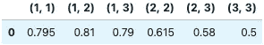
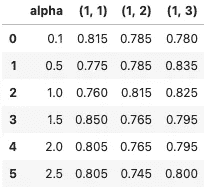

# 电影评论的情感分析第三部分

> 原文：<https://medium.com/analytics-vidhya/sentiment-analysis-of-movie-reviews-b5241ca736b7?source=collection_archive---------18----------------------->

## 第 3 部分— n-gram

更多代码链接到我的 Github:[https://Github . com/charliezcr/情操分析-电影评论/blob/main/sa_p3.ipynb](https://github.com/charliezcr/Sentiment-Analysis-of-Movie-Reviews/blob/main/sa_p1.ipynb)

## n 元语法

在 [part.1](https://crzheng97.medium.com/sentiment-analysis-of-movie-reviews-pt-1-1a52daa90cdc) 的文本预处理步骤中，我们对评论中的单词进行了逐个分词。比如*‘非常无聊的电影’*会被令牌化为*【非常’，【无聊】，【电影】】*。

这种模型被称为 unigram 模型，因为我们一次只接受一个令牌。然而，在 n-gram 模型中还有其他的单词标记方法。我们可以一次取一系列的记号。例如，在 bigram (2-gram)模型中，*'非常无聊的电影'*将被标记为 *['非常无聊'，'无聊的电影']* 。

在三元模型中，*“非常无聊的电影”*将被标记为单个标记*“非常无聊的电影”*。

N-gram 模型有助于我们的情感分析，因为单词序列可能包含更重要的分类语义。例如，单字 very 本身并不包含任何情感。“无聊”意味着评论讨厌这部电影。然而，“非常无聊”传达了评论者真的讨厌这部电影，更多的只是“无聊”。“非常无聊”应与“无聊”区别对待，因为它包含了更强烈的情感。所以我们需要找到好的 n 元模型来做情感分析。

# 调谐参数

在 Scikit-learn 的 TfidfVectorizer 中，我们可以通过传入参数(最小 n 和最大 n 的元组)来选择 n 元模型。例如，(1，1)意味着我们只使用 unigram 模型，因为最小 n 和最大 n 都是 1。(1，3)意味着我们一起使用一元模型、二元模型和三元模型。比如*'非常无聊的电影'*会被令牌化为 *['非常'，'无聊'，'电影'，'非常无聊'，'无聊的电影'，'非常无聊的电影']。*

因此，我们可以将第 1 部分中的预处理和分类功能细化如下:

```
**from** nltk.stem **import** PorterStemmer    *# stem the words*
**from** nltk.tokenize **import** word_tokenize *# tokenize the sentences into tokens*
**from** string **import** punctuation
**from** sklearn.feature_extraction.text **import** TfidfVectorizer *# vectorize the texts*
**from** sklearn.model_selection **import** train_test_split *# split the testing and training sets***def** preprocess(path, ngram):
    '''generate cleaned dataset

    Args:
        path(string): the path of the file of testing data
        ngram(tuple (min_n, max_n)): the range of n-gram model Returns:
        X_train (list): the list of features of training data
        X_test (list): the list of features of test data
        y_train (list): the list of targets of training data ('1' or '0')
        y_test (list): the list of targets of training data ('1' or '0')
    '''

    *# text preprocessing: iterate through the original file and* 
    **with** open(path, encoding**=**'utf-8') **as** file:
        *# record all words and its label*
        labels **=** []
        preprocessed **=** []
        **for** line **in** file:
            *# get sentence and label*
            sentence, label **=** line**.**strip('\n')**.**split('\t')
            labels**.**append(int(label))

            *# remove punctuation and numbers*
            **for** ch **in** punctuation**+**'0123456789':
                sentence **=** sentence**.**replace(ch,' ')
            *# tokenize the words and stem them*
            words **=** []
            **for** w **in** word_tokenize(sentence):
                words**.**append(PorterStemmer()**.**stem(w))
            preprocessed**.**append(' '**.**join(words))

    *# vectorize the texts*
    vectorizer **=** TfidfVectorizer(stop_words**=**'english', sublinear_tf**=True**, ngram_range**=**ngram)
    X **=** vectorizer**.**fit_transform(preprocessed)
    *# split the testing and training sets*
    X_train, X_test, y_train, y_test **=** train_test_split(X, labels, test_size**=**0.2)
    **return** X_train, X_test, y_train, y_test**from** sklearn.metrics **import** accuracy_score
**def** classify(clf, todense**=False**):
    '''to classify the data using machine learning models

    Args:
        clf: the model chosen to analyze the data
        todense(bool): whether to make the sparse matrix dense

    '''
    clf**.**fit(X_train, y_train)
    y_pred **=** clf**.**predict(X_test)
    accuracy **=** accuracy_score(y_test,y_pred)
    **return** accuracy
```

# 朴素贝叶斯分类器

因为从第 1 部分来看，多项式朴素贝叶斯分类器是快速而准确的。我们将使用 MultinomialNB 作为调整参数的基准模型。我们可以将不同的参数元组(从(1，1)到(3，3)传递给分类器，并在熊猫数据帧中记录性能，如下所示:

在[40]:

```
**from** sklearn.naive_bayes **import** MultinomialNB
**import** pandas **as** pd
*# create a dictionary to record the accuracy for each ngram_range*
d **=** {}
*# iterate through each ngram_range*
**for** ngram **in** [(1,1),(1,2),(1,3),(2,2),(2,3),(3,3)]:
    X_train, X_test, y_train, y_test **=** preprocess('imdb_labelled.txt',ngram)
    d[str(ngram)] **=** [classify(MultinomialNB())]
df **=** pd**.**DataFrame(data**=**d)
```



结果

我们可以看到，我们必须包含 unigram，因为(1，1)，(1，2)和(1，3)取得了很大的结果。(2，2)的表现一般。(2，3)，(3，3)的准确率都降到 0.5 了，也就是说没用了。

# 缓和

在多项式 lNB 模型中，我们可以通过调整拉普拉斯平滑的平滑参数αα来探索更好的结果。关于拉普拉斯平滑更详细的介绍，可以参考这篇[文章](https://towardsdatascience.com/laplace-smoothing-in-na%C3%AFve-bayes-algorithm-9c237a8bdece)。我们可以从列表[0.1，0.5，1，1.5，2，2.5]中选择αα，从(1，1)，(1，2)，(1，3)中选择 n 元模型。然后，运行情感分析并在熊猫数据框架中记录准确性。这样，我们就可以找到最佳的一对参数。

```
alpha_list **=** [0.1,0.5,1,1.5,2,2.5]
d **=** {'alpha':alpha_list}
**for** ngram **in** [(1,1),(1,2),(1,3)]:
    acc **=** []
    **for** value **in** alpha_list:
        X_train, X_test, y_train, y_test **=** preprocess('imdb_labelled.txt',ngram)
        acc**.**append(classify(MultinomialNB(alpha **=** value)))
    d[ngram] **=** acc
df **=** pd**.**DataFrame(data**=**d)
```



结果