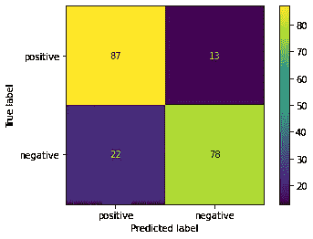

# 电影评论的情感分析第一部分

> 原文：<https://medium.com/analytics-vidhya/sentiment-analysis-of-movie-reviews-pt-1-1a52daa90cdc?source=collection_archive---------18----------------------->

## 第 1 部分—基础知识

更多代码链接到我的 Github:[https://Github . com/charliezcr/情操分析-电影评论/blob/main/sa_p1.ipynb](https://github.com/charliezcr/Sentiment-Analysis-of-Movie-Reviews/blob/main/sa_p1.ipynb)

当你有大量的影评时，如何知道它们是补充还是批评？由于数据集的量很大，不能一一标注，需要使用自然语言处理工具对文本的情感进行分类。特别是在 Python 中，像 nltk 和 scikit-learn 这样强大的包可以帮助我们进行文本分类。在这个项目中，我从 imdb 上的[评论数据集对电影评论进行了情感分析，该数据集来自 UCI 机器学习知识库的情感标签句子数据集。](https://archive.ics.uci.edu/ml/datasets/Sentiment+Labelled+Sentences)

## 文本预处理

在这个数据集中，有 1000 条电影评论，包括 500 条正面(称赞)和 500 条负面(批评)。例如，*‘一部非常、非常、非常缓慢、漫无目的的电影，讲的是一个苦恼、漂泊的年轻人。’*被标记为差评。

然而，在原始文本中，我们可以看到许多单词并不包含重要的语义。数字和标点符号在我们的原始文本中出现很多，但并不表达积极或消极的情绪。因此，我们需要剥离数字和标点符号。

为了进一步清理数据，我们需要对单词进行词干处理，以便具有不同词形变化的单词可以被视为相同的标记，因为它们传达相同的语义。例如,“distress”和“distressed”都将作为“distress”词干。

经过文本预处理后，我们有 2 个数据列表。“标签”是我们分类的目标列表。“预处理”是分类的目标特征。对于“预处理”的句子，我们将原始文本翻译成完全不可读的文本。例如，*‘一部非常、非常、非常缓慢、漫无目的的电影，讲的是一个苦恼、漂泊的年轻人。’*被预处理为*“一部关于一个遇险漂流青年的漫无目的的慢动作电影”*

你可能会想:我们将原始文本翻译成这些不可读的文本，因为我们希望每个标记都传达重要的语义。那么，为什么不去掉停用词，因为它们不传达重要的语义，但非常频繁，如“a”和“about”？在下一个特征提取部分，我们将使用 TF-IDF 来处理这些停用词

## 特征抽出

在文本预处理之后，我们将从清理后的数据中提取特征。我们将使用 TF-IDF 矢量器作为我们的单词嵌入来对文本进行矢量化和规范化。

TF-IDF 代表术语频率-逆文档频率。它评估标记对语料库中的文档的重要性。TF-IDF 将数据作为我们的模型，因为它将词频或简单的字数标准化了。它还减少了停用字词的干扰。

在这种情况下，我们将采用 TF-IDF 的变体。正规 TF-IDF 的公式是[这里是](http://www.tfidf.com/)。与原来的 TF-IDF 不同，我们改为使用 sublinear_tf，用 WF = 1 + log(TF)代替 TF。这个变体解决了[的问题:“一个术语在一个文档中出现二十次，其意义并不等于一次出现的二十倍。”](https://nlp.stanford.edu/IR-book/html/htmledition/sublinear-tf-scaling-1.html)例如，在我们的第一个评论*中，“一部非常、非常、非常缓慢、漫无目的的电影，讲述了一个痛苦、漂泊的年轻人。”*‘非常’出现了三次。因此，对于我们的数据集，我们需要应用次线性 TF 标度。这极大地提高了我们模型预测的准确性。

在特征提取之后，我们以压缩的稀疏行格式存储 Tf-IDF 加权的文档术语矩阵。每一个目标都是这句话的感悟。1 表示正，0 表示负。但是为了使数据适合我们的模型，我们需要将数据分成特征和目标。Scikit-learn 的 train_test_split 对数据进行随机洗牌，拆分成训练集和测试集。在这种特定情况下，我将使用整个测试集的 1/5，其余的 4/5 作为训练集。下面是整个预处理过程的代码:

```
**from** **nltk.stem** **import** PorterStemmer    *# stem the words*
**from** **nltk.tokenize** **import** word_tokenize *# tokenize the sentences into tokens*
**from** **string** **import** punctuation
**from** **sklearn.feature_extraction.text** **import** TfidfVectorizer *# vectorize the texts*
**from** **sklearn.model_selection** **import** train_test_split *# split the testing and training sets***def** preprocess(path):
    *'''generate cleaned dataset*

 *Args:*
 *path(string): the path of the file of testing data* *Returns:*
 *X_train (list): the list of features of training data*
 *X_test (list): the list of features of test data*
 *y_train (list): the list of targets of training data ('1' or '0')*
 *y_test (list): the list of targets of training data ('1' or '0')*
 *'''*

    *# text preprocessing: iterate through the original file and* 
    **with** open(path, encoding='utf-8') **as** file:
        *# record all words and its label*
        labels = []
        preprocessed = []
        **for** line **in** file:
            *# get sentence and label*
            sentence, label = line.strip('**\n**').split('**\t**')
            labels.append(int(label))

            *# remove punctuation and numbers*
            **for** ch **in** punctuation+'0123456789':
                sentence = sentence.replace(ch,' ')
            *# tokenize the words and stem them*
            words = []
            **for** w **in** word_tokenize(sentence):
                words.append(PorterStemmer().stem(w))
            preprocessed.append(' '.join(words))

    *# vectorize the texts*
    vectorizer = TfidfVectorizer(stop_words='english', sublinear_tf=**True**)
    X = vectorizer.fit_transform(preprocessed)
    *# split the testing and training sets*
    X_train, X_test, y_train, y_test = train_test_split(X, labels, test_size=0.2)
    **return** X_train, X_test, y_train, y_testX_train, X_test, y_train, y_test = preprocess('imdb_labelled.txt')
```

## 建模

我们可以用训练集训练模型，让模型对测试集进行分类，并通过检查模型的精度分数和时间消耗来评价模型的性能。以下是分类代码:

```
**from** **sklearn.metrics** **import** accuracy_score
**from** **sklearn.metrics** **import** plot_confusion_matrix
**from** **matplotlib** **import** pyplot **as** plt
**from** **time** **import** time**def** classify(clf, todense=**False**):
    *'''to classify the data using machine learning models*

 *Args:*
 *clf: the model chosen to analyze the data*
 *todense(bool): whether to make the sparse matrix dense*

 *'''*
    **global** X_train, X_test, y_train, y_test
    t = time()
    **if** todense:
        clf.fit(X_train.todense(), y_train)
        y_pred = clf.predict(X_test.todense())
    **else**:
        clf.fit(X_train, y_train)
        y_pred = clf.predict(X_test)
    print(f'Time cost of **{**str(clf)**}**: **{**round(time()-t,2)**}**s**\n**The accuracy of **{**str(clf)**}**: **{**accuracy_score(y_test,y_pred)**}\n**')
```

因为目标是分类的和二分法的，特征不具有假定的分布，所以我们可以用于文本分类的模型是逻辑回归、随机梯度下降分类器(SGDClassifier)、支持向量分类器(SVC)和神经网络(MLPClassifier)。因为我们的特征数据是稀疏的，所以 SVC 和 SGD 是有用的。在 3 种朴素贝叶斯分类器(伯努利、多项式和高斯)中，我们需要选择多项式，因为特征是由 TF-IDF 归一化的。这些特征既不符合高斯分布也不符合伯努利分布。

我将在下面分析每个选定型号的性能。在这一部分，我不会调整每个模型的参数，但以后会这样做。

我们也可以在技术上使用线性判别分析。然而，像我们的特征数据那样计算稀疏矩阵在计算上是昂贵的。这种模型的准确性也较低。所以这次不考虑 LDA。下面是 LDA 的表现:

```
**from** **sklearn.discriminant_analysis** **import** LinearDiscriminantAnalysis
classify(LinearDiscriminantAnalysis(),todense=**True**)
```

线性判别分析的时间成本():0.79 秒
线性判别分析的准确度():0.71

以下是入选车型的表现:

```
**from** **sklearn.linear_model** **import** LogisticRegression
**from** **sklearn.naive_bayes** **import** MultinomialNB
**from** **sklearn.svm** **import** SVC
**from** **sklearn.linear_model** **import** SGDClassifier
**from** **sklearn.neural_network** **import** MLPClassifier
**for** model **in** [LogisticRegression(), MultinomialNB(), SVC(), SGDClassifier(), MLPClassifier()]:
    classify(model)
```

*物流回收的时间成本():0.03 秒
物流回收的准确度():0.825*

*多项式的时间成本 inb():0.0s
多项式的精度 inb():0.825*

*SVC()的时间成本:0.09 秒
SVC()的精度:0.835*

*SGD classifier()的时间成本:0.0s
SGD classifier()的精度:0.82*

*MLP 分类器的时间成本():3.47 秒
MLP 分类器的准确度():0.81*

## 集成学习

虽然我们希望提高模型预测的准确性，但我们也希望避免过度拟合，以便我们可以使用模型预测其他数据集。构建集成方法是解决这个问题的方法。对于每个评论，我们将让每个选定的模型为其自己的预测投票，并采用所有投票的模式来生成集合预测。选择的模型有逻辑回归、多项式回归、SVC 和 SGD。因为神经网络需要复杂的调整，并且非常耗时，所以我不会将 MLPClassifier 包含在这个集成学习中。从下面的准确度分数和混淆矩阵中，我们可以看到，尽管时间成本增加了，但是集合模型的性能是令人满意的。

```
**from** **statistics** **import** mode
**def** ensemble(models):
    *'''to ensemble the models and classify the data based on each model's vote*

 *Args:*
 *models: the list of models chosen to analyze the data*

 *'''*
    **global** X_train, X_test, y_train, y_test
    t = time()
    *# iterate through all the models and collect all their predictions*
    y_preds = []
    **for** clf **in** models:
        clf.fit(X_train, y_train)
        y_preds.append(clf.predict(X_test))

    *# Count their votes and get the mode of each prediction as the decision*
    y_pred = []
    **for** i **in** range(len(y_preds[0])):
        y_pred.append(mode([y[i] **for** y **in** y_preds]))
    print(f'Time cost: **{**round(time()-t,2)**}**s**\n**Accuracy: **{**accuracy_score(y_test,y_pred)**}\n**')
    plot_confusion_matrix(clf, X_test, y_test, values_format = 'd',display_labels=['positive','negative'])ensemble([LogisticRegression(),MultinomialNB(),SVC(),SGDClassifier()])
```

*时间成本:0.12 秒
精度:0.83*

