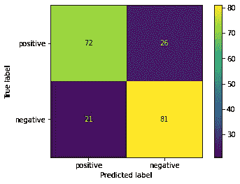

# 电影评论的情感分析第二部分

> 原文：<https://medium.com/analytics-vidhya/sentiment-analysis-of-movie-reviews-pt-2-45045225a263?source=collection_archive---------22----------------------->

## 第二部分— LSA

更多代码链接到我的 Github:[https://Github . com/charliezcr/情操分析-电影评论/blob/main/sa_p2.ipynb](https://github.com/charliezcr/Sentiment-Analysis-of-Movie-Reviews/blob/main/sa_p2.ipynb)

## 概述

还记得在《T2》第一部中，我从 imdb 上的评论数据集中对电影评论进行了情感分析。在最后一部分中，我首先将所有评论的文本预处理成小写词干，去掉数字和标点符号。然后，使用 TF-IDF 作为单词嵌入，将所有单词向量化成稀疏矩阵。之后，我运行了几个选定的机器学习模型来对特征、稀疏矩阵进行分类，并评估它们的性能。

然而，这只是情感分析的基础。因为我们有一个相对较小的数据集(1000 个条目)，所以我们不需要考虑特征的维度。上次的特征维度是 2317。

然而，如果我们有一个大的数据集，比如一百万个条目呢？1，000，000 x 2，317 的大小对于稀疏矩阵来说是超大的。存储和运行它需要强大的计算能力。这也非常耗时。因此，我们需要降低特征的维度，并在不损失准确性的情况下加快我们的机器学习过程。在这一部分，我将对 LSA 进行情感分析。

## LSA 和奇异值分解

潜在语义分析(LSA)是主题建模中常用的单词嵌入方法。另一方面，它对文本分类也很有用。简而言之，LSA 就是对 TD-IDF 矢量化后的矩阵进行奇异值分解(SVD)。如果您不熟悉 TF-IDF，请参考本研究的 Pt.1。奇异值分解是一种用于自然语言处理的强大的矩阵分解方法。在自然语言处理中，我们总是会遇到大量的特征。我们可以使用 SVD 来选择这些维度中的一小部分，以获得一个截断矩阵来处理机器学习。(这里是 SVD 的[教程)](https://web.mit.edu/be.400/www/SVD/Singular_Value_Decomposition.htm)

为了简单解释 SVD，我们可以将矩阵 A 分解为

***A=USV***

原始矩阵 A 是恩智浦矩阵。u 是一个 nxn 矩阵，包含 n 个左奇异向量。v 是一个 pxp 矩阵，包含 p 个右奇异向量。s 是恩智浦对角线矩阵，对角线上包含奇异值。对角线以外的其余元素为 0。奇异值σσ按其值排列:σ1 > σ2 > … > σk

在所有这些奇异值中，我们可以选择少量我们想要的奇异值。例如，在这种情况下，我将在所有 2317 个奇异值中选择前 100 个，以便显著降低维数。我们将保留 Uk 中的前 100 个左奇异向量，奇异矩阵 Sk 中的前 100 个奇异值，Vk 中的前 100 个右奇异向量，将它们相乘得到截断矩阵 Ak，如下:

***UkSkVk = Ak***

在 Python 中，我们可以使用 scikit-learn 来获得截断的 SVD，并将其归一化以转换特征矩阵。代码如下:

```
**from** sklearn.decomposition **import** TruncatedSVD
**from** sklearn.pipeline **import** make_pipeline
**from** sklearn.preprocessing **import** MinMaxScaler*# performance SVD*
svd **=** TruncatedSVD(100)
*# performance LSA and normalization*
lsa **=** make_pipeline(svd, MinMaxScaler())
X_lsa **=** lsa**.**fit_transform(X)
```

我们可以将这段代码集成到[第 1 部分](https://crzheng97.medium.com/sentiment-analysis-of-movie-reviews-pt-1-1a52daa90cdc)中使用的预处理方法中，并转换数据集。下面是预处理函数的 2.0 版本:

```
**from** nltk.stem **import** PorterStemmer    *# stem the words*
**from** nltk.tokenize **import** word_tokenize *# tokenize the sentences into tokens*
**from** string **import** punctuation
**from** sklearn.feature_extraction.text **import** TfidfVectorizer *# vectorize the texts*
**from** sklearn.model_selection **import** train_test_split *# split the testing and training sets*
**from** sklearn.decomposition **import** TruncatedSVD *# SVD*
**from** sklearn.pipeline **import** make_pipeline
**from** sklearn.preprocessing **import** MinMaxScaler**def** preprocess(path):
    '''generate cleaned dataset

    Args:
        path(string): the path of the file of testing data Returns:
        X_train (list): the list of features of training data
        X_test (list): the list of features of test data
        y_train (list): the list of targets of training data ('1' or '0')
        y_test (list): the list of targets of training data ('1' or '0')
    '''

    *# text preprocessing: iterate through the original file and* 
    **with** open(path, encoding**=**'utf-8') **as** file:
        *# record all words and its label*
        labels **=** []
        preprocessed **=** []
        **for** line **in** file:
            *# get sentence and label*
            sentence, label **=** line**.**strip('\n')**.**split('\t')
            labels**.**append(int(label))

            *# remove punctuation and numbers*
            **for** ch **in** punctuation**+**'0123456789':
                sentence **=** sentence**.**replace(ch,' ')
            *# tokenize the words and stem them*
            words **=** []
            **for** w **in** word_tokenize(sentence):
                words**.**append(PorterStemmer()**.**stem(w))
            preprocessed**.**append(' '**.**join(words))

    *# vectorize the texts by tfidf*
    vectorizer **=** TfidfVectorizer(stop_words**=**'english', sublinear_tf**=True**)
    X_tfidf **=** vectorizer**.**fit_transform(preprocessed)
    svd **=** TruncatedSVD(100)
    *# perform lsa*
    lsa **=** make_pipeline(svd, MinMaxScaler())
    X_lsa **=** lsa**.**fit_transform(X_tfidf)
    *# split the testing and training sets*
    X_train, X_test, y_train, y_test **=** train_test_split(X_lsa, labels, test_size**=**0.2)
    **return** X_train, X_test, y_train, y_testX_train, X_test, y_train, y_test **=** preprocess('imdb_labelled.txt')
```

## 表演

我们可以将 LSA 转换的数据应用于机器学习模型，并监控其性能的变化。请记住，在第 1 部分中，线性判别分析的结果是:

> *线性判别分析的时间成本():0.79 秒
> 线性判别分析的准确度():0.71*

现在，我们的数据维度大大降低了。我们应该期待这次的时间成本会大幅改善。此外，这次我们甚至不需要增加数据密度！

```
Time cost of LinearDiscriminantAnalysis(): 0.05s
The accuracy of LinearDiscriminantAnalysis(): 0.73
```

我们刚刚将时间成本从 0.79 秒降低到 0.05 秒。就速度而言，这是一个巨大的飞跃！

记得上次，我们还尝试了逻辑回归，多项式，SVC，SGD 和 MLP 分类器。表现为:

> *logistic regression()的时间成本:0.03s
> logistic regression()的准确度:0.825*
> 
> *多项式的时间成本():0.0s
> 多项式的准确度():0.825*
> 
> *SVC()的时间成本:0.09 秒
> SVC()的精度:0.835*
> 
> *SGD classifier()的时间成本:0.0s
> SGD classifier()的精度:0.82*
> 
> *MLP 分类器的时间成本():3.47 秒
> MLP 分类器的准确度():0.81*

我们可以尝试所有这些模型，观察它们的性能:

```
Time cost of LogisticRegression(): 0.08s
The accuracy of LogisticRegression(): 0.76Time cost of MultinomialNB(): 0.0s
The accuracy of MultinomialNB(): 0.775Time cost of SVC(): 0.08s
The accuracy of SVC(): 0.745Time cost of SGDClassifier(): 0.01s
The accuracy of SGDClassifier(): 0.75Time cost of MLPClassifier(): 0.68s
The accuracy of MLPClassifier(): 0.77
```

我们可以看到，尽管所有这些模型的精度都有所下降，但速度却加快了。对于复杂的模型 MLP 分类器，时间成本显著降低。因此，MLP 分类器和线性判别分类器可以包含在集成分类器中。

```
ensemble([LinearDiscriminantAnalysis(),LogisticRegression(),MultinomialNB(),SVC(),SGDClassifier(),MLPClassifier()])Time cost: 1.03s
Accuracy: 0.78
```

