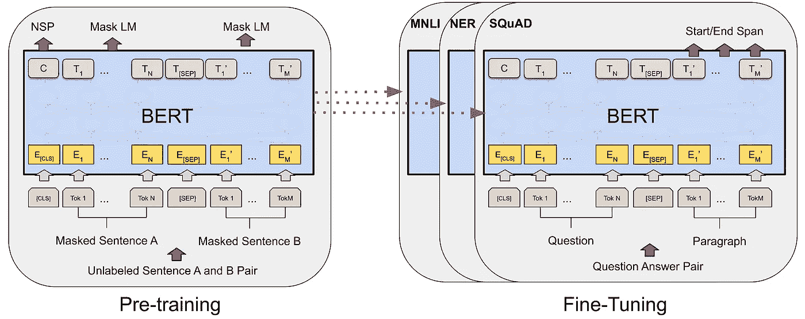

# 电影评论的情感分析第四部分

> 原文：<https://medium.com/analytics-vidhya/sentiment-analysis-of-movie-reviews-pt-4-575ccddfdbc3?source=collection_archive---------1----------------------->

## 第四部分伯特

更多代码链接到我的 Github:[https://Github . com/charliezcr/情操分析-电影评论/blob/main/sa_p4.ipynb](https://github.com/charliezcr/Sentiment-Analysis-of-Movie-Reviews/blob/main/sa_p4.ipynb)

在 IMDb 影评情感分析研究的第 [1](/analytics-vidhya/sentiment-analysis-of-movie-reviews-pt-1-1a52daa90cdc) 、 [2](/analytics-vidhya/sentiment-analysis-of-movie-reviews-pt-2-45045225a263) 、 [3](/analytics-vidhya/sentiment-analysis-of-movie-reviews-b5241ca736b7) 部分，我使用了经典的监督学习方法。在这一部分，我将结合模型 BERT 使用迁移学习。

# 迁移学习

与我自己训练的模型第 1-3 部分不同，迁移学习是一种使用现有的预训练模型来处理特定任务的方法。这次的模型 BERT 是谷歌研究人员发明的用于自然语言理解领域多种用途的最先进的深度学习模型。通过对 IMDb 电影评论的数据集进行微调，我不需要训练自己的模型，而是使用转移的模型来完成预测电影评论情绪的特定任务。打个比喻来说，训练一个有监督的学习模型就像自己造车一样；微调一个转移学习模型就像调车一样，买车，改装。

# Pytorch 和 CUDA

看完所有数据，我会用 Pytorch，一个深度学习的包。Pytorch 中的 CUDA 是一个允许使用 GPU 进行并行计算的工具包(但实际上我的本地计算机上没有 GPU，所以我仍将使用 CPU)。用比喻的方式来解释。当你交付东西的时候，使用 CPU 就像开快车移动少量货物；使用 GPU 就像同时驾驶多辆皮卡移动大量货物。因为在深度学习中，计算是大量的矩阵乘法，使用 GPU 会加快进程。

对句子进行分词时，最大长度将设置为 128。因此，超过 126 个标记的句子(另外两个标记是“cls”和“sep”，意思是句子的开始和结束)将被截断。少于 126 的句子末尾没有填充。

# 标记化



在[第 1 部分](/analytics-vidhya/sentiment-analysis-of-movie-reviews-pt-1-1a52daa90cdc)中，我使用 TF-IDF 将一个句子转换成向量，将句子转换成矩阵。在这一部分中，我将直接使用 BERT tokenizer 将句子转换为编码，由输入 id 和注意掩码组成。输入 id 是从句子中的单词转换而来的 BERT 的标记。注意力屏蔽表明每个标记在句子中需要多少注意力。

例如，在句子*中有两只鸟。*如果“那里”得到最多的关注，我们就知道鸟在那里，而不是在这里。如果“二”得到的关注最多，我们知道不止 1 只鸟，不到 3 只鸟。如果“鸟”，我们知道那里的众生是鸟，而不是其他东西。

BERT 中的注意机制使这个编码器在情感分析中很高效，因为它会注意到包含情感的单词和短语，如“喜欢”和“不喜欢”，是电影评论中最需要注意的。此外，BERT tokenizer 读取句子是双向的，即从左到右和从右到左，因此它也考虑单词在句子中的位置。

对句子进行分词时，最大长度将设置为 128。因此，超过 126 个标记的句子(另外两个标记是“cls”和“sep”，意思是句子的开始和结束)将被截断。少于 126 的句子末尾没有填充。

```
**from** transformers **import** BertTokenizer*# load bert tokenizer*tokenizer **=** BertTokenizer.from_pretrained('bert-base-uncased', do_lower_case**=True**)*# setting the maximum length of encodings to 128, so that encodings will not be too long*encodings **=** tokenizer(reviews, truncation**=True**, padding**=**'max_length', return_tensors**=**'pt', max_length**=**128)input_ids **=** encodings['input_ids']attention_masks **=** encodings['attention_mask']
```

# 数据集和数据加载器

对句子进行编码后，输入的 id、注意屏蔽和标签将以张量形式存储在 TensorDataset 中，并分成训练集和测试集。然后，数据加载器在数据集上包装可重复项，并支持自动批处理、采样、混排和多进程数据加载。

批处理意味着数据加载器将发送一批编码到模型中，用于训练过程中的小批量随机梯度下降。在这项研究中，我将批量大小设置为 16。每次，dataloader 都会将训练集中的所有数据进行重排，以生成新的一批数据。

```
**from** torch.utils.data **import** TensorDataset, random_split, DataLoader*# splitting traing and validation dataset*dataset **=** TensorDataset(input_ids, attention_masks, torch.tensor(labels))train_size **=** int(df.shape[0] ***** 0.8)val_size **=** df.shape[0] **-** train_sizetrain_dataset, val_dataset **=** random_split(dataset, [train_size, val_size])*# load datasets into dataloaders*train_dataloader **=** DataLoader(train_dataset, shuffle**=True**, batch_size**=**16)eval_dataloader **=** DataLoader(val_dataset, batch_size**=**16)
```

# 培养

Epochs 表示在训练过程中训练集将被发送到模型的次数。对于培训，我将把时期的数量设置为 3。通常推荐的历元数是 2-4。我将使用 ADAM 作为梯度下降的优化器。

```
**from** transformers **import** BertForSequenceClassification, AdamW, get_scheduler*# setting the model*model **=** BertForSequenceClassification.from_pretrained("bert-base-uncased",  *# Use the 12-layer BERT model, with an uncased vocab.*num_labels**=**2,  *# The number of output labels--2 for binary classification.*output_attentions**=False**,  *# Whether the model returns attentions weights.*output_hidden_states**=False**,  *# Whether the model returns all hidden-states.*) *# setting the epochs*num_epochs **=** 3*# setting for gradient descent*optimizer **=** AdamW(model.parameters(), lr**=**5e-5)num_training_steps **=** num_epochs ***** len(train_dataloader)lr_scheduler **=** get_scheduler("linear", optimizer**=**optimizer, num_warmup_steps**=**0, num_training_steps**=**num_training_steps)model.train()**for** epoch **in** range(num_epochs):**for** batch **in** train_dataloader:*# send batches to device (cpu or gpu)*b_input_ids **=** batch[0].to(device)b_input_mask **=** batch[1].to(device)b_labels **=** batch[2].to(device)outputs **=** model(b_input_ids, token_type_ids**=None**, attention_mask**=**b_input_mask, labels**=**b_labels, return_dict**=True**)loss **=** outputs.lossloss.backward()optimizer.step()lr_scheduler.step()optimizer.zero_grad()
```

# 估价

在[30]中:

```
**from** sklearn.metrics **import** accuracy_scorey_pred **=** []y_true **=** []model.eval()**for** batch **in** eval_dataloader:b_input_ids **=** batch[0].to(device)b_input_mask **=** batch[1].to(device)b_labels **=** batch[2].to(device)*# set gradient to zero at the start of every batch***with** torch.no_grad():outputs **=** model(b_input_ids, token_type_ids**=None**, attention_mask**=**b_input_mask, labels**=**b_labels, return_dict**=True**)logits **=** outputs.logitspredictions **=** torch.argmax(logits, dim**=-**1)y_pred.extend(predictions.tolist())y_true.extend(b_labels.tolist())print(f'Accuracy: {accuracy_score(y_pred, y_true)}')
```

> 精确度:0.905

我们可以看到，准确率高于 90%，也优于第 1-3 部分中的经典监督训练，证明 BERT 是一个更高级的情感分析模型。