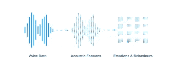
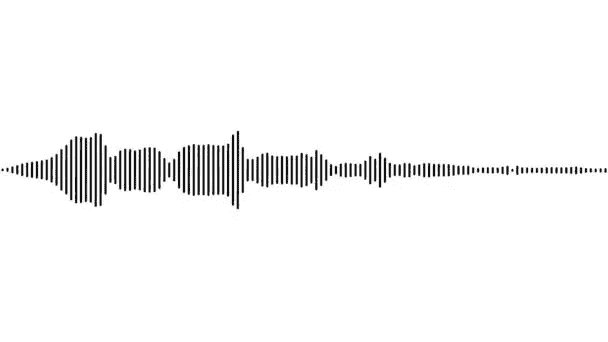
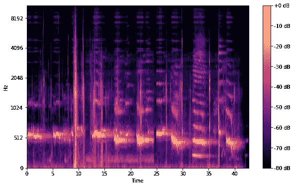
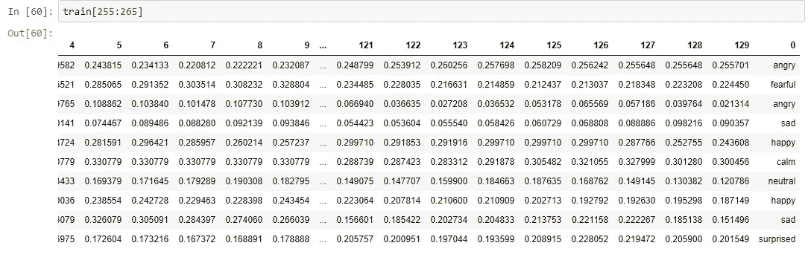
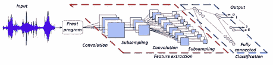
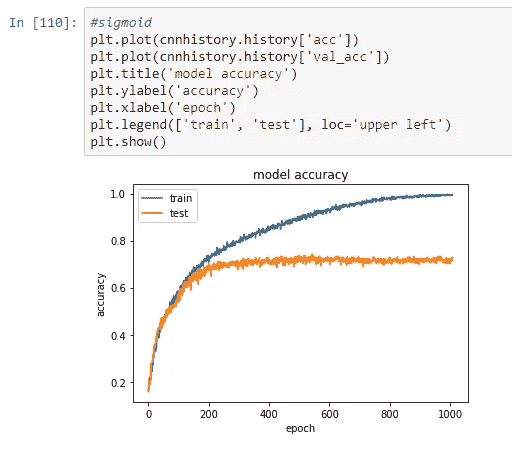
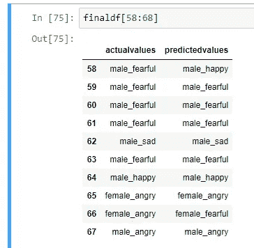

# 语音数据的情感分析

> 原文：<https://medium.com/analytics-vidhya/sentiment-analysis-of-voice-data-64533a952617?source=collection_archive---------2----------------------->

**对语音数据的情感分析**

**D** 感知情感是当今世界最重要的营销策略之一。我们可以为个人定制不同的东西来满足他们的兴趣。了解顾客的情绪会提高产品的质量。通常，情感分析是通过文本数据完成的，但是我们有很多未使用的音频数据。出于这个原因，我们决定做一个处理器，它可以通过人的声音来检测人的情绪，这将让我们管理许多与人工智能相关的应用程序。一些例子可以包括当一个人在电话中生气时，呼叫中心播放音乐。另一种可能是当一个人生气或害怕时，一辆智能汽车会减速。另一个可能是网络安全。因此，这种类型的应用在世界上有很大的潜力，将有利于公司，甚至对消费者的安全。

*语音情感分析*

*用于案例研究的数据集:*[*http://neuron.arts.ryerson.ca/ravdess/?f=3*](http://neuron.arts.ryerson.ca/ravdess/?f=3)*，*[*http://kahlan.eps.surrey.ac.uk/savee/Download.html*](http://kahlan.eps.surrey.ac.uk/savee/Download.html)

我们选择了只有音频的 zip 文件，因为我们要从语音中寻找情感。zip 文件由大约 1500 个 wave 格式的音频文件组成。第二个网站包含了大约 500 段来自四个不同演员的不同情感的音频演讲。

我们测试了其中一个音频文件，通过绘制其波形和频谱图来了解其特征。

音频的波形

音频的声谱图

下一步是组织音频文件。每个音频文件在文件名的第 6 位都有一个唯一的标识符，可以用来确定音频文件包含的情感。我们的数据集中有 5 种不同的情绪。

> 1.冷静 2。快乐 3。伤心 4。愤怒 5。可怕的

我们使用 Python 中的 Librosa 库来处理和提取音频文件中的特征。Librosa 是一个用于音乐和音频分析的 python 包。它提供了创建音乐信息检索系统所必需的构件。使用 librosa 库，我们能够提取特征，即 MFCC(梅尔频率倒谱系数)。MFCCs 是在自动语音和说话人识别中广泛使用的特征。我们还通过使用网站中提供的标识符来区分女性和男性的声音。这是因为作为一项实验，我们发现区分男性和女性的声音增加了 15%。可能是因为声音的音高影响了结果。

每个音频文件给了我们许多特性，这些特性基本上是许多值的数组。这些特征随后被附加上我们在上一步中创建的标签。

下一步涉及处理一些长度较短的音频文件的缺失特征。我们将采样率提高了两倍，以获得每个情感语音的独特特征。我们没有增加采样频率，因为它可能会收集噪音，从而影响结果

列车分离

接下来的步骤包括整理数据，分成训练和测试，然后建立一个模型来训练我们的数据。将很快添加代码

> 我们建立了多感知器模型、LSTM 模型和 CNN 模型。MLP 和 LSTM 不适合，因为它给我们的准确性低。因为我们的项目是一个分类问题，我们对不同的情绪进行分类，CNN 对我们来说是最好的。

美国有线新闻网；卷积神经网络

训练-测试验证

在建立了许多不同的模型之后，我们找到了我们情感分类问题的最佳 CNN 模型。我们利用现有模型实现了 70%的验证准确率。如果我们有更多的数据来处理，我们的模型会表现得更好。更令人惊讶的是，该模型在区分男性和女性声音时表现出色。我们还可以从上面看到模型是如何预测实际值的。在未来，我们可以建立一个序列到序列的模型，根据不同的情绪产生声音。例如快乐的声音、惊讶的声音等。

预测产量

 [## 维贾伊·阿南丹-助理工程师 1 -认知| LinkedIn

### 好奇心驱动的数据科学家，渴望利用机器学习和数据分析来提取有意义的…

www.linkedin.com](https://www.linkedin.com/in/vijay-anadan/)