# 基于 TF-IDF 方法的亚马逊评论情感分析。

> 原文：<https://medium.com/analytics-vidhya/sentiment-analysis-on-amazon-reviews-using-tf-idf-approach-c5ab4c36e7a1?source=collection_archive---------1----------------------->

特征提取:TF-IDF(词频-逆文档频)
分类:SVM，Logistic 回归

随着数字时代的发展，网上购物有了巨大的增长。每个商务人士都想分析他们的客户在谈论他们的产品。评论、星级评定是描述客户参与度的产品附件。分析客户感受的过程被称为情感分析。

在本文中，情感分析是在亚马逊珠宝数据集上进行的。

数据集链接:[https://S3 . Amazon AWS . com/Amazon-reviews-PDS/tsv/Amazon _ reviews _ us _ Jewelry _ v1 _ 00 . tsv . gz](https://s3.amazonaws.com/amazon-reviews-pds/tsv/amazon_reviews_us_Jewelry_v1_00.tsv.gz)

导入所需的包

```
import pandas as pd
import numpy as np
import nltk
import re
```

使用熊猫阅读数据集

```
df=pd.read_csv(‘data.tsv’, sep=’\t’, header=0, error_bad_lines=False)
```

预览数据集

```
df.head(3)
```

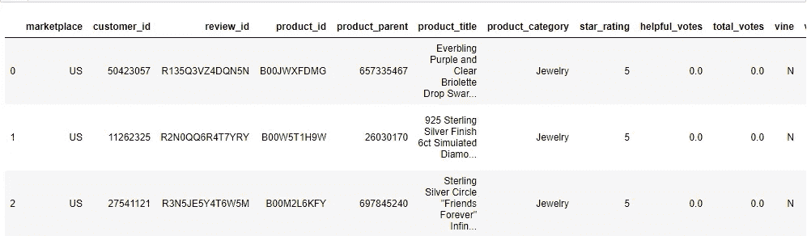

我们只需要 review_body，star_rating 列来分别描述每个评论的评论和星级。

```
df=df[[‘review_body’,’star_rating’]]
```

删除空值、缺失值并重置索引

```
df=df.dropna()
df = df.reset_index(drop=True)
df
```

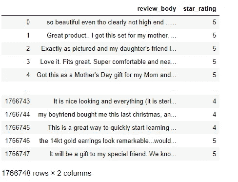

**标签评论:** 现在我们有 1766748 条评论。星级为 4.5 的评论被标记为正面评论，1.2 的评论被标记为负面评论。删除星级为 3 的评论，因为它们被认为是中性的。

```
df['star_rating']=df['star_rating'].astype(int) #convert the star_rating column to intdf=df[df[‘star_rating’]!=3]
df['label']=np.where(df['star_rating']>=4,1,0) #1-Positve,0-Negative
```

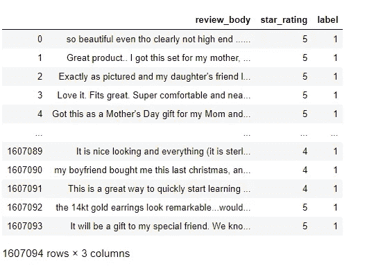

按星级分组的评论数量

```
df[‘star_rating’].value_counts()
```

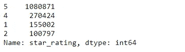

现在，我们通过考虑 100000 条评论来创建模型。在 100，000 条评论中，50，000 条是正面的，50，000 条是负面的。

我将从 16，07，094 条评论中随机抽取 100，000 条评论。不想洗牌可以忽略。

```
df = df.sample(frac=1).reset_index(drop=True) #shuffledata=df[df['label']==0][:50000]
data=data.append(df[df['label']==1][:50000])
data = data.reset_index(drop=True)
display(data['label'].value_counts())
data
```

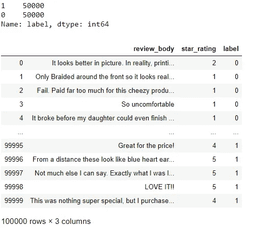

# 预处理

第一步是将所有评论转换成小写。

```
data[‘pre_process’] = data[‘review_body’].apply(lambda x: “ “.join(x.lower() for x in str(x).split()))
```

从评论中删除 HTML 标签和 URL。

```
 from bs4 import BeautifulSoup
data[‘pre_process’]=data[‘pre_process’].apply(lambda x: BeautifulSoup(x).get_text())import re
data[‘pre_process’]=data[‘pre_process’].apply(lambda x: re.sub(r”http\S+”, “”, x))
```

在评论上执行缩写。
举例:**不会被**转换为**不会被**

```
def contractions(s):
 s = re.sub(r”won’t”, “will not”,s)
 s = re.sub(r”would’t”, “would not”,s)
 s = re.sub(r”could’t”, “could not”,s)
 s = re.sub(r”\’d”, “ would”,s)
 s = re.sub(r”can\’t”, “can not”,s)
 s = re.sub(r”n\’t”, “ not”, s)
 s= re.sub(r”\’re”, “ are”, s)
 s = re.sub(r”\’s”, “ is”, s)
 s = re.sub(r”\’ll”, “ will”, s)
 s = re.sub(r”\’t”, “ not”, s)
 s = re.sub(r”\’ve”, “ have”, s)
 s = re.sub(r”\’m”, “ am”, s)
 return s
data[‘pre_process’]=data[‘pre_process’].apply(lambda x:contractions(x))
```

删除非字母字符

```
data[‘pre_process’]=data[‘pre_process’].apply(lambda x: “ “.join([re.sub(‘[^A-Za-z]+’,’’, x) for x in nltk.word_tokenize(x)]))
```

去掉单词之间多余的空格

```
data[‘pre_process’]=data[‘pre_process’].apply(lambda x: re.sub(‘ +’, ‘ ‘, x))
```

使用 NLTK 包删除停用词

```
from nltk.corpus import stopwords
stop = stopwords.words(‘english’)
data[‘pre_process’]=data[‘pre_process’].apply(lambda x: “ “.join([x for x in x.split() if x not in stop]))
```

使用 wordnet 词汇化器执行词汇化

```
from nltk.stem import WordNetLemmatizer
lemmatizer = WordNetLemmatizer()
data[‘pre_process’]=data[‘pre_process’].apply(lambda x: “ “.join([lemmatizer.lemmatize(w) for w in nltk.word_tokenize(x)]))
```

最终预处理后的评论看起来是:
**原文:**图中更好看。现实中打印质量不怎么样，感觉没有什么涂层。
**预处理:**更好看图片真实印刷质量好手感涂层。

```
data
```

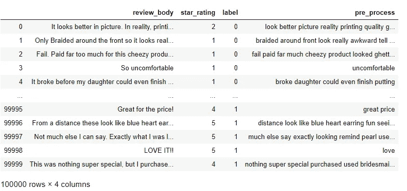

# 特征抽出

**TF-IDF:** 是一种从文本数据中提取特征的方法。TF 代表词频，IDF 代表逆文档频。

词频:单词在评论中出现的次数。例如，考虑两个评论，其中 w1、w2..表示两个评论中的单词，表定义了特定评论中的单词频率。

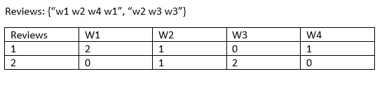

IDF 计算如下

```
idf(t) = log [ n / df(t) ] + 1
 = log[ number of documents / number of documents containing the term]+1
```

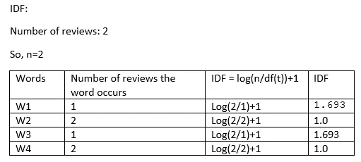

如果 smooth_idf=True。
Smooth-IDF = log[n/df(t)+1]+1

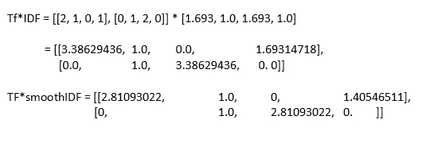

TF-IDF 是使用 sklearn 实现的:[https://sci kit-learn . org/stable/modules/generated/sk learn . feature _ extraction . text . tfidfvectorizer . html](https://scikit-learn.org/stable/modules/generated/sklearn.feature_extraction.text.TfidfVectorizer.html)

将数据分成训练集和测试集

```
from sklearn.model_selection import train_test_split
X_train,X_test,Y_train, Y_test = train_test_split(data[‘pre_process’], data[‘label’], test_size=0.25, random_state=30)print(“Train: “,X_train.shape,Y_train.shape,”Test: “,(X_test.shape,Y_test.shape))
```

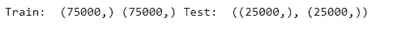

使用 TF*IDF 矢量器

```
print(“TFIDF Vectorizer……”)
from sklearn.feature_extraction.text import TfidfVectorizervectorizer= TfidfVectorizer()tf_x_train = vectorizer.fit_transform(X_train)
tf_x_test = vectorizer.transform(X_test)
```

**SVM**

用 sklearn 实现分类的 SVM

```
from sklearn.svm import LinearSVC
clf = LinearSVC(random_state=0)
```

将训练数据拟合到模型中

```
clf.fit(tf_x_train,Y_train)
```

预测测试数据

```
y_test_pred=clf.predict(tf_x_test)
```

分析结果

```
from sklearn.metrics import classification_report
report=classification_report(Y_test, y_test_pred,output_dict=True)
```

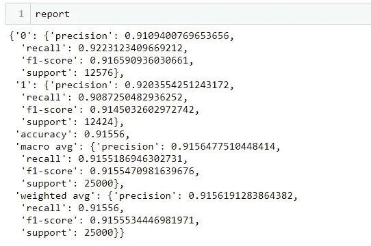

# 通过使用 SVM 分类器，我们得到了 **91.55%** 的准确率

# 逻辑回归

使用 sklearn 实现逻辑回归

```
from sklearn.linear_model import LogisticRegression
clf = LogisticRegression(max_iter=1000,solver=’saga’)
```

使训练数据符合模型

```
clf.fit(tf_x_train,Y_train)
```

预测测试数据

```
y_test_pred=clf.predict(tf_x_test)
```

分析报告

```
from sklearn.metrics import classification_report
report=classification_report(Y_test, y_test_pred,output_dict=True)
```

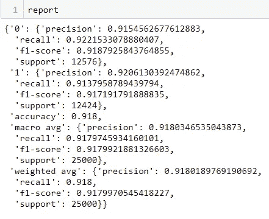

# 通过使用 LR 分类器，我们得到了 91.80%的准确率

因此我们可以对任何数据进行情感分析。

感谢和问候
Praveen Sujanmulk