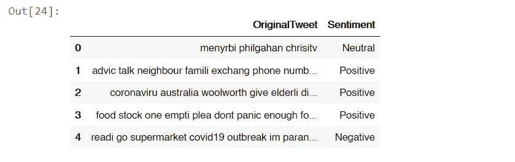
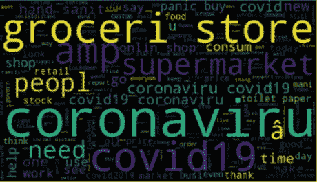
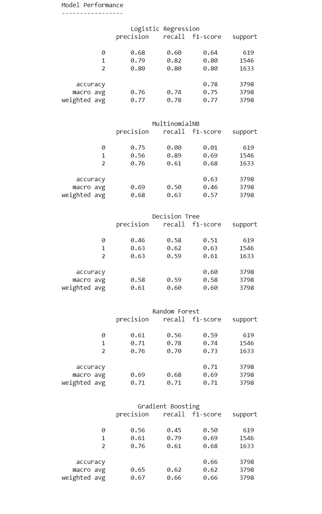

# 新冠肺炎推特上的情感分析。

> 原文：<https://medium.com/analytics-vidhya/sentiment-analysis-on-covid-19-tweets-502c29482a1c?source=collection_archive---------5----------------------->

简单地说，自然语言处理(NLP)可以被定义为人工智能的一个分支，它赋予机器阅读、理解和理解人类语言的能力。情感分析又称为 ***观点挖掘*** 或 ***AI 情感*** 是利用自然语言处理技术对文本进行分析，提取这些文本的情感并将其分类为正面负面或中性。这篇文章将会讲述情感分析是如何在新冠肺炎推特上使用的。

来源:图片由 [Tengyart](https://unsplash.com/@tengyart?utm_source=unsplash&utm_medium=referral&utm_content=creditCopyText) 在 [Unsplash](https://unsplash.com/s/photos/emotion?utm_source=unsplash&utm_medium=referral&utm_content=creditCopyText) 上拍摄

在此之前，我们需要了解**为什么社交媒体需要**情感分析**？**

来自世界各地的人们比以往任何时候都更频繁地使用社交媒体。对社交媒体数据的情感分析有助于了解关于某些主题(如电影、事件、政治、体育等)的更广泛的公众意见，并从这些社交数据中获得有价值的见解。情感分析有一些强大的应用。如今，它也被一些企业用来做市场调查，了解客户对其产品或服务的体验。

现在，关于这类项目，你可能会想到一个有趣的问题:**为什么要在**新冠肺炎推文**上进行**情感分析？冠状病毒的推文有哪些是正面的？你可能听说过电影或书评中的情感分析，但是**探索和分析这类数据的目的**是什么？

近年来，危机时期使用社交媒体进行沟通的情况显著增加。如上所述，分析社交媒体数据很重要，因为它有助于了解公众情绪。在冠状病毒疫情期间，许多人在社交媒体上表达他们的愤怒、悲痛或悲伤，而一些人也传播快乐和积极。在这段艰难时期，人们还利用社交媒体向他们的网络寻求与疫苗或医院相关的帮助。如果专家考虑这些社会数据，许多与疫情相关的问题也可以得到解决。这就是为什么分析这种类型的数据对于理解人们面临的整体问题非常重要。

来源:格伦·卡丽在 [Unsplash](https://unsplash.com/s/photos/lockdown?utm_source=unsplash&utm_medium=referral&utm_content=creditCopyText) 上拍摄的照片

唷！相当冗长的解释。

接下来是代码部分。

在这个项目中，我使用了 Kaggle 的数据集。你可以在下面的参考资料中找到我正在使用的数据集的链接。训练数据集由 41157 条推文组成，测试数据集由 3798 条推文组成。在情绪栏中有 5 种情绪，即“积极”、“非常积极”、“消极”、“非常消极”和“中性”。我们将遵循下面写的步骤

1.  数据预处理。
2.  TF-IDF
3.  建模。
4.  评价。

我已经使用了 **nltk 工具包**来处理文本**。所以和其他库一起，我的第一步是导入 nltk。**

**1)数据预处理:**机器学习模型无法应对杂乱的数据。因此，数据预处理是一个极其重要的步骤，因为它会影响模型的学习能力。

训练和测试数据集由“用户名”、“昵称”、“位置”、“TweetAt”、“OriginalTweet”和“情感”列组成。我已经删除了对我们试图预测的内容没有用处的不必要的列。“极度积极”和“积极”以及“极度消极”和“消极”之间没有太大区别，因此我用积极情绪代替了极度积极，用消极情绪代替了极度消极。这也有助于快速处理。数据预处理包括丢弃空值、删除标点符号、URL、标签、停用词，以及将 tweets 中的所有单词转换为小写。我还使用词干化和词汇化对文本进行预处理。

**词干化:**词干化是通过去掉词尾将单词还原为词根的过程。nltk 包中有不同类型的词干分析器。我已经用波特斯特梅尔为这个代码。

**词汇化:**使用词干，我们有时可能会失去单词的实际含义。词汇化类似于词干化，但它考虑单词的上下文并将其转换为基本形式。

遵循所有这些步骤后，推文看起来像这样:

处理后的推文

我还绘制了一个单词云，如下所示:

文本的词云

我现在将“积极”情绪映射为 1，“消极”情绪映射为 2，“中性”情绪映射为 0。

**2)TF-IDF:** 统计词频最流行的方法之一是 TF-IDF。TF-IDF 代表 ***词频—逆文档频率*** 。术语频率给出了单词在文档中出现的次数，而逆文档频率降低了在不同文档中频繁出现的单词的权重。它告诉我们一个单词在所有文档中是常见的还是罕见的。

TF-IDF 很重要，因为它有助于理解文档中某个单词的重要性。

建模:为此，我使用了不同的模型，如逻辑回归、朴素贝叶斯、随机森林、决策树和梯度推进。一些神经网络模型似乎也在 NLP 任务中显示出有希望的成功。我用了 RNN，LSTM，双 LSTM 和 GRU 的代码。关于更详细的实现，你可以看看我的 [git hub 代码](https://gist.github.com/shruti2835/11266849a70a946b3510eddac71c39dc)。

**4)评估:**基本分类模型的评估结果如下:

评估结果

在这些模型中，使用逻辑回归可以获得最高的精确度。在评估了所有的神经网络模型之后，观察到使用 RNNs 获得了最好的结果。使用 RNN 可获得 81%的精确度。其他模型如 Bi-LSTM 和 GRU 的也给出了良好的准确度 **80%** 和 **78%** 。可以说所有的神经网络都给出近似相似的精度。

通过这篇文章，我尽可能多地解释了新冠肺炎推特上的情感分析。希望这个帖子会有帮助。谢谢你。在那之前…

来源:照片由[桑迪·克拉克](https://unsplash.com/@honeypoppet?utm_source=unsplash&utm_medium=referral&utm_content=creditCopyText)在 [Unsplash](https://unsplash.com/s/photos/lockdown?utm_source=unsplash&utm_medium=referral&utm_content=creditCopyText) 拍摄

如果你觉得这篇文章有趣，也可以看看我的其他文章。如果你想在我发表新文章时得到通知，你也可以**订阅。**

也可以在 [LinkedIn 关注我。](https://linkedin.com/comm/mynetwork/discovery-see-all?usecase=PEOPLE_FOLLOWS&followMember=shruti-gaikwad)

如果你有任何想法或建议，请在评论区告诉我:)

对数据集的引用:

冠状病毒推文 NLP-文本分类检索自[https://www . ka ggle . com/data tattle/新冠肺炎-nlp-text-classification](https://www.kaggle.com/datatattle/covid-19-nlp-text-classification)