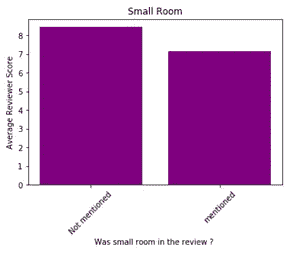
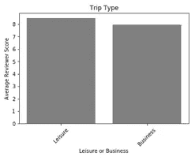

# 基于酒店评论数据集的自然语言处理情感分析

> 原文：<https://medium.com/analytics-vidhya/sentiment-analysis-using-nlp-on-hotel-review-dataset-fa049e23de29?source=collection_archive---------9----------------------->

酒店预订公司已经积累了大量的数据。用户留下的评论对酒店来说是有价值的，但由于数量巨大，提取见解并非易事。使用自然语言处理(NLP)技术，我们基于给定的评论数据进行情感分析，并将其可视化。此外，分析数据的负面和正面情绪，以基于给定的评论指出关键的优势和劣势。

# 数据源

数据取自 Booking.com 网站([数据集](https://www.kaggle.com/jiashenliu/515k-hotel-reviews-data-in-europe))，数据刮自[Booking.com](http://www.booking.com)。文件中的所有数据对每个人都是公开的。数据最初归 Booking.com 的[所有。该数据集包含全欧洲 1493 家豪华酒店的 515，000 条客户评论和评分。](http://www.booking.com)

# 使用的库:

**熊猫** —数据帧和操作

**Numpy** —数值库

**Matplotlib** —可视化

**Seaborn** —可视化

**自然语言工具包** —自然语言处理库

**sci kit-学习**–加工技术

# 预处理步骤:

与所有数据一样，第一步是**处理空值**。因为有一个最小的空值集，所以我们在分析中会直接忽略它们。还必须删除除字母以外的所有符号和字符。

为了使用文本数据进行预测建模，必须解析文本以排除一些单词。这种技术被称为**标记化**。然后它们都被转换成小写字母。**去除停用词**如‘and’，‘but’等。因为这些词在我们的分析中没有任何意义。最后，完成**变元化**并存储值。

注意:以上步骤适用于阴性和阳性病例。

# 使用积极/消极情绪中最常见的词语来寻找痛点:

Scikit-learn 库中的**计数矢量器**用于将一组文本数据转换为**矢量**。在生成矢量表示之前，还可以使用各种预处理技术，这使得它成为一个强大、通用的文本特征表示模块。

注意:以上步骤适用于阴性和阳性病例。

# 来自数据的关键见解:

通过汇总用户评论分数并通过 Seaborn 的图形工具进行分析，很明显 **Ritz Paris** 是**最好的**酒店，而 Hotel Liberty 似乎是最差的。我们观察到 **70%** 的离开评论的人来自**欧洲**，其中很大一部分来自英国。

***图 1 大陆审稿人***

审查者的分数似乎相当一致，并且**与停留的天数**无关，除了损失发生在**第 21 天**。评审者留下的分数似乎与停留的**月/年**的**无关。**

***图 2(a)停留天数与审核者评分***

***2(b)个月的停留时间与审核者评分***

**最佳** **评审**由**夫妇**和**独唱** **旅行者**似乎离开了**最差**的那些。数据集中的“谁”代表以下内容:

1.独自旅行者

2.夫妇

3.组

4.有小孩的家庭

5.有较大孩子的家庭

***图 3(a)【谁】与审核人评分***

***3(b)酒店所在国家与审核人评分***

最好的酒店出现在奥地利和西班牙。

# 引用条形图中的分组类别:

***4(a)空调 vs .评审员评分***

***图 4(b)房间大小与评审员评分***

***图 5(a)房间问题与评审员评分***

***5(b)位置与审核人评分***

***图 6(a)工作人员与审核人员得分***

***6(b)床/房间与审核者评分***

***图 7(a)移动审核与审核人评分***

***7(b)行程类型与审核人评分***

# 特征的皮尔逊相关矩阵:

***图 8 皮尔逊相关矩阵特征***

因此，可以从观察综述数据中提取大量的见解。这可以通过从数据集中选择一个特定的酒店并观察所涉及的每个特征来进一步扩展。使用数据仔细观察评论的细微差别可以极大地帮助提高客户满意度，进而提高客户保留率和忠诚度，并在新的潜在客户中产生兴趣。