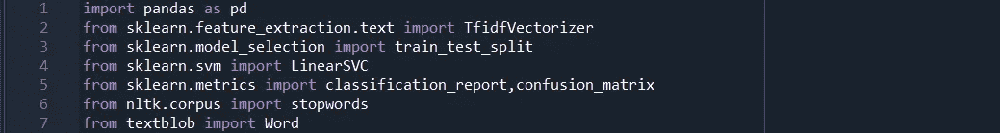
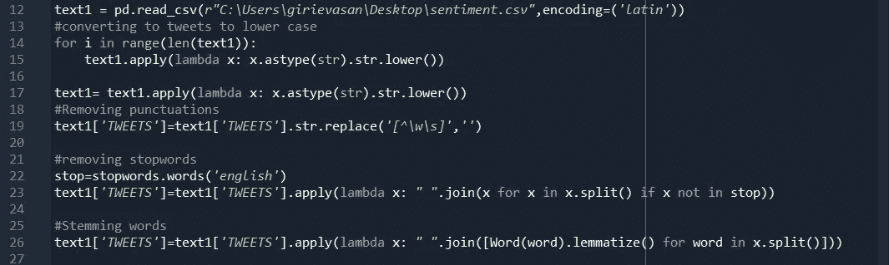
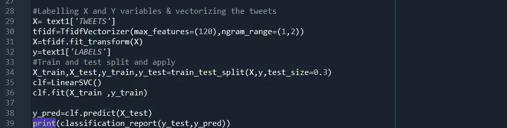
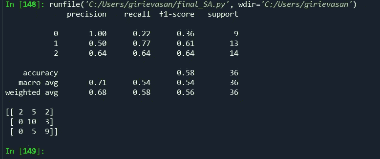
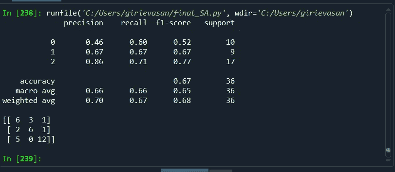

# 使用 Scikit-learn 进行情感分析

> 原文：<https://medium.com/analytics-vidhya/sentiment-analysis-using-scikit-learn-9adcfd45f6dc?source=collection_archive---------10----------------------->

电子商务公司广泛使用情感分析来衡量客户对产品的情感，并向制造商提供有价值的反馈。必须重视评审，它可用于根据客户的兴趣改进性能/产品质量。

我创建了自己的数据集，由各种主题为“印度内乱”的推文组成(120 条带标签的推文)，其中 0=中立，1 =积极，2 =消极。这些原始的 tweets 集合由标签(#)、不必要的转发、提及、标点符号组成，它们不能被输入到我们的 ML 算法中进行训练和测试。在这样做的时候，该算法将不能很好地“概括”/理解推文。以上是这段代码中使用的库的列表。

上面的部分描述了代码的预处理部分。我们使用 pandas，pd.read_csv，function，来加载数据集。所以我们从把所有的大写字母转换成小写字母开始。然后移除标签和提及。我们删除标点符号，停用词和执行词干。在大多数预处理的情况下，我使用匿名函数“lambda”来遍历数据帧，以便单独预处理推文。

在得到一个完全处理过的 tweets 数据集后，我们将它们输入到 ML 算法中。我们将“TWEETS”列指定为输入向量，“X”，将“LABELS”指定为输出向量(label)..但在此之前，不考虑算法。使用，输入向量应该是数字字符，因为我们的算法不能理解字符串来训练和测试推文，所以我们对推文进行矢量化。对于矢量化，我们使用术语频率-逆文档频率方法。在矢量化之后，我们然后进入我们的 ML 算法，在我们的情况下是支持向量分类器。我们为 ML 算法导入 LinearSVC 库，tfidfVectorizer 库在输入算法之前对输入向量进行矢量化，train_test_split 库从 sklearn 模块中为 ML 部分代码拆分数据集。

在对推文或评论进行分类时，情感分析会派上用场。一些电子商务公司使用这种技术来了解当前的市场趋势以及客户对他们的产品有多满意。如果一个人真诚地想改进他的产品，以提高他的市场，他应该多注意负面评论。类似地，当考虑到“民间动乱”的情况时，人们应该更多地关注负面推文，以减少我们国家的犯罪率和骚乱，而不是关注正面推文。因此，这份问题声明要求召回负面推文。或者为了有一个更好的模型，我们应该有一个 F1 分数合理的模型。

如前一段所述，我们需要关注负面推文/评论(2 级情绪)，以降低犯罪率和骚乱，或提高产品质量。以上两次迭代是 ML 分类器在数据集上的最佳性能，但是在一些迭代中，我注意到所有类的 F1，recall 分数都很差，这是由于数据集的大小很小。更大的数据(大约 3000 条推文)可能会更方便地提高分数，算法看到越来越多的实例。

PS:tfidf = tfidf vectorizer(max _ features =(13)，ngram_range=(1，2))；在这一行代码中，我充分减少了 max_features 参数，以获得分类器的最佳性能。