# 使用 TextBlob 的情感分析

> 原文：<https://medium.com/analytics-vidhya/sentiment-analysis-using-textblob-ecaaf0373dff?source=collection_archive---------5----------------------->

达里尔·韦伯拍摄的照片

# 什么是情感分析？

情感分析算法主要专注于处理大量文本中的观点、态度甚至表情符号。已建立的情感的变化从一种技术到另一种技术有很大的不同。传统的分析器最多定义几种基本的极性情绪(积极的、消极的、中性的)，而额外的高级模型的限制更广。

# 文本 Blob:

TextBlob 是一个用于处理文本数据的开源 python 库。它提供了一个简单的 API 来访问它的方法和执行基本的 NLP 任务。
TextBlob 对文本数据执行不同的操作，例如名词短语提取、情感分析、分类、翻译等。

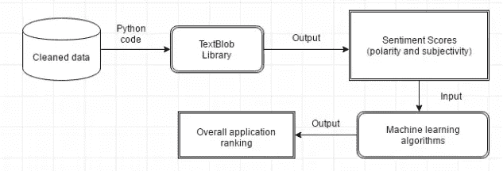

TextBlob 是建立在 NLTK 和 Pattern 之上的，它也非常容易使用，可以用几行代码处理文本。TextBlob 可以帮助您开始 NLP 任务。

让我们看一个使用 TextBlob 在 Python 中确定情感分析的非常简单的例子。

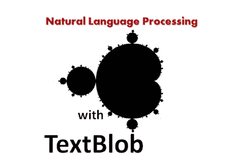

开始之前，让我们安装 TextBlob。

步骤 1:在 Anaconda/命令提示符下执行 pip install TextBlob。

第二步:一旦安装，你可以提供数据，并分析它的情绪。

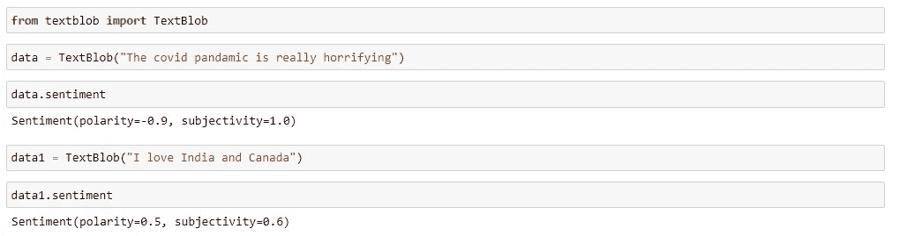

**观察:**我们可以看到输出被分为两类:极性**和主观性**。****

****极性**是范围[-1.0 到 1.0]内的浮点值，其中 0 表示中性，+1 表示非常积极的情绪，-1 表示非常消极的情绪。**

****主观性**是一个范围在[0.0 到 1.0]内的浮点值，其中 0.0 非常客观，1.0 非常主观。主观句表达一些个人的感觉、观点、信念、意见、主张、愿望、信念、怀疑和推测，而客观句则是事实。**

**我们再举一个例子来检验极性和主观性。**

**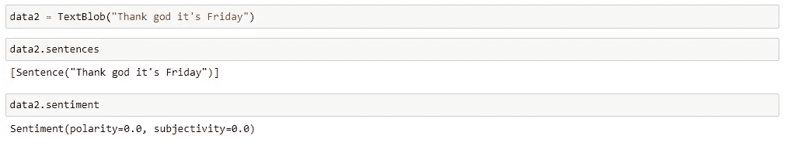**

**我们可以看到这个陈述是中性的，句子是客观的。**

**我们可以使用其他功能，并根据需求分析输出。**

# **单词标记化:**

**单词标记化是将大量文本样本拆分成单词的过程。这是自然语言处理任务中的一项要求，其中每个单词都需要被捕获并接受进一步的分析，如针对特定情感对它们进行分类和计数等。自然语言工具包(NLTK)是一个用来实现这一点的库。**

**我们有基于 NLTK 的 TextBlob，所以我们直接使用它的方法。**

**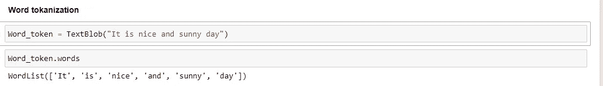**

# **字数:**

**我们可以计算给定消息中的字数，并根据需要对其进行处理。**

**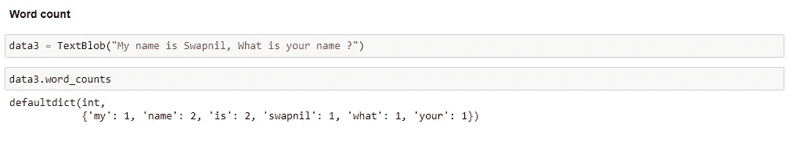**

# **名词短语提取:**

**因为我们在前一节中提取了单词，所以我们可以只从 textblob 中提取名词短语。**

**当你想分析一个句子中的“谁”时，名词短语抽取尤为重要。让我们看看下面的例子。**

**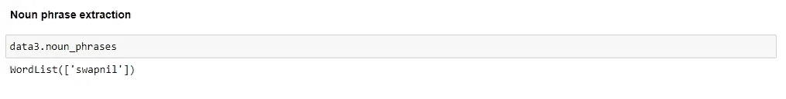**

# **翻译和语言检测:**

**使用 TextBlob 我们可以将任何语言翻译成其他语言来理解它的确切含义。**

**我们举个例子来理解这一点。**

**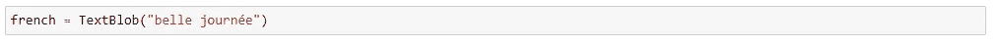**

**你能猜出这篇课文吗..？我们可以使用 textblob 来实现。**

**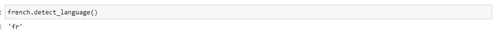**

**所以，这是法语，我们可以把它转换成任何我们容易理解的语言。为了更好地理解意思，我们将把它转换成英语。**

**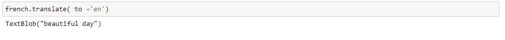**

**耶！！！！祝你有美好的一天:)**

# **拼写纠正:**

**拼写纠正是 TextBlob 提供的一个很棒的功能，我们可以使用如下所示的纠正功能来访问。**

**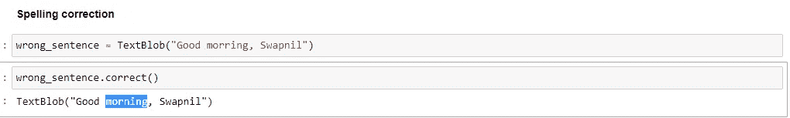**

**我们还可以使用拼写检查功能来检查建议单词的列表及其可信度。在我们的句子中“早晨”被错误地提到了，让我们检查一下对它的建议，最大的置信度将在更正中获得优先权。**

**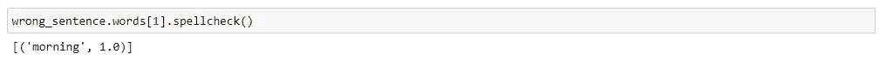**

**我们可以看到拼写检查给了我们 100%的信心，它也被取代了。**

# **优点和缺点:**

****优点:** 1。TextBlob 是在 NLTK 和 Pattern 的基础上构建的，因此通过提供一个直观的 NLTK 接口，对初学者来说很简单。
2。TextBlob 提供由 Google Translate 支持的语言翻译和检测等功能。**

****缺点:** 1。与 spacy 相比，TextBlob 稍慢，但比 NLTK 快。(Spacy>TextBlob>NLTK)
2。TextBlob 不提供依赖解析、词向量等功能。由 spacy 提供。**

****参考:** [**堆栈总线**](https://stackabuse.com/sentiment-analysis-in-python-with-textblob/)**