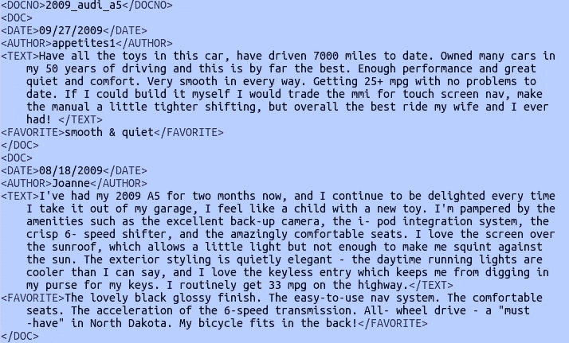
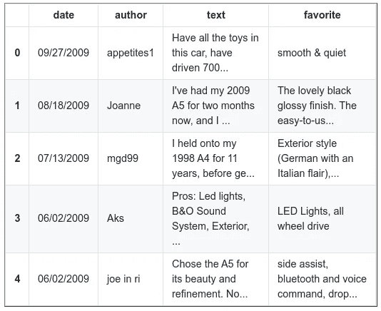
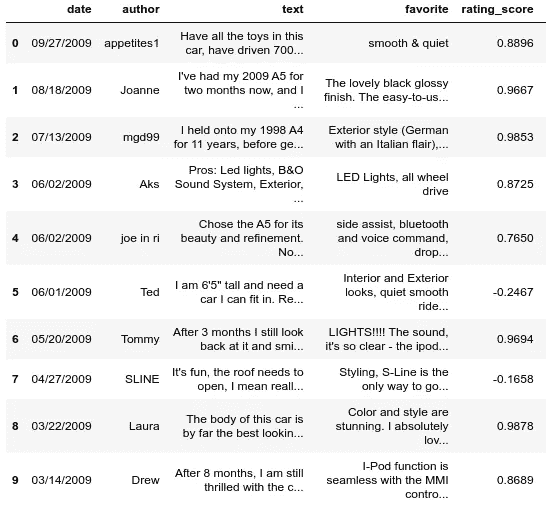
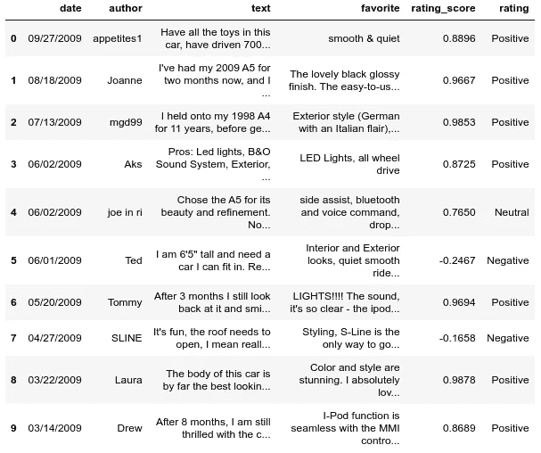

# OpinRank 数据集上的情感分析

> 原文：<https://medium.com/analytics-vidhya/sentiment-analyzer-on-opinrank-dataset-4e961dcaecbc?source=collection_archive---------12----------------------->


今天生成的大量数据是非结构化的，需要经过处理才能产生洞察力。非结构化数据的一些例子是新闻文章、社交媒体上的帖子、产品和地点的评论以及搜索历史。分析自然语言并从中理解意义的过程属于自然语言处理(NLP)领域。情感分析是一项常见的自然语言处理任务，它包括将文本或部分文本分类为预定义的情感。我们将使用[自然语言工具包(NLTK)](https://www.nltk.org/)(Python 中常用的 NLP 库)来分析文本数据。

NLTK 库包含各种实用程序，允许您有效地操作和分析语言数据。在它的高级特性中有**文本分类器**，你可以使用它进行多种分类，包括情感分析。

**情感分析**是使用算法将相关文本的各种样本分类为整体积极和消极类别的实践。使用 NLTK，您可以通过强大的内置机器学习操作来使用这些算法，以从语言数据中获得洞察力。

# 安装和导入

您将从安装一些先决条件开始，包括 NLTK 本身以及贯穿本教程所需的特定资源。

首先，使用`[pip](https://realpython.com/what-is-pip/)`安装 NLTK:

```
$ python3 -m pip install nltk
```

虽然这将安装 NLTK 模块，但是您仍然需要获得一些额外的资源。其中一些是文本样本，另一些是某些 NLTK 函数需要的数据模型。

要获得您需要的资源，请使用`nltk.download()`:

```
import nltk

nltk.download()
```

当我们执行情感分析时，我们将使用 NLTK 中的 vader_lexicon 包。

*   `vader_lexicon` **:** 由 C.J .休顿和 Eric Gilbert 创建的 NLTK 在执行情感分析时引用的单词和术语的评分列表

**OpinRank 数据集:**

OpinRank 数据集包含实体(即汽车和酒店)的用户评论。它们构成了来自 Tripadvisor(约 259，000 条评论)和 Edmunds(约 42，230 条评论)的完整评论。数据集可以在链接中找到—[https://github.com/kavgan/OpinRank.git](https://github.com/kavgan/OpinRank.git)

该数据集最适用于分析文本数据、情感分析、数据汇总、评论分类以及文本挖掘中的许多其他功能。

数据集采用以下格式:



**将上述标签格式转换为 CSV 格式:**

为此，我们将使用几个库。我们需要下载的第一个库是 [beautiful soup](https://www.crummy.com/software/BeautifulSoup/bs4/doc/) ，这是一个非常有用的 Python 抓取工具。在命令提示符下执行以下命令，下载漂亮的 Soup 实用程序。

```
$ python3 -m pip install beautifulsoup4
```

我们需要解析 XML 和 HTML 的另一个重要库是 [lxml](https://lxml.de/) 库。在命令提示符下执行以下命令来下载`lxml`:

```
$ python3 -m pip install lxml
```

现在让我们使用一些 python 代码将数据从标记格式转换为 CSV 格式。使用 Jupyter 笔记本体验更好。

```
*#changing data from tag format into csv data*
*#import BeautifulSoup package*
**from bs4 import BeautifulSoup***#data file to load the data* **data_file = "2009_audi_/2009_audi_a5"** *#csv file to convert data in tag format into csv format* **csv_file = "2009_audi_/2009_audi_a5.csv"***#loading data from the data file in text format* **with open(data_file) as txt_file:
    data = txt_file.read()***#using Beautiful soup to get the data into html format* **soup = BeautifulSoup(data, 'lxml')***#taking list to load the data into csv format* **csv_data = []** *#headers for the csv format* **csv_data.append(["date","author","text","favorite"])** *#finding and printing the data of "doc" format* **for doc_tag in soup.find_all("doc"):
**    *#loading data in list to append the cummulated data to upper list*
 **raw_data = []** *#getting each values for a respective doc tag*    **raw_data.append(doc_tag.find("date").text)
    raw_data.append(doc_tag.find("author").text)
    raw_data.append(doc_tag.find("text").text)
    raw_data.append(doc_tag.find("favorite").text)
    csv_data.append(raw_data)***#Converting list of lists to CSV* **import csv** 
*#function to convert list of lists to csv format* **def write_csv(file,data):
    with open(file, 'w', newline='') as file:
        writer = csv.writer(file)
        writer.writerows(data)***#loading the data into csv format* **write_csv(csv_file,csv_data)**
```

我们已经成功地将 tag 格式的数据转换为 CSV 格式。我已经将数据保存为 CSV 格式，这样我就可以为那些希望结果比工作更快的人共享这些文件。相反，你可以直接把它转换成熊猫数据帧。

**构建情感分析器:**

一旦 CSV 格式的数据准备就绪，我们需要构建一个情感分析器来对评级进行分类并计算评级得分。

因此，让我们使用一些 python 代码来完成这项任务。

```
**import pandas as pd***#loading the csv data into dataframe* **df = pd.read_csv(csv_file)
df.head(5)**
```



```
*#Using nltk to load the sentiment analyzer* **import nltk
nltk.download('vader_lexicon')**
```

我们将使用来自*nltk . perspective . Vader*包的一个名为*SentimentIntensityAnalyzer()*的函数。[情感分析器](https://www.nltk.org/api/nltk.sentiment.html)可以使用 NLTK 算法和功能实现和促进情感分析任务，因此无需复杂的编码就可以生成情感得分。在使用它之前，我们需要调用它。

```
*#using sentiment analyzer of nltk* **from nltk.sentiment.vader import SentimentIntensityAnalyzer** 
*#loading sentiment Analyzer* **sid = SentimentIntensityAnalyzer()**
```

上述函数将生成极性得分。我们将得到四种类型的分数:负面的、中性的、正面的和复合的。我们将使用复合分数作为评级分数，因为我们可以通过保持特定阈值来使用它对评论进行分类。

```
*#storing scores* **scores = []** 
*#iterating every review* **for i in df["text"]:**
 *#calculating the sentiment score*
 **scores.append(sid.polarity_scores(i)["compound"]** 
*#loading rating score to dataframe* **df["rating_score"] = scores
df.head(10)**
```



在这里，我们可以观察到评分的范围从负值到大约 0.98。因此，通过应用某些阈值，我们可以更改上面的代码，并可以将评级分为积极、消极和中性。

```
*#lower and upper thresholds* **threshold_lower = 0.4
threshold_upper = 0.85**
```

上述阈值是在对评级分数和评级进行统计观察后选择的。

```
*#storing scores and rating* **scores = []
rating = []**

*#iterating every review* **for i in df["text"]:**    *#calculating the sentiment score and comparing threshold*
    **if sid.polarity_scores(i)["compound"] < threshold_lower:
        rating.append("Negative")
    elif sid.polarity_scores(i)["compound"] < threshold_upper:
        rating.append("Neutral")**
    **else:
        rating.append("Positive")**
 *#appending scores* **scores.append(sid.polarity_scores(i)["compound"])** 
*#loading rating score and rating to dataframe* **df["rating_score"] = scores
df["rating"] = rating
df.head(10)**
```



因此，我们实现了我们的目标，并将评级分为积极、消极和中立。完整的结构化代码可以在—[https://github.com/muttinenisairohith/OpinRank.git](https://github.com/muttinenisairohith/OpinRank.git)找到

我们可以进一步分析评论并添加其他功能，如-

*   建立一个模型来总结人们喜欢/讨厌该产品的主要原因。
*   通过提取其他产品的评论并推荐更好的产品，将情感得分与其他产品进行比较。
*   基于评论生成为用户提供附加信息的特定主题的情感得分。

以上话题将在我们以后的文章中涉及。

敬请关注。