# Yelp 数据的情感分析——文本分类

> 原文：<https://medium.com/analytics-vidhya/sentiment-classification-of-yelp-data-293f401c3656?source=collection_archive---------12----------------------->

# **简介**

顾客在评论方面的反馈已经成为在线业务非常重要的一部分，因为它有助于了解用户对产品的情绪。基于在线网络的商业服务，如亚马逊评论、谷歌我的业务、yelp、城市搜索，为他们的客户提供选项，以文本数据以及数字评分(满分 5 分)的形式提供评论作为他们的意见。这些来自成千上万顾客的反馈充当了“网上口碑”。消费者或评论者给出的这些反馈成为新客户或现有客户选择产品或服务的标准，因为随着时间的推移，评论提供了所提供服务的当前质量。最近几项研究表明，由于客户在在线平台上分享的意见，这些反馈对业务产生了积极和消极的影响。

**问题定义:**这个项目的目标是使用自然语言处理和机器学习技术将客户的评论分为正面和负面情绪。这是一个需要解决的重要问题，因为在对产品做出决定时，只允许检查评级而不是文本评论，这将节省个人的时间。

# **数据集**

我们项目中使用的数据集是由 Yelp 提供的。这家公司制作关于各种商业来源的众包评论。从 Yelp 获得的数据集是海量的。它包括五个 json 文件，分别用于业务的不同方面，即:提示、签到、评论、用户、业务。它们中的每一个都存储在 json 文件中。用户数据集包含具有 22 个特征的 1968703 条记录，业务数据集包含具有 14 个特征的 209393 条记录，评论数据集包含具有 9 个特征的 80211222 条记录，提示数据集包含具有 5 个特征的 1320761 条记录，登记数据集包含 175187 条记录。

业务 json 文件具有诸如业务 ID、业务名称、业务位置、星级、评论计数和餐馆是否营业的信息等属性，它还具有类别作为特征，包括关于数据集中不同类型业务数据的信息。

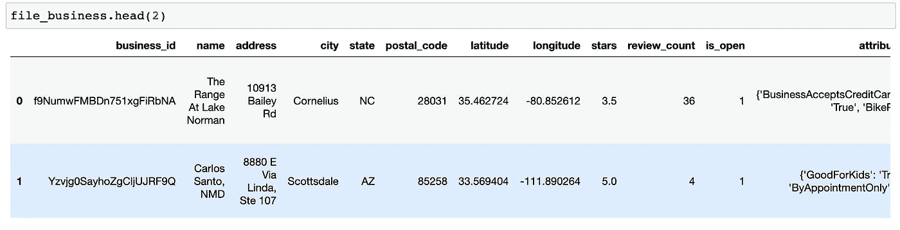

评论 json 文件也有一些属性列，即评论 id(表示评论的 id)、用户 id(表示给出评论的用户的 id)、业务 id(表示不同业务的 id)，它也有 star rating 作为存储每个人的评论的列和文本。

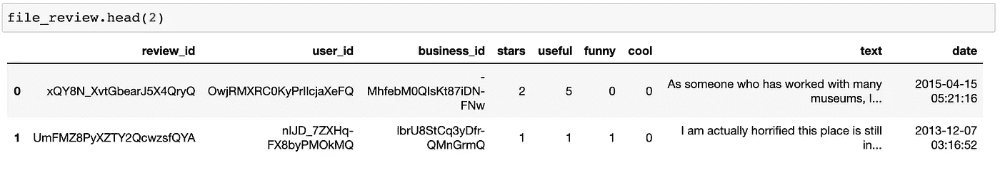

审查数据框架

在我们的项目中，用于构建机器学习模型的主要数据存在于 business json 和 review json 文件中。yelp 数据集为企业增加了很多价值，因为来自企业任何类别的数据都可以用来了解个人对该产品的行为。因此，在这样的数据上建立模型可以通过基于用户的情感向用户提供准确的推荐来帮助企业保持在市场中的竞争力。因此，对于我们的项目，我们将使用该企业的餐馆类别的评论，它有 5056227 条记录。由于计算的限制，在这项工作中，我们只利用 10000 条记录来建立我们的模型。目标标签是二元的，因为高于 3 星的评级被标记为正面评价，而任何其他评级被标记为负面评价。

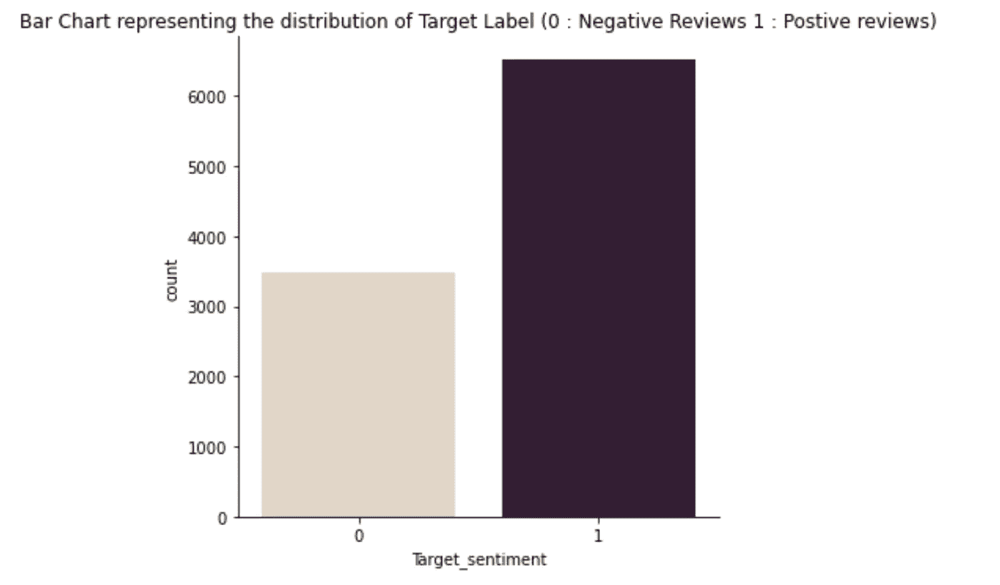

# 数据预处理

数据清理和预处理被认为是任何机器学习项目中要执行的主要任务之一，以确保机器学习模型建立在高质量数据的基础上。对数据进行预处理后，从中提取相关或重要的信息。

在这个项目中，我们执行了多个步骤来清理和处理数据。首先，我们删除了数据集中所有不必要的列，这些列在构建模型时是不需要的。我们还对评论执行了以下数据预处理技术。

> 删除不必要的列
> 
> 从评论中删除缩写
> 
> 从评论中删除数字、特殊字符和表情符号
> 
> 从评论中删除停用词
> 
> 将所有单词转换成小写格式
> 
> 对评论进行词汇化

通过使用 NLTK python 库消除了评论数据集中的停用词。最常见的停用词，如“我”、“我”等。因为它们倾向于扭曲结果，但是一些停用词没有被删除，例如“不”、“非”等。在我们的“Yelp 数据的情感分类”项目中，单词重要性是至关重要的因素，因为它将定义评论的情感，所以如果我们从“*不好”*中删除单词“不”，这将把负面情感句子转换为正面情感句子。因此，在进行数据预处理以保留评论的真实情感时，使用 NLTK 库没有消除一些停用词。我们还使用 NLTK 库对评论进行了词条化。词元化是一种将单词转换成词元形式的方法。例如，单词“*行走”*将被转换为“*行走”*。该过程将有助于正确分析评论中出现的单词，并且目标标签被转换成二进制形式(0:负面评论，1:正面评论)。

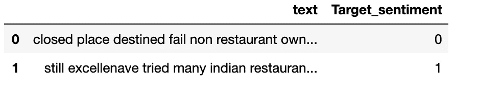

已处理数据帧

# 数据可视化

与机器学习的其他组件非常相似，数据可视化也是重要的部分之一，因为它提供了对数据模型正在处理的类型的可视化洞察。如果很好地理解了输入数据，就可以从模型中得出更精确和可预测的见解。因此，我们为模型的输入数据创建了各种可视化。

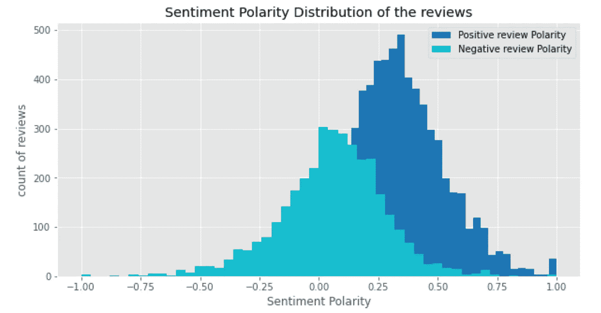

评论的情感极性图

上图是正面和负面评论的情感分析。该图根据他们的情绪明确区分了正面和负面评论。正如我们所见，负面评论更多地被归类为负极性，而正面评论大多偏向正极性。

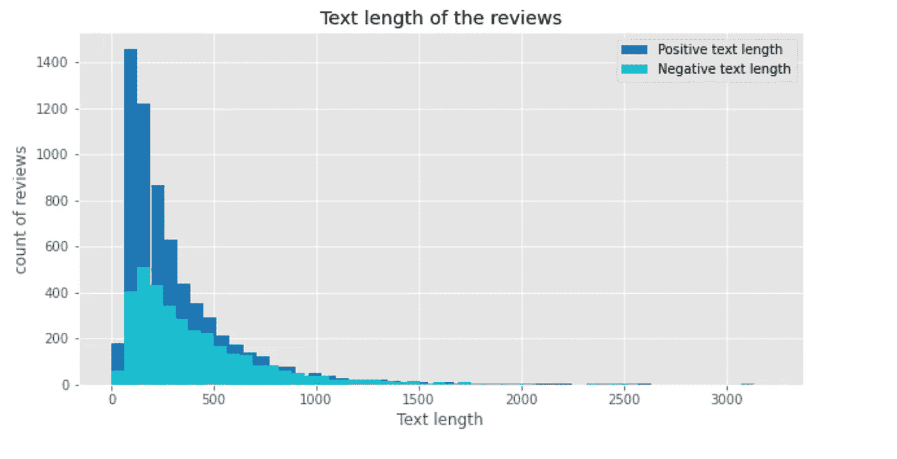

评论的文本长度

上图显示了正面和负面评论的文本长度。它给出了更简洁的理解，因为在上图中，负面评论的文本长度分布与正面评论几乎相同。这意味着用户倾向于用几乎相同的长度写正面和负面的评论。

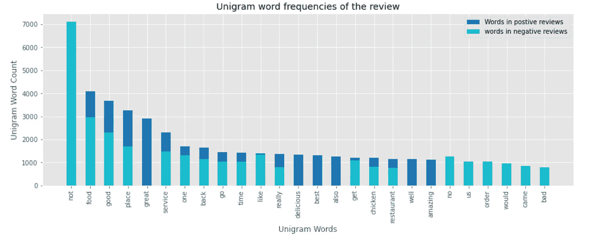

评论的单字频率

上图显示了正面和负面评论中出现频率最高的 20 个单字。对于负面评论，我们有诸如“不”、“不好”等出现频率最高的词，而对于正面评论，诸如“很好”、“最好”等词是出现频率更高的词。因此，它让我们清楚地了解数据集中使用的单字。

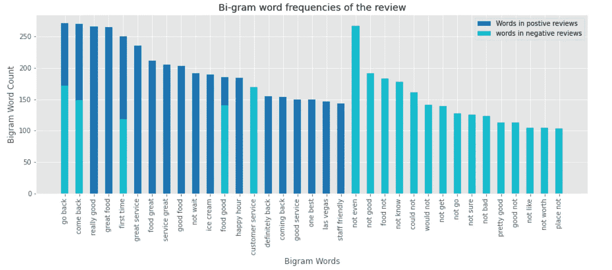

评论的双字母词频

上面的图显示了出现在文章正面和负面评论中的前 20 个二元词。从上面的情节可以清楚地看出，二元模型更相关，因为我们可以看到“不好”一词完全出现在负面评论中，而“好吃的”一词则主要出现在文本的正面评论中。因此，我们可以得出结论，单词的双元向量可能是建立模型的重要特征之一。

# 特征工程

特征工程是通过转换模型的特征空间来提高模型的整体预测性能的任务。特征工程是该过程中的核心和最重要的步骤，因为它是机器学习模型预测结果的来源。

**文本特征:**将数据集拆分后进行训练和测试。两种重要的特征工程技术被用于将文本转换成矢量。

1.  **词频逆文档频率:**是集合或语料库中的统计方法。这项技术确定了一个单词在文档中的重要性。我们已经使用 TF-IDF 将文本转换成矢量的数字表示。在我们的项目中，我们使用了 TF-IDF 的二元模型变体，因为我们可以从二元模型单词图中得出结论，这些特征可能是预测结果的最佳特征之一。
2.  用于正面和负面评论预测的第二种文本特征工程技术被称为 SpaCy。SpaCy 是一种单词嵌入技术，用于将来自数据集的评论转换为向量。使用 SpaCy 的“en_core_web_lg”模块，将每个用户的文本评论标记为单词，并从中创建向量。这些向量然后被平均以产生 300 维的数字特征，我们将这些特征向下馈送到下游的机器学习算法。

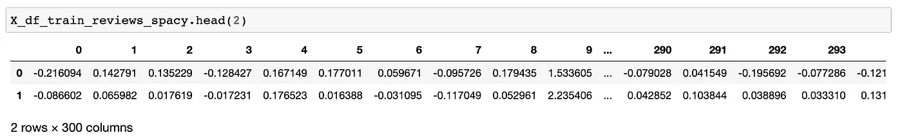

使用空间库将评论转换为矢量

**数字特征:**文本长度数字特征是使用客户给出的评论开发的。

# 履行

**多项式朴素贝叶斯:**使用的第一个基线模型是具有 TFIDF 和文本长度特征的多项式朴素贝叶斯，并且算法的所有参数都被设置为默认。

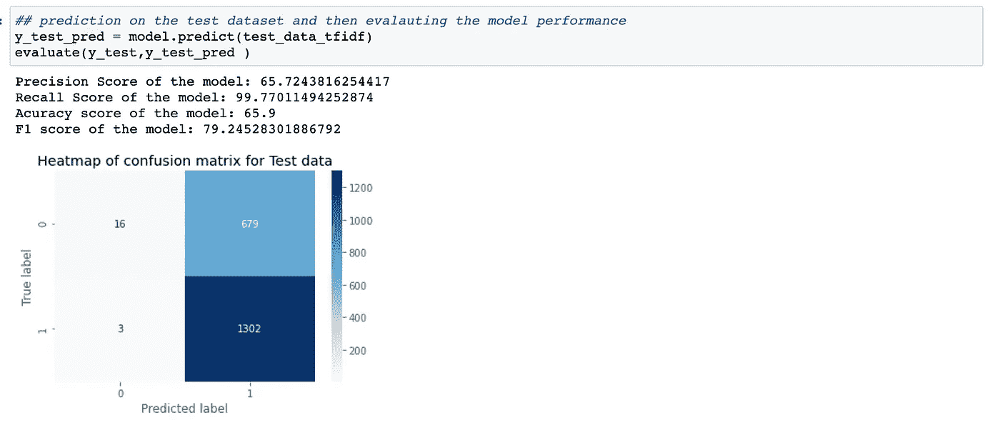

从基线模型获得的上述结果表明，与负类相比，该模型能够在正类上表现得更好。似乎模型偏向于一个类。

**支持向量机:**该算法再次与 TFIDF 和文本长度特征以及默认参数一起使用。

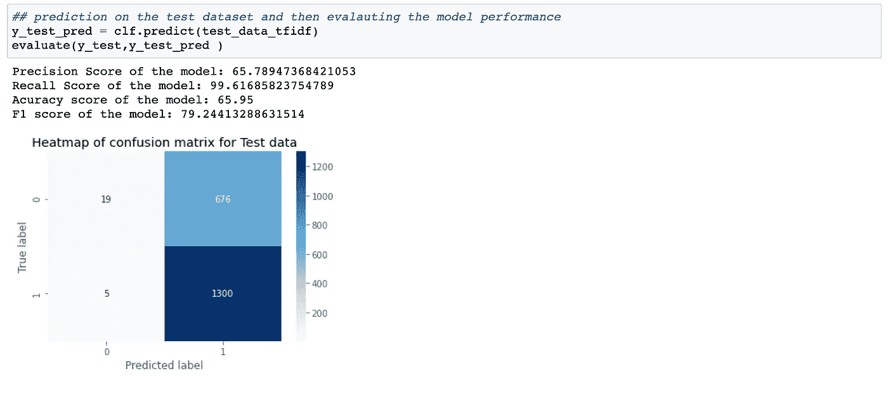

结果

第二个模型的预测与第一个模型非常相似，因为这个模型也偏向于正类。

> 为了克服上述问题并建立精确的模型，我们使用 imblearn 库对训练数据进行过采样，以便少数类的大小可以与多数类匹配。

**随机森林:**使用具有特征 TFIDF 和文本长度的过采样训练数据集来训练该算法。还使用网格搜索算法进行超参数调整，以获得模型的最佳参数。

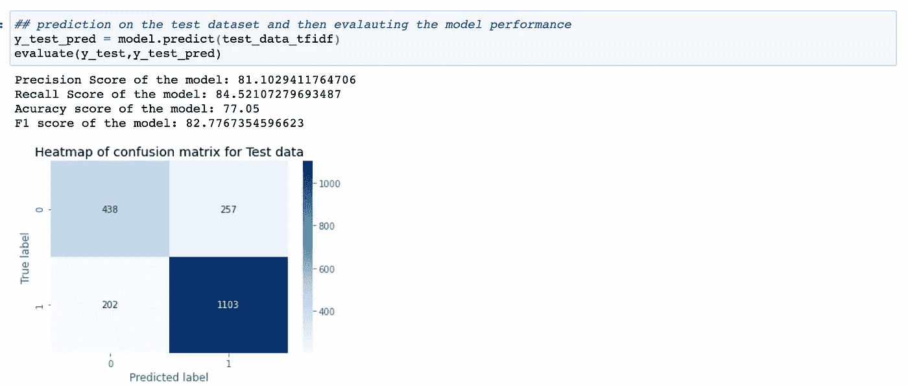

结果

正如我们所看到的，随机森林模型的结果有了显著的改进。该模型能够在目标标签的两个类别上执行得更好。

**支持向量机:**在具有空间向量和文本长度特征的过采样数据集上训练该算法。采用网格搜索算法获得该模型的最佳参数。

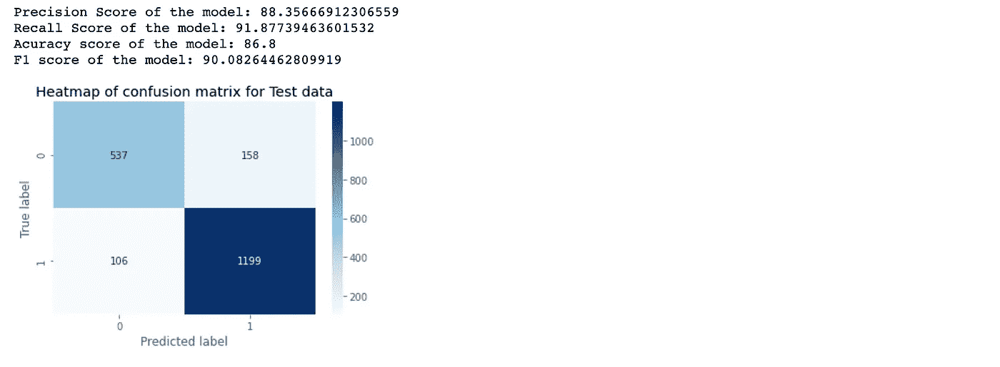

结果

从上述模型获得的结果是令人满意的，因为它在两类目标变量上都表现得更好。事实上，支持向量机模型表现最好，F1 值为 90%。

# 结论

这个项目的目标是建立一个预测模型，将用户评论分为正面或负面情绪。我们建立了两个不同场景的模型。第一个模型利用了具有默认参数的算法，并且由于类中的不平衡问题，模型 1 表现不佳。第二个模型是在平衡具有不同特征的训练数据集的类别之后，通过训练各种机器学习算法来建立的。模型 2 的支持向量机算法得到的结果在所有具有空间和文本长度特征的算法中是最好的。我们的结论是，如果 yelp 评论的数据能够被适当地管理，并且适当的特征工程应该被执行以产生好的结果。

**代码链接:**[https://github . com/abhijeet 1026/Ml-Projects/blob/master/perspection % 20 class ification % 20 on % 20 yelp % 20 dataset . ipynb](https://github.com/Abhijeet1026/Ml-Projects/blob/master/Sentiment%20classification%20on%20Yelp%20dataset.ipynb)

**参考文献:**

[https://pubson line . informs . org/doi/10.1287/mnsc . 49 . 10 . 1407 . 17308](https://pubsonline.informs.org/doi/10.1287/mnsc.49.10.1407.17308)

[https://arxiv.org/pdf/1605.05362.pdf](https://arxiv.org/pdf/1605.05362.pdf)