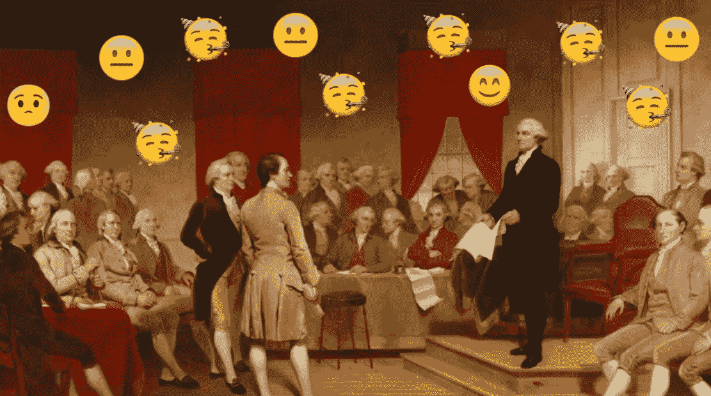

# 情感分析:用一个简单的技术例子介绍。

> 原文：<https://medium.com/analytics-vidhya/sentimental-analysis-introduction-with-a-simple-technical-example-f9abaed5e58a?source=collection_archive---------12----------------------->


# **什么事**

情感分析是用于研究人类语言的一般情绪/感觉/或情感的术语。它也可以应用于其他领域(也许是座头鲸交配的歌曲),但我们将只看文本的情感分析。

这个话题对外人来说可能有点怪异，对我们的人性来说可能显得有些侵扰。我们真的能量化我们的情绪吗？当然可以，情感分析有很多有用的应用。它并不完美，实际上离完美还很远，但它可以很有见地，并且很有趣。

# **用例**

*用户体验*:一家公司重新设计了他们的网站，想要测量用户的评论与之前的基准相比是积极还是消极。

产品开发:研发团队要求用户评论一个原型，并使用评论问卷进行情感分析，以衡量对新产品的总体反应。

*客户服务*:帮助台服务可以使用情感分析和票证优先级来确定首先解决的问题。例如，一种解决方案是从优先级最高的最不开心的客户开始，到优先级最低的最开心的客户。

*政治民意调查*:一个政治组织可能会在 twitter 标签上进行情绪分析，以“调查”一项新法律的总体情绪。

# 例子

情绪分析通常看正面、中性和负面分数的简单分类。

每个单词或单词集合将具有所有三个分数加上一个复合分数，该复合分数只是各个分数的组合，以传递一些聚合度量。

"我要给他一个他无法拒绝的提议。"教父(1972)


```
from nltk.sentiment.vader import SentimentIntensityAnalyzertext = "I'm gonna make him an offer he can't refuse."sia = SentimentIntensityAnalyzer()
sia.polarity_scores(text)
**output: {'compound': 0.2235, 'neg': 0.0, 'neu': 0.809, 'pos': 0.191}**
```

**消极**衡量文本的消极程度

**neu** 测量文本的中性程度

**pos** 测量文本的积极程度

**复合**是文本的总得分，可以按以下方式解释:

*   1 到 0.5 —总体积极情绪:
*   0.5 到-0.5 —中性情绪
*   -0.5 比 1 —负面情绪

让我们看几个其他的例子。请注意，较短的段落更难分析，而且大多数在情感上是中性的。

“我是世界之王！”(泰坦尼克号 1997)


```
sia.polarity_scores(text)
**output: {'compound': 0.0, 'neg': 0.0, 'neu': 1.0, 'pos': 0.0}**
```

“及时行乐。抓紧时间，孩子们。让你们的生活变得不同凡响。”死亡诗社，1989 年。

```
sia.polarity_scores(text)**output: {'compound': 0.0, 'neg': 0.0, 'neu': 1.0, 'pos': 0.0}**
# "seize the day" and "extraordinary" are very positive words. Again, sentiment analysis is not perfect. 
```

“妈妈总是说生活就像一盒巧克力。你永远不知道你会得到什么。”——阿甘正传，1994 年

```
sia.polarity_scores(text)
**output: {'compound': 0.3612, 'neg': 0.0, 'neu': 0.857, 'pos': 0.143}**
```

为了从《泰坦尼克号》、《死亡诗社》和《阿甘正传》的情感混乱中恢复过来，让我们来看看更令人兴奋的东西，美国宪法的序言…



```
PREAMBLE = """
We the People of the United States,\
in Order to form a more perfect Union, establish Justice,\
insure domestic Tranquility, provide for the common defense, \
promote the general Welfare, and secure the Blessings of \
Liberty to ourselves and our Posterity, do ordain and establish \
this Constitution for the United States of America.\
"""sia.polarity_scores(PREAMBLE)
**output: {'compound': 0.9744, 'neg': 0.0, 'neu': 0.608, 'pos': 0.392}**
```

啊哈，终于有些过于积极的东西了！

## 简单但技术性的解释，它如何在 4 个步骤

1.  **分词词典**

*   为每个单词创建一个到数字 id 的映射。本质上为每个单词分配一个唯一的索引。
*   这可以对整个英语语言，或者你想使用的一些单词集进行。
*   例如，让我们拿一些不那么随意的词汇集合来说:

```
+----+---+----+------+------+
|  0 | 1 | 2  |   3  |   4  |
+----+---+----+------+------+
| No | I | am | your |father|
+----+---+----+------+------+
```

**2。向量化你的正文文本**

*   因为数学是用数字来完成的，所以让我们把想要分析的单词转换成向量。我们可以这样做:如果句子中缺少字典中的一个单词，则投射 0；如果有一个单词，则投射 1。
*   例句:

```
"No, I am your father." - Star Wars (the correct quote) +---+---+---+---+---+
| 0 | 1 | 2 | 3 | 4 |  <- index 
+---+---+---+---+---+
| 1 | 1 | 1 | 1 | 1 |  <- vector 
+---+---+---+---+---+"I am a father."  - a simple sentence (ignore "a" for now)+---+---+---+---+---+
| 0 | 1 | 2 | 3 | 4 |  <- index
+---+---+---+---+---+
| 0 | 1 | 1 | 0 | 1 |  <- vector
+---+---+---+---+---+
```

**3。列车型号**

*   通过训练模型，我的意思是简单地为每个单词指定一个情感分数。这可以手动完成，或者通过使用一些其他机器学习方法来完成。
*   对于我们的例子，让我们只使用一个单一的复合分数来分配一个情感值。
*   我将根据自己的情感感知来分配分数，因此在情感分析中必须认真考虑偏见。

```
indices 
+--+--+--+----+------+
| 0| 1| 2| 3  |  4   |  
+--+--+--+----+------+text
+--+--+--+----+------+
|No| I|am|your|father|
+--+--+--+----+------+scores
+--+--+--+----+------+   
|-1| 1| 1| 0  |  1   |
+--+--+--+----+------+1 = positive
-1 = negative
0 = neutral
```

**4。使文本适合模型。**

*   这是您将要分析的文本适合模型的地方。最终目标是获得一个情感分数。
*   分数是映射到字典的另一个向量。我们不需要像在我们的例子中那样，对字典中的每个单词都有一个分数。其他机器学习模型可以对没有确切情感值的词进行平均。

```
index from the dictionary
+---+---+---+---+---+
| **0** | **1** | **2** | **3** | **4** | 
+---+---+---+---+---+vector for "No, I am your father"
+---+---+---+---+---+
| 1 | 1 | 1 | 1 | 1 |
+---+---+---+---+---+vector for "I am a father"
+---+---+---+---+---+
| 0 | 1 | 1 | 0 | 1 | 
+---+---+---+---+---+score vector
+---+---+---+---+---+
|-1 | 1 | 1 | 0 | 1 | 
+---+---+---+---+---+
```

*   让我们使用这两个句子和我们在步骤 2 中创建的向量来拟合它们，并得到一个情感分数。使用点积将单词向量与分数向量相乘。将点积的结果除以单词向量中 1 的数量，得到“加权”或组合的情感分数，该分数将在-1 和 1 之间。

```
# "No, I am your father."
[1,1,1,1,1]*[-1,1,1,0,1]^T = 2/5 = 0.4 # "I am a father."
[0,1,1,0,1]*[-1,1,1,0,1]^T = 3/3 = 1
```

*   人们很容易对《星球大战》中的名言“不，我是你的父亲”做出否定的评价，因为这是卢克·天行者可能收到的最糟糕的消息。分数其实是中性的 0.4。我认为卢克对这个消息也是中立的。顺便说一下，讽刺是很难用机器学习来衡量的。
*   文本“我是一个父亲。”得分为正 1。
*   我们除以单词向量中 1 的计数，通过句子中当前单词的数量来标准化得分，这些单词在向量中用 1 表示。

我希望这是对情感分析的一个有用的介绍，有一个简单但技术性的例子。