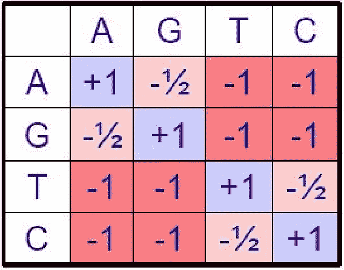

# 序列比对和 Needleman-Wunsch 算法

> 原文：<https://medium.com/analytics-vidhya/sequence-alignment-and-the-needleman-wunsch-algorithm-710c7b1a23a4?source=collection_archive---------4----------------------->

[图像来源](https://www.americangene.com/blog/the-gene-therapy-market-is-going-to-produce-a-microsoft-2/)

你知道人类的 DNA 和黑猩猩的 DNA**98.8%**是一样的吗？虽然这个数字可能听起来很小，但当我们进入我们的 DNA 时，人类和黑猩猩是非常不同的。在构成我们遗传密码的大约 30 亿个碱基对中，其中的 1.2%相当于超过 3500 万个遗传差异**。**

在染色体水平上，我们和黑猩猩有惊人的相似之处。([图像来源](https://www.mun.ca/biology/scarr/Human_Ape_chromosomes.htm))

因此，从基因组学的角度模拟黑猩猩如何进化成人类是一个巨大的壮举，因为突变可能有许多不同的可能性。突变可以包括**插入**(碱基对的添加)**缺失**(碱基对的去除)，以及**改变**(碱基对的改变)。当扩展到我们拥有的数十亿个碱基对时，这个数字对于可能将黑猩猩 DNA 改变为人类 DNA 的排列数目来说就成了天文数字。

三种最常见的突变。([图像源](https://www.singerinstruments.com/resource/what-are-genetic-mutation/))

**序列比对**解决了这个问题，它允许我们比较两条基因链，并找到导致一条链到另一条链的突变序列。序列比对的目标是找到基因组中的同源/相似序列，然后根据这些序列之间出现的缺口进行碱基突变。

序列比对的简单表示。([图像来源](https://towardsdatascience.com/pairwise-sequence-alignment-using-biopython-d1a9d0ba861f))

由于可能发生的不同进化事件的数量，常见的序列比对算法试图**最小化事件**的数量来解释两个基因序列之间的差异。此外，他们使用了改变比插入和删除更常见的启发。

## 术语

直系同源物对旁系同源物对同源物([图像来源](https://bitesizebio.com/26762/homology-terminology-never-say-wrong-word/))

*   **序列比对:**比较两条核苷酸链以发现一系列突变的过程，这些突变将一条链与另一条链区分开来
*   **直向同源:**导致两个生物体具有相同基因副本的事件(可用于追溯生物体的进化根源)
*   **旁系同源:**一个物种内的复制事件(同一物种的两个成员具有相似的基因)
*   **全局比对:**基因链中每个元素的比对
*   **局部比对:**包含相似序列的区域的比对
*   **NBAs(非钻孔比对)**:缺口总是与核苷酸配对的比对(例如，两个序列中都没有缺口)
*   **空位罚分:**在一个核苷酸序列中产生空位的罚分
*   **子串:**字符串中连续的字符序列
*   **子序列:**通过删除一些元素而不改变其余元素的顺序，可以从序列中导出的序列

# 考虑

## 最小化成本

在下面的过程中，我们需要最小化“成本”以及事件的数量。如上所述，增加成本的事情是使用插入(因为改变比插入更常见)或用嘌呤代替嘧啶(因为嘌呤更有可能被相应的嘌呤替换)。

因此，我们的目标是找到**成本最低、操作最少的序列**，将初始序列转换为最终序列。

碱基对改变的成本矩阵。([图像来源](https://www.semanticscholar.org/paper/2-.-3-Formulation-1-%3A-Longest-Common-Substring-Fujiwara-Kruskall/1b6f2a01a8ed330c8fb7ec277a50924528df8fa0/figure/1))

## 差距惩罚模型

除了考虑突变之外，还必须对缺口进行额外的考虑。例如，从生物学角度来看，制造一个缺口的成本要比扩大一个已经形成的缺口的成本高得多。目前有几种不同的差距处罚:

*   **线性缺口罚分:**对所有缺口使用固定成本，而不考虑其当前延伸的缺口长度。
*   **仿射空位罚分:**这为打开空位强加了大的初始成本，但随后为每个空位延伸强加了小的增量成本。
*   **一般缺口罚分:**这使用各种不同的多项式和线性函数来查看哪一个提供了最佳的序列比对。注意这可能会极大地影响运行时间。
*   **帧感知间隙惩罚:**这定制了成本函数以考虑编码帧中的中断；例如，某种氨基酸的变化会导致表型的改变。

间隙长度上不同间隙罚分的图表。([图像来源](https://www.wikiwand.com/en/Gap_penalty)

让我们用数学方法来表示缺口惩罚。如果我们让 **w(k)** 作为 *k* 缺口的缺口罚分，我们可以看到下面的情况出现:

*   线性间隙损失:w(k) = p
*   仿射间隙惩罚:w(k) = p + qk
*   一般缺口惩罚:w(k) = p + qk 或 w(k) = p + qk + rk

# 最长公共子串(二次)

寻找两个基因序列之间突变数量的最简单方法是使用两个序列之间最长的公共子串。然后，您可以将子串并排放在两个序列中，并解释因插入/改变而偏移的其他核苷酸。然而，这显然**不是最佳解决方案**，而且它运行起来也非常**慢**，因为你必须枚举所有可能的对齐。

工作中最长的公共子串的例子。([图像源](https://www.youtube.com/watch?v=AuXp5IZNq70))

从上面的例子中可以看出，在 S1 和 S2 之间发现了 6 个突变，尽管这显然不是最佳解决方案，也没有减少两个序列之间的步骤数。

# 最长公共子序列(指数)

一种最小化步骤的方法是**允许子序列**之间有间隔，而不仅仅局限于子串。然后，可以将这些子串部分排列在一起，并在缺口中找到突变。

工作中最长公共子序列的例子。([图像来源](https://www.youtube.com/watch?v=AuXp5IZNq70))

从上面的例子可以看出，突变已经从 6 个减少到 4 个，这意味着我们的算法越来越好。但是时间复杂度大大增加，从二次到**指数**。

如果考虑 NBAs(其中缺口总是与核苷酸配对)，以及长度为 n 和 m 的序列，其中 n > m，比对的数目为(n+m)选择 m，这大约是 2^n 比对。

# 动态规划

动态编程的基本组件。([图片来源](https://www.geeksforgeeks.org/dynamic-programming-vs-divide-and-conquer/))

我们如何在保持同等精度的同时，再次将运行时间从指数级减少到二次级？答案就在**动态规划**中，它允许我们利用重叠的子问题来高效地解决问题。对于动态编程问题，需要检查两个主要方面:

*   **最优子结构:**一个问题的最优解包含该问题子问题的最优解。
*   **重叠子问题:**子问题会重复很多次，所以存储这些子问题的答案会降低运行模型时的计算复杂度。

用动态规划将递归树转化为矩阵。([图片来源](https://itnext.io/dynamic-programming-vs-divide-and-conquer-2fea680becbe?gi=cf98e9f00d45))

对于动态编程，需要五个主要步骤:

*   找到问题的一个**参数化**，确定模型迭代时变化的变量个数。
*   确保子问题空间具有多项式时间复杂性，并且有大量子程序**可重用**。
*   确定一个有效的方法来遍历这些变量。
*   确定一个**递归公式**。这建立了上面提到的子结构，其中最优解依赖于子问题的最优解。
*   记住子问题的最优解，并用多项式表示它。

## 序列比对中的动态规划

动态编程可以通过创建矩阵用于序列比对，其中列/行是两个序列。算法，简单来说，就是系统地填表，找到最优分数，然后从最优分数回溯，找到最优解。

# Needleman-Wunsch 算法

## 设置

我们现在回到两个序列之间的最长公共子序列的问题，以及如何将时间复杂度从指数降低到线性。在做之前，这几个变量需要定义:

*   **S = {S1，S2，…，Sm}** 和 **T = {T1，T2，… Tn}** :两个序列
*   **d** :差距惩罚成本(如上所述)
*   **s(x；y)** :从 S 对齐一个碱基 x 和从 T 对齐一个碱基 y 的得分
*   **F** :矩阵，其中 F (x，y)指 S 中的第 x 位，T 中的第 y 位

矩阵 F 如何寻找 S = ACTG，T = ACTG ( [图片来源](https://www2.seas.gwu.edu/~simhaweb/cs151/lectures/module12/align.html))

该算法试图使用动态规划的一个关键部分:您可以跟踪优化的子问题，以解决寻找最佳子序列的问题。如果存在从 F(0，0)到 F(m，n)的最优对齐(或者跨两个子串的最优对齐)，那么这意味着对于[0，m]中的任何 I 和[0，n]中的 j，在 F(0，0)到 F(i，j)和 F(i+1，j+1)和 F(m，n)之间存在最优对齐。这表明最优路径中的每个子路径也必须是最优的。

此外，它还告诉我们,( m + 1) * (n + 1)空间矩阵是必要的，因为 F(i，j)存储该位置的最佳比对的分数。

## 填充矩阵

运行 Needleman-Wunsch 时矩阵 F 的实例化值。([图像来源](https://www.youtube.com/watch?v=AuXp5IZNq70)

第一步是**初始化**一些行和列，以便算法可以系统地将数据填充到矩阵中的其他单元。F(0，0)用 0 初始化，因为还没有进行对齐。F(i，0) = F(i-1，0)-d，因为从 F(i-1，0)到 F(i，0)的状态变化意味着序列 T 有一个缺口，这造成了缺口误差损失。类似地，F(0，j) = F(0，j-1)-d，因为从 F(0，j-1)到 F(0，j)的状态变化意味着序列 S 有一个间隙。

下一步是**用最优分数填充矩阵 F** 。在每个点 F(i，j ),有四种可能性需要考虑:

*   序列 S 在当前比对处有一个缺口: **F(i，j-1)**
*   序列 T 在当前比对处有一个缺口: **F(i-1，j)**
*   当前位置有一个核苷酸替换: **F (i-1，j-1)**
*   当前位置有匹配: **F(i-1，j-1)**

这些场景中的每一个都提供了不同的分数。为了最大化我们的最终得分并降低我们的成本，我们必须从这些场景中取最大值**。**

最后一步是我们的**终止**序列，终止于右下角或 F(m，n)。这是因为这是两个序列的结尾，所以没有进一步的更改。

*注意:在填写此矩阵时，请记住您是如何完成的(例如，哪个单元格给了您最高分)，这一点很重要。因此，除了存储矩阵 F 之外，还需要存储指示哪些单元格指向哪些单元格的指针。*

## 追溯

初始化完矩阵后，最后一步是**从右下角开始回溯矩阵，直到到达左上角的**(或者从 F(m，n)到 F(0，0))。这将提供最佳的对齐，并且确定路径的含义将为您提供最长的公共子字符串。

Needleman-Wunsch 的实例。([图像来源](https://www.google.com/url?sa=i&url=https%3A%2F%2Fen.wikipedia.org%2Fwiki%2FNeedleman%25E2%2580%2593Wunsch_algorithm&psig=AOvVaw1fNy7w1sIYwWG7Yh9UUR4a&ust=1614036936081000&source=images&cd=vfe&ved=0CAIQjRxqFwoTCOCzgKSS_O4CFQAAAAAdAAAAABAl))

## 运行时间

该算法的时间和空间复杂度均为 O(mn) 。这是因为矩阵的实例化比回溯花费更长时间，但是由于单元的每个实例化花费 O(1)时间，所以对于(m+1)*(n+1)个单元，它花费 O(mn)时间。同样的逻辑可以应用于空间复杂性。

*注:对于非线性间隙复杂性，运行时间可以扩展到****O(Mn(m+n))****。*

# 最佳化

## 有界动态规划

考虑到基因组中数十亿个碱基对，即使时间复杂度为 O(mn ),这个数字仍然很大。有没有办法让模型**线性复杂度**？

可以实现的一种情况是，只有靠近对角线的正方形被用于追溯特征。这意味着不需要实例化矩阵中的其他数字。当然，可能有一些序列严重偏离对角线，但是该算法将可能捕获相对最佳的比对，同时忽略具有太多缺口的比对。

有界动态规划的图形表示。([图像源](https://slideplayer.com/slide/14104507/))

数学上可以说我们把矩阵限制在距离 W，这意味着只会有 **O((m+n) * W)** 的时间和空间复杂度，也就是说现在有线性复杂度。然而，重要的是要记住，这将不再保证最佳对齐。

## 线性空间对齐

可以进行的另一个观察是，只需要最后更新的列来创建下一列，这仅花费 O(m)。然而，即使更新是 O(m ),我们怎样才能使回溯是线性的呢？

这可以使用**分而治之**来完成，其中可以进行向前(从左上开始)和向后(从右下开始)传球，这些传球将在中间栏中汇聚。步骤如下:

*   通过**将相邻列的两个比对分数**相加，找到中间列的最佳分数。
*   重复这个过程，取左右两列。
*   使用前面的中间列作为指针来计算中间列的最高分数。

步骤#1:将两个比对分数相加，找到最佳分数。([图片来源](https://slideplayer.com/slide/4837166/))

递归地分而治之，同时迭代地重复步骤#1。([图像来源](https://slideplayer.com/slide/5148425/))

因为回溯需要更多的计算，所以总运行时间为 O(Mn)+O(1/2mn)+O(1/4mn)+…= O(2mn)=**O(Mn)**。然而，与所提供的多项式简化相比，这个线性标量 2 就相形见绌了。

# 多重对齐

## 三序列比对

现在我们已经确定了两个序列的序列比对，让我们看看是否可以将相同的逻辑扩展到一系列的**三个序列 S、T 和 U** 。对于这些，F 的每次更新有七种不同的可能性:

*   对准中两个间隙的三种方式(3 选 2 组合)
*   对准中一个间隙的三种方式(3 选 1 组合)
*   一种对齐方式没有间隙(3 选 0 组合)

因此，更新规则更改如下:

修正了三序列比对的更新规则。([图片来源](https://www.youtube.com/watch?v=AuXp5IZNq70))

注意，对于需要对齐的长度为 n 的 k 个序列，时间和空间复杂度相应地扩展到 **O(n^k。考虑使用上面讨论的各种优化算法来减少运行时间。**

三序列比对的图示。([图片来源](http://www.mi.fu-berlin.de/wiki/pub/ABI/MultipleAlignmentWS13/multal1.pdf))

## 渐进式多重比对

查看三序列比对，我们可以看到，由于指数增长，比对多个序列将很快变得不可行。我们怎样才能把 O(n^k 的增长降低到类似于 O(k*n^2 的水平呢？

首先，让我们假设我们知道与我们的每个序列相关的进化树，并且我们的第一个两序列比对是与最密切相关的序列进行的(这个过程被称为**种子比对**)。接下来，继续将下一个最接近的序列与种子进行比对，每次新的比对都会替换种子。这个过程一直持续到产生最终的对准。

渐进序列比对的可视化表示。([图像源](https://www.researchgate.net/figure/A-progressive-multiple-sequence-alignment-An-example-of-progressive-Multiple-Sequence_fig1_221865314))

需要注意的一点是，这个最终比对**并不是最优的**，但是产生的**运行时间比上面提到的 n 序列比对算法**要短得多。

# 局部对齐

在这个算法中，我们考虑两个序列如何能有最长的公共子序列。这假设**核苷酸分组不会在突变**之间交换位置，这可能最终导致大量突变，而实际结果要小得多。

使用 Needleman-Wunsch 的局部比对示例。([图像来源](https://www.youtube.com/watch?v=AuXp5IZNq70)

如上所示，S 和 T 中的核苷酸序列可以互换，即使这两个序列之间几乎没有突变。对此进行编码相对类似于用于全局比对的 Needleman-Wunsch 算法。初始化、迭代和终止过程略有改变:

*   **初始化:**而不是说 F(i，0) = F(i-1，0)-d，F(i，0) = 0 因为注意局部比对说明在 S 或 t 的任何一点核苷酸序列都可以有一个开关，这适用于 F(j，0)，它也初始化为 0。
*   **终止:**终止现在可以在任何地方发生，如上图所示。
*   **迭代:**因为终止现在可以在任何地方发生，所以我们希望对负的分数进行重罚。因此，我们现在添加一个新的约束，其中如果最大值是负的，那么我们使 F(i，j) = 0。

用于局部对齐的矩阵 F 的实例化值。([图片来源](https://www.youtube.com/watch?v=AuXp5IZNq70))

# 半全局比对

半全局查找序列 S 的子串 S 与序列 t 的子串 t 的**对齐**

使用 Needleman-Wunsch 的局部比对示例。([图像源](https://www.youtube.com/watch?v=AuXp5IZNq70))

与局部比对相似，Needleman-Wunsch 算法中的代码稍有变化，允许这种半全局比对:

*   **初始化:**与本地对准相同
*   **终止:**终止可以发生在底行或右列的任何地方。这是因为这些是序列 S 或 T 停止的地方。由于我们正在寻找半全局比对，一旦序列停止，就没有办法再进一步，类似于全局比对。

用于半全局比对的矩阵 F 的实例化值。([图像来源](https://www.youtube.com/watch?v=AuXp5IZNq70))

# TL；速度三角形定位法(dead reckoning)

*   序列比对使我们能够比较两条遗传链，并确定是什么突变导致了这两条遗传链。
*   在序列比对过程中，必须为缺口大小和不同的核苷酸改变付出一定的代价，以便序列比对在概率和生物学上更有意义。
*   最简单的序列比对算法，最常见的子串，准确性最低，但运行时间最快(二次)。最常见的子序列具有较高的精度，但运行时间极慢(指数级)。
*   动态规划允许我们使用重复的最优子序列来减少模型的计算时间。Needleman-Wunsch 算法为每个子比对创建一个分数矩阵，并通过回溯最大分数找到最佳比对。该算法的时间和空间复杂度是二次的。
*   优化，如有界空间编程和线性空间对齐，是为了使运行时线性。
*   Needleman-Wunsch 算法可以扩展到多个序列的序列比对。
*   不是将整个序列匹配在一起，而是将序列的某些部分匹配在一起，以增加模型的准确性，并提供两个序列之间的进化途径的更好视图。

# 额外资源

*   书籍:[计算生物学——基因组、网络、进化](https://ocw.mit.edu/ans7870/6/6.047/f15/MIT6_047F15_Compiled.pdf)
*   视频:[使用动态编程的序列比对](https://www.youtube.com/watch?v=AuXp5IZNq70)
*   视频:[局部比对，哈希，BLAST 算法](https://www.youtube.com/watch?v=pO3GCbmfUKQ)
*   Page: [Needleman-Wunsch 算法](https://en.wikipedia.org/wiki/Needleman%E2%80%93Wunsch_algorithm)
*   工具:[成对序列比对](https://www.ebi.ac.uk/Tools/psa/)

*如果你想多聊聊，安排一个会议:* [*日历*](https://calendly.com/adityamittal307) *！关于我目前正在做的项目的信息，可以考虑订阅我的* [*简讯*](https://preview.mailerlite.com/v5x5i6) *！下面是* [*订阅*](https://forms.gle/pLWuNuBuJQokMk3N8) *的链接。有兴趣连线的话，关注我上*[*Linkedin*](https://www.linkedin.com/in/adityamittal-/)*[*Github*](https://github.com/adityamittal13)*[*中*](/@adityamittal307) *。***