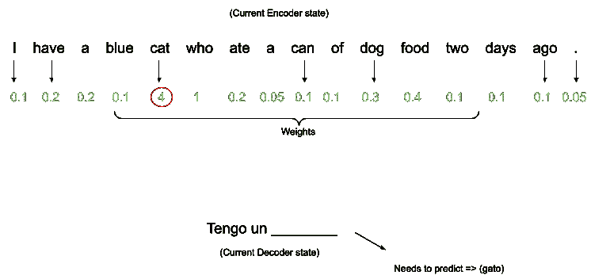
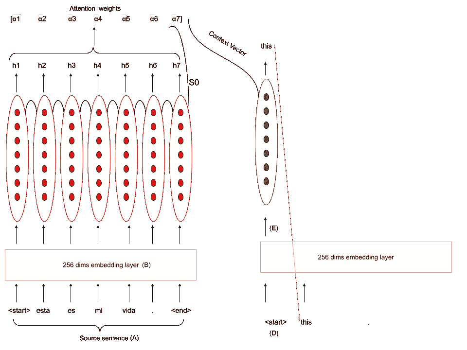
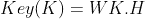
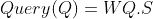
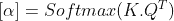
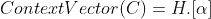
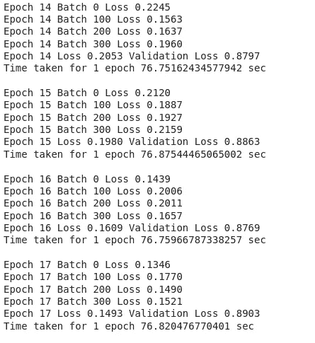
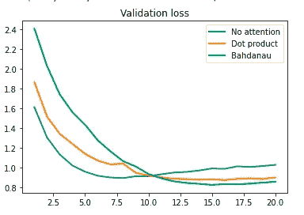
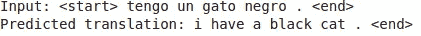

# 序列到序列模型(包括实现—制作翻译器)—第 2 部分

> 原文：<https://medium.com/analytics-vidhya/sequence-to-sequence-models-with-implementation-make-a-translator-part-2-49dbccd3d7d6?source=collection_archive---------1----------------------->

在本文中，我们扩展了我们在第一部分 中构建的 seq2seq 模型，并为其添加了“注意”。我之前在第一部分 **中已经提到了序列对序列模型的需求，使用 RNNs 对其建模。**

请注意，本文有一些代码片段。**完整代码库** [**点击此处**](https://colab.research.google.com/drive/1Fy5nYokwJR3TDek-yS8QC75WDpV_fDxa) **。**

我坚持看完第一部分，以便轻松进入第二部分

# 为什么关注？

我们希望编码器记住输入句子中的重要单词，这些单词会影响解码器解码编码的方式。为此我们使用**注意机制。**


## 建立直觉

让我们考虑下面的翻译:

```
ENGLISH
I have a blue cat who ate a can of dog food two days ago .SPANISH
Tengo un gato azul que se comió una lata de comida para perros hace dos días.
```

对于预测解码器中每个西班牙语单词的模型，它需要知道哪些英语单词对解码器将预测的下一个单词影响最大。



```
Since we need to predict 'gato' (cat in spanish), the english word 'cat' has the highest weight and hence importance during prediction.This otherwise would have been lost due to **vanishing gradients** since the word 'cat' is at the beginning of the input sentence.
```

## 进入细节



考虑上面的模型

```
**α1 α2** ... **α7**  ->  the weights for attention
**h1 h2 ... h7** -> output of each RNN layer in the encoder
**S0** -> Hidden state of the last RNN layer [h1, h2, ... h7] => H
[S0]  -> S
```

## 计算注意力权重(alphas)

我们引入了可训练的参数:WQ(查询权重)和 WK(关键权重)。



计算密钥(可以看作是一个密集层)



计算查询(可以看作是一个密集层)



计算注意力权重

讨论形状

```
H -> (64,16,1024)
WK -> (1024,1024)
K -> (64, 16, 1024)S -> (64,1,1024)
WQ -> (1024,1024)
Q -> (64,1,1024)alpha -> (64,16,1)
```

## 计算上下文向量

上下文向量乘以 RNN 输出(H)。它可以被直观地视为将每个单词输出乘以一些“重要性”权重。



计算上下文向量

## 继续看解码器

解码器(E)中当前单词的单词嵌入与上下文向量(C)连接。这个联合向量被用作 RNN 中的隐藏状态。

注意，在解码器预测每个新单词之前，计算新的上下文向量。

## 关注点积编码

# 用心构建解码器

## 密码

# 培养

## 密码

# 结果



# 翻译



# 我们真的需要 RNNs 吗？

## 注意力提供了什么？

1.  考虑所有输入单词(双向、顺序 rnn)
2.  计算试图求解消失梯度(GRUs/lstm)的上下文向量
3.  允许在前向和后向传播期间并行计算权重，因为仅涉及密集层。

```
We see that attention can do a lot of things RNNs can do.
Hence it is worth to see an experimental setting where we remove RNNs entirely and use only attention.It is in fact proven that Attention performs faster and much better than RNNs. This research work was done in a paper called Attention is all you need.We'll naively implement pure attention in **Part 3 (COMING SOON!)**
```

# 对于整个代码库访问

[](https://colab.research.google.com/drive/1Fy5nYokwJR3TDek-yS8QC75WDpV_fDxa) [## Seq2Seq 实现](https://colab.research.google.com/drive/1Fy5nYokwJR3TDek-yS8QC75WDpV_fDxa) 

# 参考

1.  https://www.youtube.com/watch?v=pLpzU-xGi2E&t = 3028s
2.  [https://github . com/yanxuhapygela/NLP-study/blob/master/seq 2 seq _ with _ attention . ipynb](https://github.com/YanXuHappygela/NLP-study/blob/master/seq2seq_with_attention.ipynb)
3.  【https://www.youtube.com/watch?v=B3uws4cLcFw】T2&list = plgtf 4d 9 zhho 8 p _ zdkstvqvtkv 80 jhhxoe