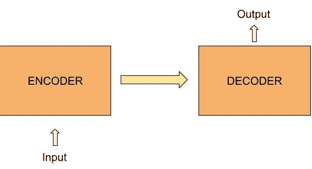
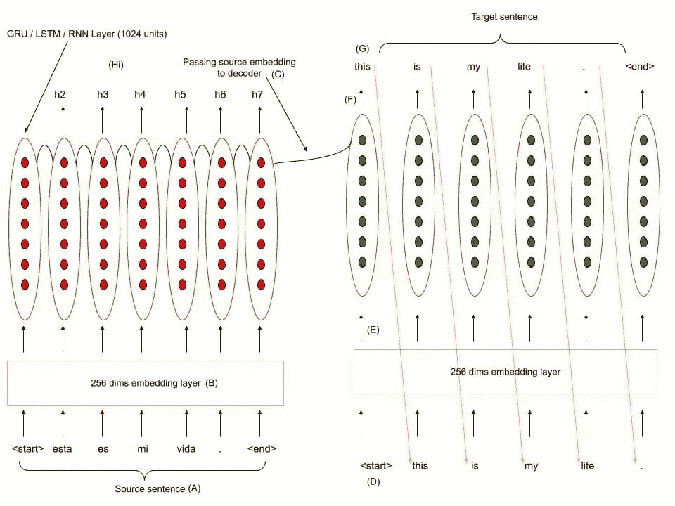
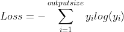
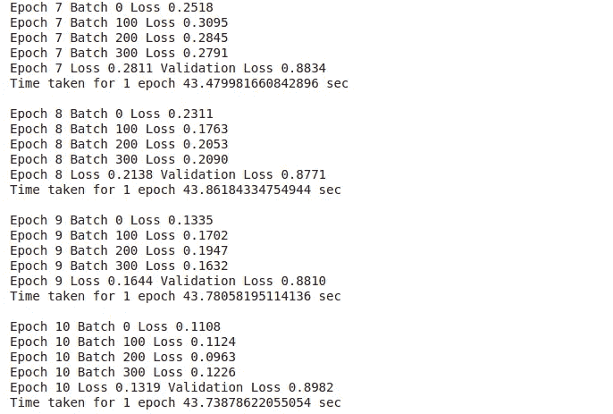

# 序列到序列模型(包括实现—制作翻译器)第 1 部分

> 原文：<https://medium.com/analytics-vidhya/sequence-to-sequence-models-with-implementation-part-1-73cd012520eb?source=collection_archive---------0----------------------->

在本文中，我将向您概述序列到序列模型。我将涵盖序列到序列模型的需求，使用 RNNs(第 1 部分)建模，并注意改进结果( [**第 2 部分**](https://amaygada.medium.com/sequence-to-sequence-models-with-implementation-make-a-translator-part-2-49dbccd3d7d6) )。

请注意，本文有一些代码片段。**完整代码库** [**点击这里**](https://colab.research.google.com/drive/1Fy5nYokwJR3TDek-yS8QC75WDpV_fDxa) **。**

# 序列模型序列的需求

序列对序列模型是编码器-解码器网络，其架构可用于复杂的机器学习任务，如机器翻译、文本[摘要](https://www.vocabulary.com/dictionary/summarization#:~:text=summarization%20Add%20to%20list%20Share,court%20is%20called%20a%20summation.)和聊天机器人。



Seq2Seq 型号概述

# 预处理

## 指导方针

1.  删除特殊字符(@、%、#、…)
2.  在标点符号和单词之间添加空格。(早上好！—>早上好！)
3.  给每个句子添加<start>和<end>标记</end></start>
4.  创建单词索引和倒排单词索引(使用 keras tokenizer)
5.  将每个句子填充到最大长度

## 样本值输入

> 这是我的生活。

## 抽样输出

> 这是我的生活。

## 密码

# 网络建模



## 讨论正向传播

1.  根据词汇大小，将源句子中的所有单词转换为一个热向量
2.  将一个热点向量通过一个可训练的 256 维嵌入层( [**点击此处**](/analytics-vidhya/a-mathematical-dive-into-word-embeddings-5c06f2fd9bbe) 了解更多关于嵌入层和词向量的信息)
3.  嵌入的向量通过 RNN 层(1024 个单元)。
4.  生成源句子的编码。
5.  编码被传递给解码器，它充当解码器 RNN 的隐藏状态。
6.  通过一次传递一个单词来训练解码器。
7.  该模型被期望预测下一个字，该字被传递到 RNN 层。(实际单词在训练期间传递，而预测单词在预测期间传递)
8.  一旦遇到<end>标记或者达到数据集确定的目标句子的最大长度，模型就停止。</end>

## 讨论矩阵形状

有趣的是，没有很多人在讨论建模时讨论矩阵形状，我觉得这是理解 ML 中网络的一个非常重要的部分。

方括号()中的字母表示层。利用这些字母符号，我们将研究矩阵的形状。

我们还将考虑批量大小(64 ),以避免在浏览代码时产生混淆

假设源句子的最大长度= 16(填充后)

RNN 的单位数= 1024

```
{we will consider all 16 together because we have the entire source sentence}
A -> (64, 16, Vocab_size)
B -> (64, 16, 256)
C -> (64,1,1024)
Hi -> (64, 1, 1024){we will consider each word one by one in the decoder as we use the previous word to form the next word. Hence we will not use the max length here.}
D -> (64, 1, Vocab_size)
E -> (64, 1, 256)
F -> (64,1,1024)
G -> (64, 1, Vocab_size)  {apply softmax here to get output word}
```

## 样本值输入

> 这是我的生活。

## 抽样输出

> <start>这就是我的生活。</start>

## 编码编码器网络

编码器张量流代码

## 解码器网络编码

解码器张量流代码

# 损失函数



损失函数

# 培养

# 结果



结果部分

# 翻译

```
Input:                     <start> ¿ todavia estan en casa ? <end> 
Predicted translation:     are you at home ? <end>
```

# 当前编码器/解码器网络的问题

当编码器对输入句子中的最后一个单词进行编码时，由于 ***消失梯度*** ，许多与前面单词相关的信息都丢失了

这通常会影响较长的输入句子。

## 解决办法

我们希望编码器记住输入句子中的重要单词，这些单词会影响解码器解码编码的方式。为此我们使用**注意机制。**

[**第二部分**](https://amaygada.medium.com/sequence-to-sequence-models-with-implementation-make-a-translator-part-2-49dbccd3d7d6) 关于注意事项的详细说明

# 有关整个代码库，请访问:

[](https://colab.research.google.com/drive/1Fy5nYokwJR3TDek-yS8QC75WDpV_fDxa) [## Seq2Seq 注意](https://colab.research.google.com/drive/1Fy5nYokwJR3TDek-yS8QC75WDpV_fDxa) 

# 参考

1.  [https://www.youtube.com/watch?v=pLpzU-xGi2E&t = 3028s](https://www.youtube.com/watch?v=pLpzU-xGi2E&t=3028s)
2.  [https://github . com/yanxuhapygela/NLP-study/blob/master/seq 2 seq _ with _ attention . ipynb](https://github.com/YanXuHappygela/NLP-study/blob/master/seq2seq_with_attention.ipynb)