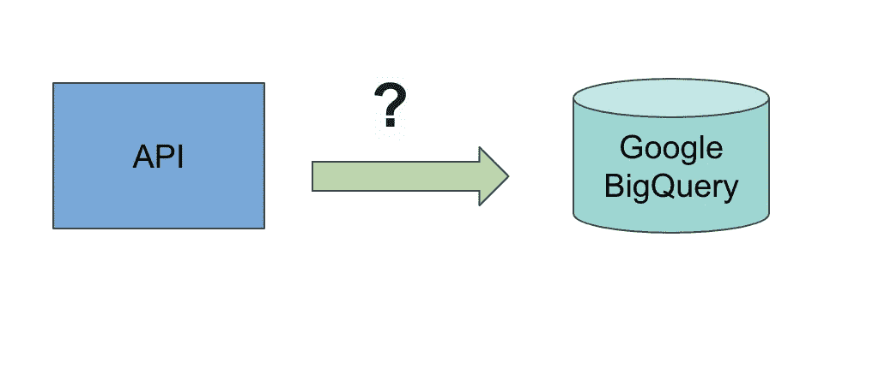

# Google BigQuery 中的无服务器 API 数据摄取:第 1 部分(简介)

> 原文：<https://medium.com/analytics-vidhya/serverless-api-data-ingestion-in-google-bigquery-b926d7de6c80?source=collection_archive---------10----------------------->

## 以无服务器的方式获取 Google BigQuery 中的 API 数据！

> 最初发表于[https://asyncq.com](https://asyncq.com/serverless-api-data-ingestion-in-google-bigquery-part-1-introduction)

**Google big query 的 API**

在云计算时代， [*无服务器*](https://www.redhat.com/en/topics/cloud-native-apps/what-is-serverless) 已经成为我们不断听到的流行语，最终，我们确信无服务器是所有公司的出路…