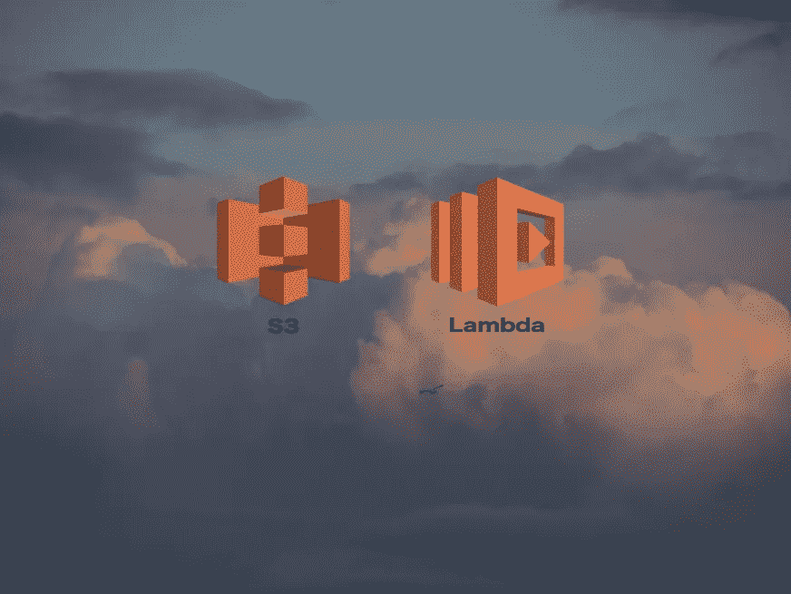

# 使用 AWS Lambda 和 S3 的无服务器图像处理

> 原文：<https://medium.com/analytics-vidhya/serverless-image-processing-with-aws-lambda-and-s3-50e8966eeb0d?source=collection_archive---------2----------------------->

## 使用 AWS Lambda 的分步教程。

图片由来自 Unsplash.com 的 [@nimbus_vulpis](https://unsplash.com/@nimbus_vulpis) 提供

我的上一篇文章总结了什么是 AWS Lambda，以及我们如何从中受益来构建高度复杂的无服务器系统。我们研究了 Lambda 服务包含哪些内容，以及它提供了哪些好的特性。你可以在这里查看我关于 AWS Lambda [的介绍文章。如果您不熟悉云计算和 AWS，您…](http://link)