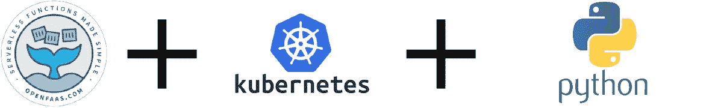
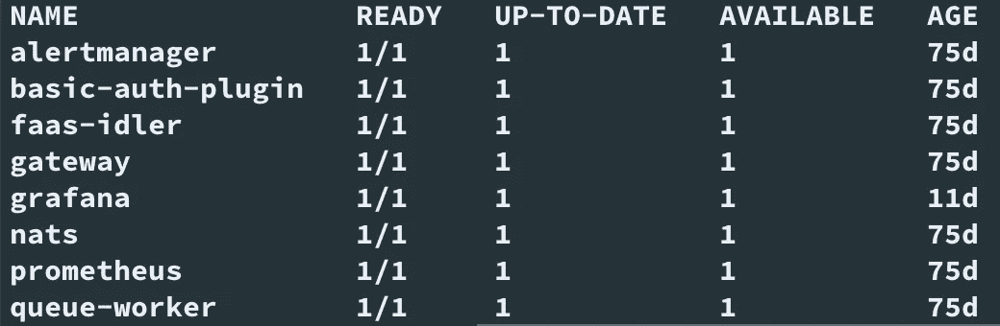
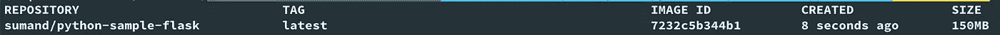
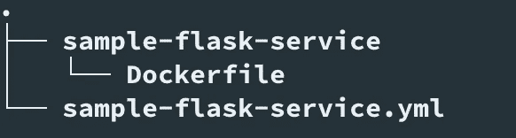
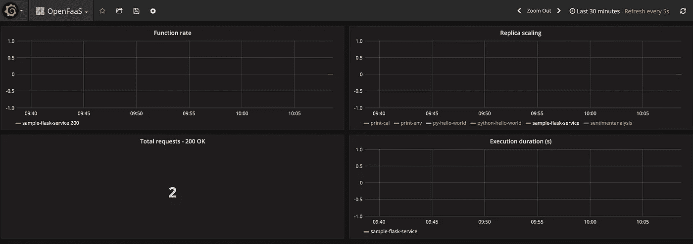
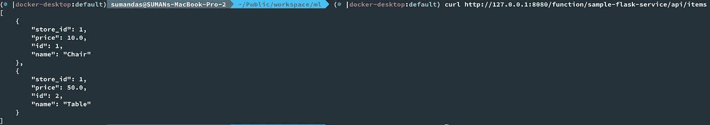
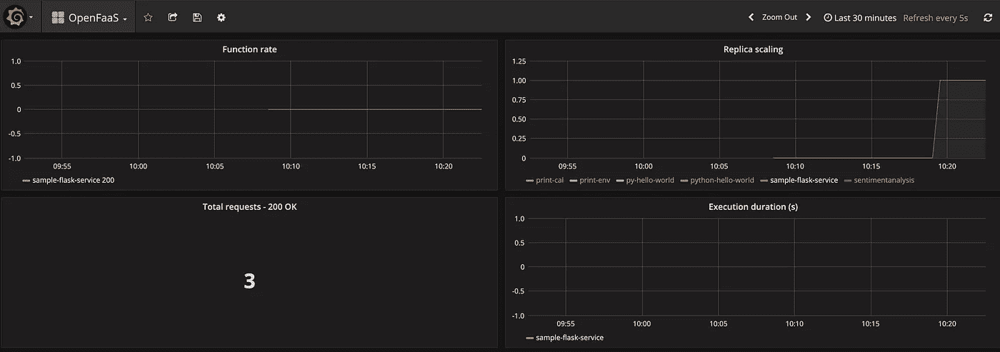
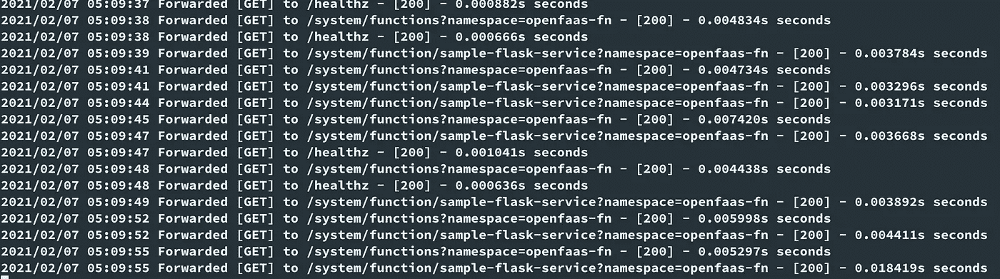
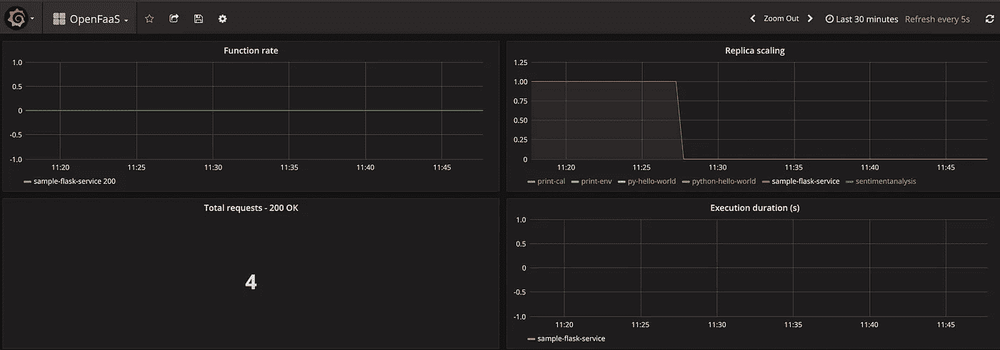
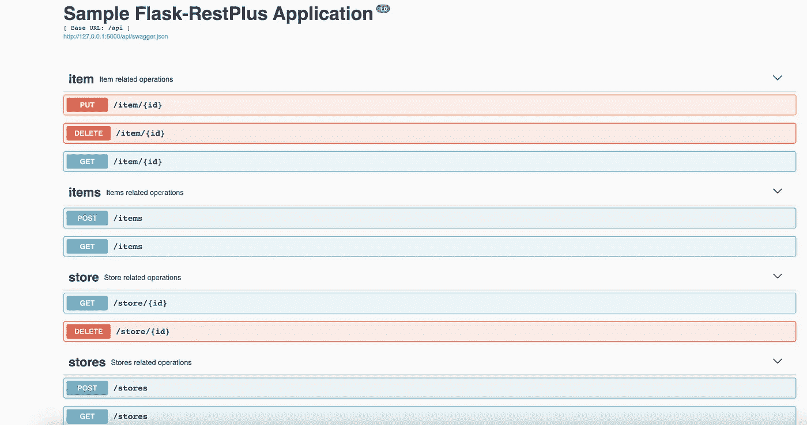

# 使用 OpenFaas、Kubernetes 和 Python 的无服务器

> 原文：<https://medium.com/analytics-vidhya/serverless-with-openfaas-kubernetes-and-python-9934e4a80de5?source=collection_archive---------5----------------------->



带 OpenFaas 的无服务器

在本教程中，我们将学习如何在 [**OpenFaas**](https://github.com/openfaas/faas) 中将 **Flask 微服务**部署为**无服务器功能**。在我之前的一个教程中，我们已经看到了如何创建一个 [Flask 微服务](/analytics-vidhya/building-rest-apis-using-flask-restplus-sqlalchemy-marshmallow-cff76b202bfb)。我们将把那个微服务作为参考，作为一个功能部署在 OpenFaas 上。

## 什么是无服务器？

无服务器是一种架构模式，其中业务逻辑被编写为可以以无状态方式执行的功能。无服务器并不意味着在没有服务器的情况下执行代码。这仅仅意味着我们不必在编写代码的同时提供硬件和基础设施。该应用程序仍然运行在由第三方服务管理的服务器上。

## FaaS 开放机场

功能即服务(FaaS)是一种无服务器模型，能够开发、运行和管理应用功能，而无需构建和部署微服务应用所需的复杂基础设施。按照这种模型构建应用程序是实现无服务器架构的一种方式，通常在构建微服务应用程序时使用。

## Docker 和 Kubernetes

Docker 是一个平台，它使用操作系统级虚拟化来交付被称为容器的软件包中的软件。每个容器都捆绑了自己的软件、库和配置文件。虽然它们彼此隔离，但是它们可以通过明确定义的通道相互通信。容器是开发和部署微服务的好方法。

Kubernetes 是一个可移植的、可扩展的开源平台，它促进了跨主机集群的应用程序容器(这里是 Docker 容器)的部署、伸缩和操作的自动化。

有关 Kubernetes 的更多详细信息，请查看:[https://Kubernetes . io/docs/concepts/overview/what-is-Kubernetes/](https://kubernetes.io/docs/concepts/overview/what-is-kubernetes/)

## OpenFaas

OpenFaaS 是一个开源框架，它使用 Docker 容器来存储和运行函数，支持在 Kubernetes 上实现无服务器架构。 [**OpenFaaS**](https://docs.openfaas.com/) 让开发者可以轻松地将事件驱动的功能和微服务部署到 Kubernetes，而无需重复的、铁板一块的编码。它允许您将您的代码或现有的二进制文件打包到 Docker 映像中，以获得具有自动缩放和度量的高度可伸缩的端点。

有关 OpenFaas 的更多信息，请查看:[https://docs.openfaas.com/](https://docs.openfaas.com/)

我们将使用以下步骤在 OpenFaas 中将 Flask 微服务部署为无服务器功能:

1.  设置 Kubernetes 和 OpenFaas
2.  对接烧瓶应用
3.  创建自定义函数
4.  部署功能
5.  测试功能

## 先决条件

*   Kubernetes 集群:我们需要一个正在运行的 Kubernetes 集群。如果 Kubernetes 集群不可用，则按照 [*的说明建立一个 Kubernetes 集群*](https://kubernetes.io/docs/setup/) *。*
*   **Docker Hub 帐户:**Docker Hub 上的一个帐户，用于存储我们将在本教程中创建的 Docker 图像。有关创建新账户的详细信息，请参考 [Docker Hub](https://hub.docker.com/) 页面。
*   **kubectl:** 关于安装`kubectl`的详细信息，请参见[安装并设置 kubectl](https://kubernetes.io/docs/tasks/tools/install-kubectl/) 页面。

## 1.设置 Kubernetes 和 OpenFaas

OpenFaaS 可以在任何本地或远程 Kubernetes 集群上工作。部署本地或远程 Kubernetes 集群有许多选择。这里，我们将使用 **Docker Desktop** 独立的 Kubernetes 集群来部署 OpenFaas。我们可以使用头盔或阿卡德部署 OpenFaaS。

[**掌舵人**](https://helm.sh/) 是 Kubernetes 包和运营经理。借助 Helm，用户可以通过 Chart 发布自己的应用配置集，然后使用 Helm 或第三方自动化工具发现、安装、升级和管理这些配置。

[**arkade**](https://github.com/alexellis/arkade) 是一个用 Go 编写的开源 CLI，有助于轻松管理应用。`arkade`在内部使用 [helm](https://helm.sh/) 图表和`kubectl`将应用程序安装到 Kubernetes 集群。arkade 为舵图的各种流行选项公开了强类型标志，可以通过`arkade install --help`或`arkade install APP --help`发现。

在这里，我们将使用`arkade`来安装 OpenFaas，因为使用它安装应用程序非常简单快捷。

## 1.1 安装 arkade

使用以下命令安装 arkade。

```
# For MacOS / Linux: 
curl -SLsf https://dl.get-arkade.dev/ | sudo sh# For Windows (using Git Bash) 
curl -SLsf https://dl.get-arkade.dev/ | sh
```

## 1.2 安装 OpenFaas

因为我们使用本地 Kubernetes 集群，所以我们将使用下面的 arkade 命令来安装 OpenFaas。

```
**arkade install openfaas --basic-auth-password password123 --set=faasIdler.dryRun=false**
```

arkade install 命令使用其官方舵图安装 OpenFaaS。在这里，我们用自己的**密码**安装了 OpenFass，并且禁用了`faasIdler.dryRun`。`faasIdler.dryRun`是自动缩放所必需的，我们稍后会谈到。

要检查安装`OpenFaas`的所有可用选项，我们可以使用以下命令。

`arkade install openFaas --help`

要验证安装是否成功，我们可以执行以下命令。

```
**kubectl get deploy --namespace openfaas**
```

安装完成后，输出应该如下所示:



open FAAS-部署

要检查 OpenFaas 中所有核心容器的状态，我们可以执行下面的命令。

```
**kubectl rollout status -n openfaas deploy/gateway**
```

下面的示例输出显示了`gateway`部署已经成功推出。

```
**deployment "gateway" successfully rolled out**
```

我们将使用 kubectl port-forward 命令将对 [http://localhost:8080](http://localhost:8080) 的所有请求转发到运行网关服务的 pod。

```
**kubectl port-forward -n openfaas svc/gateway 8080:8080**
```

只要流程在运行，从本地机器到网关服务的连接将保持打开。如果它断开连接，我们可以再次运行该命令。或者，我们也可以在最后使用`&`在后台运行它。

## 1.3 安装 faas-cli

一旦安装了 OpenFaas，我们就必须安装`faas-cli`。需要使用`faas-cli`来部署和测试 OpenFaas 的功能。执行以下命令安装`faas-cli`。

```
# MacOS and Linux users# If you run the script as a normal non-root user then the script
# will download the faas-cli binary to the current folder
$ curl -sL [https://cli.openfaas.com](https://cli.openfaas.com) | sudo sh# Windows users with (Git Bash)
$ curl -sL [https://cli.openfaas.com](https://cli.openfaas.com) | sh
```

OpenFass 现在准备好了。我们可以使用`faas-cli`或 UI 登录 OpenFass，如下所示:

```
**faas-cli login --username admin --password password123**
```

这里，默认用户名是 **admin** ，密码是我们之前在步骤`1.2 Install OpenFaas`中安装 OpenFaas 时指定的。

要打开 UI，请在网络浏览器中导航至[**http://127 . 0 . 0 . 1:8080**](http://127.0.0.1:8080)。

## 2.对接烧瓶应用

简单地说，dockerizing 意味着使用 docker 容器来打包、部署和运行应用程序。我们将对之前在我的一个教程中创建的示例 Flask 应用程序进行 dockerize。

## 2.1 准备应用程序

在任何目录中使用以下命令克隆我的示例 Flask 应用程序项目。

```
git clone [https://github.com/sumanentc/python-sample-flask-application.git](https://github.com/sumanentc/python-sample-flask-application.git)
```

你可以查看[样品瓶应用](/analytics-vidhya/building-rest-apis-using-flask-restplus-sqlalchemy-marshmallow-cff76b202bfb)了解详情，瓶子应用如何工作，文件夹结构和文件。我们将使用这个 Flask 应用程序打包成一个 docker 映像。

## 2.2 创建 Dockerfile 文件

Docker 文件基本上是一个文本文件，它有关于如何为我们的项目构建 Docker 图像的精确说明。

打开项目文件夹，添加包含以下内容的 docker 文件:

```
FROM python:3.7-slim-buster

WORKDIR /home/app

COPY requirements.txt requirements.txt
RUN pip install -r requirements.txt

COPY . .

CMD python app.py
```

前面文件中的每一行都是以线性自顶向下方式执行的命令。

*   **FROM** 指定了基础容器映像，我们的应用程序容器的新映像将在这个基础容器映像上构建。在这里，我们将基本映像作为 python:3.7-slim-buster，这是一个官方的 slim 变体 python 映像。
*   **WORKDIR** 表示安装应用程序的默认目录。我已经设置为/home/app 了。在此之后运行的任何命令都将从该文件夹中执行。
*   **COPY** 简单地将本地机器上指定的文件复制到容器文件系统中。我已经把 requirements.txt 复制到/home/app 了。
*   随后是**运行**，执行所提供的命令。这里，我们使用 pip 命令安装 requirements.txt 中的所有依赖项。
*   然后，我们简单地将当前本地文件夹中的所有文件复制到/home/app，该文件夹实际上是我们的应用程序根文件夹。
*   最后，我们使用 **CMD** 通过运行 python app.py 来运行应用程序。

我们需要在前面克隆项目时下载的`app.py`文件中添加主机参数。这允许在 Docker 容器之外访问应用程序。app.py 中所需的更改突出显示如下:

```
if __name__ == '__main__':
    db.init_app(app)
    ma.init_app(app)
    app.run(port=5000, debug=True,**host='0.0.0.0'**)
```

## 2.2 创建 Docker 容器映像

创建 Dockerfile 之后，使用 docker build 命令构建 Docker 容器映像。这将首先读取编写指令的 Dockerfile 文件，然后自动构建映像，然后可以运行该映像。

```
$ docker build -t sumand/python-sample-flask .
```

这里，我们要求 Docker 在相同的位置使用 Docker 文件构建一个映像。t 参数为将要构建的图像设置名称/标签。最后一个参数是一个点(。)，这表示当前文件夹中的所有内容都需要打包到构建中。

我们可以使用以下命令检查创建的映像:

```
$ docker images
```



docker 图像

## 2.3 将映像推送到 Docker Hub

接下来，我们需要将 docker 映像推送到 Docker Hub，这将允许我们创建、测试、存储和分发容器映像。Docker 映像通过 docker push 命令推送到 Docker Hub，如下所示:

```
$ docker push sumand/python-sample-flask:latest
```

现在，docker 映像已经创建，我们可以使用这个 docker 映像从任何地方运行 Flask 应用程序。

## 3.创建自定义函数

在前面的步骤中，我们使用 arkade CLI 将 OpenFaaS 部署到 Kubernetes 集群。现在，让我们使用 OpenFaas 模板创建一个函数，我们可以在 OpenFaas 中部署它。

因为我们有一个 dockerized Flask 应用程序，所以我们将使用 OpenFaas 的`dockerfile` [模板](https://github.com/openfaas/templates)来创建我们的函数，如下所示:

```
export OPENFAAS_PREFIX=sumand
faas-cli new --lang dockerfile sample-flask-service
```

OpenFaas 函数存储为一个容器映像。这里，我们将使用 DockerHub 来存储我们的图像。因此，我们用 DockerHub 用户名设置环境变量`OPENFAAS_PREFIX`。

`faas-cli *new*`使我们能够在当前目录下通过 dockerfile 模板创建一个新函数

这里，我们使用`OpenFaas`模板 dockerfile 创建了一个名为`sample-flask-service`的函数。

执行上述命令后，我们会发现创建了以下文件:

*   样本-烧瓶-服务. yml
*   样品瓶服务/文档



功能文件

我们必须根据我们的要求更新上述文件。

## 3.1 更新 sample-flask-service.yml

**sample-flask-service . yml**包含有关如何构建和部署函数的信息。

样本-烧瓶-服务. yml

代码行解释如下:

*   第 1 到 4 行包含关于 OpenFaas 和 Gateway 的信息。我们不需要做任何改变，因为我们使用本地 OpenFass，否则我们需要更新网关 URL。
*   第 6 行包含我们之前创建的函数的名称。
*   第 7 行指定了我们在创建函数时使用的模板。
*   第 8 行指定了我们的函数代码所在的文件夹(不是文件)。
*   第 9 行指定了函数的 Docker 图像名，它将使用适当的前缀来构建。
*   **环境变量:**第 10 到 14 行包含环境值，我们已经根据我们的需求覆盖了这些值。
    将环境变量`RAW_BODY`设置为`true`需要将`context.body`设置为原始请求体，而不是将其解析为 JSON 的默认行为。
    此外，我们还更新了超时值，因为当这些值设置得太低时，会导致功能过早退出。
*   **自动缩放:**需要第 15 到 18 行来启用`autoscaling`。默认情况下，OpenFaas 将至少维护我们函数的一个副本，以便它是热的，随时准备以最小的延迟提供流量。因为我们需要我们的函数是**无服务器**的，我们需要设置`com.openfaas.scale.zero:true`和`faasIdler.dryRun=false`，我们在前面的步骤 **1.2** 中已经做了。

## 3.2 更新 Dockerfile

现在，为我们的函数更新 docker 文件。

DockerFile 文件

代码行解释如下:

*   第 1 行指定 of-watchdog:0.8.0 作为基本映像。`of-watchdog`实现一个 HTTP 服务器监听端口 8080，作为运行函数和微服务的反向代理。它可以用于将请求转发给我们的应用程序。
*   第 2 行指定了我们在**步骤 2** 中创建的样品瓶应用程序的图像。
*   在第 6–7 行，我们从基本映像安装看门狗。
*   从第 9 行到第 19 行，我们设置了非根用户以及访问权限。
*   从第 21-27 行开始，我们将 watchdog 设置为启动进程，将 upsteam _ url 设置为 flask 应用程序的 url。

## 4.部署功能

我们的定制功能现在可以部署了。执行以下命令来部署该功能。

```
**faas-cli up -f sample-flask-service.yml**
```

上述命令在内部执行以下操作:

*   创建函数的本地容器图像
*   将映像推送到远程注册中心，在我们的例子中是 docker hub
*   使用 OpenFaas REST API，在 Kubernetes 集群内部创建一个部署和一个新的 Pod 来服务流量

现在，我们的 Flask 应用程序已经被部署为 OpenFaaS 的一个功能。

## 5.测试功能

我们已经在 OpenFaas 中将我们的函数部署为启用了自动缩放的无服务器函数。在继续测试我们的功能之前，我们必须设置对进程的监控，以了解无服务器实际上是如何工作的。出于监控目的，我们可以使用 **Grafana** 。

我们可以使用下面的命令轻松地将 **Grafana** 部署为 Kubernetes 集群中的一个 pod。

```
**kubectl -n openfaas run --image=stefanprodan/faas-grafana:4.6.3 \
--port=3000 grafana**
```

接下来，从我们的本地计算机使用端口转发来访问 Grafana，而不将其暴露给互联网。

```
**kubectl port-forward deployment/grafana 3000:3000 -n openfaas**
```

从[**http://127 . 0 . 0 . 1:3000/**](http://127.0.0.1:3000/.)**打开 OpenFaas Grafana 仪表板。**输入**Grafana 的默认密码，即 **admin: admin。**open FAAS Grafana 仪表盘如下所示:**

****

**OpenFaas Grafana 仪表板**

**从仪表板中，我们可以看到没有运行的函数实例。这是因为我们在**步骤 3** 中启用了自动缩放和`com.openfaas.scale.zero:true`。这意味着如果我们在一段时间内没有处理任何请求，那么所有的功能都将停止。这将有助于我们节约成本。**

**现在，让我们向 flask 应用程序发送一个请求，并检查输出。**

```
curl [http://127.0.0.1:8080/function/sample-flask-service/api/items](http://127.0.0.1:8080/function/sample-flask-service/api/items)
```

****

**测试我们的 Flask 应用程序公开的一个 API**

**一旦我们的示例请求成功执行，请再次检查 Grafana 仪表板。**

****

**显示自动缩放的 Grafana 仪表板**

**从控制面板中，我们可以看到副本的数量从 0 增加到了 1，以满足请求。该副本计数将根据负载进一步增加，直到**步骤 3.1 更新 sample-flask-service.yml** 中指定的`com.openfaas.scale.max`。**

**自动缩放在后台工作的方式是阻塞请求，直到达到所需的副本数量。我们可以从如下网关日志中验证这一点:**

```
**kubectl logs -n openfaas deploy/gateway -c gateway -f**
```

****

**副本计数的网关日志**

**因为我们在函数中启用了`com.openfaas.scale.zero:true`，所以不用的时候会自动缩小。我们可以在仪表板中验证这一点。**

****

**缩小到 0**

**现在，我们的示例 Flask 应用程序的所有 API 都可以在 OpenFaas 中获得，并且可以以无服务器的方式执行。**

****

**烧瓶 API Swagger**

**上面显示的大摇大摆的图像来自我们的示例 Flask 应用程序，作为参考。**

**[](https://github.com/sumanentc/python-sample-flask-application) [## suman entc/python-样品-烧瓶-应用

### 进入项目文件夹并执行下面的命令。我们将使用 Pipenv 来设置 VirtualEnv。管道外壳…

github.com](https://github.com/sumanentc/python-sample-flask-application) 

要在 OpenFaas 中调用上面的任何 API，只需在开头加上`http://127.0.0.1.:8080/function/sample-flask-service/api/`，后跟端点。例如，调用`/stores` API 使用`http://127.0.0.1:8080/function/sample-flask-service/api/stores`。

如果您想参考完整的代码，请检查:

[https://github.com/sumanentc/openfaas-sample-function.git](https://github.com/sumanentc/openfaas-sample-function.git)

## 结论

使用 OpenFass 模板，我们可以轻松地将现有的 Flask 应用程序移植到 OpenFass，并以无服务器的方式执行。

## 参考资料和有用的读物

[](https://docs.openfaas.com/deployment/kubernetes/) [## 库伯内特斯-奥本法斯

### 在部署 OpenFaaS 之前，您应该提供一个 Kubernetes 集群。部署本地或…有许多选择

docs.openfaas.com](https://docs.openfaas.com/deployment/kubernetes/) [](https://helm.sh/) [## 舵

### Helm 是查找、共享和使用为 Kubernetes 构建的软件的最佳方式。Helm 帮助您管理 Kubernetes…

helm.sh](https://helm.sh/) [](https://github.com/alexellis/arkade) [## alexellis/arkade

### arkade 提供了一个便携式市场，可以下载您最喜欢的 devops CLIs 和安装舵图，并带有一个…

github.com](https://github.com/alexellis/arkade) [](https://github.com/openfaas/templates) [## open FAAS/模板

### 要了解更多关于 OpenFaaS 模板的信息，请访问 faas-cli。注意:模板是完全可定制的-所以如果…

github.com](https://github.com/openfaas/templates) [](https://www.openfaas.com/blog/zero-scale/) [## 使用 OpenFaaS 扩展到零，然后再返回

### 在这篇文章中，我将解释如何通过让 OpenFaaS 自动将函数缩放到零来节省资源…

www.openfaas.com](https://www.openfaas.com/blog/zero-scale/) [](https://docs.openfaas.com/architecture/watchdog/) [## 看门狗

### OpenFaaS 看门狗负责启动和监控 OpenFaaS 中的函数。任何二进制文件都可以成为…

docs.openfaas.com](https://docs.openfaas.com/architecture/watchdog/) [](https://www.openfaas.com/blog/openfaas-flask/) [## 用 OpenFaaS 构建 Flask 微服务

### Flask 和无服务器风格的 Python 函数哪个更好？为什么不两者兼得呢？OpenFaaS 有几个流行的 Python…

www.openfaas.com](https://www.openfaas.com/blog/openfaas-flask/)**