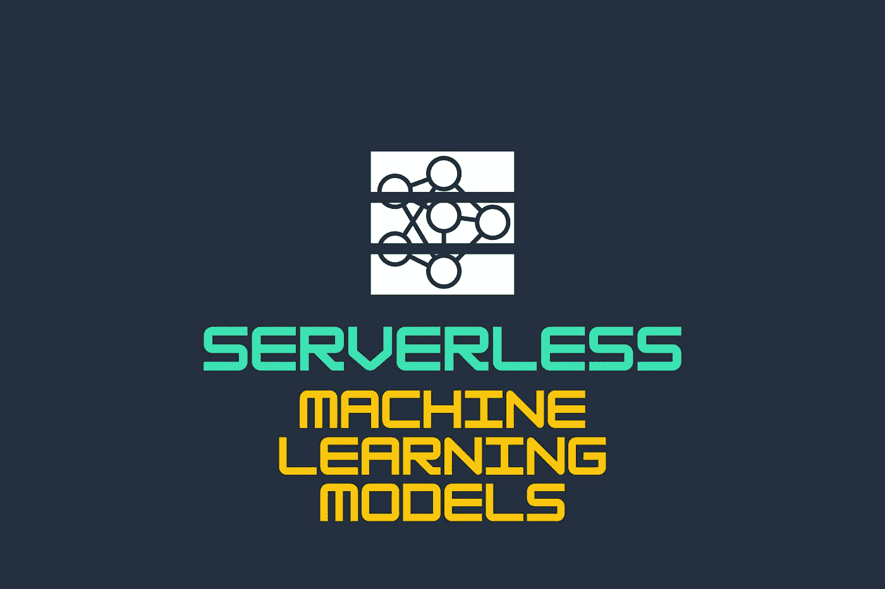
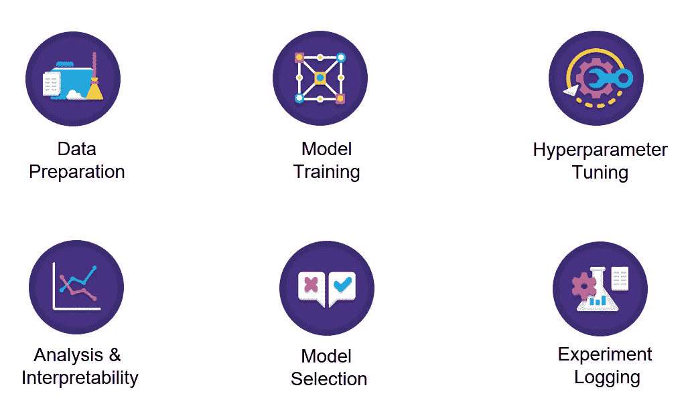
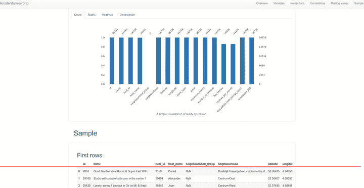
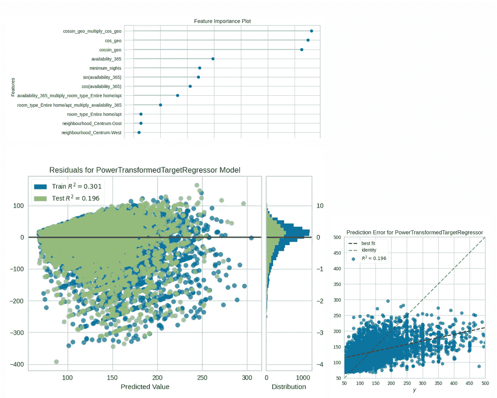
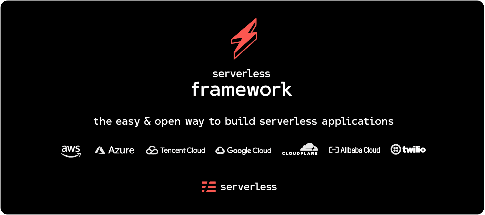
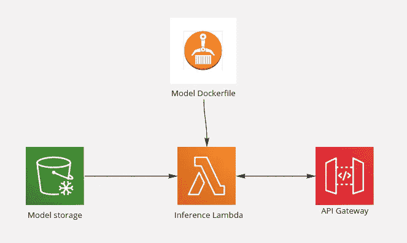
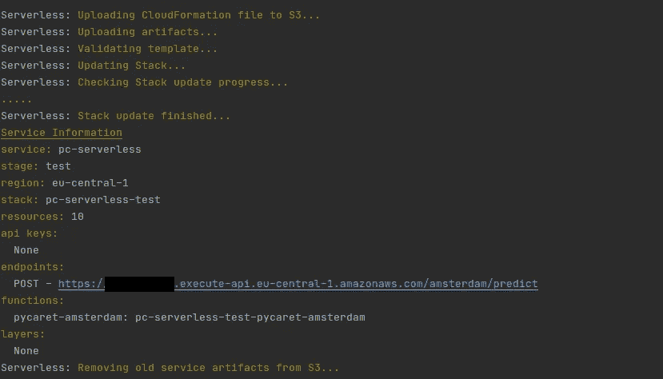
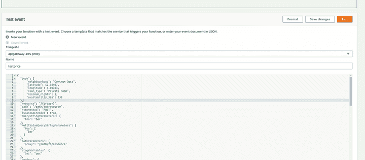

# 使用 Pycaret 和 AWS Lambda 的无服务器机器学习模型

> 原文：<https://medium.com/analytics-vidhya/serverless-your-machine-learning-model-with-pycaret-and-aws-lambda-c33334ee6011?source=collection_archive---------4----------------------->

机器学习工程师的生活并不简单。我们从不完整的需求和数据开始，设计许多实验。最后，构建一个高效、可扩展的推理过程。就机器学习而言，越来越多的人在谈论无服务器。我们希望打造高效、先进的解决方案，同时还应该灵活、易于实施。不可能？我想是这样的，但是我们专注于为商业创造有利可图的解决方案的策略在设计过程中给了我们很大的优势。机器学习环境中的无服务器架构似乎很理想，因为我们有:

*   没有对基础设施的管理
*   自动资源缩放
*   为我们使用的东西付费

如果你被这三个基本论点所说服——继续。在本文中，我们将基于无服务器架构构建一个简单的 httpAPI。为此，我们将使用:

*   基于 AutoML-py caret 库构建的模型
*   自动化架构构建的无服务器框架
*   AWS Lambda 和 API 网关为我们的解决方案提供一个端点

**走吧！**

# 长话短说

让我们假设一家基础设施完全基于 AWS 的成长型初创公司的 CEO 想要成为我们的客户。“AirRent”的商业价值是帮助在 Airbnb 上执行租赁过程。他们想创建一个快速的概念证明，并检查是否有可能估计在阿姆斯特丹租一套公寓的价格并增加房地产的维护费。目前，客户并不关心模型本身，而是关心成本和 PoC 的执行速度。我们承担这项工作，并制定最低计划:

*   基于 AutoML 解决方案，使用 EDA、特征工程、模型选择和可解释性创建简化的机器学习实验
*   用于开发实现无服务器机器学习架构的整个管道的无服务器框架
*   使用专用容器实现 AWS Lambda，以进行价格预测和预报

完整源代码可在 [**Github**](https://github.com/g0lemXIV/serverless-machine-learning) 上获得

# PyCaret AutoML

[Pycaret 模块](https://pycaret.org/about/)

如果你不熟悉为低代码机器学习设计的 PyCaret 库。我强烈推荐查看 Moez Ali 的文章，他是这个伟大框架的主要创建者。

## 自动化探索性数据分析

假设我们想要下载数据并创建一个简单的仪表板来进行探索性的数据分析。为此，最好的解决方案可能是[熊猫简介](https://github.com/pandas-profiling/pandas-profiling)

脚本从 I[nsideairbnb.com](http://insideairbnb.com/)下载数据并保存，生成基本 EDA 分析。现在，我们可以分析关于数据的基本信息，并决定哪些数据值得在以后的实验中使用。速度很快，对吧？

HTML 小部件中熊猫概况的输出

我们可以得出结论，许多变量是无用的。毕竟一个典型的用户是没有`number of reviews`或者`reviews_per_month`的。我们必须从数据中删除这些信息。此外，价格似乎在 0-25 英镑和 500-10000 英镑之间。这不是我们的情况，我们专注于 POC，所以我们决定放弃极端记录。再者，我们要从模型的角度去思考姿态和经度，是不是足够好的特征来描述特征空间中的位置？在我看来——不，因此我们将准备三个基于三角函数的附加属性(在`base_processing`内部)

## 自动化机器学习模型开发

我们已经到了建模的地步，正如我所说的，我们将使用 PyCaret 库中的半自动机制。首先，我们删除不必要的列，并在`setup`函数中创建多个特性。我真的鼓励你看看 [PyCaret 文档](https://pycaret.readthedocs.io/en/latest/)来尝试不同的设置。为了清楚起见，我们创建了多个多项式、三角函数以及数字列之间的交互。组合分类级别，最后根据 [Boruta 算法](https://www.analyticsvidhya.com/blog/2016/03/select-important-variables-boruta-package/)选择最重要的特征。最后，我们比较多个模型，选择最好的，优化超参数，并将最终的一个保存到 S3。当然，我们需要某种程度的理解，所以我们将生成一些图来解释我们的模型。

## 模型解释

不太好…我们的模型不能达到可接受的结果，而且有时我们低估了公寓的价格。有趣的是，在五个最重要的功能中，有三个是手动生成的。人类思维的力量是无价的。**但请记住，这只是一个非常不寻常和具有挑战性的数据集的例子，只需要很少的工作。**

在展示了第一批成果后，CEO 决定部署该解决方案，因为要与投资者进行演示。艰难的开始上层生活并不容易😂

第一次实验结果的解释

# 无服务器框架和 AWS

[无服务器框架](https://www.serverless.com/)

无服务器框架是一个[开源](https://github.com/serverless/serverless)工具，用于自动化云基础设施的部署。如果不熟悉，可以随意看看[系列课程和教程](https://www.serverless.com/learn/)。基本上，该框架使其成为一个可能的原型，并快速开发云应用程序，将其与在 GPU 而不是 CPU 上训练深度学习模型进行比较。下面我描述了我们模型的架构图。因为 lambda 只能有 **~250Mb** 层。我决定创建一个包含自定义图像的容器，在其中安装 PyCaret。为什么不呢？有了无服务器框架，用定制容器部署 lambda 相当容易，不管我们是想使用 PyCaret、Tensorflow 还是 PyTorch。

架构图

## λ处理器

主要的 lambda 处理程序包含 4 行代码，不漂亮吗？我们决定使用 [aws_lambda_powertools](https://github.com/awslabs/aws-lambda-powertools-python) 来适应输入/输出规则的定制功能。首先，加载来自 S3 的 Pycaret 模型。接下来，我们创建数据模型来捕捉事件。最后，主处理程序支持推理操作。

## 码头集装箱

正如我所说的 lambda **可以处理低于 250 Mb 的层**，所以我们必须创建一个预装 PyCaret 的定制 docker 容器。感谢容器化，我们可以把所有必要的库和自定义代码。记得将 lambda 处理程序放在`LAMBDA_TASK_ROOT`目录中。我们不需要构建容器并将其推送到 ECR，无服务器框架会为我们做这件事(如果我们有适当的权限)。

## 无服务器配置文件

用无服务器构建基础设施相当容易。我们有两个感兴趣的基本区域。

*   `provider` —用于拾取关于栈的所有信息，我们可以定义`runtime`、`environment variables`、`policy`和 **docker 图像名称，这些图像将被推送到 ECR。**
*   `functions` —用于定义λ函数。我们可以设置`timeout`、`memorysize`、`events`来唤醒我们的 lambda

最后，在本地测试之后(我使用的是 PyCharm 的 [AWS 工具包](https://aws.amazon.com/pycharm/))，我们只需输入`sls deploy`就可以了！堆栈应该能够成功部署

# 摘要

最后，我们可以在 AWS 控制台中测试我们的 lambda。第一次通话可能需要更长时间，因为我们必须从 S3 下载一个模型，但接下来的**计费持续时间约为 250 毫秒/300 毫秒。**这意味着我们可以调用我们的 lambda 100 000 次，并支付大约 3 美元。我觉得值得去做！

可能模型还不够好，无法应用到生产环境中。但是随着更多的数据和更多的分析，我们可能会创造一个更好的模型，给出可靠的价格预测。重要的是，我们使用一个半自动的过程来部署一个机器学习模型，以最小的努力和非常好的每次预测价格(机器学习的良好指标)。

谢谢你到达文章的结尾！我认为无服务器可以在许多项目中有所帮助，在这些项目中，我们必须实现机器学习模型来完成一项特定的任务。阅读完本文后，您可能对如何处理大型 lambda 层、无服务器框架和 PyCaret 功能有了基本的了解。

## 如果你喜欢它，请在[@ bodzionrafal](https://twitter.com/BodzionyRafal)留下拍手声或推特说 hello✌️