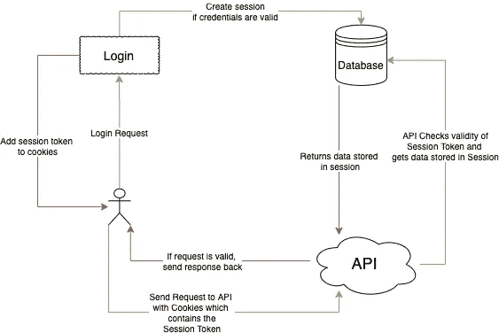
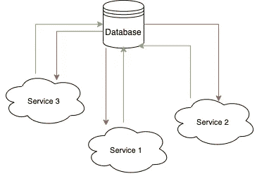
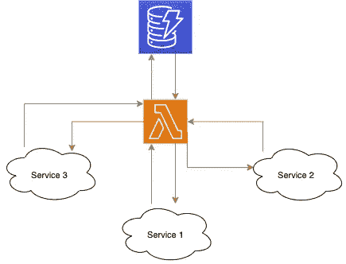
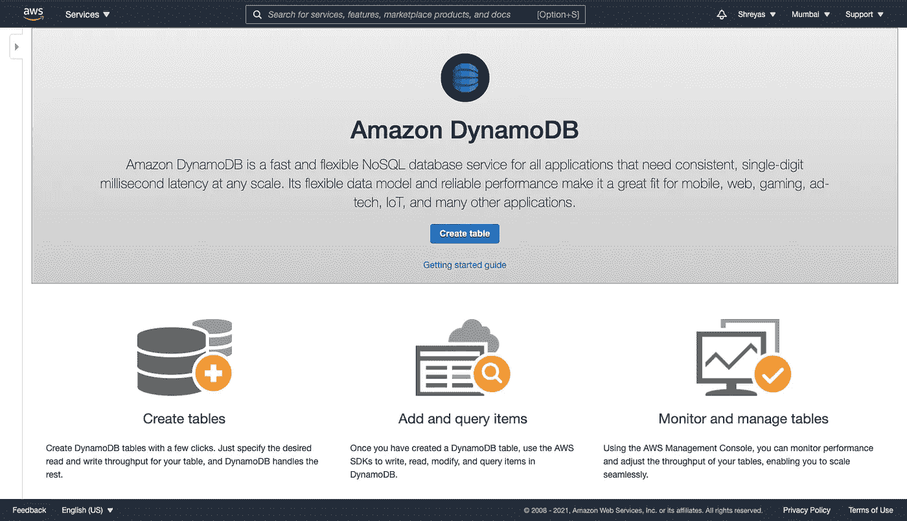
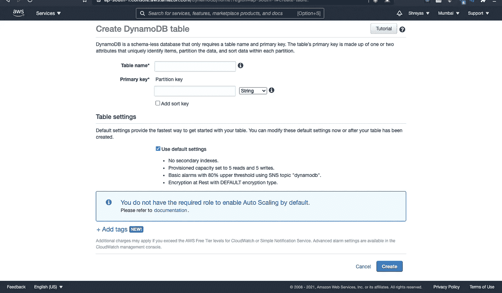
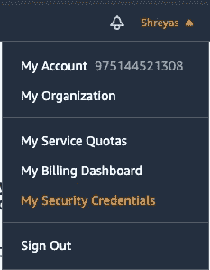
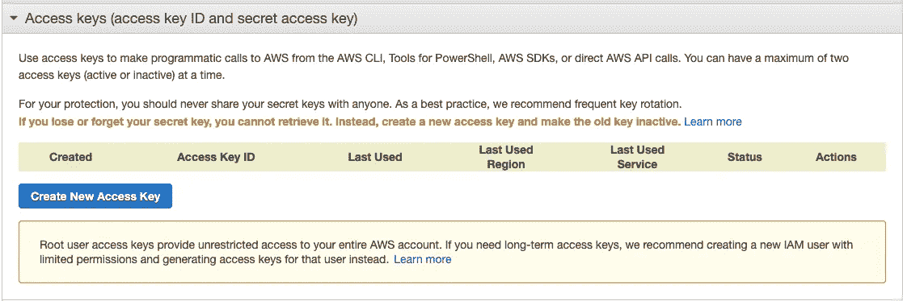

# 使用 Lambda 和 DynamoDB 进行会话认证

> 原文：<https://medium.com/analytics-vidhya/session-authentication-with-lambda-and-dynamodb-60355bff8a97?source=collection_archive---------0----------------------->


亚历克斯·库利科夫在 [Unsplash](https://unsplash.com) 上的照片

在本教程中，我们使用 AWS Lambda 和 DynamoDB 创建会话认证。我们回顾了什么是会话认证，为什么我们使用 Lambda，并从头开始构建它。我们还将使用无服务器应用模型(SAM)框架来测试、打包和部署 Lambda 函数。

# 什么是会话认证？

你可能已经猜到了，会话认证是一种最广泛使用的认证，也是最容易实现的认证。

## 它是如何工作的？

当用户输入凭据并提交登录请求时，后端首先检查凭据是否有效，如果有效，将生成一个随机字符串。这个随机生成的字符串就是我们的会话令牌。

然后，该字符串与其他一些必需的数据(如用户 ID)一起存储在数据库中。让我们称这个字符串为*令牌*，因为这就是它，一个用来访问一组服务的令牌。然后，这个令牌作为 Cookie 存储在客户端，并在每次后续请求时发送到应用程序的后端。

当用户向 API 发送请求时，会发生以下情况:

1.  该请求被发送到包含 cookies 的服务器
2.  后端解析 cookies 并获取会话令牌
3.  验证会话令牌，如果有效，则通过向存储会话令牌的数据库发送请求来获取会话数据

这是我们可以实现的最简单的会话认证版本。

*注意，数据库可以是任何类型的。然而，由于会话信息经常被读取，因此将它存储在具有极快读取速度的数据库中是很有用的。*



## 但是为什么要用 Lambda 呢？

您可能想知道为什么我们需要使用 Lambda 进行会话认证，而实现它的逻辑并不复杂，只需要很少的工作。这个问题的答案，就像今天的许多其他问题一样，是微服务。

对于一个单一的应用程序，使用 Lambda 可能会适得其反，因为你通常只有一个包含所有逻辑的代码库。甚至可能会有性能下降，因为每次用户发送请求时，您都要向 Lambda 函数发送请求。



但是，在现代应用程序中，通常会有数十、数百甚至数千个微服务，在每个服务中重新实现验证用户身份所需的逻辑会变得非常繁琐，难以编写和维护。

开发人员遵循的最常见的规则可能是 DRY(**D**o not**R**EPE at**Y**yourself)，这正是我们想要达到的目标。有了 Lambda，我们的流程图就像下面这样，所有的逻辑都在一个地方，维护变得更加容易。这也创造了一个非常有用的额外的抽象层。



***重要:*** *这并不意味着你要一直朝着干代码努力。* [*下面大谈湿码(干码的反义词)*](https://www.deconstructconf.com/2019/dan-abramov-the-wet-codebase) *。*

# JWTs 呢？

如果你不知道， [JWT](https://jwt.io) 代表 JSON Web 令牌。这是另一种认证方式，近年来获得了极大的普及和采用。

主要优势是 JWT 经过加密签名，会话数据存储在令牌本身中，这意味着后端不必在每次用户发送请求时都向数据库发送请求，这在很多情况下可能会带来更好的性能。

然而，jwt 并不都是华而不实的。

## jwt 的缺点

1.  更难实现安全的东西。这里有一篇[文章](https://www.pingidentity.com/en/company/blog/posts/2019/jwt-security-nobody-talks-about.html)描述了用 jwt 实现所需要的一些更难的东西，没有这些东西它是不安全的。
2.  可存储数据的限制。关于用户的敏感数据不能存储在 JWTs 中，因为这些数据会公开。
3.  要求您知道用户登录了哪些设备的功能是不可能的。例如，如果您想要向用户显示他们登录的所有设备以及从一个设备注销另一个设备。

# 先决条件

1.  一个 [AWS 账户](https://aws.amazon.com)。不要担心，我们将使用 DynamoDB 和 Lambda，在一定的限制下可以免费使用，因此不会向您收取任何费用。
2.  [节点和 NPM](https://nodejs.org/en/download/)
3.  在本地运行我们的 Lambda 函数
4.  你选择的编辑

如果您对以下步骤使用 AWS 命令行界面感到满意，您可以这样做。不过，我们将直接使用 AWS Dashboard，因为它的入门更加简单。

请确保您登录到了一个 AWS 帐户，该帐户具有使用 DynamoDB、Lambda、CloudFormation 和 S3 所需的权限。如果使用的是个人帐户或根用户帐户，则不必担心权限问题，可以继续前进。

# 创建动态数据库表

首先，登录到你的 [AWS 控制台](http://AWS Console)然后前往[动力数据库](http://console.aws.amazon.com/dynamodb)。然后，点击*创建表格。*



DynamoDB 是一个没有 schemaless 的 NoSQL 数据库。它是文档数据库和密钥值存储的混合。我们使用 DynamoDB 是因为它是无服务器的，这意味着我们几乎没有什么需要管理的，它非常快速可靠，而且由于它是无模式的，我们可以存储非结构化数据。

如果你以前从未使用过像 DynamoDB 或 MongoDB 这样的 NoSQL 数据库，而你正在使用一个像 PostgreSQL 这样的传统关系数据库，我建议你阅读 AWS 文档中的[这一节，进一步了解它们是如何比较的，以及它们是如何工作的。](https://docs.aws.amazon.com/amazondynamodb/latest/developerguide/SQLtoNoSQL.html)

[](https://docs.aws.amazon.com/amazondynamodb/latest/developerguide/SQLtoNoSQL.html) [## 从 SQL 到 NoSQL

### 如果您是应用程序开发人员，您可能有一些使用关系数据库管理系统的经验…

docs.aws.amazon.co](https://docs.aws.amazon.com/amazondynamodb/latest/developerguide/SQLtoNoSQL.html) 

点击*创建表格*，进入下页。



让我们来分析一下 DynamoDB 表中的不同组成部分。

1.  表名—确切地说，是表的名称
2.  主键—就像在关系数据库中，我们使用主键来标识某个记录一样，我们在 DynamoDB 中使用主键。

如果你仔细观察，你还会注意到一个叫做“分区密钥”的东西和一个“排序密钥”的复选框。

> 主密钥由分区密钥(哈希密钥)和可选的排序密钥组成。分区密钥用于跨主机对数据进行分区，以实现可扩展性和可用性。选择一个具有大范围值并且可能具有均匀分布的访问模式的属性。例如，CustomerId 是好的，而 GameId 是坏的，如果你的大部分流量与一些流行的游戏有关。
> 
> 排序关键字允许在分区内进行搜索。例如，具有主属性 CustomerId 和排序属性 OrderTimestamp 的 Orders 表将允许查询给定日期范围内特定客户的所有订单。

在这一点上，如果你对使用的术语感到困惑，不要担心，你并不孤单。分区和排序键的命名与 DynamoDB 的内部工作方式以及它如何使用这两者来分发和存储数据有关，您不必了解它们是什么。然而，对于那些好奇的人来说，你可以查看 AWS 文档的[这一节](https://docs.aws.amazon.com/amazondynamodb/latest/developerguide/HowItWorks.Partitions.html)，它对这两者进行了更详细的解释。

让我们继续将表命名为`UserSessions`并将主键命名为`sessionId`，主键的类型为`string`。

我们将坚持使用默认设置，因为这将有助于我们快速开始，我们不需要修改任何东西来启动和运行我们的应用程序。

最后，点击*创建。*

# 使用 DynamoDB

使用 DynamoDB 的 API 相当简单。您可以使用 [REST API](https://docs.aws.amazon.com/amazondynamodb/latest/developerguide/Using.API.html) 、 [AWS CLI](https://docs.aws.amazon.com/amazondynamodb/latest/developerguide/Tools.CLI.html) 或使用 [DynamoDB SDK](https://docs.aws.amazon.com/amazondynamodb/latest/developerguide/GettingStarted.NodeJs.html) 来执行命令。在本教程中，我们将只涉及使用 DynamoDB 的基础知识，不会深入探讨，但是如果你想了解更多关于使用 DynamoDB 的知识，请随时浏览[文档](https://docs.aws.amazon.com/amazondynamodb/latest/developerguide/Introduction.html)。

在 DynamoDB 中，*项*是属性的集合，其中每个属性是一个键-值对，值可以是标量、集合或文档类型(文档类似于 JSON 对象)。简单地说，一个*条目*是一个具有多个属性的记录，这些属性被存储为键值对。每个表有多个条目，每个条目有多个属性。

为了处理 DynamoDB 中的数据，我们使用了操作。操作是我们可以用来修改 DynamoDB 表中数据的命令。创建、写入、更新和删除(CRUD)功能有四个主要操作，即`PutItem`、`GetItem`、`UpdateItem`和`DeleteItem`。

## 写入数据

为了将数据写入 DynamoDB 表，我们使用了`PutItem`操作。

```
{ 
  "sessionId": { "S": "abcd-abcd-abcd" },
  "userId": { "S": "dcba-dcba-dcba" },
  "timestamp": { "N": 1612969254 },
  "isActive": { "BOOL": true }
}
```

如果我们用上面的输入在我们创建的表上执行`PutItem`操作，一个新的项目在我们的表中被创建，其中`sessionId`被设置为`abcd-abcd-abcd` , `userId`被设置为`dcba-dbca-dcba`，而`timestamp`被设置为`1612969254`。记住，我们将`sessionId`设置为我们的主键，并且类型为 string，所以这个字段的值必须是惟一的，并且类型为 string，否则将会抛出一个错误。

**但是什么是**`S``N``BOOL`？这是我们提供的值的数据类型。`S`代表字符串，`N`代表数字，`BOOL`代表布尔。您可以在官方文档中找到所有可用数据类型及其约束的完整列表。

## 更新数据

类似于`PutItem`操作，我们使用`UpdateItem`操作来更新表中的数据。然而，`UpdateItem`操作的工作方式略有不同。我们必须提供想要修改其数据的项目的主键，并提供一个**更新表达式**。更新表达式指定要修改哪个属性值。

假设我们想要修改我们在上一节中刚刚创建的项目的`isActive`属性，我们的更新表达式应该是`SET active = :activeStatus`，其中`:activeStatus`是属性值的占位符，我们使用更新表达式属性参数传递它。

更新表达式属性参数看起来类似于我们提供给`PutItem`操作的输入，如下所示。

```
{ 
  ":activeStatus": { "BOOL": true }
}
```

我们指定占位符键和占位符的值以及类型的值。

## 读取数据

为了读取数据，我们向`GetItem`操作提供我们想要检索的项目的主键。

到目前为止，我们已经讨论过的操作以及我们如何使用它们可能看起来有点模糊，因为我们还没有运行它们。希望当我们在下一节使用 Lambda 和 DynamoDB 编写一些代码时，事情会变得更加清楚。

# 创建 Lambda 函数

与我们如何直接从 AWS 仪表板使用 DynamoDB 不同，当使用 Lambda 时，我们将只从我们的文本编辑器和终端工作。我们甚至将直接从我们的终端捆绑和部署 Lambda 函数，这将在下一节中讨论。

## 我们将要创建的函数

1.  创建会话
2.  验证并获取会话信息
3.  停用会话

## 项目设置

1.  创建三个单独的文件夹，分别命名为`create-session`、`get-session-info`和`deactivate-session`，每个功能一个。
2.  在每个文件夹中运行`npm init -y`来初始化 NPM
3.  所有的 Lambda 函数都需要与 DynamoDB 交互，我们将使用 AWS JavaScript SDK 来完成。我们还将需要`@aws-sdk/util-dynamodb`包，其中包含实用功能，使工作与 SDK 更容易。要安装 SDK 和实用程序库，请在每个文件夹中运行`npm i @aws-sdk/client-dynamodb @aws-sdk/util-dynamodb`。

## 创建会话功能

对于 create-session 函数，我们将使用一个名为`crypto-js`的附加包，它包含使用不同算法生成散列的函数。要安装它，运行`npm i crypot-js`。

我们首先创建一个`generateId`函数，它使用`SHA256`散列函数随机生成一个会话 ID，输入是用户 ID、当前时间戳和一个随机生成的数字的串联字符串。

然后，我们初始化 DynamoDB 客户端的一个实例。

最后，我们创建 Lambda 函数处理程序，其输入将是用户信息，如用户 ID，输出将是会话信息，包括会话 ID、到期日期、活动状态和创建时间。

在上一节中，我们讨论了如何提供参数值的数据类型。但是请注意我们在这里没有这样做。相反，我们创建一个常规的 JavaScript 对象，并将其从`@aws-sdk/util-dynamodb`包传递给`marshall`函数。

`marshall`函数将一个常规的 JavaScript 对象作为输入，解释每个参数的数据类型，并返回一个具有 DynamoDB 所期望的格式的对象，其中提供了属性值的数据类型。

例如，如果我们向`marshall`函数提供输入`{ sessionId: "abcd-abcd-abcd" }`，我们将得到输出`{ sessionId: { S: "abcd-abcd-abcd" } }`。

我们调用`DynamoDB`实例上的`.putItem()`方法，将表名和项目属性作为输入来执行`PutItem`命令。

## 验证会话并获取会话数据

类似于 create-session 函数，我们首先初始化一个`DynamoDB`的实例。在这种情况下，Lambda 函数的输入将是一个具有单一`sessionId`属性的对象，输出将是会话信息。

我们通过运行`.getItem()`方法来执行`GetItem`操作，将我们想要访问的条目的表名和键作为输入，在本例中是会话 ID。

`GetItem`操作的响应结构类似于我们提供给`PutItem`操作的输入，即提供属性值的数据类型。但是，我们不想处理这个问题，因为这会使访问数据变得很麻烦。为了从对象中移除数据类型，我们使用了`unmarshall`实用程序，它的功能与`marshall`功能正好相反。例如，如果我们提供字符串`{ sessionId: { S: "abcd-abcd-abcd" } }`作为输入，输出将是`{ sessionId: "abcd-abcd-abcd" }`。

在返回会话信息之前，我们检查会话是否过期，如果过期，我们通过运行`.updateItem()`方法执行`UpdateItem`操作，并将`isActive`属性设置为 false 并返回会话信息对象。如果它没有过期，我们将会话的过期日期更新为从当前时间算起的 14 天，并返回带有更新的过期日期的会话信息对象。

## 停用会话

您可能会问，为什么我们要停用会话而不删除它。想象一下，在创建会话之后，用户注销，但在此之前，用户存储在其他地方创建的会话令牌。

然后，让我们考虑在用户注销时删除令牌，而不是停用它。在未来的某个时候，不管可能性有多小，想象一下创建了一个令牌，它与我们之前为前一个用户创建并删除的令牌完全匹配。

前一个用户仍然可以访问该令牌，如果他们尝试使用该会话令牌访问应用程序，他们将可以完全访问第二个用户的帐户。

为了防止上述情况，我们确保令牌直到时间结束都是唯一的(字面上)。做到这一点最简单的方法是拥有一个活动状态，并存储该令牌是否活动。这样，数据库中有一个内置的约束，防止我们创建重复的会话令牌，包括那些被停用的会话令牌。

类似于 validate 和 get 会话数据函数，该函数的输入也是一个对象，其属性是会话 ID。然后，我们运行`UpdateItem`操作，并将`isActive`属性设置为 false，并返回更新后的会话信息。

我们还将`UpdateItem`命令的`ReturnValues`属性设置为`ALL_NEW`，告诉 DynamoDB 在更新项目后返回所有属性。

# 使用 SAM 进行本地测试和部署

[无服务器应用模型(SAM)](https://docs.aws.amazon.com/serverless-application-model/latest/developerguide/what-is-sam.html) 是一个帮助我们构建、测试、打包和部署无服务器应用的框架。在我们的例子中，我们将使用它来测试和部署我们刚刚创建的 Lambda 函数。

## 山姆是如何工作的

为了在本地测试 Lambda 函数，SAM 使用 Docker 创建一个执行环境，并基于 SAM 模板执行函数。为了打包和部署这些功能，SAM 使用了 S3 和 AWS CloudFormation。

## SAM 模板

SAM 模板是一个 YAML 文件，它提供了所需的信息，比如函数的运行时间和函数代码的位置。

在模板的顶部，我们提供了应用程序的描述和 CloudFormation 所需的一些基本信息，这是我们不必担心的。

在参考资料部分，我们有三个刚刚创建的函数，它们都是类型`AWS::Serverless::Function`，即一个 Lambda 函数。

然后，我们为`Properties`下的每个函数提供以下属性:

1.  `CodeUri` —包含代码的目录的相对路径
2.  `Handler`—Lambda 处理函数，在我们的例子中是`index.lambdaHandler`，也就是我们在`index.js`中导出的`lambdaHandler`函数。
3.  `Runtime`—Lambda 函数的执行环境，将为`nodejs12.x`。

## 设置 AWS 凭据

为了通过 AWS 认证，我们需要我们的 a *访问密钥 ID* 和 s *ecret 访问密钥。*您可以通过点击 AWS 仪表板中您的用户名下的*我的安全凭证*来获取它们。在*您的安全凭证*页面中，在访问密钥部分下单击*创建新的访问密钥。确保记下或下载 s *密码进入键*，因为它不会再出现。*



您可以使用 AWS CLI 、凭证文件或环境变量来设置您的 AWS 凭证[。要使用环境变量设置您的凭证，请在您的终端中运行以下命令。](https://docs.aws.amazon.com/serverless-application-model/latest/developerguide/serverless-getting-started-set-up-credentials.html)

```
$ export AWS_ACCESS_KEY_ID=*your_access_key_id*
$ export AWS_SECRET_ACCESS_KEY=*your_secret_access_key*
```

## 调用函数

要启动一个 dev 服务器，它将是调用我们的 Lambda 函数的端点，运行`sam local start-lambda`。默认情况下，该命令将在`localhost:3001`启动服务器。

假设您有一个`/login`端点。一旦您验证了用户输入的凭证是正确的，您将调用带有用户信息的`CreateUserSessionFunction`作为输入，然后将来自输出的`sessionId`存储在用户的 cookies 中。这样，每次用户向您的后端发送请求时，您都可以从 cookies 中获得`sessionId`，并使用该`sessionId`作为输入来调用`GetSessionInfoFunction`，从而获得会话信息。

要使用 AWS JavaScript SDK for node 调用该函数，可以使用下面的代码。它调用 SAM 模板文件中提到的`GetSessionInfoFunction`。

## 部署功能

最后，要打包函数 run `sam build`并将其部署到 AWS，运行`sam deploy`。真的就那么简单！

要调用部署中的函数，请从上面的示例中删除端点，这样就可以开始了！

# 结论

我们可以有很多方法来进行会话认证，正如前面提到的，使用我们刚刚在 Lambda 和 DynamoDB 中使用的方法并不适合每种用例，尤其是不适合单片应用程序。

总的来说，我们的方法和无服务器的伟大之处在于，它从第一天起就为生产做好了准备。而且用更少的努力，我们的方法就像一些使用 jwt 的更安全的方法一样安全。

## 下一步怎么样

*   您可以尝试使用像 Redis 这样的内存数据库来获得最佳性能。
*   使用一个`.env`文件或凭证文件来存储您的 AWS 凭证，这样您就不必每次都设置环境变量。

教程的最终代码可以在 GitHub 的*[*shreyas 44/session-auth-tutorial*](https://github.com/shreyas44/session-auth-tutorial)找到*