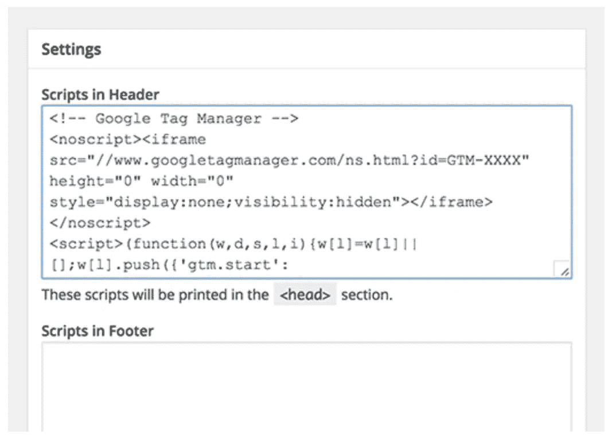

# 为您的应用程序设置 Google Analytics

> 原文：<https://medium.com/analytics-vidhya/set-up-google-analytics-to-your-application-2e55929d3c99?source=collection_archive---------16----------------------->

**Google Analytics** 允许您跟踪和了解客户的行为、用户体验、在线内容、设备功能等。

斯蒂芬·菲利普斯-Hostreviews.co.uk 在 [Unsplash](https://unsplash.com?utm_source=medium&utm_medium=referral) 上的照片

了解如何设置 Google Analytics 是理解以下内容的第一步:

*   ***你网站的访问者是谁***
*   ***他们想从你的业务中看到什么内容***
*   ***他们在浏览你的网站时的表现***

谷歌分析是他们所谓的“免费增值”服务，这意味着小企业可以使用该服务而无需支付月费，但如果你想要更多高级功能或使用该服务做更多事情的能力，则需要支付经常性费用。

一旦你实现了它，谷歌分析允许你跟踪和测量你的业务的流量目标

然而，设置谷歌分析可能很难(委婉地说)。幸运的是，本教程将帮助任何水平的数字营销人员轻松、轻松地建立谷歌分析。

在我们开始具体如何做到这一点之前，让我们来看看是什么让谷歌分析如此伟大。

## 为什么你需要谷歌分析

Google Analytics 是一个强大的工具，可以提供关于你的网站和访问者的不可或缺的信息。

以下是你可以从谷歌分析中获得的一些数据:

*   你的网站获得的总流量
*   你的流量来自的网站
*   个人页面流量
*   转换的潜在客户数量
*   您的销售线索来自的网站
*   访问者的人口统计信息(例如，他们住在哪里)
*   无论你的流量来自移动还是桌面

# 让我们设置它

## 设置 Google 标签管理器

谷歌标签管理器是谷歌的免费标签管理系统。

它的工作方式很简单:谷歌标签管理器获取你网站上的所有数据，并将其发送到其他平台，如脸书分析和谷歌分析。

它还允许您轻松地更新和添加标签到您的 Google Analytics 代码，而不必在后端手动编写代码——节省您的时间和许多令人头疼的问题。

首先，你必须在 [**谷歌标签管理器仪表盘**](https://tagmanager.google.com/) 上**创建一个账户。**

输入帐户名称，然后点按“继续”。

然后你将**建立一个容器，**，它本质上是一个桶，包含你的网站的所有“宏、规则和标签”，根据 Google 的说法是。

给容器取一个描述性的名称，并选择它将关联的内容类型(Web、iOS、Android 或 AMP)。

完成后，**点击创建，查看服务条款，并同意这些条款**。然后您会得到容器的安装代码片段。

这是你将要粘贴到你的网站后端的一段代码，用来管理你的标签。为此，**将这两段代码复制并粘贴到你网站的每一页上。**如说明所说，你需要在头中打开第一个，在体后打开第二个。

如果你正在使用 WordPress，你可以很容易的通过粘贴两段代码到你的 WordPress 主题中。

**专业提示**:你可以安装并激活 WordPress 的[插入页眉和页脚](https://wordpress.org/plugins/insert-headers-and-footers/)插件(或其他类型网站的等效插件)，让这个过程变得更加简单。这将允许您在整个网站的页眉和页脚中添加任何脚本，但您只需复制并粘贴一次。

# 设置谷歌分析

像谷歌标签管理器一样，你需要通过在 GA 页面 **注册** [**来**创建一个谷歌分析账户。****](https://analytics.google.com/analytics)

**输入您的帐户和网站名称，以及网站的网址。**一定要选择你网站的行业类别和你希望报道所在的时区。

完成所有这些操作后，请接受条款和服务，以便获得您的跟踪 ID。

> 当 Google Analytics 4 正式公布时，它成为 GA 中的默认属性类型。因此许多人感到困惑。他们还能创造万能分析财产吗？
> 
> **重要提示**:这只适用于新创建的属性。如果您已经创建了一个 GA4 属性，并且想要迁移它(连同它的数据)，那是不可能的。如果是这种情况，您仍然需要创建 Universal Analytics 属性，并开始在那里收集数据。目前，两个 GA 版本之间没有数据传输机制(我怀疑将来会有)。

跟踪 ID 是一串数字，告诉 Google Analytics 向您发送分析数据。这是一个看起来像 UA-000000–1 的数字。第一组数字(000000)是您的个人账户号码，第二组数字(1)是与您的账户相关的物业号码。

这是您的网站和个人数据所独有的，因此不要公开与任何人共享跟踪 ID。

一旦有了跟踪 ID，就该进入下一步了。

# 用谷歌标签管理器设置分析标签

现在，您将了解如何为您的网站设置特定的 Google Analytics 跟踪标签。

转到你的[谷歌标签管理器仪表板](https://tagmanager.google.com/)，点击**添加新标签**按钮。

您将被带到一个页面，在那里您可以创建新的网站标签。

在上面，您会看到您可以定制标签的两个区域:

*   **配置。**标签收集的数据将去向何处。
*   **触发。**您想要收集什么类型的数据。

点击**标签配置按钮**选择您想要创建的标签类型。

为了给谷歌分析创建一个标签，你需要选择“通用分析”选项。

一旦你点击它，你就可以选择你想要跟踪的数据类型。这样做，然后进入“谷歌分析设置”并从下拉菜单中选择“**新变量…** ”。

然后，您将被带到一个新窗口，在这里您可以**输入您的 Google Analytics 跟踪 ID。**这将把你网站的数据直接发送到谷歌分析，你以后可以在那里看到它。

完成后，转到“触发”部分，选择要发送到 Google Analytics 的数据。

与“配置”一样，点击**触发按钮**进入“选择触发器”页面。从这里，点击**所有页面**，它将发送您所有网页的数据。

当该说的都说了，该做的都做了，您的新标记设置应该如下所示:

你有一个新的谷歌标签跟踪和发送数据到你的谷歌分析页面关于你的网站！

不过，我们还没完。你仍然需要设定你的目标

虽然你可能知道你的网站和业务的关键绩效指标，但谷歌分析却不知道。

这就是为什么你需要告诉谷歌你的网站成功的样子。

为了做到这一点，你需要在你的谷歌分析仪表板上设定目标。

首先点击左下角的**管理按钮**。

一旦你这样做，你将被送到另一个窗口，在那里你可以找到“目标”按钮。

点击该按钮，然后您将被带到“目标”仪表板，在那里您可以创建一个新的目标。

从这里开始，你将能够浏览不同的目标模板，看看是否有一个符合你的预期目标。你还需要选择你想要的目标类型。它们包括:

*   **目的地。**例如，如果您的目标是让您的用户访问特定的网页。
*   **持续时间。**例如，如果你的目标是让用户在你的网站上停留一定的时间。
*   **每个会话的页面/屏幕。**例如，如果你的目标是让用户访问特定数量的页面。
*   **事件。**例如，如果你的目标是让用户播放视频或点击链接。

从那里，你可以更具体地设定你的目标，比如选择用户需要在你的网站上停留多长时间才能认为它是成功的。一旦你完成，保存目标，谷歌分析将开始为你跟踪它！

记住:你可以使用谷歌标签管理器和谷歌分析工具来追踪各种各样的数据。很容易迷失在你能追踪的所有指标中。我们的建议是从对您最重要的指标开始。

就这样，你完了

照片由[布鲁斯·马尔斯](https://unsplash.com/@brucemars?utm_source=medium&utm_medium=referral)在 [Unsplash](https://unsplash.com?utm_source=medium&utm_medium=referral) 上拍摄

感谢阅读…:)