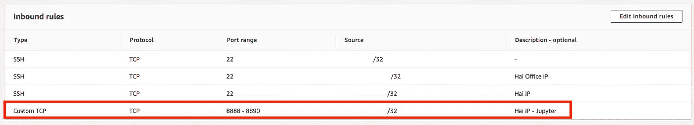
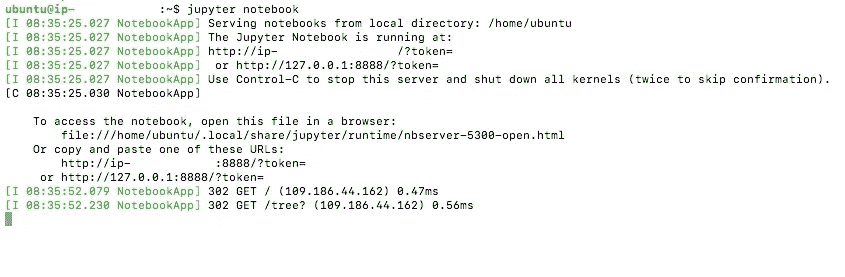
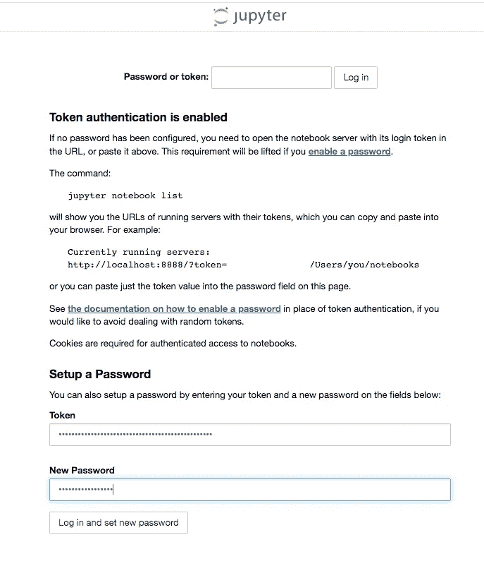

# 在 AWS EC2 实例上设置 Jupyter 记事本

> 原文：<https://medium.com/analytics-vidhya/set-up-jupyter-notebook-on-aws-ec2-instance-1a87d1707467?source=collection_archive---------3----------------------->


美国宇航局在 [Unsplash](https://unsplash.com?utm_source=medium&utm_medium=referral) 拍摄的[照片](https://unsplash.com/@nasa?utm_source=medium&utm_medium=referral)

## Jupyter 笔记本配置

## 快速轻松地设置您的个人远程环境

作为一名数据科学家，我每天都使用 Jupyter Notebook。因此，当我需要在新的远程服务器(例如 EC2 实例)上设置我的个人环境时，我要做的第一件事就是安装和配置 Jupyter Notebook。这样做的动机是，现在我可以使用一个(强大的)远程服务器作为我的 Python 代码(在 Jupyter 笔记本环境中编写)的后端。

在这篇博客中，我将描述快速、简单地建立一个 Jupyter 笔记本工作环境的最基本、最强制的步骤。

# 安装 Jupyter

首先，在您的远程服务器上安装 Jupyter 包。

```
pip install jupyter
```

# 入站规则

出于安全原因，EC2 实例位于一个 [VPC](https://aws.amazon.com/vpc/?vpc-blogs.sort-by=item.additionalFields.createdDate&vpc-blogs.sort-order=desc) 中，即虚拟私有云。默认情况下，VPC 不允许访问远程服务器，以将其与公共互联网流量和潜在攻击者隔离开来。VPC 有安全组，允许您通过自定义的规则控制入站/出站流量。

因此，我们需要确保我们的入站规则允许我们访问远程服务器。具体来说，我们需要允许访问端口 8888 (Jupyter 默认端口),以便能够通过浏览器打开它。当多个团队成员同时在同一台远程服务器上工作时，最好预先定义一个端口范围访问，例如 8888–8890。作为另一层安全措施，我还限制对一组特定白名单 IP 的访问(例如，我的办公室和家庭 IP)。



从 [AWS 控制台](https://console.aws.amazon.com/ec2/)打印屏幕。IP 地址受到审查。图片作者。

# Jupyter 配置文件

如果`~/.jupyter`目录下不存在`jupyter_notebook_config.py`文件，运行以下命令创建该文件:

```
jupyter notebook --generate-config
```

在你的`jupyter_notebook_config.py`文件中编辑以下几行:

```
# The IP address the notebook server will listen on. 
c.NotebookApp.ip = '0.0.0.0' # default value is 'localhost'c.NotebookApp.open_browser = False # default value is True
```

# 运行 Jupyter 笔记本

运行以下命令启动 Jupyter 环境:

```
jupyter notebook
```

在您的本地浏览器中，转到{REMOTE_SERVER_IP}:8888 并复制令牌以便登录。



IP 地址和令牌受到审查。图片作者。

# 设置密码

第一次，建议设置一个密码，这样您就不需要在每次启动 Jupyter 环境时复制密码。



令牌被审查。图片作者。

# 启用扩展

要启用 Jupyter 笔记本扩展，请运行以下命令:

```
pip install jupyter_contrib_nbextensions
jupyter contrib nbextension install --user
```

# 虚拟环境设置

要创建一个虚拟环境来区分不同项目的不同版本的 Python 包，请运行以下命令:

```
virtualenv -p `which python3` venv
source venv/bin/activate
```