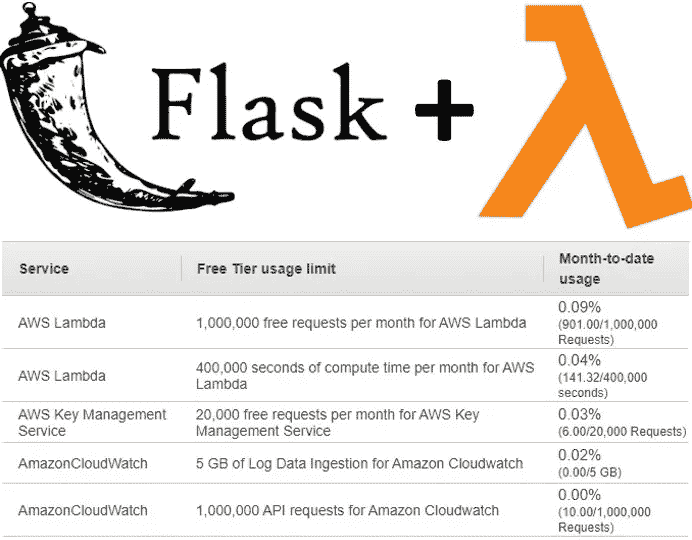

# 免费设置您自己的 web 服务器！

> 原文：<https://medium.com/analytics-vidhya/set-up-your-own-web-server-for-free-109f4ad62c1f?source=collection_archive---------29----------------------->

在 lambda 中部署 Flask 应用程序。

最近，我发现可以将 flask WebAPI 应用程序部署为 lambda 函数。

建立一个免费(或几乎免费)的 API 后端的想法看起来非常诱人。随着这样的架构，如 JAMStack，它让你有可能创建自己的网站，而不需要支付托管费。