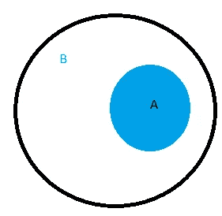
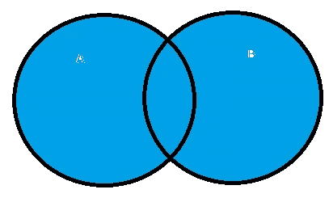
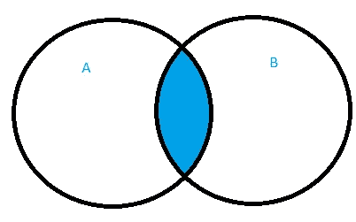
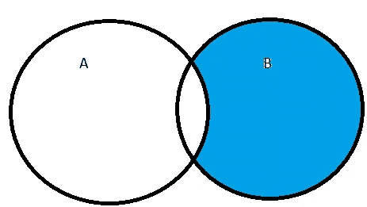
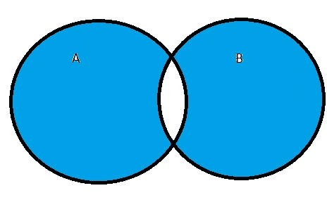

# Python 中的集合

> 原文：<https://medium.com/analytics-vidhya/sets-in-python-9c7ce3e57932?source=collection_archive---------8----------------------->

## 如何在 Python 中创建和操作集合


Goran Ivos 在 unsplash.com 拍摄的照片

在今天的文章中，我们将探索 Python 中的集合。你一定在数学课上学过集合，如果你还记得集合是元素的集合，今天我们将深入研究 Python 中集合的细节，它与数学集合很接近，但又不相同。Set 是 Python 中的四种内置数据类型之一，另外三种是 List、Tuple 和 Dictionary，它们都有不同的性质和用途。它用于存储数据集合，用花括号写。

在 Python 中，集合存储无序值，同一元素不能多次出现。它使得集合非常有用，可以有效地从列表或元组中删除重复值，并执行常见的数学运算，如并集和交集。例如，设 S 是一组小于或等于 10 的偶数。

```
S = set([2,4,6,8,10])
```

我说过，集合既不能有任何顺序，也不能有重复的值。

```
In [ ]: set([2,4,6,8,10,8,6])Out [ ]:{2, 4, 6, 8, 10}
```

你可以在上面的代码中看到，每个元素在集合中只能出现一次。现在，设 W 是一个集合

```
In [ ]: W = set(['hello','hola','bonjour'])
print(W)
Out [ ]: {'hola', 'hello', 'bonjour'}
```

在上面的例子中，集合 W 的顺序没有被保留。

# 初始化集合

为了创建一个新的空集，可以使用 set()

```
S **=** set()
```

# 添加和删除集合中的值

我们可以使用 **update()** 向集合中添加新元素。它将集合中的元素(作为参数传递)添加到集合中。在下面的例子中，我使用了 update()向空集 s 中添加新元素。

```
In [ ]: S.update({1,3,5,7,9,11,13,15})
print(S)Out [ ]: {1, 3, 5, 7, 9, 11, 13, 15}
```

从集合中删除元素。我们可以使用 **remove()** ，只有当集合中存在要删除的元素时，它才起作用。

```
In [ ]: S.remove(3)
print(S)Out [ ]: {1, 5, 7, 9, 11, 13, 15}
```

而 **discard()** 则不管集合中是否存在要删除的元素。

```
In [ ]: S.discard(5)
print(S)Out [ ]: {1, 7, 9, 11, 13, 15}In [ ]: S.discard(17)
print(S)Out [ ]: {1, 7, 9, 11, 13, 15}
```

我们可以使用 **pop()** 从集合中移除一个随机元素。

```
In [ ]: S.pop()
print(S)Out [ ]: {7, 9, 11, 13, 15}In [ ]: S.pop()
print(S)Out [ ]: {9, 11, 13, 15}
```

为了从一个集合中得到一个排序列表，我们使用 **sorted()** 函数。

```
In [ ]: S **=** {**-**9,1,7,5,9,**-**1,**-**5,**-**3,3,**-**7}
print(sorted(S))Out [ ]: [-9, -7, -5, -3, -1, 1, 3, 5, 7, 9]
```

# 不可变元素

虽然一个集合是可变的，也就是说，我们可以添加或删除其中的元素，但是集合中的元素是不可变的(不能改变)。不可变对象包括数字、字符串和元组。在下面的例子中，你可以看到一个集合的元素可以是元组。

```
In [ ]: T **=** set([(2,5),(4,7),(6,9)]
print(T)Out [ ]: {(2, 5), (6, 9), (4, 7)}
```

但它们不能是列表。

```
In [ ]: L **=** set([[2,5],[4,7],[6,9]])
print(L)**---------------------------------------------------------------------------**
**TypeError**                                 Traceback (most recent call last)
**<ipython-input-139-efadde9932a3>** in <module>
**----> 1** L **=** set**([[2,5],[4,7],[6,9]])**
      2 print**(**L**)****TypeError**: unhashable type: 'list'
```

# 集合运算

Python 定义了集合上的许多运算。大多数操作有两种形式，一种是方法，另一种是数学运算符的重载。

```
In [ ]:
*# Let A be a set of even integers between 0 and 9* A **=** set([0,2,4,6,8])
*# Let B be set of all integers between 0 and 8* B **=** set(range(0,9))
*# C be set of odd integers between 0 and 9* C **=** set([1,3,5,7,9])
```

**或**的元素属于:**为了检查一个元素是否在集合中，我们使用了“in”和“not in”运算符。**

```
In [ ]: 9 **in** A, 2 **not** **in** B, 7 **in** COut [ ]: (False, False, True)
```

****子集** **(A⊆B ):** 若集合 a 包含在集合 b 中，则 a 是 b 的子集，换句话说，集合 a 中的所有元素也是集合 b 中的元素，如下图所示。为了在 Python 中研究一个集合 A 是否是另一个集合 B 的子集，我们使用 issubset()或< =。**

```
In [ ]: A.issubset(B)Out [ ]: TrueIn [ ]: A**<=**BOut [ ]: True
```

****

****A⊆B****

****超集(B⊇A):** B 是 a 的超集是 a 是 b 的子集的另一种说法，为了在 Python 中检验它，我们使用 issuperset()或> =。**

```
In [ ]: B.issuperset(A)Out [ ]: TrueIn [ ]: B**>=A**Out [ ]: True
```

****Union****(a⋃b):**a⋃b**拥有属于集合 a 或集合 b 的所有元素，要在 Python 中找到 union，我们使用 union()或|。****

```
**In [ ]: A.union(B)Out [ ]: {0, 1, 2, 3, 4, 5, 6, 7, 8}In [ ]: A **|** BOut [ ]: {0, 1, 2, 3, 4, 5, 6, 7, 8}**
```

********

******A⋃B******

******交集****(a⋂b):**a⋂b**拥有同时属于集合 a 和集合 b 的所有元素，在 Python 中判断交集，我们使用交集()或&。******

```
****In [ ]: A.intersection(B)Out [ ]: {0, 2, 4, 6, 8}In [ ]: A&BOut [ ]: {0, 2, 4, 6, 8}****
```

************

********A⋂B********

********difference****(B-A):**B-A 包含所有在 B 中而不在 A 中的元素，在 Python 中要计算 Difference，我们用 Difference()或-。******

```
**In [ ]: B.difference(A)Out[ ]: {1, 3, 5, 7}In [ ]: B**-**AOut[ ]: {1, 3, 5, 7}**
```

********

******B-A******

******对称差(A △ B):** A **△** B 包含属于 A 或 B 但不属于它们的交集的所有元素，或者包含属于两个集合之一但不属于两个集合的所有元素。我们使用 symmetric_difference()或^的方法来寻找 Python 中的对称差。****

```
**In [ ]: A.symmetric_difference(B)Out [ ]: {1, 3, 5, 7}In [ ]: A**^**BOut [ ]: {1, 3, 5, 7}**
```

********

******A △ B******

******计算笛卡尔积**
两个集合 A 和 B 的笛卡尔积，记为 A × B，是所有可能的有序对的集合，其中 A 的元素第一，B 的元素第二。在集合构造符号中，A × B = {(a，b) : a ∈ A 和 b ∈ B}。下面的代码片段用 Python 计算了两个集合 A 和 B 的笛卡尔积。****

```
**In [ ]: *# Let A be a set of even integers between 0 and 9* A **=** set([0,2,4,6,8])
*# Let B be set of all integers between 0 and 8* B **=** set(range(0,9))
C **=** set()**for** x **in** A:
 **for** y **in** B:
      C.add((x,y))
COut [ ]:
{(0, 0),
 (0, 1),
 (0, 2),
 (0, 3),
 (0, 4),
 (0, 5),
 (0, 6),
 (2, 0),
 (2, 1),
 (2, 2),
 (2, 3),
 (2, 4),
 (2, 5),
 (2, 6),
 (4, 0),
 (4, 1),
 (4, 2),
 (4, 3),
 (4, 4),
 (4, 5),
 (4, 6),
 (6, 0),
 (6, 1),
 (6, 2),
 (6, 3),
 (6, 4),
 (6, 5),
 (6, 6)}**
```

# ****结论****

****在本文中，我们学习了 Python 中的集合，如何创建集合，如何在集合中添加和删除元素。我们讨论了可应用于布景的操作。我们还看到集合本身是可变的，但是它们的元素是不可变的。感谢您的阅读。我希望这篇文章对你有用。如果你有任何问题，请在下面的评论中或通过 Twitter 联系我们。快乐的蟒蛇！****