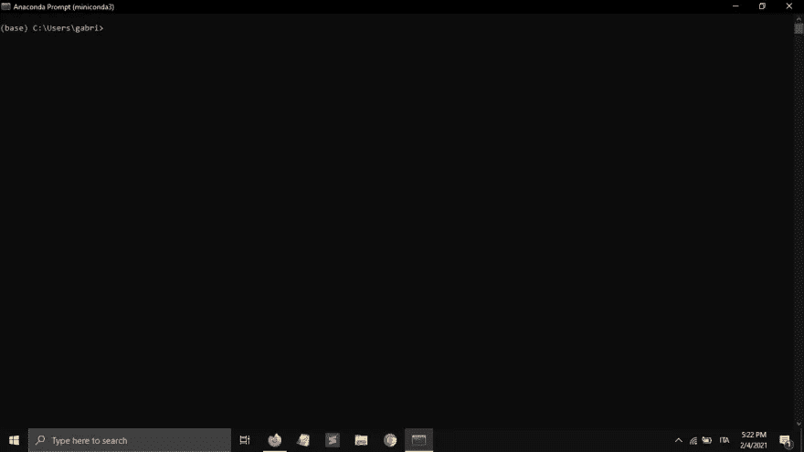

# 在 windows 上设置 python 机器学习环境

> 原文：<https://medium.com/analytics-vidhya/setting-up-a-python-machine-learning-environment-on-windows-db462846231e?source=collection_archive---------25----------------------->


# 介绍

为了能够用 python 学习机器学习，我们必须首先设置环境。为了创建 python 的机器学习环境，我们需要一个软件，它拥有我们实际开始所需的所有包。
Anaconda 大约有 3gb 的空间，并且有我们可能需要的所有工具，但是对于初学者来说，它是压倒性的，我们永远不会使用它，至少现在不会，这就是为什么我们要下载 *miniconda* ，以及我们需要的所有包，然后将它们导入到 *jupyter notebook* ，一个显示数据的好软件。

# 第一步

miniconda 的链接是[这里](https://docs.conda.io/en/latest/miniconda.html)。
在页面上你会看到类似这样的内容:


单击第一个

要下载 miniconda，你必须经历安装其他软件的所有相同步骤，所以我不会涵盖这一部分。您可以不做任何更改，直接点击 next，然后等待提取。


这是一个旧的映像，所以希望安装一个更高的版本

安装完成后，要设置环境，您必须打开 *anaconda 提示符*，这是一个特殊的命令提示符，用于激活我们的机器学习环境。


在你打开它之后，你会在你的面前看到 anaconda 命令提示符。



现在我们已经完成了所有的基础工作，让我们进入下一部分。

# 设置环境文件夹

首先，我们要在桌面上创建文件夹，这样你就可以方便地访问它，为此你必须这样做

```
(base) C:\Users\name> cd Desktop
```

其中“name”是您的用户的名称，正如您已经看到的，我的是“gabri”
这样，您现在在桌面上，命令提示符将看起来像这样

```
(base) C:\Users\name\Desktop>
```

现在我们只需*创建*包含项目的文件夹，然后在其中下载包。

```
(base) C:\Users\name\Desktop> mkdir sample_project
```

然后

```
(base) C:\Users\name\Desktop> cd sample_project
```

现在我们已经到了存储我们项目所有内容的文件夹中，我们可以继续把它变成我们的定制环境。

# 创建自定义环境

要有效地在示例文件夹中创建自定义环境，只需在命令提示符下键入以下内容

```
(base) C:\Users\name\Desktop\sample_project> conda create --prefix ./env pandas numpy matplotlib scikit-learn
```

但是我们在这里做什么？
我们正在创建文件夹 *env* ，这将是我们的自定义环境。
输入命令后，您会看到类似于


向下滚动，您会看到继续操作的请求。只需输入 y。


下载结束后，环境将被创建，要激活，您必须键入

```
(base) C:\Users\name\Desktop\sample_project\env> conda activate C:\Users\name\Desktop\sample_project\env
```

现在“(基础)”将消失，路径看起来将类似于

```
(C:\Users\name\Desktop\sample_project\env) C:\Users\name\Desktop\sample_project\env>
```

现在我故意没有安装*[jupyter 笔记本](https://jupyter.org/)。
我这样做是为了向您展示如何在环境设置完成后安装软件包/组件。*

*你打字*

```
*(C:\Users\name\Desktop\sample_project\env) C:\Users\name\Desktop\sample_project\env> conda install jupyter notebook*
```

*下载完成后，您可以打开 jupyter notebook，在 anaconda 命令提示符下写下它的名字*

```
*(C:\Users\name\Desktop\sample_project\env) C:\Users\name\Desktop\sample_project\env> jupyter notebook*
```

# *Jupyter 笔记本界面*

*Jupyter 会在你的浏览器中打开它的界面，你会看到类似这样的东西*

**

*要创建笔记本文件，我们点击新建，然后点击 python 3*

**

*点击后，它会打开一个新的标签*

**

*这类似于 python 中的 shell，您实际上可以编写命令，然后使用 shift + enter 执行它们*

**

*现在，最后一步是导入我们开始机器学习所需的所有库。
键入 jupyter 笔记本外壳*

```
*import pandas as pd
import numpy as np
import matplotlib.pyplot as ply
import sklearn # abbreviation of sci kit*
```

**

*这些都是为了建立我们的机器学习环境*

# *如何从环境中退出*

*要离开我们的环境，我们必须打开 anaconda 命令提示符，按 control + c，然后输入*

**

*然后我们简单地输入 *conda deactivate**

**

*现在，这不再是一个机器学习环境，而是一个简单的文件夹。*

# *最后的想法*

*现在我们已经完成了*设置*我们的机器学习环境所需的所有工作，我们必须开始工作了。*

*最初发布于[开发至](https://dev.to/russianmouth/setting-up-a-python-machine-learning-environment-on-windows-2hfi)*