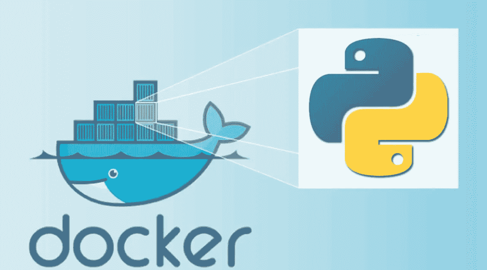
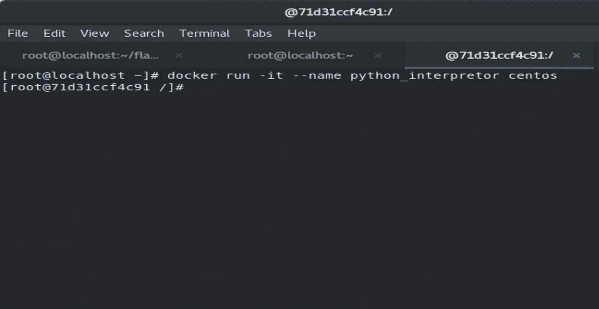
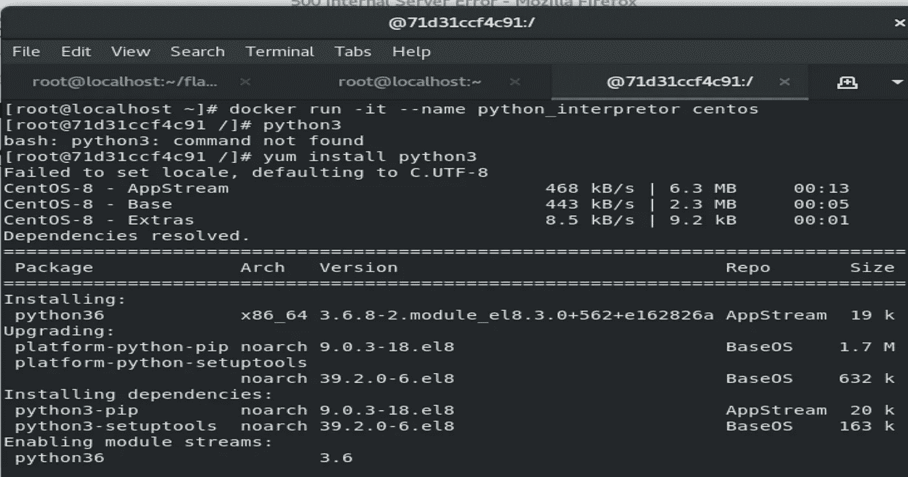
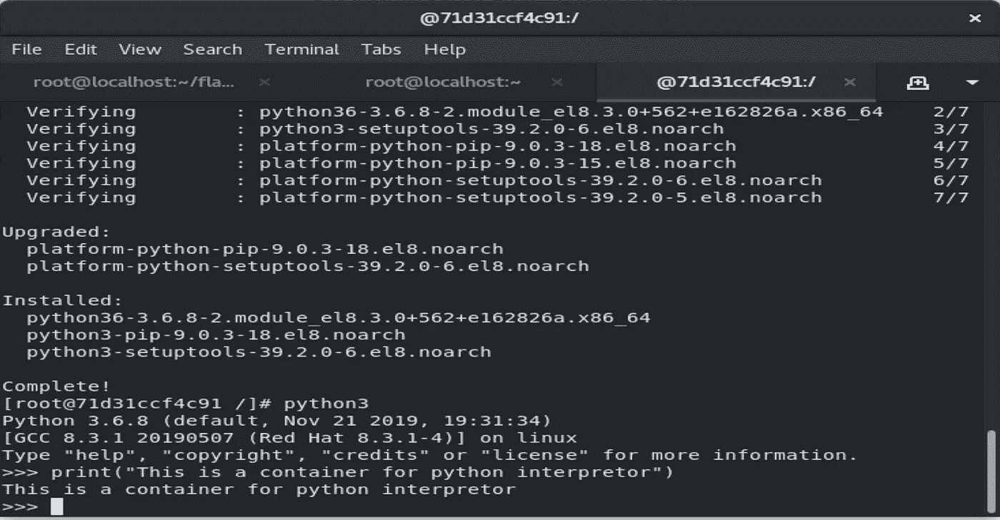
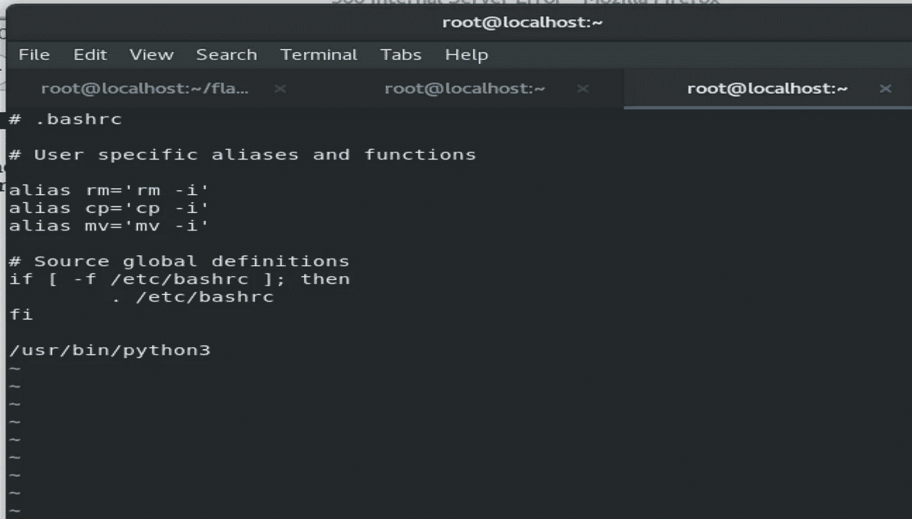
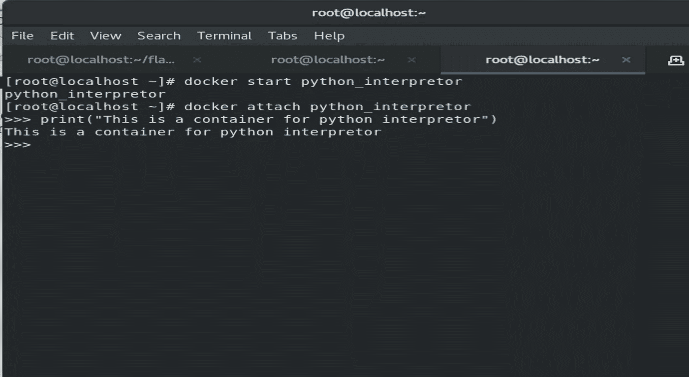

# 在 Docker 容器上设置 Python 解释器

> 原文：<https://medium.com/analytics-vidhya/setting-up-python-interpreter-on-docker-container-cdd33b9bba5a?source=collection_archive---------8----------------------->



在这篇博客中，我将一步一步地指导你如何对接你的 python 解释器。

所以让我们开始吧！！

**步骤 1:** 启动 docker 容器

我将使用 centos 作为我的容器的操作系统。您也可以使用任何其他 docker 图像，如 fedora 和 ubuntu。

要下载 docker 映像，请使用以下命令

`docker pull centos`

用于启动集装箱

```
docker run -it --name python_interpretor centos
```



**第二步:安装 python 解释器**

使用 yum 软件包管理器进行安装

```
yum install python3
```



测试 python 解释器

**步骤 3:在启动容器时启动 python**

为此，我们必须配置/root/。bashrc 文件。所以现在只是添加了 python 的路径



现在启动 docker 容器后，我们可以看到 python 解释器自动启动了



# 感谢您的阅读！