# 在 AWS 上设置免费的 VPN 服务

> 原文：<https://medium.com/analytics-vidhya/setup-a-free-vpn-service-on-aws-613fcec6e7c6?source=collection_archive---------0----------------------->

## 使用 OpenVPN 访问服务器，在不到 5 分钟的时间内在 AWS 上设置一个工作 VPN 服务器的简单指南

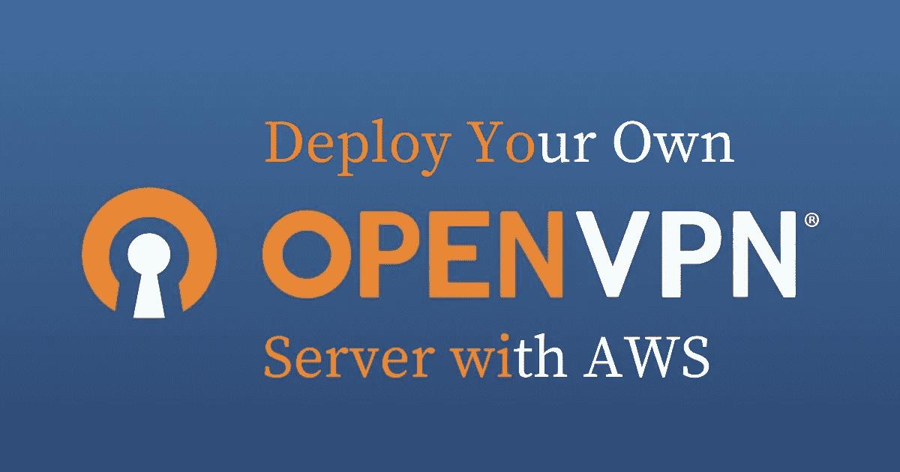

首先，让我们区分一下**隐私**和**匿名**。

## 保密=加密=机密

你可以被认为是信息的发送者，但是信息本身是秘密的，只有你能阅读它。

## 匿名=未知的发送者/接收者

但不一定是隐私和机密。

VPN 可以提供两者或仅一个。大多数网络流量已经用 HTTPS 加密了。因此，在最好的情况下，没有 VPN，你的 ISP 或局域网上的任何人都可以看到域名。不满足。他们知道您访问了哪些网站，但看不到纯文本内容。

添加 VPN 会创建到 VPN 服务器的加密隧道。VPN 服务器充当代理，将流量转发到其目的地。

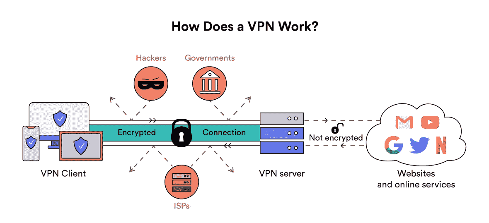

因此，如果你连接到第三方托管的 VPN 服务器，那么你的 ISP 只能看到 VPN 服务器的 IP 地址。然而，VPN 服务器可以保存日志，他们基本上可以窥探你的流量，因为你已经给了他们信任。

自托管 VPN 是指您托管自己的 VPN 服务器。所以你肯定知道你是否写日志。这是目前最好的方法，但在某些方面也有局限性。

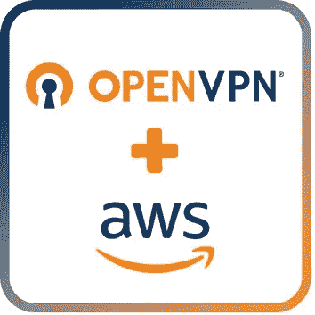

## 可以在 AWS 中托管 OpenVPN。

这提供了一定程度的匿名性，因为你可以选择一个位于香港的服务器，但如果你想选择许多服务器位置，那么你必须为每个地理位置托管一个服务器，这可能会变得昂贵。

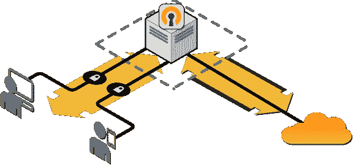

互联网流量通过一个安全加密的 VPN 隧道

# 要求:

*   AWS 帐户—新帐户具有 12 个月的免费等级资格，每月累计使用 750 小时，因此您无需为在 AWS 上运行 VPN 付费。

# 步骤 1-从 AWS 市场启动 OpenVPN 访问服务器

**1。**登录 AWS 管理控制台，导航到 **EC2 服务**。

**2。**如果您位于印度，请将您的地区更改为 ***亚太(新加坡)ap-southeast-1。*** 然后点击启动实例。

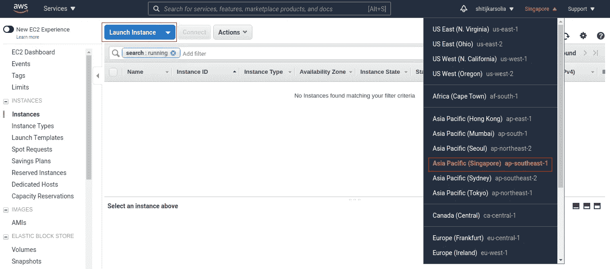

> 不幸的是，OpenVPN 不是一个非常轻量级的协议，所以它会导致一些令人讨厌的速度下降。当然，根据您最初的 ISP 速度，有些人可能会经历速度的大幅下降，而其他人几乎不会注意到。
> 
> *所以你可以做些什么来获得更平稳的速度:*
> 
> ***使用离你比较近的服务器*** *。例如，如果你在印度，不要使用美国的服务器。在新加坡、香港或孟买使用，因为它们都位于亚太地区。*
> 
> 你应该这样做，因为
> 
> *数据包在您的设备和服务器之间的传输速度会更快。*
> 
> 你的连接不太可能因为丢包而掉线。

**3。**在仪表盘中，点击`AWS Marketplace`菜单，输入 OpenVPN。选择带有`Free Tier Eligible`徽章的第一个。

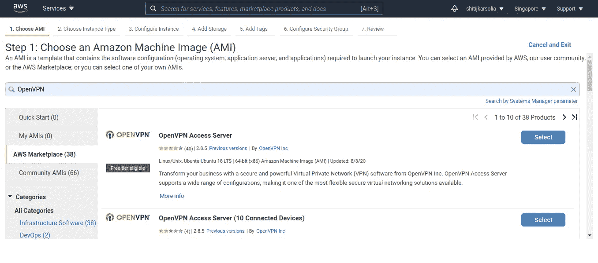

**4。**在下一页点击继续，从实例类型列表中选择`t2.micro`，点击 ***查看并启动*** 按钮。

**5。**创建一个新的密钥对(或者使用现有的密钥对)，输入名称，然后单击下载密钥对。然后单击启动实例，等待实例进入运行状态。

# 步骤 2 —配置服务器

*   如果您使用的是 Linux 或 Mac 机器，打开您的终端并通过 SSH 连接到您的服务器，如`openvpnas`:

```
ssh -i "{keyname}.pem" openvpnas@{Your-IPv4-Public-IP}
```

*   接下来，为协议键入 **yes** ，然后会提示你想要如何配置你的 VPN。

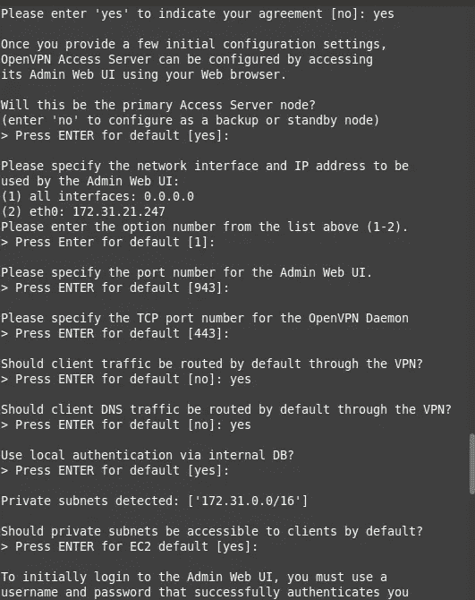

*   对于以下两个提示，键入 **yes** :

```
Should client traffic be routed by default through the VPN?
> Press ENTER for default [no]: yesShould client DNS traffic be routed by default through the VPN?
> Press ENTER for default [no]: yes
```

*   只需点击回车键就可以确认所有的默认设置。
*   到达终点后，更改用户的密码。输入两次新密码，一切就绪。

```
sudo passwd openvpn
```

*   接下来，打开浏览器窗口并键入

```
https://{Your-IPv4-Public-IP-address}:943/admin 
```

*   用`openvpn`和你刚刚设置的密码登录。

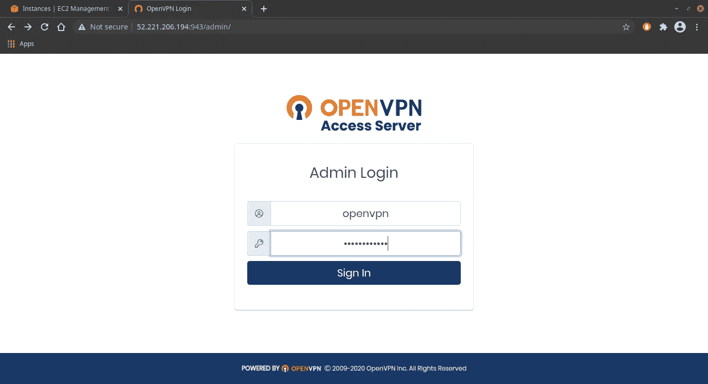

*   进入 OpenVPN 的管理面板后，点击配置并进入“VPN 设置”

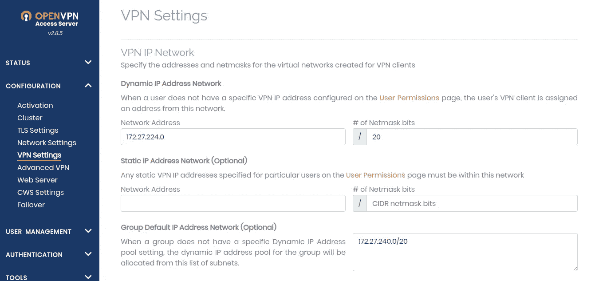

*   向下滚动，然后应用以下更改:

> *确保切换到*客户端互联网流量是否应该通过 VPN 路由？*设置为* ***是***
> 
> *将*切换为*让客户端使用特定的 DNS 服务器* ***是***
> 
> *进入自定义 DNS 服务器，设置主 DNS 服务器为* `*1.1.1.1*` *(CloudFlare DNS)，次 DNS 服务器为* `*8.8.8.8*`

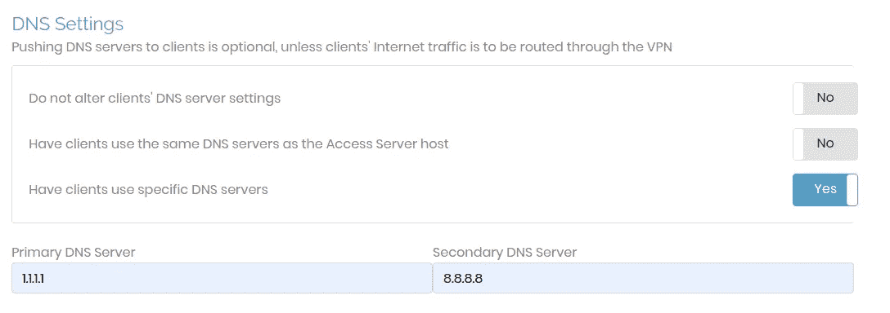

*   要知道我为什么更改 DNS 服务器:

[](https://www.howtogeek.com/664608/why-you-shouldnt-be-using-your-isps-default-dns-server/) [## 为什么不应该使用 ISP 的默认 DNS 服务器

### 您的计算机、电话和其他设备通常使用域名系统(DNS)服务器，路由器通过该服务器…

www.howtogeek.com](https://www.howtogeek.com/664608/why-you-shouldnt-be-using-your-isps-default-dns-server/) 

*   保存设置然后点击**更新运行服务器**

# 步骤 3 —使用 VPN

需要一个 VPN 客户端，它可以捕获您希望通过 OpenVPN 隧道发送的流量，并对其进行加密，然后将其传递给 OpenVPN 服务器。

**一、**要获得官方 OpenVPN Connect 应用，请在您的 Android 设备上进入[谷歌 Play 商店](https://play.google.com/store/apps/details?id=net.openvpn.openvpn)并安装官方 OpenVPN Connect 应用。

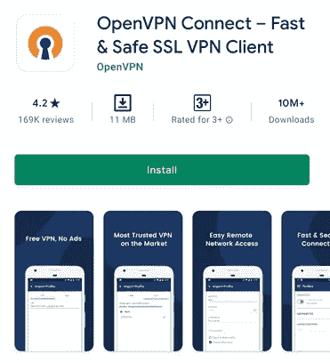

**二。**打开应用程序&输入正在运行的 EC2 的 IPv4-Public-IP-address，开始导入过程。

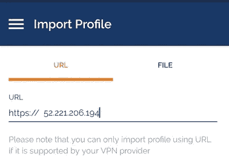

**三。**输入用户名`openvpn`和您设置的密码。

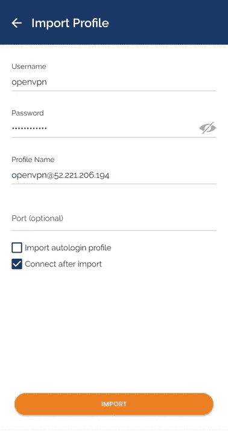

**四。**导入完成后，您就可以使用该应用程序了！

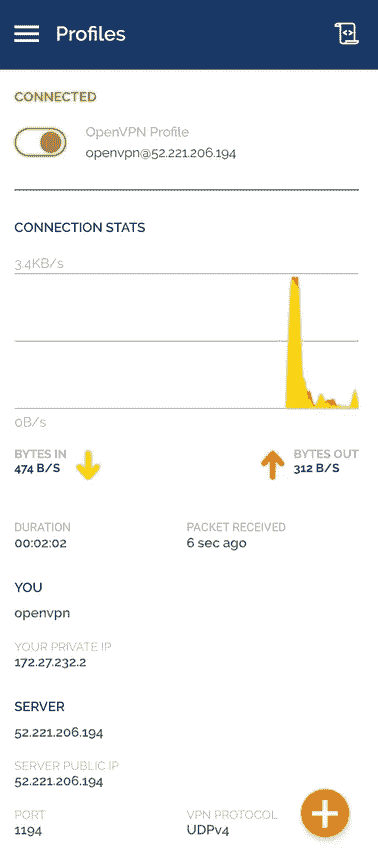

# 速度测试结果:

作为参考，我的真实位置在印度:

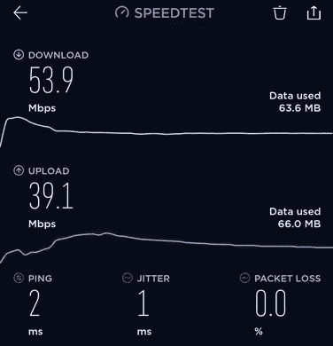

这些是我在新加坡服务器上运行 VPN 获得的速度:

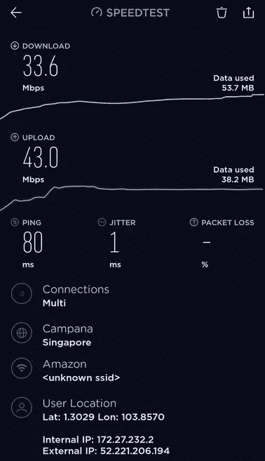

要在其他平台上使用 VPN，您必须安装相应的客户端应用程序:

> [*用 Windows 连接到 Access Server*](https://openvpn.net/vpn-server-resources/connecting-to-access-server-with-windows/)[*用 macOS 连接到 Access Server*](https://openvpn.net/vpn-server-resources/connecting-to-access-server-with-macos/)[*用 Android 连接到 Access Server*](https://openvpn.net/vpn-server-resources/connecting-to-access-server-with-android/)[*用 Apple iOS 连接到 Access Server*](https://openvpn.net/vpn-server-resources/connecting-to-access-server-with-apple-ios/)[](https://openvpn.net/vpn-server-resources/connecting-to-access-server-with-linux/)

*你都准备好了！你现在可以连接到你自己的 VPN 服务器，享受网上冲浪😎。*

*如果你仍然喜欢购买 VPN 服务，那么这个网站有各种 VPN 服务的公正审查:*

*[](https://thatoneprivacysite.net/vpn-section/) [## 一个搞隐私的家伙做的 VPN 对比

### 当我得知我的隐私每天被不同的公司多次侵犯时，我开始尝试…

thatoneprivacysite.net](https://thatoneprivacysite.net/vpn-section/)*