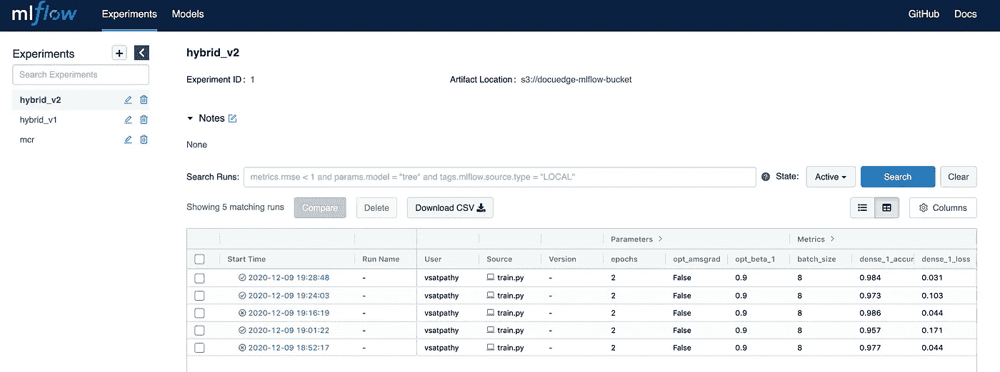

# 在 AWS EC2 上设置 MLflow

> 原文：<https://medium.com/analytics-vidhya/setup-mlflow-on-aws-ec2-94b8e473618f?source=collection_archive---------0----------------------->


欢迎学习端到端 MLOps 的 3 部分教程，从培训、跟踪、部署和推理开始。

第 1 部分:在 AWS EC2 上设置 MLflow

第 2 部分:在 AWS Fargate 上部署 MLOps

第 3 部分:AWS Fargate: II 上的 MLOps 部署

继续第 1 部分…

你可以在这里找到所有使用过的代码[的 Github 库！](https://github.com/vaibhavsatpathy/psAI-clOps)

在工程师的广泛开发之后，由神经网络执行的重载训练的度量的跟踪是最重要的。这里我们将使用一个叫做 [MLflow](https://mlflow.org/) 的框架来跟踪我们所有的培训。使用该框架的优势在于，它允许跨用户、团队和组织进行跟踪，使他们能够理解从以前的培训中获得的知识，并使用它们来开发更好的模型。

现在，我们将通过必要的步骤，以最小的努力在 AWS EC2 上设置 [MLflow tracking](https://www.mlflow.org/docs/latest/tracking.html#tracking) 服务器。

步骤 1:设置 AWS 帐户并登录到您的控制台

步骤 2:搜索 EC2 并单击启动实例

第三步:选择亚马逊 Linux 2 64 位(x86)


步骤 4:选择 t2.micro 实例


步骤 5:通过添加子网中现有的 VPC 来配置实例，或者选择默认选项


步骤 6:跳到配置安全组。如果您现有的安全组允许 SSH 和 HTTP 连接，请添加这些安全组或创建一个新的安全组，允许从您的 IP 进行 SSH 连接，以配置实例和 HTTP 连接来与跟踪服务器进行交互


步骤 7:检查并启动您的实例

步骤 8:通过 SSH 连接到您的实例。为了找到必要的命令，在您的仪表板中打开 EC2 并单击您的实例 ID，从那里单击 Connect，您应该会看到命令。


步骤 9:如果系统中没有 python3.5 或更高版本，请安装它们

> sudo yum 安装 python3.5

步骤 10:安装 MLFlow

> sudo pip3 安装 mlflow

步骤 11:在仪表板上安装 httpd 工具进行密码保护

> sudo yum 安装 httpd-工具

步骤 12:安装 nginx 并打开配置文件

> sudo yum 安装 nginx

步骤 13:为 testuser 添加密码

> sudo htpasswd -c /etc/nginx/。htpasswd testuser

步骤 14:配置 nginx 反向代理到端口 5000

> sudo nano /etc/nginx/nginx.conf

将以下内容添加到配置文件中，如下所示

> location/{
> proxy _ pass[http://localhost:5000/](http://localhost:5000/)；
> auth_basic“受限内容”；
> auth _ basic _ user _ file/etc/nginx/。htpasswd
> }


步骤 15:启动 nginx 服务器和 mlflow 服务器

```
sudo service nginx startmlflow server --host 0.0.0.0
```

步骤 16:创建一个 S3 存储桶来存储度量和模型

步骤 17:要在 python 训练代码中使用该设置，请将以下内容添加到训练脚本中


步骤 18:一旦执行了上述操作，您将能够在 EC2 实例的公共 DNS 上看到 MLflow 仪表板

要找到您的公共 DNS，请打开您的实例并单击连接。复制地址并在新浏览器中打开它。



祝贺您成功地在 EC2 实例上设置了 MLflow 的跟踪服务器。希望你喜欢这个教程。😁😁