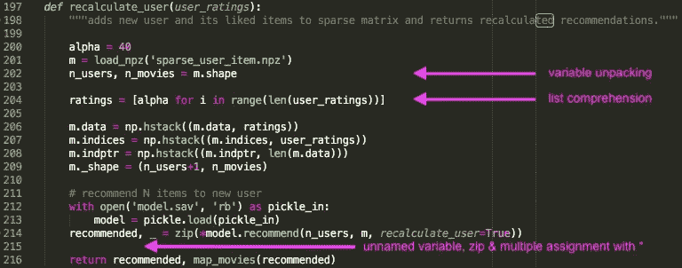

# 用 Python 清理代码的七个技巧

> 原文：<https://medium.com/analytics-vidhya/seven-tips-to-clean-code-with-python-24930d35927f?source=collection_archive---------0----------------------->

## 以下是我作为数据科学家在工作中每天使用的七个技巧和代码片段。

作者图片

在这个故事中，我将分享我在日常工作中使用的东西，以及帮助我改进代码的东西。查看下面的列表，看看有没有什么新的东西给你！

*   用 f 字符串格式化字符串