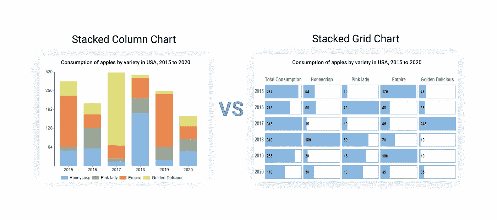
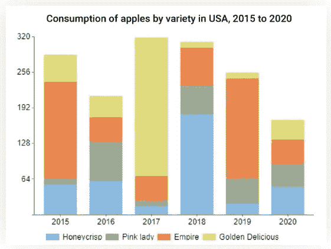
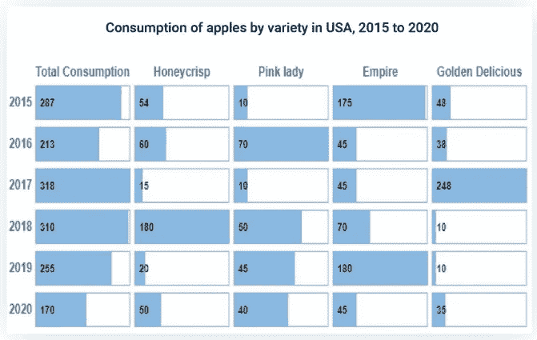
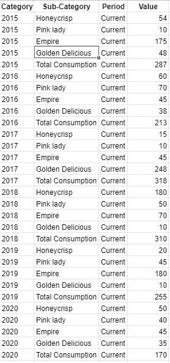
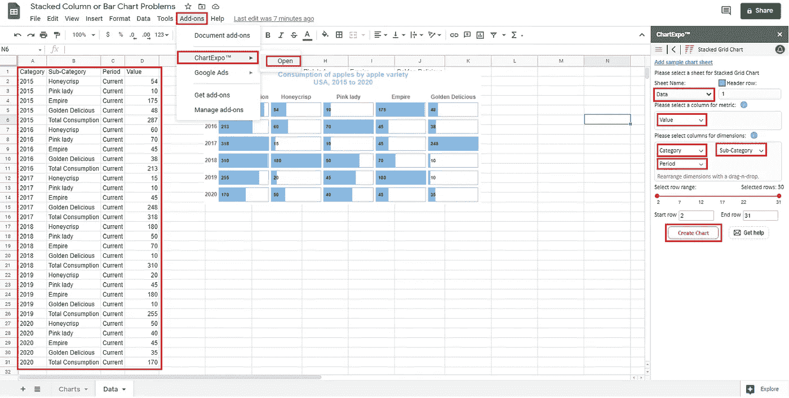

# 堆积条形图的几个数据解释问题及其解决方法

> 原文：<https://medium.com/analytics-vidhya/several-data-interpretation-problems-with-stacked-bar-chart-and-their-solution-b0075fbaa541?source=collection_archive---------2----------------------->

您可能会认为堆积条形图在大多数数据分析场景中都能很好地工作。

答案是否定的。

以下是一些例外情况:

看下面的图表。显示了 2015 年至 2020 年美国各种苹果的消费量。条形图的总高度很容易比较，但是粉色女士的灰色条形图呢？2018 年、2019 年和 2020 年的时间是变长了还是变短了？你有多确定？

## 堆积条形图差异

上面的图表很好地显示了一段时间内苹果的总消费量，但在按品种细分数据时，很难真正理解除 Honeycrisp 之外的任何品种的变化，因为它们不稳定，缺乏共同的视野。试着通过时间对比粉红女郎苹果的消耗。能不能精确对比一下 2018 vs 2019 的粉红女郎苹果？两条杠看起来一样，对吗？

堆积条形图的挑战？

*   使用次要分类变量来衡量其他划分或比较就不那么直接了。
*   堆叠条形图需要花费太多的精力来理解中间显示的品种趋势。
*   更加飘忽不定，缺乏共同的视野。

## 解决方案:堆叠网格图

我们可以通过使用多个单条形图来解决这些问题。试着将子类别拆分成多个迷你图表，每个图表都可以比较，并从一个共同的角度显示它们的条形图。

当然，通过这种方式呈现数据，我们已经将注意力从苹果的总消费量上转移开了，但有一种方法可以更好地呈现这些数据，与古代的堆积条形图相比，它将创建一个更好的视觉故事。

**堆叠网格图**将解决以下问题:

*   在这个图表中，子类别的比较很简单。
*   易于理解子类别类型的趋势。
*   每个子类别从一个共同的地平线显示他们的酒吧。
*   “一段时间内苹果的总消费量”和“一段时间内苹果品种对苹果的消费量”很容易解释。

数据如下所示:

## 如何在 Google Sheets 中创建堆叠网格图？

你需要从谷歌商店安装[**chart Expo for Google Sheets Add-On**](https://chartexpo.com/utmAction/NCttZCtncytRSitBcis=)。

一旦安装。

跟随此视频创建此图表。

1.  首先在 Chrome 浏览器中打开 Google Sheets，点击**附加组件> ChartExpo >打开**
2.  接下来，点击 **PPC 图表**，然后点击**矩阵图表**。
3.  复制工作表中的样本数据，并从**工作表名称**下拉列表中选择工作表。
4.  从**指标**下拉列表中选择一列。在我们的例子中，选择**值**(数值)列作为公制。
5.  从**维度下拉列表中选择一列。**在我们的例子中，**类别**列被选择为维度 1，**子类别**列被选择为维度 2，**期间**列被选择为维度 3 (您也可以比较当前&以前的期间数据。)
6.  最后，点击**创建图表**按钮。

图表将如下所示:

您可以使用[**chart Expo for Google Sheets Add-On**](https://chartexpo.com/utmAction/NCttZCtncytRSitBcis=)创建数据可视化，无需任何编码经验，只需几次点击。这个工具很方便，因为你可以把它安装在 Google Sheets 上，在一个地方工作。

[**chart Expo for Microsoft Excel&Office 365 插件**](https://chartexpo.com/utmAction/NCttZCt4bCtRSitBcis=) 还提供可视化库，使从电子表格中获得洞察力变得容易。