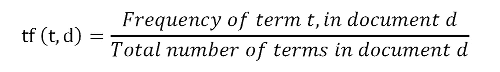
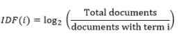

# 性骚扰(安全城市)——案例研究

> 原文：<https://medium.com/analytics-vidhya/sexual-harassment-safe-city-case-study-cdd524c033c1?source=collection_archive---------13----------------------->

我也是

# 内容:

1.  **概述**
2.  **关于数据。**
3.  **选择正确的绩效指标。**
4.  **探索性数据分析。**
5.  **数据预处理。**
6.  **矢量化和特征提取**
7.  **试验不同的模型。**
8.  **结果**
9.  **端到端管道。**
10.  **样本输出。**
11.  **部署**
12.  **APP 链接**
13.  **未来的工作。**
14.  **参考文献。**

**1 —概述:**安全城市是一个带有多类标签和性投诉的数据集，其中投诉被标记为三类:评论、色迷迷和猥亵。这是基于自然语言处理的问题，这个分类样本改编自安全城市的一篇论文:理解不同形式的性骚扰个人故事。我使用的是论文中的同一个数据集。安全城市论坛是一个关于性骚扰和性虐待的个人故事的众包平台，每个故事都包括一个或多个带有标签的性骚扰形式以及描述。

**2 —关于数据:**数据已从[https://www . safe city . in](https://www.safecity.in/)中抓取

数据集由训练、开发和测试三部分组成
，每个部分包含四列——

*   **描述(字符串对象):**在社交媒体上与 Me-too 标签分享的受害者的个人故事。
*   **注释(整数):**说明是否属于注释类别的描述标签。
*   **抛媚眼/面部表情/凝视(整数):**描述标签，说明是否属于抛媚眼、面部表情、凝视类别中的任何一个。
*   **触摸/摸索(整数):**描述标签，说明是否属于触摸、摸索类别。

**3 —性能指标:**有许多性能指标可用于多标签分类:

*   **准确率:**准确率是数据点总数中正确预测(真阳性和真阴性)的比例。这很简单，但在评估模型时，尤其是在数据不平衡的情况下，有时可能会出错。

精确度公式

*   **精度:**它是真阳性(TP)与所有阳性之间的比率，这意味着所有阳性数据点中有多少是我们的模型预测的实际阳性。数学上:

精确公式

*   **回忆:**它是真阳性(TP)和所有数据点(TP 和 FN)之间的比率，这意味着所有阳性数据点中有多少是我们的模型预测的实际阳性。数学上:

回忆公式

我们可以清楚地看到，精确度和召回率都围绕着只对正面类别/预测进行评分，而对负面类别/预测则留有余地。当然，在一些问题中，你可能只关心正类而不关心负类，但是在这个问题中，我们需要关于两种情况的全部信息。

*   **F1 评分:**是准确率和召回率的加权平均。因此，这个分数同时考虑了假阳性(FP)和假阴性(FN)。F1 通常比准确性更有用，尤其是当你的班级分布不均匀的时候。

不幸的是，它不像准确性那样容易理解。例如，如果我得到 0.86 的 F1 分数，我们就不能轻易地解释它与精确度、召回率或任何其他指标相比的实际意义，因为它是精确度和召回率的加权平均值。

F1 公式

*   **海明损失:**是错误标签占标签总数的分数。当使用多标签分类时，这是非常有用的，因为它也给部分正确的预测一些分数。

*   **恭维汉明损失:**也称为汉明得分，是非常简单的度量只是汉明损失的逆/恭维即 1-汉明损失。简而言之，汉明损失告诉使用损失，而汉明得分告诉使用多少正确的预测，我们的模型就像准确性指标。因此，我们将使用这一指标，因为我们熟悉准确性，并且可以很容易地解释它。

**4 —探索性数据分析:**一个训练有素、运行良好的模型的支柱是 EDA。这一部分将有助于了解数据，如数据不平衡等。

*   **词云:**它是由在特定文本或主题中使用的词组成的图像的情节，其中每个词的大小指示其频率或重要性。所以，一个特定的词在我们的文本中出现的越频繁，它在我们的词云中出现的就越大，越粗。

词云代码

词云

*   **标签关联数量:**对于更详细的数据分析，我们将绘制与事件相关的类别数量。

标签关联代码

标签关联

在上面的图中，0、1、2 和 3 描述了发生了多少起骚扰行为。例如，如果标签计数为 2，则在触摸、凝视或评论中发生了两次骚扰行为。当然，零意味着这是一个中性的行为，也就是说，触摸、凝视或评论都没有发生。

*   **标签计数:**在此图中，我们绘制了每个数据部分(即训练、开发和测试)的每个类别/标签计数，以了解数据是否不平衡。

标签计数的代码

标签计数

*   **获取频繁和罕见词列表:**现在我们将获取每个数据部分(即训练、开发和测试)和每个类/行为的频繁和罕见词列表。这将有助于我们计划预处理。

常用词和生僻字代码

常用词和生僻词

**5 —数据预处理:**这是每一个机器学习或者深度学习建模中最重要也是最关键的部分。如果我们没有做好数据的预处理，那么所有的特征工程和建模都将是徒劳的。

*   **删除重复数据点:**重复数据是非随机抽样的极端情况，它们会使我们拟合的模型产生偏差。将它们包括在内本质上会导致模型过度拟合这个数据点子集。

删除重复数据点的代码

*   **缩写:**缩写是我们用撇号书写的单词。因为我们想标准化我们的文本，所以扩展这些缩写是有意义的。比如“不是”会变成“不是”。

去收缩代码

*   **处理特殊字符、数字和小写:**这一步是必不可少的，因为文本数据中的其他术语，如特殊字符和数字，会给数据添加噪声，这会对机器学习模型的性能产生不利影响。因此，我们删除了所有特殊字符和“#”来代替数字，许多嵌入技术都是这样做的。小写单词使大写单词变成小写，以避免不必要的复杂性。

处理数字、特殊字符和小写字母的代码

**6 —矢量化和特征提取:** ML 和 DL 算法确实适用于原始数据，即文本数据。因此，为了克服这一点，我们将文本数据转换为文本数据的矢量表示，这称为特征提取或特征编码。

*   **单词包:**单词包是描述单词在文档中出现的文本的表示。它被称为单词包，其中任何关于顺序或结构的信息都被丢弃。如果语料库太大，它将创建巨大表示向量，其中大多数值是稀疏的。它需要更多的内存和计算资源。
*   **词频:**是该词在当前文档中出现频率的得分。

词频公式

*   **逆文档频率:**这是对该单词在文档中的稀有程度的评分。

*   **TFIDF:** 根据单词在文档中出现的频率重新调整单词的频率。公式:其中，TF 为词频，IDF 为逆文档频。注意:TFIDF 为不太常用的单词给出较大的值。当 IDF 和 TF 都很高时，TFIDF 值也很高，即单词在整个文档中很少见，而在文档中很常见。

TFIDF 公式

*   **Word2Vec:** 它是一种用于 NLP 的技术，其中算法使用神经网络模型从大型文本语料库中学习单词关联。一旦经过训练，这种模型可以检测同义词或为部分句子建议额外的单词。Word2vec 用称为向量的特定数字列表来表示每个不同的单词，向量是使用简单的数学函数余弦相似度来计算的。

Word2Vec 的代码

*   **快速文本:**快速文本是另一种单词嵌入方法，是 word2vec 模型的扩展。快速文本不是直接学习单词的向量，而是将每个单词表示为 n 元字符。这有助于捕捉较短单词的含义，并允许嵌入理解后缀和前缀。一旦单词用字符 n-gram 表示，就训练一个跳过 gram 模型来学习嵌入。

快速文本代码

*   对于这个问题，我们将使用最先进的 BERT 进行矢量化技术的实验。它是一种基于神经网络的自然语言处理预训练技术。说白了就是可以用来获取单词的上下文。

伯特的代码

*   **特征提取:**在的另一个实验中，我们将使用简单的自动编码器来提取特征。为了正确理解，让我们把它分成几个部分—
*   **矢量化—** 如上所述，我们知道矢量化的重要性，因此在这一部分，我们将对文本数据进行矢量化、填充和截断。

用于矢量化的代码

**建模——本部分中的**将定义自动编码器架构并对其进行培训。

自动编码器模型

**7 —使用不同模型的实验:**现在，我们使用上面讨论的不同矢量化技术对 ML 算法进行实验。为了避免重复编写相同的代码，我写了一个名为“auto_models”的函数，它接受如下输入

*   **训练数据—** 在此我们给出预处理的训练数据(有时是原始数据以供实验)。
*   **开发数据—** 在这里，我们给出了预处理的开发数据(有时是实验用的原始数据)。
*   **测试数据—** 在这里我们给出预处理的测试数据(有时是实验用的原始数据)。
*   **矢量器模式—** 在这个模式中，我们给出了我们想要使用的矢量器技术/方法的字符串。可用的矢量器模式:{None，BOW，TFIDF，W2V，BERT，Fast，DL}
*   **模型模式—** 在这里，我们给出了我们想要使用的模型的字符串。可用模式:{无，KNN，LGR，RF}

汽车模型功能

**8—结果:**我实验训练了一些模型，记录了他们的汉明分数。

结果

**9—端到端管道:**现在，我们采用各自的矢量化技术来获得性能最佳的模型。

管道

**10 —样本输出:**

抽样输出

**11 —部署:**对于部署，我使用了 AWS 和 Streamlit。一些示例输出:

抽样输出

抽样输出

**12 — APP 链接:**[https://share . streamlit . io/ismailsiddiqui 011/sexual _ arbitration _ APP/main/APP . py](https://share.streamlit.io/ismailsiddiqui011/sexual_harassment_app/main/app.py)

**13 —未来工作:**

*   通过适当的架构，可以使用字符级单词嵌入来代替单词级嵌入。
*   使用 LSTM 或双向 LSTM。

**14 —参考文献:**

*   **应用人工智能—**[https://www.appliedaicourse.com](https://www.appliedaicourse.com/)
*   **机器学习掌握程度—**[http://machinelearningmastery.com](http://machinelearningmastery.com/)
*   **数据野心家—**[https://dataaspirant.com](https://dataaspirant.com/)
*   **Scikit Learn—**[https://scikit-learn.org](https://scikit-learn.org/)

> **完整代码 GitHub:**[https://GitHub . com/ismailsiddiqui 011/Sexual _ arbitration _ Case _ Study](https://github.com/ismailsiddiqui011/Sexual_Harassment_Case_Study)
> 
> **关于我详细的职业历史/背景，请关注:**[https://www.linkedin.com/in/ismailsiddiqui011](https://www.linkedin.com/in/ismailsiddiqui011/)