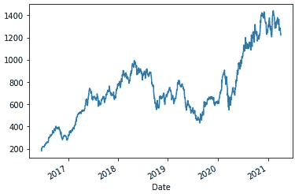

# 利用 RNN 和 LSTM 预测股价

> 原文：<https://medium.com/analytics-vidhya/share-price-prediction-using-rnn-and-lstm-8776456dea6f?source=collection_archive---------4----------------------->


如果你有兴趣建立一个算法，可以预测股票的价格趋势，这可能是你的网页。

本文讨论了一种使用深度学习技术(如递归神经网络和长短期记忆)进行股票价格预测的方法。

我们将通过使用 RNN 和 LSTM 构建深度学习模型的每个步骤，并检查哪一个更适合预测趋势。任何具有深度神经网络基础知识的人都可以很容易地理解这篇文章。


**股票价格预测的深度学习方法。**

在进行步骤之前，让我们先了解一下 RNN 和 LSTM 的概念。

**RNN:**

递归神经网络(RNN)是一类强大的神经网络，用于建模序列数据，如时间序列或自然语言。我用它来预测股票价格。这背后的逻辑是，它会记住特定序列后的价格，模型会根据该模式获得经验。示意性地，RNN 层使用 for 循环在序列的时间步长上迭代，同时维护内部状态，该内部状态编码关于它到目前为止已经看到的时间步长的信息。RNN 只能在短时间内保持序列模式，因此，我们转移到 LSTM，它能记住长短期记忆中的模式。

**LSTM:**

LSTM 是一种用于深度学习领域的人工递归神经网络架构。它优于前馈神经网络，因为它可以在更长的时间内记忆数据点，因此得名长期短期记忆。LSTM 网络由单元、输入门、输出门和遗忘门组成。
细胞就像一个存储器，可以存储任意时间的值，三个门控制着细胞内外的信息。

要获得 RNN 和 LSTM 的详细视图，请点击下面的图片:

[](https://purnasaigudikandula.medium.com/recurrent-neural-networks-and-lstm-explained-7f51c7f6bbb9)

**数据采集&预处理:**

我们需要做的第一件事是安装 yfinance。如果你还没有安装它。

```
pip install yfinance
```

导入 yfinance 模块来收集特定股票的数据。对于我们的情况，我们将使用护送有限公司。

```
#importing yfinance
import yfinance as yf#Collecting data
data = yf.download('ESCORTS.NS',period='5y',interval='1d')
```

yfinance.download()需要的参数是股票代码 tickerperiod:您希望提取数据的总持续时间，interval:指连续记录，例如 1 天 put“1d”。这将提取 5 年来每天的股票数据，不包括节假日。

导入以下库:

```
import pandas as pd
import numpy as np
import tensorflow as tf
import matplotlib.pyplot as plt
%matplotlib inline
```

现在我们已经收集了数据，我们需要选择所需的列。数据包含股票的历史数据，包括开盘价、收盘价、最低价、最高价、成交量和调整后的收盘价。我们将使用调整关闭模式检测和预测。此外，将数据分为训练集和测试集，以便我们可以在以后评估我们的模型。

```
data_target = data.iloc[:1182,4]
data_test = data.iloc[1132:,4]
steps = 7#return numpy representation of data
data = data.loc[:,["Adj Close"]].values
test = data[len(data) - len(data_test) - steps:]#4 the column is Adj Close
```

让我们通过可视化来检查趋势。

```
plot = data_target.plot()
```



NSE 护送有限公司

在此之前，我们需要定义一些函数来缩小数据，并将数据转换成一组特定价格的模式。

为了缩小，我们将使用 ScikitLearn 下的 MinMaxScaler。

```
#Scaling Dataset
def scaledata(data_target): #Import scaler and initialise it
    from sklearn.preprocessing import MinMaxScaler
    scaler = MinMaxScaler(feature_range=(0,1))
    #transform by converting it to array and shape of (-1,1)
    data_target_scaled = scaler.fit_transform(np.array(data_target).reshape(-1,1))
    #plot the scaled version of data
    plot_scaled = pd.DataFrame(data_target_scaled).plot()
    print(data_target.shape) #returns scaled data
    return data_target_scaled, scaler
```

在进行下一个函数之前，让我们了解一下为什么需要它。现在，我们知道 RNN 保留了这种模式，例如，如果你周日穿红色，周一穿蓝色，周二穿绿色，然后重复这种模式，RNN 可以在短时间内保留这种模式。它可以预测你今天穿红色 t 恤明天穿蓝色。因此，数据必须有一个模式才能被识别。

现在，我们将构建一个函数，将数据转换为价格模式，并根据该模式得出目标价格。这样，我们的模型可以学习价格模式的反应。

```
#Create pattern and end price set
def createPatternSet(data_target_scaled,steps=7):   
    x_patern = []  #Independent Variable
    y_price = []   #Dependent Variable for day in range(steps,data_target_scaled.shape[0]):
        row = data_target_scaled[day-steps:day,0]
        #print(len(row))
        x_patern.append(row)
        y = data_target_scaled[day,0]
        #print(y)
        y_price.append(y)

    x_patern,y_price = np.array(x_patern),np.array(y_price)
    #RNN and LSTM takes 3D inputs, we need to change the shape of array to 3 dimensional. x_patern = x_patern.reshape(x_patern.shape[0],x_patern.shape[1],1) #returns independent and dependent variable sets
    return x_patern,y_price
```

上述函数将待转换的数据和步数作为步数。默认情况下，我们将步长设置为 7，这意味着 7 天模式和之后的价格将分别被记录为自变量和因变量。

```
#Scale Down Target
data_target_scaled = scaledata(data_target)[0]
scaler = scaledata(data_target)[1]
#prepare test data
test = data[len(data) - len(data_test) - steps:]
test = scaler.transform(test)
```

**训练和测试集:**

我们将使用我们的函数来处理和构建 x_train 和 y_train。

```
#Overwrite steps to 50\. it doesnt really matter here because we will be doing a lot of iterations with it (Take anyhthing less than 100).
train_pattern = createPatternSet(data_target_scaled,steps=50)
x_train = train_pattern[0]
y_train = train_pattern[1]#Input Shape needs to be 3D.
x_train.shape
>>> (1132, 50, 1)
```

我们已经完成了训练集的构建，我们将构建测试集。

```
#create pattern and price for test set.
test_pattern = createPatternSet(test,steps=50)
x_test = test_pattern[0]
y_test = test_pattern[1]#Dont forget to check the shape of x_test (3D reuired).
x_test.shape
```

测试数据将用于模型的评估。我们将基于 x_test 预测这些值，然后将它们与原始 y_test 值进行比较。

至此，我们已经完成了数据预处理，现在是有趣的部分**。**

**模型建筑:**

我们将定义一个带有方法的类，这些方法可以构建体系结构，编译它，并使它适合给定的数据。该类还将拥有设置参数的方法，如神经元的数量、batch_size 和 epoch。构建这个类的原因是，我们可以使用传递的不同参数运行一个 for 循环，并分析结果。这将有助于读者尝试超参数的其他组合。

后来，我们也可以从这个类继承 LSTM，并改写建筑的建造方法。有其他选项可用于超调模型，但我们坚持这一最基本的理解。

为 RNN 构建类:

默认情况下，模型的架构包含以下几层:

```
Layer (type)                 Output Shape              Param #   
=================================================================
simple_rnn_44 (SimpleRNN)    (None, 50, 50)            2600      
_________________________________________________________________
dropout_32 (Dropout)         (None, 50, 50)            0         
_________________________________________________________________
simple_rnn_45 (SimpleRNN)    (None, 50, 50)            5050      
_________________________________________________________________
dropout_33 (Dropout)         (None, 50, 50)            0         
_________________________________________________________________
simple_rnn_46 (SimpleRNN)    (None, 50, 50)            5050      
_________________________________________________________________
dropout_34 (Dropout)         (None, 50, 50)            0         
_________________________________________________________________
simple_rnn_47 (SimpleRNN)    (None, 50)                5050      
_________________________________________________________________
dropout_35 (Dropout)         (None, 50)                0         
_________________________________________________________________
dense_19 (Dense)             (None, 1)                 51        
=================================================================
Total params: 17,801
Trainable params: 17,801
Non-trainable params: 0
```

对于编译，我使用了 Adam 和，对于损失函数均方误差。

为 LSTM 构建类:

继承以前类的属性并覆盖架构。

```
class LstmModel(StocksPriceRNN):
    StocksPriceRNN.model = tf.keras.Sequential()
    def __init__(self,x_train,y_train,epoch):
        super().__init__(x_train,y_train,epoch)

    def buildArchitecture(self,dense=1):
        StocksPriceRNN.model = tf.keras.Sequential()
        StocksPriceRNN.model.add(tf.keras.layers.LSTM(
                                 StocksPriceRNN.neurons,
                                 input_shape=(None,1)))
        #Output
        StocksPriceRNN.model.add(tf.keras.layers.Dense(units=1))
        return StocksPriceRNN.model.summary()
```

**可视化:** 接下来，我们构建一个函数来绘制验证曲线。

```
def plotting(org_vals,output):
    plt.figure(figsize=(10,5), dpi=80, facecolor='w', edgecolor='k')
    plt.plot(org_vals,color="Green",label="Org value")
    plt.plot(output,color="Yellow",label="Predicted")
    plt.legend()
    plt.xlabel("Days")
    plt.ylabel("Price")
    plt.grid(True)
    plt.show()
```

这是一个很大的工作量，但我们已经建立了我们的算法，唯一剩下的事情就是把它们放在一起。

**迭代&评估:**

首先，我们将迭代 RNN，然后是 LSTM。将比较两者的最佳输出以进行评估。

构建一个 For-Loop 语句来传递不同的时期和批处理大小。对数据运行模型并可视化输出:

```
for steps in [7,30,90]:
    for epoch in [20,30,50]:
        #prepare train data
        train_pattern = createPatternSet(data_target_scaled,steps=steps)
        #prepare test data
        test = data[len(data) - len(data_test) - steps:]
        test = scaler.transform(test) test_pattern = createPatternSet(inputs,steps=steps)
        x_test = test_pattern[0]
        y_test = test_pattern[1]
        #Build Model
        RNN1 = StocksPriceRNN(x_train,y_train,epoch)
        RNN1.buildArchitecture(2,0)
        RNN1.compiler()
        #fit model
        history = RNN1.modelfit()
        #Predict Values
        pred = RNN1.model.predict(x=x_test)
        output = scaler.inverse_transform(pred)
        org_vals = scaler.inverse_transform(y_test)
        #visualise
        print("Plotting for Steps {} and Epoch {}".format(steps,epoch))
        plotting(org_vals,output)
```

这将在 9 次迭代中输出。在比较了迭代之后，我发现 RNN 在 90–30 和 90–50(步长-纪元)的组合上给出了草率但相对最好的结果。

以下是输出:


RNN:为步骤 90 和时代 50 绘图

30-50 个历元之间没有太大的差别，但是准确度可以随着历元的增加而增加。

类似地，我们为 LSTM:
运行迭代。请注意，将会有一些与“超出调用范围”相关的警告，这是很自然的，因为我们只将测试数据分割为 100 个记录。为了避免这种情况，请确保 experimental_relax_shapes=True，这是一个放松参数形状的选项，可以避免不必要的缩进(不一定需要)。

```
# for different epochs, batch size, and neurons/units. 
for epch in [60,100,200]:
    for batch in [2,4,6]:
        for neurons in [8,10,12]:
            LSTM2 = LstmModel(x_train,y_train,epoch=epch)
            LSTM2.changeBatchSize(batch)
            LSTM2.changeNeurons(neurons) LSTM2.buildArchitecture()
            LSTM2.compiler()
            history = LSTM2.modelfit() pred = LSTM2.model.predict(x_test)
            pred = scaler.inverse_transform(pred)
            #org = scaler.inverse_transform(y_test) print("For epch {}, neurons {} and batch {}".format(epch,neurons,batch))
            plotting(org,pred)
```

输出将包含 27 次迭代。

分析 LSTM 的输出，很明显 LSTM 在数据集上的表现优于 RNN。LSTM 在批量大小= 2、单位= 10 和纪元= 200 时给出了更好的结果。

以下是输出:


LSTM

**尾注:**
我们建立的模型能够进行更多的迭代。我们只尝试了其中的一些，仍然设法接近原始价格曲线。去吧！并且自己尝试其他超参数，因为我们已经构建了一个类实例，我们可以做很多修改，而无需编写整个代码或对同一代码进行更改。

下面是完整的代码:
[https://www . ka ggle . com/rishirajak/share-price-prediction-using-lstm-and-rnn](https://www.kaggle.com/rishirajak/share-price-prediciton-using-lstm-and-rnn)

**感谢**阅读我的作品。