# Shopee 产品匹配 EDA 和清洗

> 原文：<https://medium.com/analytics-vidhya/shopee-product-matching-kaggle-challenge-comprehensive-eda-26cf1ca62945?source=collection_archive---------15----------------------->

还包括图像的光学字符识别。

## 导入所需的库

```
import pandas as pd
import numpy as np
import cv2
import seaborn as sns
import sklearn
import matplotlib.pyplot as plt
from textwrap import wrap
import pytesseract
import re,string
from wordcloud import WordCloud, STOPWORDS
from tqdm.notebook import tqdm
from joblib import dump, load
import nltk
from nltk.corpus import stopwords
nltk.download('stopwords')[nltk_data] Downloading package stopwords to /usr/share/nltk_data...
[nltk_data]   Package stopwords is already up-to-date!

Truepath = '../input/shopee-product-matching'
train_path = '../input/shopee-product-matching/train_images'
test_path = '../input/shopee-product-matching/test_images'
```

**让我们看看数据头**

```
data = pd.read_csv(path+'/'+'train.csv')
data.head()
```

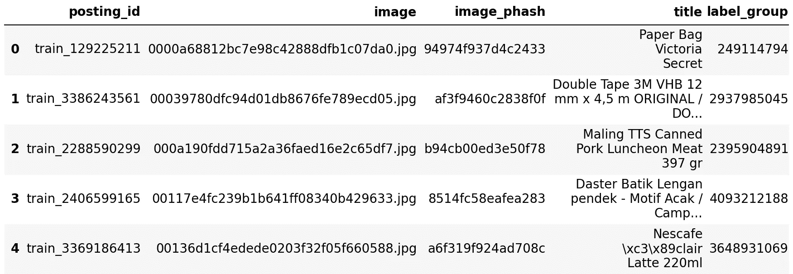

## 关于数据的基本细节

```
print(f"The Shape of the train data : {data.shape}")
print(f"Duplicate Rows : {data.shape[0] - len(data['posting_id'].unique())}")The Shape of the train data : (34250, 5)
Duplicate Rows : 0print("Number unique label_groups = {}".format( len(data["label_group"].unique()) ))Number unique label_groups = 11014
```

**这里一个标签组表示相似的产品，即:所有具有相同 label_id 的产品都是相似的**

```
num_label_groups = {}
for i in data['label_group']:
    num_label_groups[i] = data[data['label_group'] == i]len_label_groups = {}
for i in num_label_groups:
    len_label_groups[i] = len(num_label_groups[i])

print(f"Max of all the label groups : {max(len_label_groups.values())}")
print(f"Min of all the label groups : {min(len_label_groups.values())}")Max of all the label groups : 51
Min of all the label groups : 2label_names = list(num_label_groups.keys())
num_label_groups[label_names[5]]
```

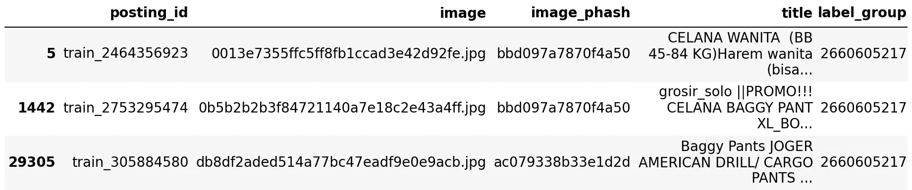

**让我们想象一些类似的产品**

此功能允许您输入 label_id 并查看前 10 个(或更少，如适用)类似产品。

```
def visualize_sim_products(label_id):
    sns.set_style("whitegrid")
    plt.rcParams['font.size'] = '28'
    plt.figure(figsize=(50,50))
    length = len_label_groups[label_id]
    if length > 10:
        length = 10
    for i in range(length):
        img = plt.imread(train_path + '/' + num_label_groups[label_id]['image'].iloc[i])
        plt.subplot(length,2,i+1)
        plt.imshow(img)
        plt.title("\n".join(wrap(num_label_groups[label_id]['title'].iloc[i],60)))
        plt.axis('off')
    plt.show()visualize_sim_products(label_names[14])
```

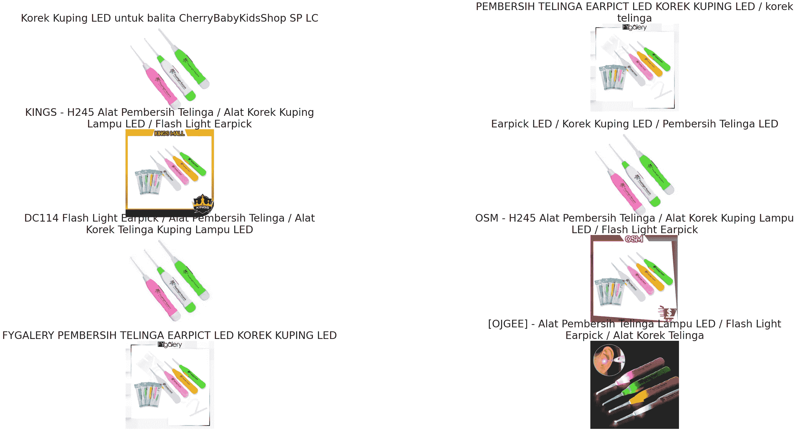

## 感知哈希

根据维基百科，在这个挑战中提供了永久散列，所以我仔细阅读了它:

> 感知散列是使用一种算法来产生各种形式的多媒体的片段或指纹。[1][2]如果多媒体的特征相似，感知散列函数是类似的，而加密散列依赖于输入值的微小变化产生输出值的剧烈变化的雪崩效应。感知哈希函数广泛用于查找在线版权侵权案件以及数字取证，因为它能够在哈希之间建立关联，从而可以找到相似的数据(例如具有不同的水印)。

因此，可能相似的对象具有相似的感知散列值。这是我的假设，我们来验证一下这是不是真的。

```
num_label_groups[label_names[17]]['image_phash']18       bf38f0e083d7c710
4636     bf3cf0e08197c712
14656    bf38f0e08397c712
Name: image_phash, dtype: object
```

看来我的假设是错的。

但是我们可以使用这些相位之间的汉明距离作为一个特征(特征工程)，这将用于另一个笔记本。

似乎完全相同的图像有相同的相位。

```
def hamming(s1, s2):
    return float(sum(c1 != c2 for c1, c2 in zip(s1, s2))) / float(len(s1))
hamming('bf38f0e08397c712','bf38f0e083d7c710')0.125
```

## 让我们找出有多少完全相同的图像

```
copies = {}
for i in data['image_phash']:
    copies[i] = data[data['image_phash'] == i]
phash_list = list(copies.keys())

copies[phash_list[14]]
```

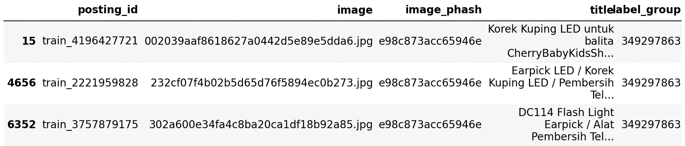

```
copies_len = {}
for i in copies.keys():
    copies_len[i] = len(copies[i])copies_len = pd.DataFrame({'phash':copies_len.keys(),'count':copies_len.values()})
# copies_len.reset_index(inplace=True)
copies_len.head()
```


```
copies_len.sort_values(by='count',ascending = False, inplace = True)
```

## 前 10 个重复图像的相位

```
fig = plt.figure(figsize=(70,50))
sns.barplot(x = copies_len.iloc[:10]['phash'],y=copies_len.iloc[:10]['count'])
plt.show()
```

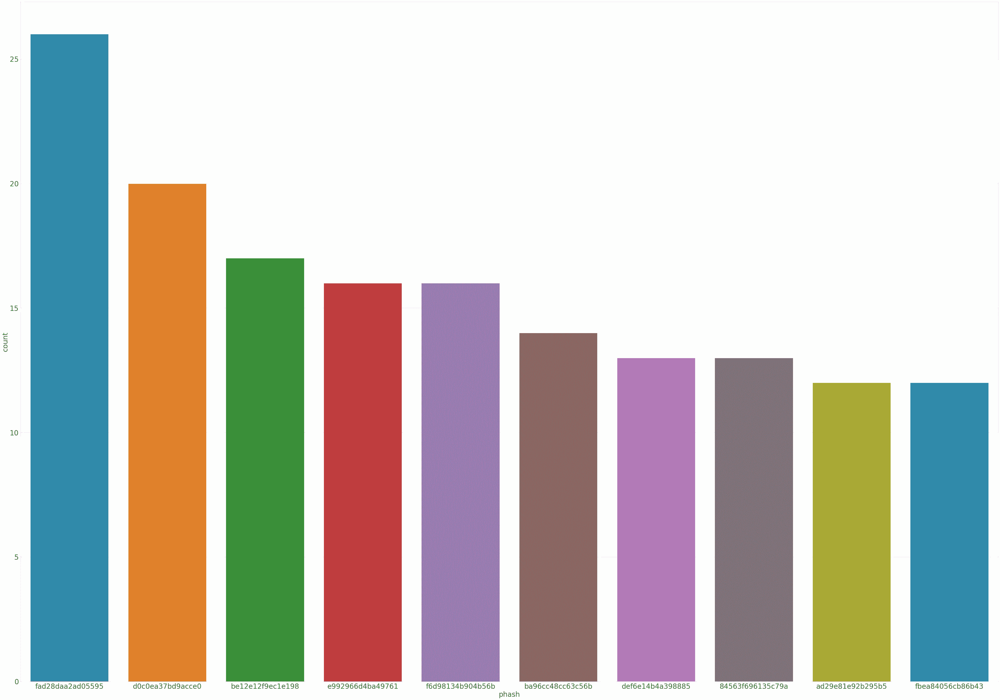

## 让我们来看一些确切的副本

```
def visualize_sim_phashes(phash):
    sns.set_style("whitegrid")
    plt.rcParams['font.size'] = '28'
    plt.figure(figsize=(50,50))
    length = len(copies[phash])
    if length > 10:
        length = 10
    for i in range(length):
        img = plt.imread(train_path + '/' + copies[phash]['image'].iloc[i])
        plt.subplot(length,2,i+1)
        plt.imshow(img)
        plt.title("\n".join(wrap(copies[phash]['title'].iloc[i],60)))
        plt.axis('off')
    plt.show()visualize_sim_phashes(phash_list[14])
```

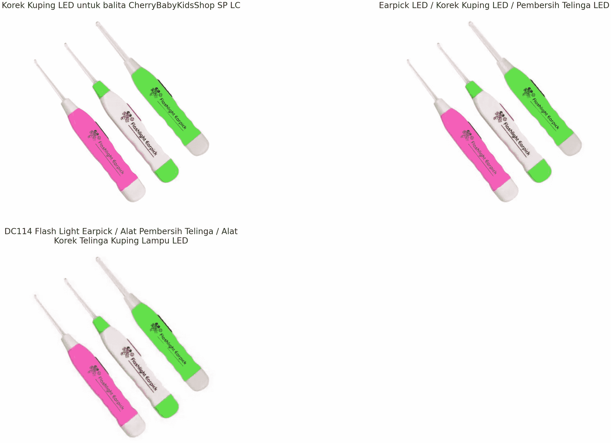

# 基于自然语言处理的 EDA

```
title_text = data['title'].valuesdef clean(title):
    stop = stopwords.words('english')
    title = [x for x in title.split() if not x in stop]
    title = " ".join(title)
    title = title.lower()
    title = re.sub(r"\-","",title)
    title = re.sub(r"\+","",title)
    title = re.sub (r"&","and",title)
    title = re.sub(r"\|","",title)
    title = re.sub(r"\\","",title)
    title = re.sub(r"\W"," ",title)
    for p in string.punctuation :
        title = re.sub(r"f{p}","",title)

    title = re.sub(r"\s+"," ",title)

    return titledata.head()
```


## 词汇云

```
stopwords_wc = set(STOPWORDS) 
token_text = ''

for i in tqdm(title_text):
    token_l = i.split()
    token_text += " ".join(token_l) + " "0%|          | 0/34250 [00:00<?, ?it/s]
```

## 标题文字的文字云

```
wordcloud = WordCloud(width = 800, height = 800, 
                background_color ='white', 
                stopwords = stopwords_wc, 
                min_font_size = 10).generate(token_text)

plt.figure(figsize = (8, 8), facecolor = None) 
plt.imshow(wordcloud) 
plt.axis("off") 
plt.tight_layout(pad = 0) 

plt.show()
```


**让我们尽可能从图像中提取所有信息，也许将来会用作特征**

```
# Use this for OCR extraction
# ocr_text = []
# for i in tqdm(range(data.shape[0])):
#     img = cv2.imread(train_path + '/' + data['image'].iloc[i])
#     img = cv2.cvtColor(img, cv2.COLOR_BGR2RGB)
#     text = pytesseract.image_to_string(img)
#     text = " ".join(text.split())
#     if len(text) != 0:
#         ocr_text.append(text)
#     else:
#         ocr_text.append('Nothing Found')

# data['ocr_text'] = ocr_text# data.to_csv('cleaned_and _raw_ocr.csv')
data = pd.read_csv('../input/cleaned-shopee-data-with-ocr/cleaned_title_and_ocr_sw.csv')
# Cleaning titles and ocr text again for stopwords, which I missed before
data.drop(['cleaned_title','cleaned_ocr_text'],axis=1,inplace=True)
data['cleaned_title'] = data['title'].map(clean)data['cleaned_ocr_text'] = data['ocr_text'].map(clean)
# data.drop(['Unnamed: 0','Unnamed: 0.1'],axis=1,inplace=True)
data.to_csv('cleaned_title_and_ocr_sw.csv')data.head()
```

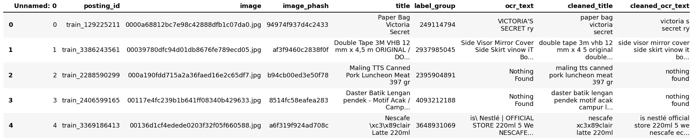

## 用于 OCR 数据的 WordCloud

```
title_text = data['cleaned_ocr_text'].values
stopwords_wc = list(STOPWORDS)
token_text = ''

for i in tqdm(title_text):
    if i.strip() != 'Nothing Found'.lower():
        token_l = i.split()
        token_text += " ".join(token_l) + " "

wordcloud = WordCloud(width = 800, height = 800, 
                background_color ='white', 
                stopwords = stopwords_wc, 
                min_font_size = 10,contour_color='steelblue').generate(token_text)

plt.figure(figsize = (8, 8), facecolor = None) 
plt.imshow(wordcloud,interpolation='bilinear') 
plt.axis("off") 
plt.tight_layout(pad = 0) 

plt.show()0%|          | 0/34250 [00:00<?, ?it/s]
```

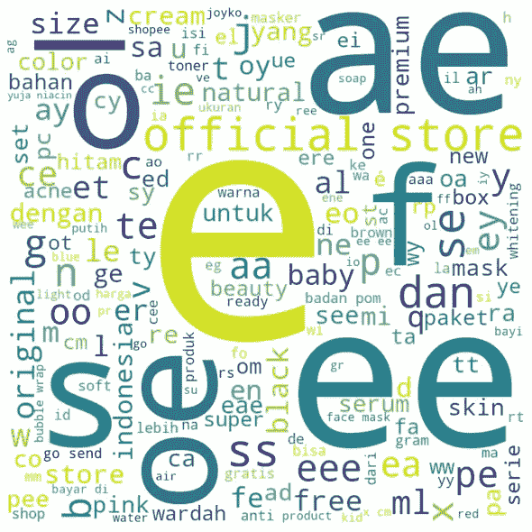

## 让我们看看标题和 OCR 文本

## 标题文本长度的分布

```
plt.figure(figsize = (10, 6))
sns.set_style("whitegrid")
sns.kdeplot(data['cleaned_title'].apply(lambda x: len(x)),fill = True,edgecolor='black',alpha=0.9)
plt.xlabel('Title Text Length')
plt.show()
```

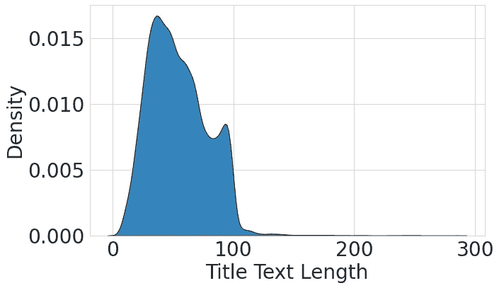

## 标题文本令牌计数的分布

```
plt.figure(figsize = (10, 6))
sns.set_style("whitegrid")
sns.kdeplot(data['cleaned_title'].apply(lambda x: len(x.split())),fill = True,edgecolor='black',alpha=0.9,color='cyan')
plt.xlabel('Title Text Tokens Count')
plt.show()
```

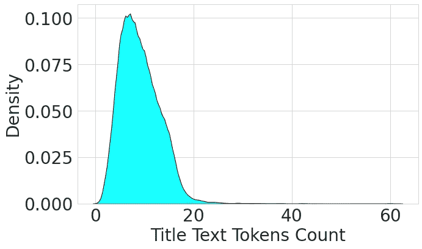

## OCR 文本长度的分布

```
plt.figure(figsize = (10, 6))
sns.set_style("whitegrid")
sns.kdeplot(data['cleaned_ocr_text'].apply(lambda x: len(x)),fill = True,color = 'red',edgecolor='black',alpha=0.9)
plt.xlabel('OCR Text Length')
plt.show()
```

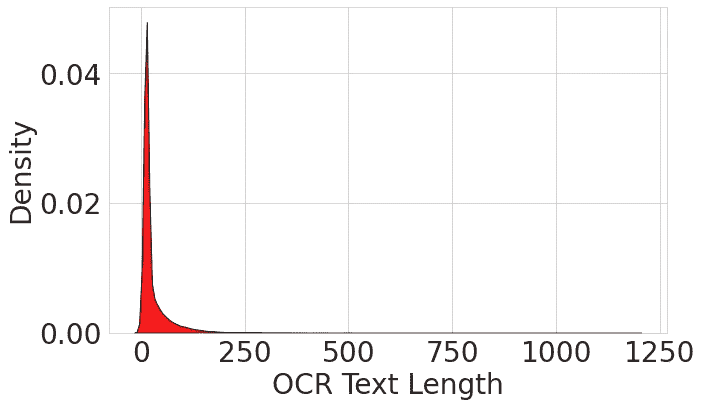

## OCR 文本令牌计数的分布

```
plt.figure(figsize = (10, 6))
sns.set_style("whitegrid")
sns.kdeplot(data['cleaned_ocr_text'].apply(lambda x: len(x.split())),fill = True,color = 'maroon',edgecolor='black',alpha=0.9)
plt.xlabel('OCR Text Tokens Count')
plt.show()
```

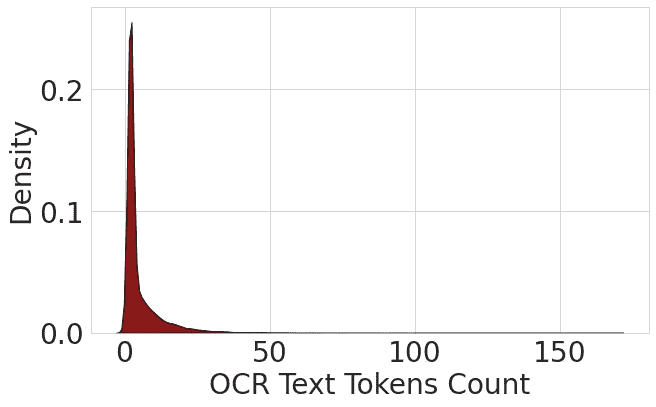

## 图像形状 EDA

```
image_shapes_h = []
image_shapes_w = []
image_shapes_c = []
for i in tqdm(range(data.shape[0])):
    img = cv2.imread(train_path + '/' + data['image'].iloc[i])
    h, w, c = img.shape
    image_shapes_h.append(h)
    image_shapes_w.append(w)
    image_shapes_c.append(c)0%|          | 0/34250 [00:00<?, ?it/s]dump(image_shapes_h,'heights.pkl')
dump(image_shapes_w,'widths.pkl')
dump(image_shapes_c,'channels.pkl')

image_shapes_h = load('heights.pkl')
image_shapes_w = load('widths.pkl')
image_shapes_c = load('channels.pkl')set(image_shapes_c){3}
```

**没有任何黑白图像&**

```
sns.set_style("white")
sns.axes_style('whitegrid')
h = sns.JointGrid(x =  image_shapes_h,y = image_shapes_w,height=8)
h.plot_joint(sns.scatterplot)
h.plot_marginals(sns.histplot, kde=True)
plt.show()
```


## 数据洞察(汇编)

*   数据库中总共有 34250 个产品是唯一的，这意味着没有重复的行。
*   数据集中提供了 11014 个 label_groups。
*   所有标签组的最大数量:51
*   所有标签组的最小值:2
*   一个标签组中所有图像的感知哈希并不相同，但是存在一些标题不同的相同图像。
*   Phash hamming distance 可能是将来使用的一个好功能。
*   我们可以参考各自的单词云来了解标题和 ocr 文本中经常使用的单词。
*   OCR 文本可能是模型的一个很好的特性。
*   大多数数据的标题文本长度似乎少于 90 个字符。
*   大多数数据的标题文本标记计数似乎少于 20 个单词。
*   同样，OCR 文本长度似乎也少于 90–100 个字符。
*   OCR 文本标记的数量似乎少于 18–20 个标记(这些标记中的大部分是来自糟糕的 OCR 的乱码)
*   所有图像都是 3 通道 RGB 图像，数据集中没有 B&W 或灰度图像。结合图可以得到图像的高度和宽度分布的概念。