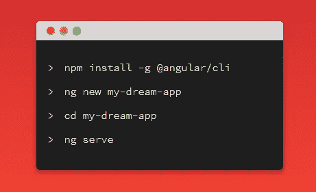

# 我应该选择有棱角的还是有棱角的？

> 原文：<https://medium.com/analytics-vidhya/should-i-choose-angular-or-angularjs-1a0c3bb5b65?source=collection_archive---------18----------------------->

AngularJs 是一个开源的 javascript 框架，由 Google 开发，用于开发前端 web 应用程序。它的后续版本被编号为 Angular 2 及以后的版本。根据 2020 年 StackOverflow 开发者调查，angular 是第三大最受欢迎的 web 框架，占 25.1%。但是当我们比较 angular 和 AngularJs 时，最受欢迎的 web 框架是 Angular。然而，当我们比较所有的框架时，根据 StackOverflow 年开发者调查，我们可以看到最可怕的 web 开发框架是 AngularJs。

无论你是一名学生还是一名软件工程师，希望拓展你的 web 开发阶段，或者是一家企业希望通过推出应用程序来扩大自己的声誉，这篇文章都会对你有所帮助。所以在这篇文章中，我将讨论 Angular 和 AngularJs 之间的主要区别。

当我们考虑 Angular 和 AngularJs 之间的关键差异时，我们可以发现，数据绑定的基本架构和方法已经发生了变化。这里有一些我希望触及的关键差异因素，

*   体系结构
*   以打字打的文件
*   依赖注入
*   角度 CLI
*   表达式语法
*   表演
*   移动支持

# 体系结构

AngularJS MVC 框架工作流

AngularJs 有一个模型-视图-控制器(MVC)。它作为一个核心组件管理数据、逻辑、表达式以及应用程序的行为方式。

但是在角度上，

角度的基本架构

它使用的组件是带有模板的指令。这意味着，当您将业务逻辑放入模型中时，控制器中的预期输出，angular 会执行所有过程来导出预期输出。但是模型管线是由 AngularJs 自动生成的。

# 以打字打的文件

类型脚本与 JavaScript

AngularJs 使用 javascript，但是在 angular 2 上，使用 typescript。Typescript 在开发过程中提供静态类型。虽然 typescript 有助于避免许多运行时陷阱。以及 typescript 是 javascript 的超集。然而，AngularJs 也很难用于复杂和较大的应用。

# 依赖注入

依赖注入

在 AngularJs 中，依赖注入被注入到各种链接和控制功能以及指令定义中。但是在 Angular 中，它实现了一个层次依赖注入系统。它使用声明、提供者和构造函数。

# 角度 CLI

AngularJs 没有自己的 CLI，但在 angular 2+中，它有自己的 angular CLI，用于生成组件、模块和服务等。不仅如此，它还用于高效快速地生成完整的项目。

# 表达式语法

作为 AngularJs 开发人员，他/她应该记住绑定属性或事件的正确 ng 指令，但是作为 Angular 开发人员，“()”用于事件绑定，“]”用于属性绑定。当我们比较有角的和有角的时，有角的要比有角的好得多。因为要处理数据绑定。

# 表演

根据开发者的意见，他们说，如果你正确地构建一个 Angular 应用程序，它可以比 AngularJs 应用程序快五倍。以及 AngularJs 使用双向数据绑定特性，最终可以减少构建的工作量和时间。然而 angular 有更好的结构，比 AngularJs 快得多。

# 移动支持

AngularJs 不提供移动开发支持，但 Angular 提供。

现在我想继续谈谈有角的和有角的优点和缺点，

# **棱角分明的优点**

*   由于更好的数据绑定和基于组件的架构，比 AngularJs 快 5 倍。
*   角度的分量是相当独立的。这使得它们可以重用并且测试友好。
*   支持浏览器和移动应用。
*   有一个内置的服务器端渲染应用程序的扩展。所以这对于搜索引擎优化也是一个巨大的加分点。

# 角度的缺点

*   使用 AngularJS 开发的遗留系统，但需要进行迁移。
*   组件的管理方式很复杂。所以有时所谓的 angular 是一种冗长的语言。

# AngularJs 的优势

*   更容易和更快地学习 AngularJs。因为它基于 javascript。
*   双向数据绑定提供了更快、更简单的方式来绑定数据，而无需开发人员的干预。
*   AngularJS 的 MVC 和 MVVM 架构将数据与设计分开。

# AngularJs 的缺点

*   在你去安古拉吉斯旅行之前。你应该对 javascript 有很好的了解。
*   无法在禁用 javascript 的环境中运行。

现在，我转到本文的最后一部分，即您应该为前端开发选择 Angular 还是 AngularJs。

如果你要开发一个简单明了的应用程序，AngularJs 比 Angular js 更容易、更快。但是如果你要构建一个范围更大的复杂应用，那么你的选择应该正好是 Angular 2+。因此，作为一名学生、开发者或企业主，投资 Angular 将是朝着正确方向迈出的积极一步，这将是一个巨大的加分点。