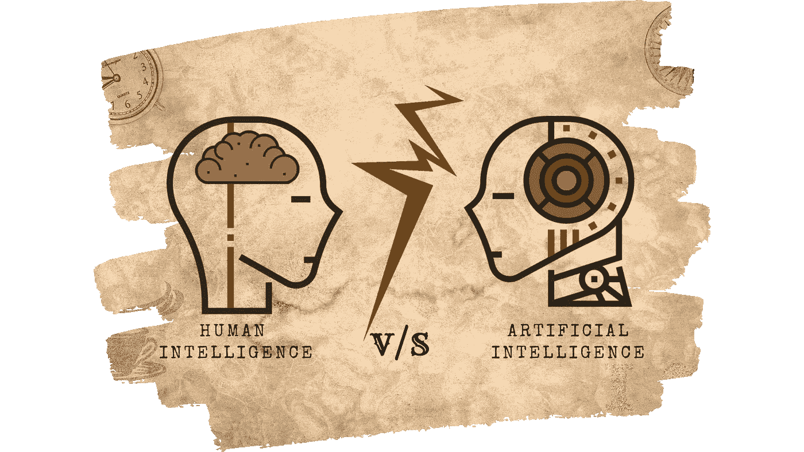

# 我该担心 AI 抢了我的饭碗吗？

> 原文：<https://medium.com/analytics-vidhya/should-i-worry-about-ai-taking-my-job-2ba20fb3f52f?source=collection_archive---------29----------------------->

(图片由[作者](https://www.instagram.com/hrishabh_digaari/)提供)

## 我们来谈谈:

## 人类智能 v/s 人工智能

在这篇文章中，

*   你将和我一起浏览我们的*人类历史*的各个章节，收集关于*人工智能*对人类生活影响的证据碎片。
*   基于这些证据和我对人文主义信条的理解，我将试着描述我们的现状和我们可能的未来。

> 那么让我们来看看我们的第一个问题…

# 这篇文章是给我的吗？

如果你对阅读一个*适度可能的*未来感兴趣——这涉及到*碳基*人类对*硅体内的高度智能算法的高度依赖—* 基于我们过去两个世纪的习惯，那么你会喜欢喝着你最喜欢的饮料阅读这篇文章。

# 这篇文章是关于什么的？

这篇文章是关于一个基于我们过去 200 年的想法和希望的未来。显然，真正的未来可能是完全不同的，但即使有一丁点儿的可能性，我也很乐意写出来。

现在，对一些人来说，这可能听起来有点悲观，但最好不要妄下结论。我们的星球见证了许多文化和文明的兴衰。埃及被当地的法老持续统治了大约 2500 年。如果有人在克利奥帕特拉七世时代对一个埃及人说，埃及帝国很快就会灭亡，他可能会感到震惊。[【1】](https://en.wikipedia.org/wiki/List_of_pharaohs)

> 所以这是一个开始的想法—

# 当人工智能几乎可以做人类做的所有事情时，会发生什么？

为了回答这个问题，让我们回到我们可以通过握手来问候对方的时代。实际上，还要多一点。我想让你在 19 世纪初来见我。世界上大多数经济体分为三个部门:

大多数人从事农业活动，这为他们提供了直接的工作来养活自己和家人。人口中有一小部分人依靠*工业*和*服务业*为生。

几年后，我们目睹了许多国家的工业革命。人们从他们的农场迁移到新的机械化工厂。这场革命增加了工业部门和服务业的就业机会。

现在，让我们把时间快进到 2x，到 21 世纪初，发达国家经历了另一场革命，其中*工业*工作岗位**消失**而*服务业*部门**的工作机会大增**。

截至 2010 年，居住在美国的 2%的人口在农业部门工作，20%的居民在工业部门工作，78%的人从事教师、医生、全栈开发者、平面设计师和其他服务性工作。

基于过去两个世纪的这种趋势，你是否想过:

# 当人工智能开始比人类更好地教育、诊断和设计时，会发生什么？

现在，**这不是一个全新的问题。你我都见过这样的问题。例如，在工业革命时代之后，人们抗议机械化可能导致大规模失业和混乱。但是我们目睹了旧的工作变得过时，新的工作不断涌现和发展！**

而人呢？人们舒适地将社会城市化到今天的样子。

但是我听到很多人——我也相信——说，

> *“总有一些事情人类可以做得比机器更好”*

但这不是自然规律。这个**可能不是**永久的。

让我们从零开始审视自己。大致来说，我们有两种主要的能力:

*   认知能力:从最简单到最复杂的问题，我们执行任何任务都需要的基于大脑的技能。
*   身体能力:我们不需要运用太多大脑技能就能完成一些身体活动的能力。

机器让我们的体力工作变得更容易，让我们更专注于我们的认知能力。但是，想象有一天机器在保留、识别和理解模式方面超过我们。

我知道你现在可能在想什么，

> *“嘿，赫里沙巴，有许多事情*人类比机器更擅长*，这要感谢我们* ***独特的认知能力*** *。毕竟，* ***我们比这个星球表面的任何其他动物或原始人都要高级得多！***

*但是在我们得出任何结论之前，让我们出去兜一圈我们的近代史。*

## *国际象棋:人类智力的生物计量*

*在 20 世纪 80 年代，人们通过习惯性地展示象棋作为人类优越性的认可来吹嘘人类的独特性。他们得出结论，在这个游戏中，机器永远无法征服人类。*

**

*(图片由[作者](https://www.instagram.com/hrishabh_digaari/)提供)*

*跳到 1997 年 2 月，IBM 的超级计算机深蓝**在纽约市中心击败了加里·卡斯帕罗夫**。[【2】](https://en.wikipedia.org/wiki/Deep_Blue_versus_Garry_Kasparov)*

*在围棋(游戏)的世界里也有类似的账号，谷歌的 AlphaGo 自学了围棋(游戏)的玩法，**在 2016 年 3 月击败了**韩国围棋冠军 Lee Sedol。[【3】](https://en.wikipedia.org/wiki/AlphaGo_versus_Lee_Sedol)*

## *棒球:钱球的奇特案例*

*自从 19 世纪以来，职业棒球经理和球探已经在比赛中利用他们的本能、智慧、经验和专业知识来招募和管理他们的球员。他们认为棒球运动员的选拔是一门艺术，只有亲密且经验丰富的人才能掌握。仅仅一台机器或一个计算机程序永远无法解开棒球的秘密和精神。*

**

*(图片由[作者](https://www.instagram.com/hrishabh_digaari/))*

*2002 年，奥克兰运动家队的比利·比恩决定打破这一体系，引入一种由统计学家和计算机极客开发的算法，创造出一个被管理者忽视的失败者团队。结果呢？奥克兰运动家队成为美国联盟历史上第一支连续赢得 20 场比赛的球队。[【4】](https://en.wikipedia.org/wiki/2002_Oakland_Athletics_season)*

## *面部识别:人类智慧与生俱来的权利*

*根据斯坦福大学的研究，面部识别是婴儿视觉系统中最早发展的特征之一。[【5】](https://news.stanford.edu/news/2012/december/infants-process-faces-121112.html)*

*长期以来，面部识别一直被认为是最强大的计算机和人类之间的一道铁栅栏。*

**

*(图片由[作者](https://www.instagram.com/hrishabh_digaari/)提供)*

*今天，面部识别程序被情报部门和警察部队广泛用于扫描无数小时的监控内容，因为它们比人类更有效、更快。*

## *交通:进入埃隆马斯克*

*2004 年，麻省理工学院和哈佛大学的教授发表了一项关于就业市场的研究，他们将卡车驾驶归类为在可预见的未来没有任何被自动化取代的机会的工作的一个例子。[【第六期】](https://economics.mit.edu/files/11574)*

**

*(图片由[作者](https://www.instagram.com/hrishabh_digaari/)提供)*

*今天，像特斯拉这样的公司不仅在推动这一点，而且还通过**和**来实现这一点。[【7】](https://www.tesla.com/autopilot)*

## *公司:艾在船上*

*成为一家公司或组织的董事会成员是一项复杂的投资组合。你需要展示管理和领导素质的广度和深度，以及商业头脑和相关的行业经验。*

**

*(图片由[作者](https://www.instagram.com/hrishabh_digaari/))*

*但是，2014 年 5 月，总部位于香港的 Deep Knowledge ventures **任命了一个名为 VITAL to 其董事会的算法**，该算法根据对大量数据的细致分析，对公司是否应该投资某家公司进行投票。[【8】](https://en.wikipedia.org/wiki/VITAL_%28machine_learning_software%29)*

## *iPhone 医生*

*2015 年，耶鲁大学的研究人员成功演示了*人工胰腺的使用。*一个微型传感器和一个微型泵，连接到一个小胰岛素管，被安装在病人的腹部。*

**

*(图片由[作者](https://www.instagram.com/hrishabh_digaari/)提供)*

*该传感器负责测量并向 iPhone 报告患者的血糖水平。iPhone 上有一个应用程序，可以分析信息并向传感器发出命令，传感器反过来在没有任何人类帮助的情况下，向患者的腹部注射受控量的胰岛素。[【9】](https://medicine.yale.edu/news-article/14441/)*

## *治疗:IBM 的沃森博士*

*你最后一次去看心理医生是什么时候？我希望你不必。但你可能在人生的某个阶段去看过心理医生。(即使你不信任我，你也没有错过任何东西。)*

**

*(图片由[作者](https://www.instagram.com/hrishabh_digaari/)提供)*

*那么治疗师是做什么的呢？他通过检查你的面部表情和语调等外部信号来了解你的情绪状态。*

*IBM 的沃森是一种人工智能，它不仅可以比医生更精确地分析你的外部信号，还可以同时分析通常对人类耳朵和眼睛隐藏的各种内部指标。[【10】](https://www.ibm.com/developerworks/library/os-ind-watson/index.html)*

## *音乐是艺术*

*是啊！音乐是艺术。根据韦氏词典的说法:*

> *“艺术是对技巧和创造性想象力的有意识的运用，尤其是在审美对象的生产中”*

*它反映了文化价值观，记录了人们的生活经历。它需要情感。**艺术是人类独有的。***

> *真的吗？*

**

*(图片由[作者](https://www.instagram.com/hrishabh_digaari/)提供)*

*花点时间。假设*人工智能*接管了我们的医生，我们的司机，我们的老师，他们甚至处理我们的账目，甚至我们的法律案件。那么我们到底还剩下什么？艺术似乎是一个全新的职业。如果每个人都想成为艺术家呢？我不这么认为。*

*1989 年，加州大学的一位教授开发了一种叫做 EMI 的算法。在一次盲测中，百代的作品被**称赞**正是因为它们的**深情和情感共鸣**，甚至超过了原艺术家的作品。[【11】](https://en.wikipedia.org/wiki/David_Cope)*

# *人工智能会对我们产生怎样的影响？*

*毫无疑问，即将到来的建立在人工智能基础上的技术进步将使我们的生活变得更加轻松。人工智能甚至有可能不需要人类付出太多努力就能养活和支持人类。但关键问题是:*

> *什么能让我们保持忙碌和满足？*

*毒品和虚拟现实世界可能会让我们保持参与，并提供比外面沉闷的现实更激烈和令人兴奋的参与，但如果我们的生活中没有工作和目标，我们可能会感到毫无价值，是的，还不如最终变得一无是处。*

# *我该担心 AI 抢了我的饭碗吗？*

*在我写这篇文章的时候，*人工智能*离作为人类的存在还很遥远，但是超过 95%的人类特征和技能在完成大多数现代工作时效率低下。对于人工智能来说，把我们挤出工作岗位，仅仅是通过超越我们在特定职业上的能力。*

*因此，我们的目标不应该是为人类智能创造新的工作机会。我们的主要目标应该是创造人类智能比人工智能表现更好的新工作。*

*因为你和我都不知道 2050 年就业市场的情况，所以我们也不知道该教我们的下一代什么。他们在学生时代学到的大部分知识，可能在他们 30 岁时就过时了。*

*从广义上来说，我们的生活分为两个阶段:*

*   *理论阶段:我们在学校和大学学习和获得知识的阶段*
*   ***实践阶段**:我们在实际项目中工作并应用我们的知识。*

*很快，这两个人生阶段可能会过时，人生成功的唯一途径将是*在一生中不断学习*和*发展我们的技能*。*

# *参考*

*   *在各自的参考点连接。*

> **感谢阅读，祝咖啡愉快！☕**