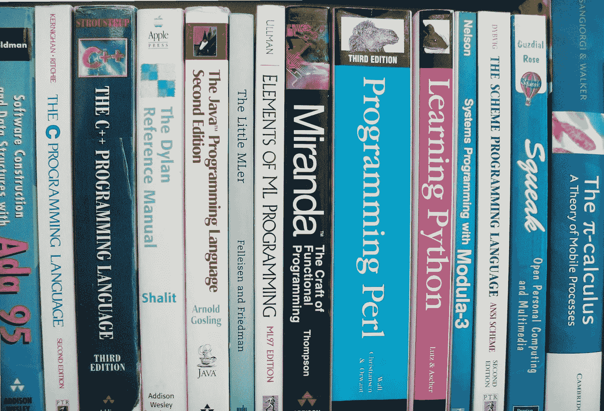

# 2021 年该不该学 SAS？

> 原文：<https://medium.com/analytics-vidhya/should-you-learn-sas-in-2021-453597a4387f?source=collection_archive---------1----------------------->

## SAS 语言正在被淘汰，或者您应该认真考虑重新学习它吗？

(src =[https://pixabay.com/images/id-942485/](https://pixabay.com/images/id-942485/)

# 介绍

T 数据科学行业在过去十年中发展迅速，变化多端。随着这种快速发展，出现了一系列新的工具，以及对编程惯例的一些改变…