# 哪种机器学习模型最适合预测哪些股票值得买？

> 原文：<https://medium.com/analytics-vidhya/showdown-which-machine-learning-model-is-the-best-for-predicting-which-stocks-are-worth-buying-2516de68d34f?source=collection_archive---------5----------------------->


资料来源:wccftech

**指导问题:** *哪种机器学习模型最适合预测哪些股票值得买入？*

## 数据集描述

对于这个分析，我将使用来自 Kaggle 的[“美国股票 200+金融指标(2018)”数据集。](https://www.kaggle.com/cnic92/200-financial-indicators-of-us-stocks-20142018)

该数据集包含 2018 年美国股市的数据。它包含 200 多个财务指标，这些指标通常出现在每个上市公司每年发布的 10-K 文件中，涉及超过 4k 只股票。最后一列“类别”列出了每只股票的二进制分类。如果 class = 1，那么股票的价格变化百分比在那一年之后上升；如果 class = 0，那么股票的价格变化百分比在那一年之后下降。这个“类别”栏可以用来衡量股票是否值得购买。

# 🕵️‍♀️数据勘探公司

为了给我的模型选择提供信息，我将首先研究我的数据。

## **数据集概述**

```
df.info()
```

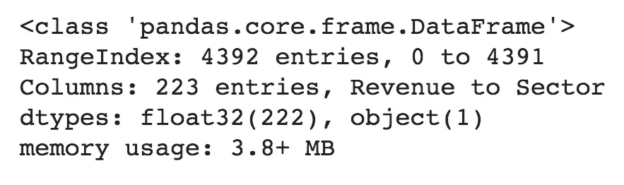

**图 1** :数据集信息

## **关联热图**

```
fig, ax = plt.subplots(figsize=(20,15))
sns.heatmap(df.corr(), annot=False, cmap='YlGnBu', vmin=-1, vmax=1, center=0, ax=ax)
plt.show()
```

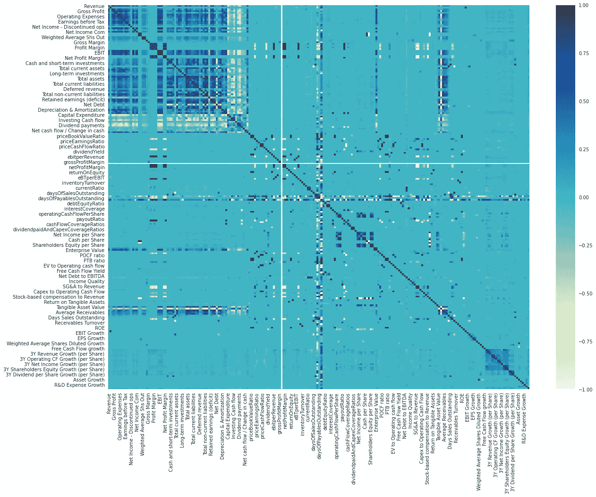

**图 2:** 显示数据集中要素之间相关性的热图

**相关表**

```
corr = df.corr().abs()
s = corr.unstack()
so = s.sort_values(kind="quicksort")
print(so[-4470:-4460])
```

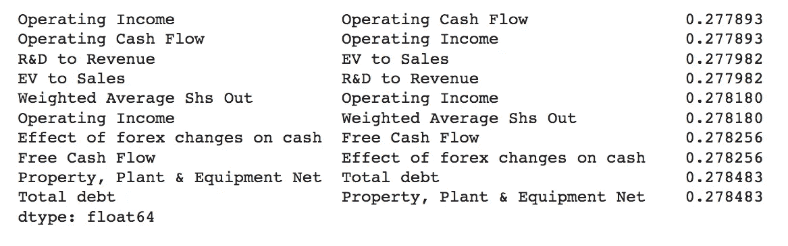

**表 1:** 显示具有最高相关性的特征和它们各自的相关系数的表

## **探索“类”功能**

**班级计数栏剧情**

```
classes = df['Class'].value_counts()
class_len = len(classes)
sns.set_style("darkgrid")
sns.barplot(np.arange(class_len), classes)
plt.title('Class Count', fontsize=18)
plt.show()
```

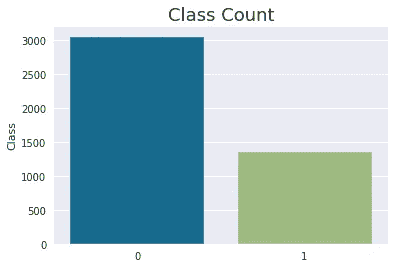

**图 3:** 显示数据集“类”特征中的值和这些值的计数的条形图

**计算“类”中空值的数量**

```
print("Number of null values in 'Class':", df['Class'].isnull().sum())
```

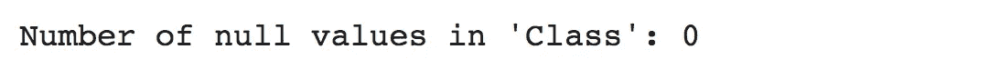

**图 4:** 显示了“类”特征中空值的数量

这一探索揭示了两个主要发现:

1.  如*图 1* 所示，该数据集具有大量的特征(223)和条目(4392)，因此我将选择能够支持该数据集大小的模型
2.  “类”特征是二进制的，它不是 0 就是 1 ( *图 3* )。对于任何行，它也不会丢失，这意味着每只股票都被赋予 0 或 1 值(*图 4* )。这证实了我可以将“Class”作为目标变量来使用这个数据集的分类模型。

基于这些发现，我将选择使用能够处理大型数据集的分类模型来分析这个数据集。

# 数据清理和准备🛁

## 将“扇区”列转换为虚拟值

“部门”特征描述公司是什么部门的一部分；例如:医疗保健、科技、能源、房地产等。为了能够在我的模型中集成“Sector”特性，我将把这个列转换成虚拟值。

```
dummy = pd.get_dummies(df['Sector'])
dummy.head()
```

然后，我可以从数据框中删除原始的“扇区”要素，并用新的虚拟值列替换它。

```
df = df.drop('Sector', axis=1)
df1 = pd.concat([dummy, df], axis=1)
```

## **处理缺失值**

这个数据集有多少个缺失值？

```
print("Total number of null values:", df1.isnull().sum(axis = 1).sum())
```

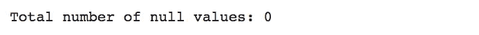

显然，这个数据集有需要处理的缺失值。但是，在我这样做之前，我想使用热图来了解一下这个缺失值的分布情况。

```
plt.figure(figsize = (40,10))
sns.heatmap(df1.isnull(), yticklabels=False)
```

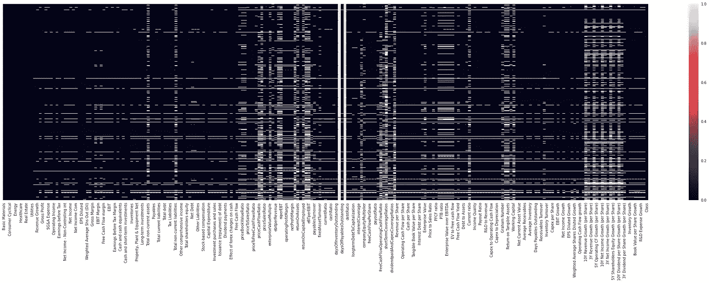

**图 5:** 显示数据集中所有要素的空值分布的热图

从*图 5* 中，我已经可以看出有一些特征的缺失值百分比非常高。为了查看丢失值最多的要素以及丢失值的百分比是否高到值得移除该要素，我将对每个要素的空值求和，将这些数据放入数据框中，按降序对数据框进行排序，并打印前 20 个值。我还将找到这些特征的空值的百分比。

```
col_len = df1.shape[0]null_df = df1.isnull().sum().sort_values(ascending=False).head(20)
null_df = null_df.to_frame()
null_df.rename(columns={0:"Null Count"}, inplace=True)
null_df['Percentage Null'] = ((null_df["Null Count"] / col_len)*100)print(null_df)
```

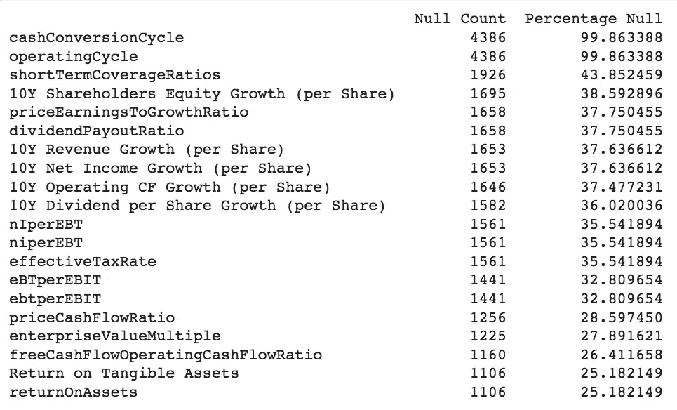

**表 2:** 数据帧中具有最高空值计数的二十个特征及其各自缺失值的百分比

功能“cashConversionCycle”和“operatingCycle”的空值百分比非常高。建议移除缺失值超过 70–75%的任何要素；由于这两列有超过 99%的空值，它们将被删除。

```
df1 = df1.drop('cashConversionCycle', axis=1)
df1 = df1.drop('operatingCycle', axis=1)
```

还剩下大量的空值；但是，我已经移除了缺失值百分比大到值得移除的要素。因为删除更多的特性不是最好的选择，所以我将使用 Scikit-learn KNNImputer，它使用 k-Nearest Neighbors 方法来填充丢失的值。

```
imputer = KNNImputer(n_neighbors=2)
df_filled = imputer.fit_transform(df1)
```

现在，所有缺失的值都已填充，我可以将数据放入模型中。

# 模型📈

```
X = df1.drop('Class',axis=1)
y = df1.loc[:,'Class'].valuesX_train, X_test, y_train, y_test = train_test_split(X, y, test_size=0.33, random_state=42)
```

在确定我的目标变量并将我的数据分成训练和测试之后，我可以开始构建我的模型。

## 决策图表

**使用决策树的理由:**我选择决策树作为我的模型之一，因为它能够在不同的分类阶段使用不同的特征子集和决策规则。虽然决策树通常容易过度拟合，但我希望通过修剪来减轻这种情况。

```
dt = DecisionTreeClassifier(criterion='entropy', random_state=0, max_depth=10)
dt.fit(X_train, y_train)
y_pred = dt.predict(X_test)
acc_testing = accuracy_score(y_pred, y_test)print("Accuracy = ",acc_testing)
```

结果:**精度= 0.6641379310344827**

## 随机森林模型

**使用随机森林模型的理由:**众所周知，随机森林模型可以很好地处理大量数据，这有利于此分析，因为数据集非常大。它们也不容易在分类中过度拟合，因为它们只考虑特征的子集，并且模型的最终结果依赖于所有的树。

```
from sklearn.metrics import recall_score
from sklearn.ensemble import RandomForestClassifiermodel_rf = RandomForestClassifier(n_estimators=100, random_state=42)model_rf.fit(X_train, y_train)predict_rf = model_rf.predict(X_test)recall_rf = recall_score(y_test, predict_rf, pos_label=1.0)precision_rf = precision_score(y_test, predict_rf, pos_label=1.0)print(' Accuracy = ', precision_rf)
```

结果:**精度= 0.7627551020408163**

## 逻辑回归

**使用逻辑回归的理由:**我选择了逻辑回归作为我的模型之一，因为它在分类方面非常有效，而且实现起来非常简单。不幸的是，这个数据框架比通常用于逻辑回归的要大，但是我可以通过增加“max_iter”来使我的模型适应这个情况。我也将使用 L2 正规化，以帮助防止过度拟合。

```
model = LogisticRegression(max_iter=500000000, penalty='l2', solver='liblinear')model.fit(X_train, y_train)y_pred = model.predict(X_test)log_acc = accuracy_score(y_test, y_pred)print('Accuracy =', log_acc)
```

结果:**精度= 0.6793103448275862**

## XGBoost

**使用 XGBoost 的理由:**出于各种原因，我选择了一个 XGBoost 分类器作为我的模型之一:

*   众所周知，它具有出色的速度和性能
*   它有各种各样的调谐参数
*   其核心算法是可并行的
*   在多种机器学习基准数据集上，该方法表现出比其他 ML 方法更好的性能

```
xgb_model = XGBClassifier(objective="binary:logistic", random_state=2020, learning_rate=0.1)xgb_model.fit(X_train, y_train)y_pred = xgb_model.predict(X_test)xgb_acc = accuracy_score(y_test, y_pred)print("Accuracy = ", xgb_acc )
```

结果:**精度= 0.7282758620689656**

## 装袋分级机

**使用 Bagging 分类器的理由:**我的许多模型都使用决策树。不幸的是，决策树容易过度拟合。此外，决策树通常不稳定，这意味着即使训练数据中非常小的变化也会导致非常不同的决策树模型。

然而，根据我的 *ITP 449:机器学习的应用*课堂笔记:“基于树的 Bagging 集成通过将每棵树拟合到训练数据的不同引导样本上来利用这些缺点。由于决策树的不稳定性质，使每棵树过度适应其特定的自举样本将导致具有不同树集合的集合。虽然每棵单独的树都过度拟合了它用来训练的数据，但由于这些不同的树，整体的方差减少了。”

```
model_bagging = BaggingClassifier(DecisionTreeClassifier(), n_estimators = 10, random_state = 42)model_bagging.fit(X_train, y_train)pred_bagging = model_bagging.predict(X_test)bagging_acc = accuracy_score(y_test, pred_bagging)print(' Accuracy = ', bagging_acc)
```

结果:**精度= 0.6841379310344827**

## 投票组合

**使用投票集成的理由:**我选择投票集成作为我的模型之一，因为该模型结合了多个模型的预测，从而有助于提高预测的准确性。

```
rfClf = RandomForestClassifier(max_depth = 10, n_estimators=200, random_state=0)
dtcClf = DecisionTreeClassifier(max_depth = 10)
logClf = LogisticRegression(max_iter=500000000, penalty='l2', solver='liblinear')
xgbClf = XGBClassifier()clf2 = VotingClassifier(estimators = [('rf',rfClf), ('dt',dtcClf), ('xgb',xgbClf), ('log', logClf)], voting='soft')
clf2.fit(X_train, y_train)
clf2_pred = clf2.predict(X_test)recall_voting = recall_score(y_test, clf2_pred, average="binary", pos_label=1.0)precision_voting = precision_score(y_test, clf2_pred, pos_label=1.0)vote_acc = accuracy_score(y_test, clf2_pred)print('Accuracy score', vote_acc)
```

结果:**精度= 0.7151724137931035**

# 型号选择📊

为了比较每个分类器的准确性并推断出最准确的一个，我将在一个带标签的条形图上绘制每个分类器的准确性。

```
plt.style.use('ggplot')data = {'Classifier':  ["DecisionTreeClassifier", "RandomForestClassifier", "Logistic Regression", "XGBoost", "Bagging Classifier", "Voting Ensemble"],'Acc': [acc_testing, precision_rf, log_acc, xgb_acc, bagging_acc, vote_acc ],}for count, el in enumerate(data['Acc']):
   data['Acc'][count] = el * 100acc_data = pd.DataFrame (data, columns = ['Classifier','Acc'])g = sns.barplot(x='Classifier', y='Acc', data=acc_data)
plt.xticks(rotation=45)
plt.ylabel('Accuracy %')
plt.title('Classifier Accuracy')for p in g.patches:
    g.annotate(format(p.get_height(), '.1f'),(p.get_x() +          p.get_width() / 2., p.get_height()),ha = 'center', va = 'center', xytext = (0, 9), textcoords = 'offset points')plt.show()
```

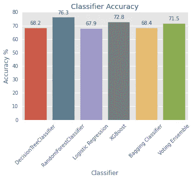

**图 5:** 每个分类器的准确度百分比

随机森林分类器具有最高的准确度% (76.3)，其次是 XGBosst (72.8)和投票集成(71.5)。为了确保随机森林分类器实际上是最有希望的模型，而不是简单地过度拟合，我将对每个模型进行交叉验证。

**随机森林分类器的交叉验证**

```
rfc_cv = RandomForestClassifier(n_estimators=100, random_state=42)scores = cross_val_score(rfc_cv, X_train, y_train, cv=10, scoring = "accuracy")print("Scores:", scores)
print("Mean:", scores.mean())
print("Standard Deviation:", scores.std())rfc_cv_mean = scores.mean()
```

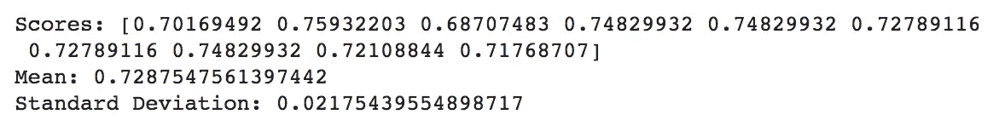

**XGBoost 分类器的交叉验证**

```
xgb_cv = XGBClassifier(objective="binary:logistic", random_state=2020, learning_rate=0.1)scores = cross_val_score(xgb_cv, X_train, y_train, cv=10, scoring = "accuracy")print("Scores:", scores)
print("Mean:", scores.mean())
print("Standard Deviation:", scores.std())xgb_cv_mean = scores.mean()
```

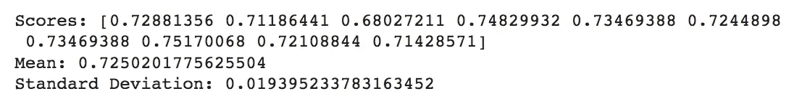

**投票组合的交叉验证**

```
rfClf = RandomForestClassifier(max_depth = 10, n_estimators=200, random_state=0)
dtcClf = DecisionTreeClassifier(max_depth = 10)
logClf = LogisticRegression(max_iter=500000000, penalty='l2', solver='liblinear')
xgbClf = XGBClassifier()clf2 = VotingClassifier(estimators = [('rf',rfClf), ('dt',dtcClf), ('xgb',xgbClf), ('log', logClf)], voting='soft')vote_cv = XGBClassifier(objective="binary:logistic", random_state=2020, learning_rate=0.1)
scores = cross_val_score(vote_cv, X_train, y_train, cv=10, scoring = "accuracy")print("Scores:", scores)
print("Mean:", scores.mean())
print("Standard Deviation:", scores.std())vote_cv_mean = scores.mean()
```

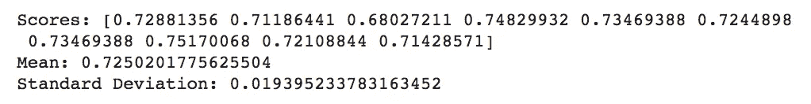

**各模型间交叉验证分数的比较**

```
data1 = {'Classifier':  ["RandomForestClassifier","XGBoost", "Voting Ensemble"],'Cross Validation Score': [rfc_cv_mean, xgb_cv_mean, vote_cv_mean],}cv_data = pd.DataFrame (data1, columns = ['Classifier','Cross Validation Score'])cv_data.sort_values(by='Cross Validation Score', ascending=False)
```

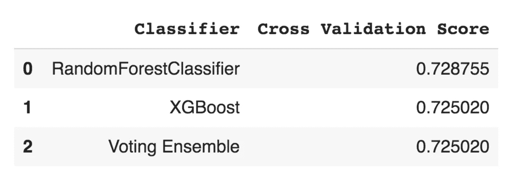

**表 3:** 以降序显示每个分类器的交叉验证分数

根据*表 3* ，随机森林分类器具有最高的交叉验证分数以及最高的准确性；因此，我将选择它作为我的最终模型。

## 模型微调

为了微调我的模型，我将使用 Scikit-learn 的 GridSearchCV 来优化我的模型的超参数。

```
from sklearn.model_selection import GridSearchCVparam_grid = {'max_depth': [10, None],'n_estimators': [10, 50, 200],'random_state':[0, 42, None]}grid = GridSearchCV(RandomForestClassifier(), param_grid, refit = True, verbose = 2,n_jobs=-1)grid.fit(X_train, y_train)grid_predictions = grid.predict(X_test)print(classification_report(y_test, grid_predictions))print(grid.best_params_)
```

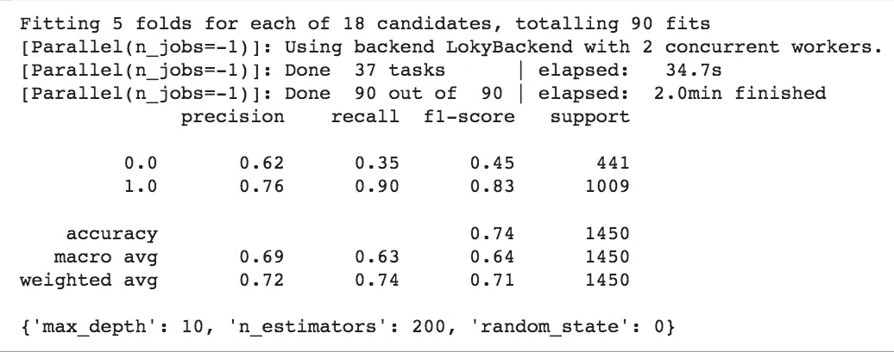

图 6

Scikit-learn 的 GridSearchCV 推荐以下超参数:

*   max_depth = 10
*   n _ 估计值= 200
*   随机状态= 0

因此，我将用这些超参数创建一个新的随机森林分类器。

```
after_cv_rf = RandomForestClassifier(max_depth = 10, n_estimators = 200, random_state = 0)
after_cv_rf.fit(X_train, y_train)
after_cv_predict = model_rf.predict(X_test)
recall_cv = recall_score(y_test, after_cv_predict, pos_label=1.0)
aftercv_precision_rf = precision_score(y_test, after_cv_predict, pos_label=1.0)print('Accuracy = ', aftercv_precision_rf)aftercv_rfc_cv = RandomForestClassifier(max_depth = 10, n_estimators = 200, random_state = 0)
scores = cross_val_score(aftercv_rfc_cv, X_train, y_train, cv=10, scoring = "accuracy")aftercv_cv_mean = scores.mean()print("Mean cross-validation score = ", scores.mean())
```


现在，我们可以将它们整合在一起:

```
data2 = {"Before Cross-validation":  [precision_rf,rfc_cv_mean ], "After Cross-validation": [aftercv_precision_rf, aftercv_cv_mean], "Type": ["Accuracy Score", "Mean Cross-validation Score"]}final_df = pd.DataFrame (data2, columns = ["Type", "Before Cross-validation","After Cross-validation"])final_df.set_index("Type")
final_df.head()
```

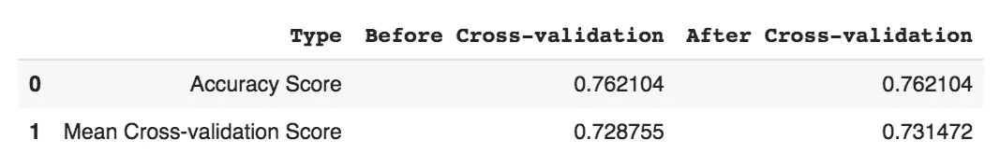

**表 4:** 对比交叉验证前后的准确度得分和平均交叉验证得分

虽然模型的准确性得分没有增加，但其平均交叉验证得分增加了，这意味着模型由于超参数优化而得到了改善(*表 4* )。

## 🧙‍♀️最终判决:

**随机森林模型具有 76.2%的准确率和 73.1%的交叉验证分数，是预测哪些股票值得购买的最佳机器学习模型**🎉*(至少对于这个数据集)*

# 🎁额外收获:一些见解

## 特征重要性

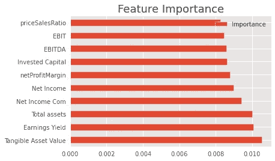

**图 7:** 根据我们的随机森林模型，预测股票“类别”的十个最重要的特征

根据*图 7* ，在该模型中，以下特征在预测股票是否值得卖出时最为重要:

1.  **有形资产价值:**“是公司经营中使用的有形的、可计量的资产。财产、厂房和设备等资产是有形资产。它们为公司提供生产商品和服务的手段，从而构成了公司业务的支柱。然而，由于有形资产是有形资产，自然发生的事故会损坏有形资产。”(通过 Investopedia)
2.  **收益收益率:**“指最近 12 个月的每股收益除以当前每股市价。收益收益率(市盈率的倒数)显示的是公司每股收益的百分比。”(通过 Investopedia)
3.  **总资产:**“个人、公司或国家拥有或控制的具有经济价值的资源的总和，预期它将提供未来的利益。”(通过 Investopedia)

## 行业洞察

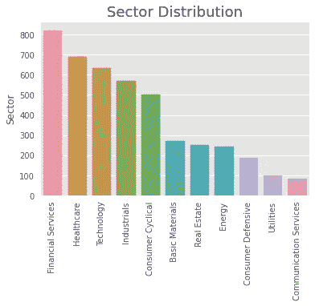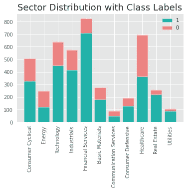

**图 8** :统计数据集中每个板块的股票数量。**图 9:** 每个扇区中“0”和“1”计数的堆积条形图。

从*图 8 和图 9* 中，我们可以看到数据集中最受欢迎的行业如下:

1.  金融服务
2.  卫生保健
3.  技术。

而数据集中最不受欢迎的部门如下:

1.  通信服务
2.  公用事业
3.  消费者防御

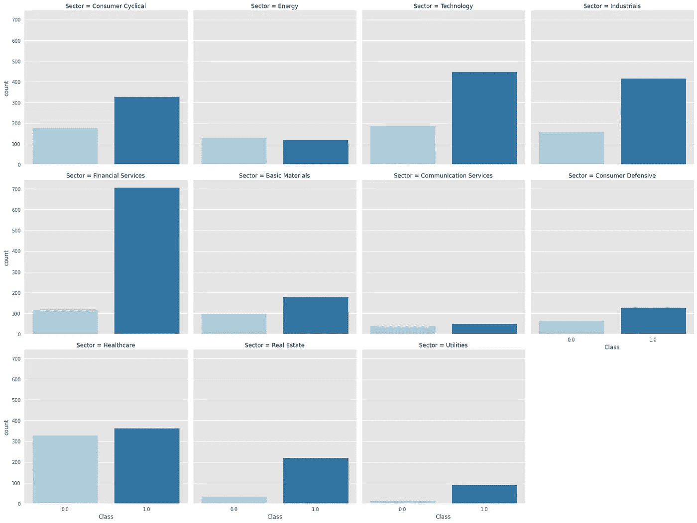

**图 10:** 每个扇区的“0”和“1”计数的分类图。

从*图 10* 中，我们可以看到每股值得购买股票比例最高的行业如下:

1.  金融服务
2.  房地产
3.  工业