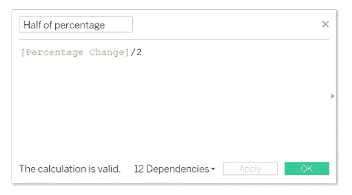
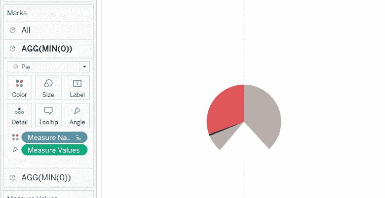
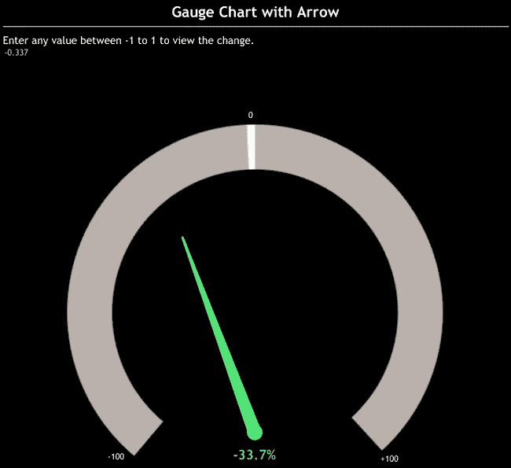

# 用仪表图在表格中显示 KPI 百分比变化

> 原文：<https://medium.com/analytics-vidhya/showing-kpi-percent-change-in-tableau-with-gauge-charts-d8d06c30e65e?source=collection_archive---------0----------------------->

描述百分比变化的仪表图(作者提供图片)

我回来了——带着另一张我在网上找不到的工作图。和以前一样，我将详细说明制作图表的步骤。

但首先让我们了解一下背景。

网上有大量的仪表图。但是要求以特定的方式反映 KPI 的百分比变化。如果变化为正，右侧应反映百分比，反之亦然。你可以参考标题上面的主图。所以，让我们从我如何实现同样的目标开始。

***第一步*** :准备虚拟数据集。我们将使用这些数据来准备我们的仪表图。<参见图 1 >。

图 1(作者图片)

***第二步*** :现在让我们按顺序列出我们的计算。首先，我们将百分比变化字段减去一半。<参见图 2 >。

图 2(作者图片)

***第三步*** :创建一个计算字段‘1。一个。该字段将反映负百分比变化，并显示在左侧。<参见图 3 >。

图 3(作者图片)

***第四步*** :创建计算字段‘1。b '。该字段将反映左侧的剩余部分。<参见图 4 >。

图 4(作者图片)

***第五步*** :创建计算字段‘1。c '。该字段将反映正百分比变化，并出现在右侧。<参见图 5 >。

图 5(作者图片)

***第六步*** :创建计算字段‘1。d '该字段将反映右侧的剩余部分。<参见图 6 >。

图 6(作者图片)

***第七步*** :创建一个计算字段‘1。e '此字段的目的是指定我们将创建的四分之三圆两端之间的宽度。您可以更改该值，稍后自己查看差异。<参见图 7 >。

图 7(作者图片)

***第八步*** :创建一个计算字段‘1。第一针。这将表明负百分比区域的结束。<参见图 8 >。

图 8(作者图片)

***第九步*** :创建计算字段‘1。第二针。这将指示正百分比变化区域的终点。<参见图 9 >。

图 9(作者图片)

***第十步*** :创建一个计算字段‘Dummy’。该字段的作用是将百分比变化作为一个标签。<参见图 10 >。

图 10(作者图片)

***步骤 11*** :现在让我们开始在工作表区域放置这些字段和其他字段。

a.在上面的列栏中，键入 MIN(0)两次，并在“全部”的标记卡中选择下拉列表中的饼图。

b.将“指标”字段放在“过滤器”窗格中，然后选择“A”。

c.拖动“过滤器”窗格中的“测量名称”并选择，如下所示。<refer fig="" a="">。</refer>

图 11 a(作者图片)

d.移动详细信息卡中的“测量值”和 top-MIN(0)色卡中的“测量名称”。并且在同一张卡中，增加饼状图的大小。然后在屏幕右侧的色卡中，确保计算字段的顺序如图所示。此外，确保在此阶段字段的颜色如图所示。以后你可以根据自己的需要改变颜色。<refer fig="" b="">。</refer>

图 11 b(作者图片)

e.现在将如上图所示的“测量值”从细节卡更改为角度。饼图将会发生如下所示的变化。<refer fig="" c="">。</refer>

图 11 c(作者提供的图片)

f.单击上面列栏中的一个最小值(0)上的双轴。并将第二个饼图的颜色改为白色。<refer fig="" d="">。</refer>

图 11 d(作者提供图片)

g.现在将“虚拟”字段放在颜色选项卡中，将“百分比变化”字段放在第二个饼图的标签卡中。根据您的选择增加标签的大小。并略微增加第二个饼图的大小。<refer fig="" e="">。</refer>

图 11 e(作者图片)

h.通过将网格线、零线、行分隔线和列分隔线删除为无来清除工作表，取消选中上面列栏中 MIN(0)的“显示标题”和“包含在工具提示中”选项。

移除所有不需要的工具提示和标签。

j.现在，您可以右键单击筛选器窗格中的度量字段，并选择 Show filter。选择不同的指标，并根据其值查看图表的变化。

您可以查看。twbx 文件[此处](https://public.tableau.com/app/profile/priya.yogendra/viz/GaugeChartofchange/GaugewithpercentageChange?publish=yes)。此外，在文件中，我已经包括了另一种类型的带箭头的仪表图。这是我从 Toan Hoang 的博客上截取的，并对其进行了定制。<参见图 11 >

图 11(作者图片)

# **关注**

我想在这里提出的一个问题是，如果 KPI 中的正百分比变化被认为是不好的，该怎么办。例如，运营费用的增加从来都不是好事。在这种情况下，我建议交换颜色来反映这种担忧。设置字段“1”的颜色。“c”为红色，而“1”为红色。' a '蓝色或绿色。

# **其他参考资料**

这样我们就完成了仪表图。我现在加入了一些其他作者的博客链接，这些链接是关于我们还可以做什么或者用仪表图显示什么的。

1.[https://www . flerlagetwins . com/2017/07/creating-NPS-gauges-in-tableau _ 87 . html](https://www.flerlagetwins.com/2017/07/creating-nps-gauges-in-tableau_87.html)作者:Ken Flerlage

2.[https://tableau.toanhoang.com/gauge-chart-with-arrow/](https://tableau.toanhoang.com/gauge-chart-with-arrow/)由 Toan Hoang

3.[https://www . anmolparimoo . com/post/gauge-charts-speedmeter-in-tableau-without-custom-data](https://www.anmolparimoo.com/post/gauge-charts-speedometer-in-tableau-without-custom-data)作者 Anmol Parimoo(我的过程的基础)。

4.安摩尔·帕利穆的《https://www.anmolparimoo.com/post/nps-gauge-chart-tablea》

如果你的要求不同，一定要阅读它们，并进行你自己的混搭或即兴表演。