# Shuddi:一个智能机器人，让你的不和谐频道免于亵渎

> 原文：<https://medium.com/analytics-vidhya/shuddi-a-smart-bot-that-keeps-your-discord-channel-free-of-profanity-5c9cbf30641?source=collection_archive---------12----------------------->

图片提供:[联合国儿童基金会](https://www.unicef.org/end-violence/how-to-stop-cyberbullying)

# 摘要

欺凌并不新鲜。新的是互联网，以及我们与世界各地的朋友、家人和陌生人互动变得多么容易。互联网，作为现代世界不可或缺的一部分，也给个人带来了一种模糊感——尤其是恶霸。据 T2 估计，60%的青少年在过去的 10 年中曾遭受过网络欺凌。由于这个问题在很大程度上仍然没有解决，而且经常被忽视，这个项目旨在激励人们积极主动地提出新的方法，使互联网对每个人都更加安全。

在这个项目中，我们将构建一个[不和谐](https://discord.com/)机器人——shud dhi(在[泰卢固语](https://en.wikipedia.org/wiki/Telugu_language)中的意思是‘纯洁’)，它将能够调节它加入的频道，并积极劝阻和禁止发送仇恨或亵渎信息的用户。Shuddhi 将能够记录过去违反规则的用户，并将对屡犯者采取严厉行动。

**关键词** : *神经网络*， *DBMS* ， *SQL* ，*不和谐*， *Bot* ，*网络欺凌*

# 快速演示

*   让我们首先来看一个现场演示，演示 Shuddi 如何在实际的群聊环境中工作。

# 简要概述

对整个项目有一个 10，000 英尺的视角是很重要的，这样我们就能了解事情的本质。首先，我们需要一个分类器，它可以识别一个消息是否包含亵渎或仇恨的意图，或者它是否是干净的。仇恨言论分类器将成为我们机器人的关键，因为它将完成几乎所有的繁重工作。在我们完成这些之后，就开始建造真正的机器人本身。这还包括编写用户可以在聊天中键入的特殊命令，然后将我们的分类器集成到其中。我们还需要维护一个数据库，因为我们需要跟踪用户和他们的违规行为。需要解决的问题很多，因此，该项目分为三个部分:

*   **第一部分** : *构建分类器*
*   **第二部分** : *创建数据库及其处理程序*
*   **Part-3** : *构建最终机器人*

**注意**:所有的代码都可以在 [GitHub 库](https://github.com/yogeshchandrasekharuni/shuddi)上获得。

# 第 1 部分:构建分类器

**第一部分**内容:

1.  *简介*

*2。数据分析*

*3。建模*

*4。总结*

# 介绍

在这一部分，我们的目标是建立一个预测模型，可以识别明确的或带有仇恨意义的信息。

**问题陈述**

*   给定一条英语消息，判断该消息是否包含露骨的词语或包含仇恨的意图。

**约束条件**

*   ***延时要低。*** 这是因为仇恨信息需要尽快处理，以尽量减少其后果。
*   ***错误分类一个正数据点可能代价高昂*** 。如前所述，由于不处理仇恨信息的后果可能会很严重，所以当务之急应该是尽量减少误判的数量。
*   ***可解释性不重要*** 。我们的模型错误地将干净的消息标记为可恨的后果并不高。对于更复杂的模型，可解释性可以被允许折衷。

# 数据分析

在我们开始任何建模之前，首先非常好地理解我们的数据集是至关重要的。

**数据集**

对于手头的任务，我们使用来自 [Kaggle](https://www.kaggle.com/vkrahul/twitter-hate-speech?select=train_E6oV3lV.csv) 的“ *Twitter 仇恨言论*”数据集。我们将这个数据集加载到 Pandas 数据框架中进行进一步分析。

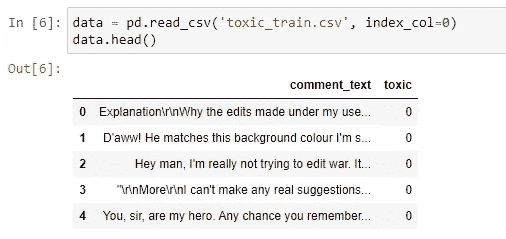

数据帧的头部

这个数据集包含大约 16 万条推文，以及人类标注的标签，这些标签表明推文是否有毒。

这个数据集适合我们的任务吗？

*   你可能会问，这是正确的数据吗？你可能认为不是，因为这个数据集包含推文，然而，我们的最终目标是确定直接或群体消息是否有毒。谢天谢地，答案是肯定的。这个数据集非常适合我们，因为推文很像信息。例如，在上面数据帧的最后一条推文中，一个用户问*“先生，你是我的英雄。你还记得在哪一页吗？”。你可能会注意到，这条推文的结构与普通信息的结构非常相似。*

## 数据清理

在这一部分中，我们将为进一步的分析和建模准备好数据。

**拆分数据**

*   我们将数据分为训练-测试-验证，60%的数据点用于训练，20%用于测试和验证。这是为了防止任何可能的数据泄漏源。

**删除无效行**

*   我们首先删除任何具有空值的行和其他重复的行(如果有的话)。

**去除噪音**

*   我们做的另一个数据清理决定是删除所有少于 2 个单词的数据点。做出这种设计选择是因为只有一个单词(或零)的消息通常只是噪音，会使我们的模型失去意义。
*   另一个噪音来源是 tweets，与真实的字母相比，它有更多的数字或其他非字母字符。例如，像“42 India-0780–23341”这样的推文通常没有任何意义，也没有为我们的模型添加任何信息。因此，对于任何字母数占推文中所有字符的百分比小于既定容差的推文，我们只需将其删除。通过这样做，我们丢失了大约 1000 个数据点(大部分是有噪声的)。

**文本预处理**

在我们处理和分析推文之前，我们首先需要清除任何 HTML 标签，不必要的或无效的字符。为此，我们编写了自己的函数:

*   *从 tweet* 中删除所有特殊字符和数字，因为随机数和特殊字符不会给我们的模型添加任何信息。
*   *删除停用词*，因为它们在两个类中都是通用的，因此对预测没有帮助。
*   *删除所有 HTML 标签和其他非英语单词*
*   *将整篇推文转换成小写*
*   *执行* [*词汇化*](https://www.datacamp.com/community/tutorials/stemming-lemmatization-python) *:* 词汇化与词干化不同，它适当地减少了词尾变化，确保词根属于该语言。

## 分析

现在我们已经清理了数据集，我们可以开始理解它了。

## **目标**

让我们看看我们的目标变量是如何分布的

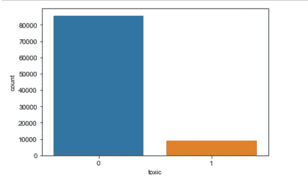

*   我们注意到严重的阶级不平衡。我们将在建模过程中考虑这一点。

## **推文**

**推文长度**

*   这一特征表明了特定 tweet 中出现的字符数。假设是，一条推文的长度可能是其性质的指标。我们稍后将验证或否定这一点。

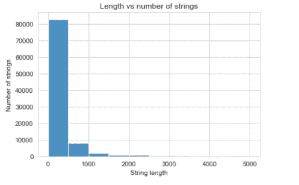

*   从图表中，我们可以看到推文长度的帕累托分布。

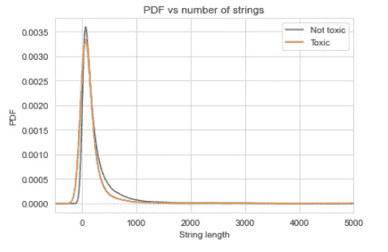

*   在绘制了正面和负面类别的独立 pdf 后，我们注意到一条推文的长度对其毒性的影响非常小，如果没有影响的话。

**一条微博的平均字数**

平均单词长度对一条推文的毒性有影响吗？我们来调查一下。

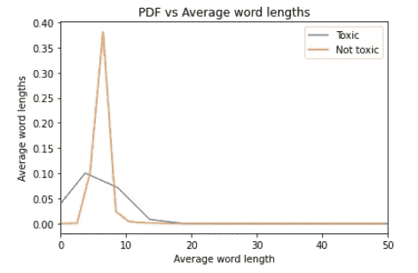

*   我们注意到分类分离的 pdf 遵循一个非常不同的分布。
*   平均长度为 5-7 个单词的推文更有可能是无毒的，而不是有毒的

**免责声明** : *在文本分析过程中，由于项目的性质，我们必然会发现冒犯性或露骨的词语。建议读者自行判断。*

**最常用词**

让我们想象一下这两个班级中最常见的单词

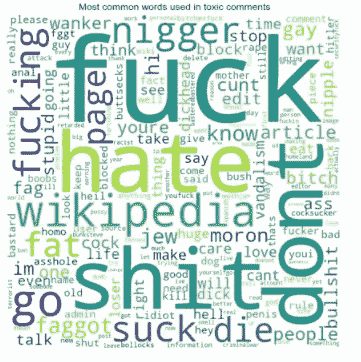

无毒与有毒信息的常用词

*   可以看出，很明显，不同的班级在常用词上有很大的差异——这是意料之中的。这是一个很好的暗示，我们需要一个健壮的 d 维单词表示，它将能够很好地捕捉单词之间的差异。

**最常用词的频率**

现在我们知道了最常见的单词是什么，让我们看看它们是如何分布的。

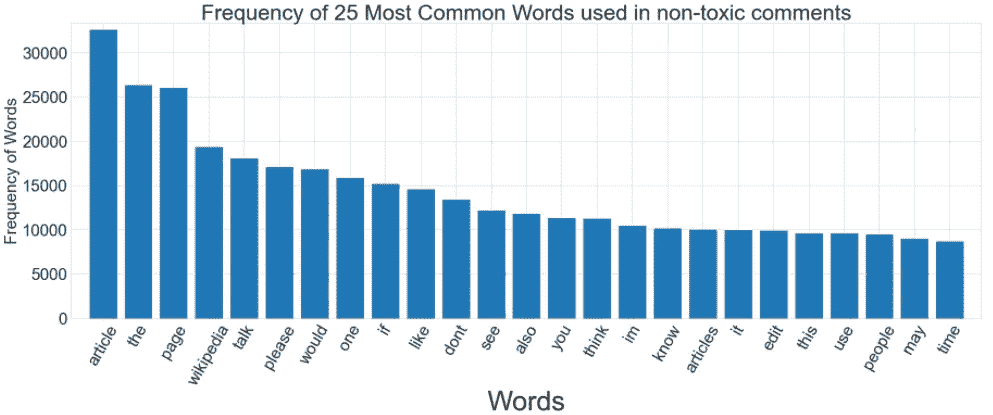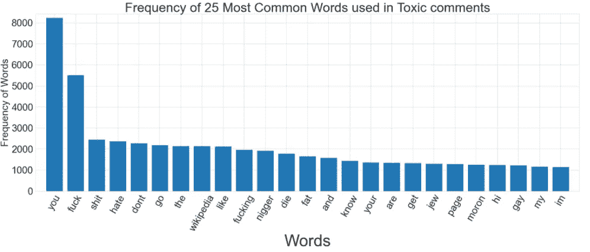

*   我们注意到，在不同的班级中，差异很大的单词也有类似的分布。

## 向量化文本

*   由于单词之间的差异可能非常大，所以设计选择不使用像单词袋这样的表示，而是使用密集和健壮的 TF-IDF 加权 word2vec 表示。我们使用一个在谷歌新闻数据集上预先训练过的模型。
*   在这一步之后，我们最终为我们的每条推文提供了一个 300 维的表示。我们还添加了两个额外的指标——推文长度和推文中的平均单词长度，并将我们的每个数据点表示为一个密集的 302 维向量。

## 可视化高维数据

*   为了了解我们的数据在 302 维中的样子，让我们用 2 维和 3 维来表示它。

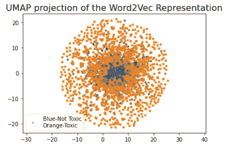

2D 代表

*   在 2 维中，我们看到我们的数据点形成一个圆，大多数积极的数据点靠近圆周，而大多数干净的信息更靠近中心。
*   然而，我们无法清楚地看到这两个阶层之间的距离。让我们在三维空间中可视化我们的数据集，以便获得更好的想法。

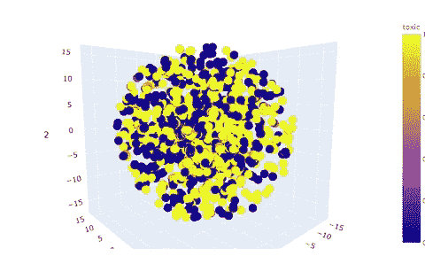

300 维 w2v 表示的 3D 投影

*   我们看到，在 3D 中，我们的数据点形成了一个球体，其中大多数数据点彼此非常接近。请注意，黄色数据点是有毒消息，蓝色数据点是干净的。从上面的 3D 图中可以清楚地看到，最终的决策面需要是一个[超球体](https://en.wikipedia.org/wiki/N-sphere)。

# 建模

*   为了给我们的任务找到合适的模型，我们将建立不同复杂程度的模型。

## 韵律学

在我们开始任何建模之前，建立一个我们将最大化(或最小化)的性能指标是至关重要的。这是因为虽然一些模型可能获得很好的准确性，但它们获得的对数损失很差。

**关键绩效指标**

我们任务的 KPI 被选为 F1 分数，这是精确度和召回率的调和平均值。这是因为我们希望我们的模型有最大数量的真阳性和最小数量的假阳性。

*   精确将确保我们的真阳性率高，而回忆将确保我们的假阴性率低。使用本质上是这两者的平均值的度量标准将意味着我们将获得两个世界的最佳结果。因此，我们选择 F1，并且对于我们建立的所有模型，我们将尝试最大化这个分数。

## 随机模型

*   一个随机模型正如其名字所暗示的那样。它返回一个随机预测。我们将构建两个随机模型，一个返回基于均匀分布的预测，另一个使用类别先验，即初始类别不平衡。因为对于每个正数据点，我们有大约 9 个负数据点，所以我们的第二个随机模型将在 90%的情况下返回 **0** ，在 10%的情况下返回 **1** 。

*   我们也有对数损失和 AUC 的模型回报概率。现在，让我们看看在最坏的情况下我们的度量应该是什么样子。

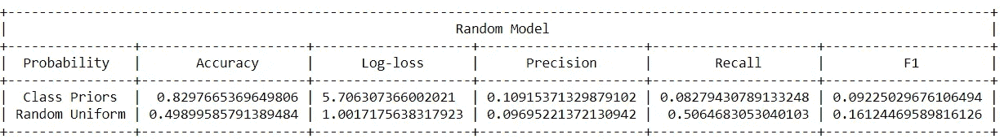

*   我们现在看到，在最坏的情况下，我们的 KPI-F1 分数应该不低于 0.16，我们的准确率应该至少为 82%。

## 基于距离的模型

*   在实现了我们的数据集的表示之后，认为简单的超平面拟合模型可能会产生良好的结果似乎是不合理的。然而，尽管我们的数据在 3 维空间中不是线性可分的，但是在 302 维空间中可能存在一个超平面来分离我们的类。让我们调查一下是不是这样。

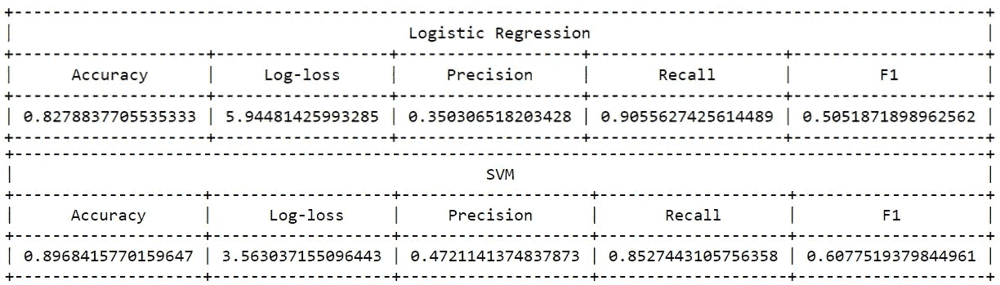

*   在建立了两个模型之后，我们注意到两个模型都有很好的召回率，但是以精度为代价。由于高召回率，F1 分数看起来仍然不错，但对于这样的数据集，还有更适合的模型。

## 基于树的集成模型

*   为了得到一个超球体作为决策边界，我们需要模型对数据点的分布没有任何天真的假设。逻辑回归和线性 SVM 假设数据大多是线性可分的。然而，基于树的模型没有这样的假设，可以很好地适应非线性数据集。
*   在平衡我们的数据集之后，我们建立了两种模型:随机森林和梯度增强决策树，这两种模型都是决策树的集合。

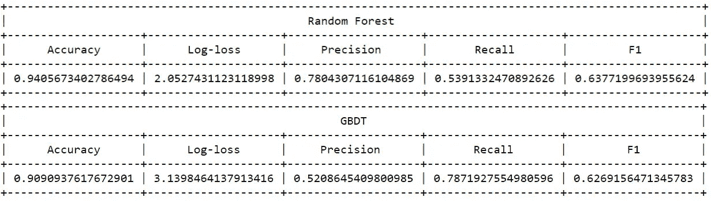

*   在构建了两个集成之后，我们看到了比基于距离的模型更好的性能。我们看到两种车型的精度都有很大提高，F1 的总成绩也有相当大的提高。

然而，总体增量并没有我们预期的那么大。会不会是数据集中的底层函数比我们最初想象的要复杂和非线性得多？

## 神经网络

*   由于我们简单的基于距离的模型失败了，并且我们的基于树的集成仅比它们稍好，我们将建立一个健壮的神经网络，它将能够完美地适应我们数据集中的潜在非线性。
*   在这一部分，我们将构建一个深度多层感知器(MLP)。

**架构**

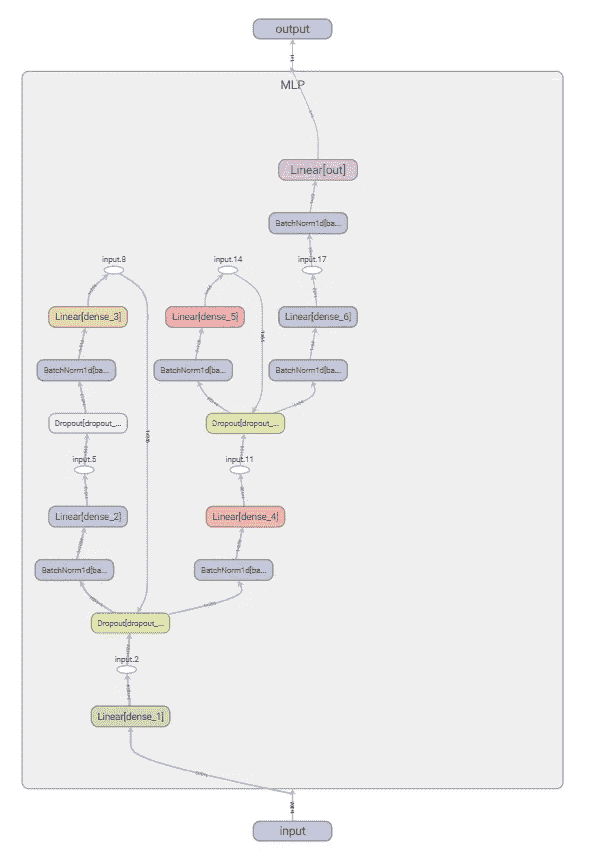

模型的架构

*   我们总共有 7 个密集层，看起来像:
*   密集 _1(302，1024) ->密集 _2(1024，512) ->密集 _3(512，256) ->密集 _4(256，128) ->密集 _5(128，64) ->密集 _6(64，32) ->密集 _7(32，1)
*   除了最后的密集层之外，所有的密集层都有一个 ReLU 激活，并被批量规格化。除了最后 2 层之外，所有层都有漏失。

**层层**

*   我们总共有 6 个**密集、完全连接的层**，每一层都由 ReLU 激活。与这些密集图层相关联的权重通过反向传播来拟合数据集。
*   我们还有 3 个**脱落**层，每个层具有不同的保留概率。漏失通过随机“关闭”*% p*密集层中存在的总神经元来防止我们的模型过度适应训练数据。这通过随机化提供了规律性，并帮助我们的模型更好地概括。
*   对于我们的每个密集层，我们也有一个**批量标准化**层。这些层有助于使我们的小批量的平均值和标准偏差分别接近 0 和 1。批量规范化也给我们的网络带来了额外的规范化。
*   最后一层也是一个**密集层**，它将维度从 32 降低到 1，但是，这个神经元没有 ReLU 激活。这是我们的模型的输出，因为我们所做的本质上是一个二进制分类，我们将在稍后对这个神经元应用一个 sigmoid 函数。

**设计网络**

*   既然我们理解了模型的架构，我们就可以开始训练它了。

**构建数据加载器**

*   在开始训练模型之前，让我们首先构建所有必要的数据加载器，并定义一些模型参数。

*   **损失函数**:因为这是一个二元分类，我们使用二元交叉熵
*   优化器:我们使用 Adam(学习率为 1e-3)，因为它通常比随机梯度下降或 RMSprop 表现得更好。
*   **批量大小**:这是特定于 GPU 的。我将在 8GB RTX 2060 超级 GPU 上训练这个网络，因此批量为 512。

**培训**

*   现在，我们终于可以开始训练我们的网络了

*   大约 40 个周期后，我们得到大约 0.05 的 BCE 损失。现在，让我们通过计算 KPI 和其他指标来评估我们的模型。

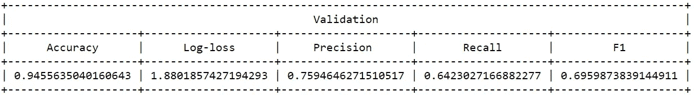

*   我们获得了更好的 F1 分数，大约为 70%,准确率为 75%,对未知数据点的召回率为 64%。我们的模型非常符合基本功能。

## 模拟判决

*   在我们的神经网络优于我们之前的每一个模型之后，我们最终选择这个 MLP 作为我们的最终分类器。我们通过构建两个类来为部署做好准备——一个预处理消息，另一个实现我们的最终分类器。

*   上面的类是我们将在最终的机器人运行时使用的。

# 摘要

*   在这一部分中，我们的任务是构建一个能够识别邮件是否有毒的分类器。
*   我们从一个数据集开始，该数据集包含推文以及表明其毒性的标签。我们首先分析了这些推文，以便更好地理解它们。然后，我们围绕这些推文构建了一些新功能，让我们的模型更有活力。
*   在分析过程中，我们将 302 维的数据投影到 3 维来可视化。然后我们意识到我们的数据是超球形的，我们的决策面需要非常复杂。
*   为了给我们的数据找到合适的模型，我们尝试了两个基于距离的模型，如 LogisticRegression 和线性 SVM 模型，这两个模型都产生了不令人满意的结果。
*   我们还尝试了几个基于树的集成模型，它们工作得相当好，但我们意识到，与简单的线性模型相比，预测能力的增加并不明显。
*   然后，我们从头开始构建了一个强大的神经网络，并在我们的数据集上训练它。这款 MLP 在未知数据点上的 F1 得分为 70%,远远高于我们之前的所有车型。
*   我们使用这个网络作为最终的分类器，并构建了几个在运行时对我们有帮助的类。

# 第 2 部分:创建数据库及其处理程序

**第二部分内容:**

1.  *简介*
2.  *设计数据库*
3.  *构建处理程序*
4.  *总结*

## 介绍

在我们开始实际构建数据库之前，让我们首先理解为什么我们首先需要一个数据库。我们的机器人应该能够对代码违反者采取行动，但如果直接将初犯的成员踢出去，那就有点过分了。我们应该想出一种机制来跟踪用户和他们过去的违规行为。一种方法是只使用一个文件。每次出现代码违规时，打开文件，从文件中读取，采取必要的措施，记录到文件中，然后关闭文件。然而，这既慢又容易出错，尤其是对于拥有大量用户的不和谐服务器。

使用一个专用的数据库来完成这个任务是最理想的，因为 SQL 查询比一遍又一遍地从磁盘上打开一个文件要好得多。对于这个项目，我们将使用与 Python 打包在一起的 SQLite。

## 设计数据库

既然我们知道了为什么我们需要一个数据库，让我们开始实际设计它。我们的数据库应该能够存储以下信息:

1.  **用户 ID** :这将是 [*主键*](https://www.w3schools.com/sql/sql_primarykey.ASP) ，因为 user_id 对每个 discord 用户都是唯一的。
2.  **用户名**:数据库将不得不存储这些信息，因为我们的机器人发出的任何回复，为了清晰起见，必须有收件人的名字。
3.  警告级别:因为在用户第一次违反规则时就把他们踢出去太过分了，我们将记录他们违反规则的次数。如果他们已经有两次警告，但仍然继续他们的行为，机器人将从服务器上删除他们。
4.  **先前警告**:让我们也存储最后一次向用户发出警告的时间。如果用户在超过 24 小时内没有收到警告，让他们摆脱困境似乎是合理的。因此，如果用户在过去 24 小时内没有违反任何规则，机器人将删除所有的警告。
5.  **之前的道歉**:我们的机器人也会容纳道歉。如果用户违反了规则并为此道歉，机器人将删除用户的所有警告。然而，我们需要记录用户最后一次道歉的时间，否则他可能会违反规则，然后立即道歉，这可能会无限期地继续下去。如果用户从未道歉或在过去 24 小时内没有道歉，我们将只接受道歉。

## 构建处理程序

既然我们已经成功地设计了适合当前任务的数据库，我们就可以构建处理程序了。

这个处理程序将负责查询、存储和检索数据库中的信息。让我们讨论一下我们的处理程序需要做的操作。

1.  **创建表格**:这是一个显而易见的。我们的处理程序将需要连接到数据库，并创建如上所述的表，如果它还不存在的话。
2.  **获取并设置警告级别:**我们需要编写能够检索并存储每个 user_id 的警告级别的查询
3.  **获取并设置先前的警告和道歉时间戳**:还需要设计能够检索并存储用户收到警告并道歉的最后时间戳的查询。

现在让我们构建处理程序。

*   上面的处理程序类 *UsersDataHandler* 将处理所有的查询。

## 摘要

在这一部分，我们首先理解了为什么我们首先需要一个数据库。然后我们围绕我们的需求设计一个数据库，最后构建一个处理所有查询的处理程序类。

# 第 3 部分:构建 bot

**第三部分内容:**

1.  *简介*
2.  *命令*
3.  *处理程序*
4.  *回复*
5.  *总结*

## 介绍

在过去的两节中，我们构建了分类器和数据库。现在，我们终于可以开始建造机器人了。为了构建这个机器人，我们将使用非常棒的 [discord.py](https://discordpy.readthedocs.io/en/stable/) 库。概括地说，机器人应该具有以下功能:

*   **对脏话** : *发出警告。*
*   **当用户被发出足够的警告** : *踢用户。*
*   **如果用户在过去 24 小时内没有违反任何规则** : *删除他们的警告。*
*   **当用户在 24 小时内第一次道歉时** : *删除他们的警告。*
*   **当有警告的用户在 24 小时内第二次道歉** : *拒绝他们的警告。*
*   **回复** : *机器人需要向用户发出不重复且合适的回复。*

## 命令

该机器人将接受以下命令:

*   **！list_commands:** 回复当前支持的命令列表。
*   **！who** :回复一些关于 bot 的基本信息。
*   **！警告**:如果用户在过去被警告过一次或多次，则进行回复。
*   **！抱歉**:要么接受这个道歉，要么拒绝。
*   **！感谢**:让机器人感到被欣赏。:)
*   **！退出**【仅限管理员】:关闭机器人。

很好，现在让我们用代码实现它

## 经理人

我们已经准备好了命令，但是机器人还不知道如何响应它们。为此，我们有一些在特定命令上调用的方法。一些处理程序是:

*   **关于新消息**:在出现新消息时，我们的机器人首先检查该消息是否是命令，然后检查该消息是否是亵渎的。如果这是亵渎，它会调用我们的下一个处理程序——仇恨言论。
*   **关于仇恨言论**:在检测到用户违反了代码时，机器人会向他们发出警告，或者如果他们已经有过警告，机器人会将他们踢出服务器。
*   **道歉时**:当用户使用！抱歉，我们的机器人将检查他们是否在过去 24 小时内已经道歉。如果他们这样做，它拒绝他们的道歉，否则，它接受并删除他们所有的警告。
*   **开警告**:当用户使用！警告命令，我们的机器人使用处理我们数据库的 *UsersDataHandler* 类来检索用户过去已经得到的警告数量。

让我们看看代码中的这些处理程序。

## 答复

在这个阶段，我们的机器人有一个数据库，一个分类器，所有需要的命令，甚至这些命令的处理程序。我们的机器人现在需要做的就是向我们的用户发送类似人类的响应。为此，我们创建一个单独的文件，包含所有预先写好的回答。让我们来看几个样本回复

*   我们为每个事件随机选择一个回复。所有的回复都存储在一个 pickle 文件中，机器人在启动时会读取这个文件。

## 摘要

在这一部分，我们的任务是从头开始构建一个机器人。我们必须编写可接受的命令，为它们设计处理程序，将我们的分类器集成到机器人中，并在机器人和数据库之间建立连接。完成所有这些之后，我们还设置了一个回复文件，其中包含了我们的 bot 当前支持的所有预先设计的回复。做完所有这些，我们的机器人终于准备好了。

首先，我们简单地做 *python launcher.py* 来启动机器人。

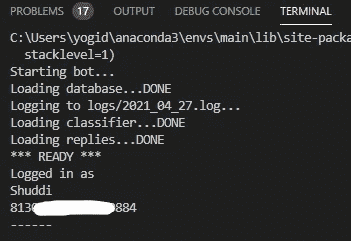

机器人启动

*   一旦机器人被邀请进入服务器并启动，我们就会看到它在线并准备好拯救世界，以防恶霸破坏群聊。

# 结论

在这个项目中，我们的目标是建造一个智能机器人，能够检测仇恨言论并惩罚违法者。我们通过首先设计一个深度神经网络来实现这一点，该网络在看不见的数据点上获得了 70%的 F1 分数。我们还建立了一个数据库，能够非常快速地检索信息，并帮助我们跟踪用户及其违规行为。然后，我们通过设计命令，在我们的机器人和数据库之间建立连接，并将我们的神经网络集成到机器人中，来构建最终的机器人。

最后，舒迪迪准备好了，将立即解放恶霸的世界！嗯，不，不完全是。网络欺凌不是一个人(或一个机器人)可以解决的问题。需要群众的关注。要了解更多关于如何帮助打击网络欺凌的信息，[点击此处](https://www.unicef.org/end-violence/how-to-stop-cyberbullying)。

要知道如何设置 Shuddi 并在自己的服务器上使用它，请通读 [GitHub 库上的**用法**部分。](https://github.com/yogeshchandrasekharuni/shuddi)

感谢您的阅读，如有任何更正、建议或问题，请通过电子邮件联系我:*yogeshchandrasekharuni@gmail.com*或登录 [LinkedIn](https://www.linkedin.com/in/yogesh-chandrasekharuni-2a8895191/) 。