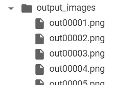

# 使用 Colab 中的 OpenPose 进行手语检测

> 原文：<https://medium.com/analytics-vidhya/sign-language-detection-using-openpose-in-colab-a2f364e3fcd2?source=collection_archive---------3----------------------->

如何使用 Google [Colab](https://research.google.com/colaboratory/) 中的 OpenPose 检测手语

[在 Colab 中设置](#595d)
[TensorFlow 姿态](#43ac)
[从网络直播图像推断](#07e2)
[结论](#0c41)
[参考](#08c7)

有听力障碍的人用手语交流。 [OpenPose](https://github.com/CMU-Perceptual-Computing-Lab/openpose) 是一个由 CMU 开发的开源库，可以检测包括面部和手部动作在内的人体姿态。很酷的应用程序是用 OpenPose 开发的。在本文中，我想展示如何在 Google Colab 环境中使用 [OpenPose](https://github.com/CMU-Perceptual-Computing-Lab/openpose) 进行实验和原型制作。

# Colab 中的设置

为什么是 Colab？在本地机器上运行实验的设置需要处理一些虚拟环境和依赖关系。另一方面，Colab 总是干净的，像 TensorFlow 这样受欢迎的库已经安装了。最重要的是，它带有一个免费的 GPU，这是一个巨大的优势。

整个代码样本在这里[分享。](https://github.com/changsin/DL/blob/main/notebooks/openpose_sign_language.ipynb)

1.  **安装和构建 OpenPose:** 安装和构建 OpenPose 及其依赖项的步骤摘自 [Tugstugi](https://github.com/tugstugi/dl-colab-notebooks/blob/master/notebooks/OpenPose.ipynb) 的笔记本。

*   git 克隆 CMU 开放姿态

```
!git clone https://github.com/CMU-Perceptual-Computing-Lab/openpose.git'
```

*   安装依赖项

```
!apt-get -qq install -y libatlas-base-dev libprotobuf-dev libleveldb-dev libsnappy-dev libhdf5-serial-dev protobuf-compiler libgflags-dev libgoogle-glog-dev liblmdb-dev opencl-headers ocl-icd-opencl-dev libviennacl-dev
```

*   构建:这将需要几分钟时间。

```
!mkdir build && cd build && cmake .. && make -j`nproc`
```

**2。下载 youtube 视频或上传自己的视频:**您可以使用 [youtube-dl](https://youtube-dl.org/) 下载 youtube 视频，如示例命令所示。用实际的 youtube id 替换$youtube_id。例如，对于 youtube 链接:[https://youtu.be/VjainPzPo2k](https://youtu.be/VjainPzPo2k)，youtube id 是[vjainzpo 2k](https://youtu.be/VjainPzPo2k)。

手语演示服务

```
!youtube-dl -f 'bestvideo[ext=mp4]' --output "youtube.%(ext)s" [https://www.youtube.com/watch?v=$youtube_id](https://www.youtube.com/watch?v=$youtube_id)
```

3.**使用 OpenPose 进行姿态估计:**视频下载后，通过 OpenPose 进行处理，得到关键点。最多可检测 135 个关键点。然而，默认情况下，CMU OpenPose 不会注释手语检测所需的面部和手部姿势。要将它们包括在关键点检测中，请添加“手”和“脸”参数，如下所示:

```
.[/build/examples/openpose/openpose.bin](https://colab.research.google.com/github/changsin/DL/blob/main/notebooks/openpose_sign_language.ipynb#) --face --hand --video ../video.mp4 --write_json ./output_json/ --display 0 --write_video ../openpose.avi
```

指定了两个输出。

*   write_json:将自动注释结果写入一个 json 文件。对于视频的每一帧，都会生成一个 JSON 文件。
*   write_video:编写包含姿势注释的视频

输出单位为*。avi 格式，因此使用 [FFmpeg](https://www.ffmpeg.org/) 将其转换为*.mp4 以便于处理。转换命令是:

```
!ffmpeg -y -loglevel info -i openpose.avi output.mp4
```

输出视频包含重叠在原始图像中的关键点标签。


4.**解析重点:**改装后的 mp4 可以放在 Jupyter 笔记本里面玩。如果你想看到图像中的点，你必须将视频转换成图像。您可以使用 [FFmpeg](https://www.ffmpeg.org/) 将视频分割成帧。只需添加一个额外的参数来指定 fps(每秒帧数):

`-vf fps=30`

为了使输出文件名易于跟踪，让我们通过用五个零填充输出文件名来格式化编号的输出文件名。`.[/images/out](https://colab.research.google.com/github/changsin/DL/blob/main/notebooks/openpose_sign_language.ipynb#)%05.png`

```
!cd openpose && ffmpeg -ss 10 -t 5 -i ../youtube.mp4 ./output_images/out%05d.png -vf fps=30
```

输出图像文件现在按顺序显示:



接下来，让我们处理包含关键点的 json 文件。每个 json 文件对应一个帧，并包含以下部分:

*   姿势 _ 关键点 _2d
*   面 _ 关键点 _ 二维
*   手 _ 左 _ 关键点 _ 二维
*   手 _ 右 _ 关键点 _ 二维
*   姿势 _ 关键点 _3d
*   面 _ 关键点 _3d
*   手 _ 左 _ 关键点 _3d
*   手 _ 右 _ 关键点 _3d

因为输入的是 2D 图像，所以只有 2D 关键点被填充。

OpenPose 的示例注释文件

每个关键点由(x 坐标，y 坐标，置信度值)组成。您可以使用这些信息快速解析 JSON 文件，并在相应的图像上标出关键点:


# 张量流姿态

tf_pose 是 OpenPose 的 TensorFlow 库，它是可视化关键点的好方法。它支持身体姿势，但不支持手或脸。让我们安装 tf_pose，估计身体姿势。

```
!pip install tf_pose
```

变量“人类”包含图像中识别的身体部位的关键点。

```
[BodyPart:0-(0.49, 0.42) score=0.73 BodyPart:1-(0.50, 0.63) score=0.52 BodyPart:2-(0.38, 0.61) score=0.56 BodyPart:5-(0.62, 0.62) score=0.60 BodyPart:6-(0.67, 0.78) score=0.10 BodyPart:14-(0.46, 0.39) score=0.39 BodyPart:15-(0.52, 0.39) score=0.68 BodyPart:17-(0.56, 0.43) score=0.48]
```

变量“图像”现在可以使用标准绘图功能可视化。

```
plt.imshow(image)
```


# 从实时网络摄像头图像推断

现在，通过 TensorFlow Pose，OpenPose 的设置已经就绪，您甚至可以提供实时网络摄像头图像。要采取的步骤是:

1.  在字节数组中拍摄实时图像
2.  将其转换为 png 格式
3.  将 png 图像传递给 TfPoseEstimator
4.  将带注释的 OpenPose 图像转换为字节数组
5.  通过 javascript 在浏览器中显示字节数组。

附带的 Colab [笔记本](https://github.com/changsin/DL/blob/main/notebooks/openpose_sign_language.ipynb)包含最终看到 OpenPose 处理的实时图像提要的必要代码。


当前示例代码只能显示姿态关键点。要真正注释关键点，你需要一个像 [blackolive](https://testworks.co.kr/contents/blackolive.html) 这样的专业工具。

# 结论

本文展示了如何在 Colab 环境中使用 OpenPose 库进行原型设计和实验来检测手语。整个代码样本在这里[分享。就是这样。](https://github.com/changsin/DL/blob/main/notebooks/openpose_sign_language.ipynb)

# 参考

*   OpenPose 的初始设置借用了 [Tugstugi 的 OpenPose 笔记本](https://github.com/tugstugi/dl-colab-notebooks/blob/master/notebooks/OpenPose.ipynb)。
*   启用网络摄像头馈送修改自 [Vindruid 的 yolov3 笔记本](https://colab.research.google.com/github/vindruid/yolov3-in-colab/blob/master/yolov3_streaming_webcam.ipynb#scrollTo=7OYmjeF-edKE)。