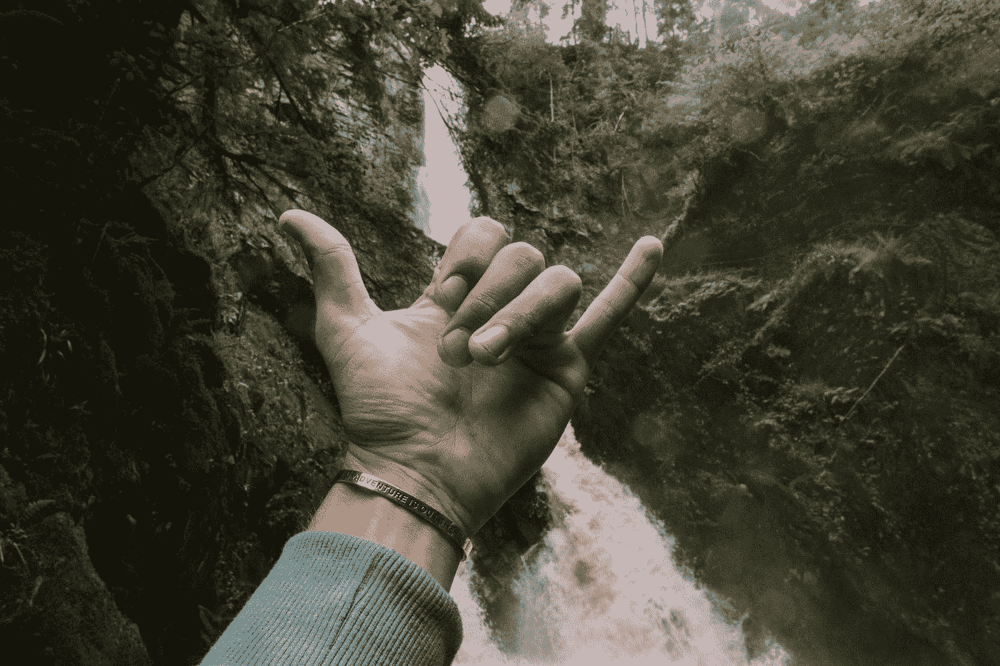
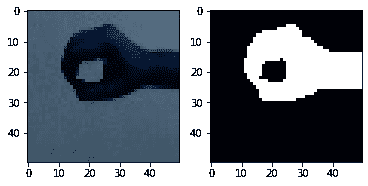
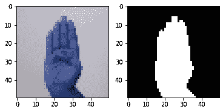
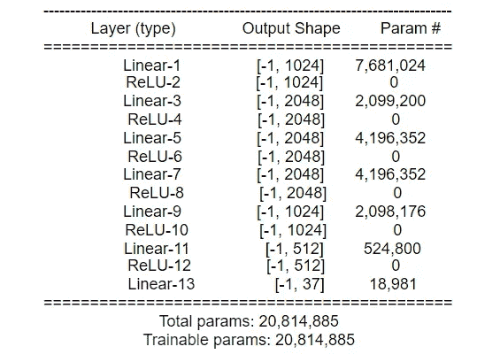
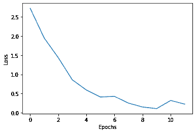
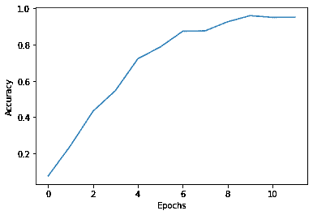
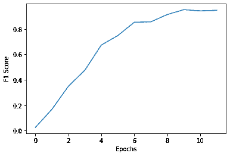

# 使用深度学习的手语手势检测

> 原文：<https://medium.com/analytics-vidhya/sign-language-gesture-detection-using-deep-learning-ffb17d5c4015?source=collection_archive---------6----------------------->

端到端机器学习项目



照片由[科迪板](https://unsplash.com/@codypboard?utm_source=medium&utm_medium=referral)在 [Unsplash](https://unsplash.com?utm_source=medium&utm_medium=referral) 上拍摄

在着手解决问题之前，了解问题陈述的原因和内容非常重要。那我们开始吧..

手语是一种交流语言，就像聋人社会中使用的任何其他语言一样。这个数据集是手语中使用的一套完整的手势，可以被其他正常人用来更好地理解手语手势。数据集收集自 Kaggle 网站。该数据总共包括 37 个类，它们具有英语字母表的所有字符，也全部是 10 个数字和一个低分数(对于空格)。细节将在后面的章节中解释。该模型是在 Python 语言下构建的，这是 ML 和 DL 任务的流行选择。

Pytorch 是一个灵活的库和特性，它被用于这个项目。关于模型和其他的进一步细节在下面提到。该模型在可通过 Kaggle 内核获得的 GPU 下训练。

ML 生命周期有 4 个主要部分

*   数据采集
*   从数据中预处理和提取特征
*   模型准备
*   模型的部署

> **数据集**的采集

**该数据集由 37 种不同的**手势组成，其中包括 **A-Z 字母**手势、**0–9**数字手势以及一种表示空间的手势，这意味着聋哑人在交流时如何表示两个字母或两个单词之间的空间。数据集有两个部分，即****

****

**手势符号“H”**

****

**手势符号“0”**

**文件夹(1)-手势图像数据-由不同手势的手的彩色图像组成。每个手势图像的大小为 **50 x 50** ，并且位于其指定的文件夹名称中，即 A-Z 文件夹由 A-Z 手势图像组成，0–9 文件夹分别由 0–9 手势组成，“_”文件夹由手势图像组成，用于分隔。这里给出了数据集的一些样本。**

> ****预处理和特征提取****

**正如图像所示，它是一个 RGB(红绿蓝)图像，这意味着它有 3 x 50 x 50，其中 50 x 50 是图像的大小。考虑到真实世界的情况和计算成本，该模型可以仅通过灰度级来建立，在黑白图像中也是如此。这里对图像进行预处理，将它们转换成 BW 图像。**

********

**这是通过调整亮度、高斯阈值二值化来实现的。这里展示了一些图像。图像现在被转换为 BW 和更低的维度，即 50 x 50(因为只有 0 或 255)。预计计算成本会降低。二值图像是任何图像的重要特征之一，因此这就完成了特征提取部分。**

> ****模型准备****

**模型准备也是生命周期的重要部分之一。有几种方法可以选择模型。因为问题陈述是关于解决图像的，最合适的最大似然算法是 SVM 树。但是由于在将某个数据传递给传统的最大似然算法之后**，该模型不再进一步学习。因此，像神经网络和 CNN 这样的深度学习算法最近变得很受欢迎。****

```
class net(nn.Module):def __init__(self,input_size,hidden_layers,num_classes):super(net,self).__init__()
    self.input = nn.Linear(in_features=50*50*3,out_features=1024)
    self.relu_1 = nn.ReLU()
    self.hidden1 = nn.Linear(in_features=1024,out_features=2048)
    self.relu_2 = nn.ReLU()
    self.hidden2 = nn.Linear(in_features=2048,out_features=2048)
    self.relu_3 = nn.ReLU()
    self.hidden3 = nn.Linear(in_features=2048,out_features=2048)
    self.relu_4 = nn.ReLU()
    self.hidden4 = nn.Linear(in_features=2048,out_features=1024)
    self.relu_5 = nn.ReLU()
    self.hidden5 = nn.Linear(in_features=1024,out_features=512)
    self.relu_6 = nn.ReLU()
    self.output = nn.Linear(in_features=512,out_features=num_classes)def forward(self,X):
    model = self.input(X)
    model = self.relu_1(model)
    model = self.hidden1(model)
    model = self.relu_2(model)
    model = self.hidden2(model)
    model = self.relu_3(model)
    model = self.hidden3(model)
    model = self.relu_4(model)
    model = self.hidden4(model)
    model = self.relu_5(model)
    model = self.hidden5(model)
    model = self.relu_6(model)
    model = self.output(model)return model
```

****车型总结****

****

**虽然这些模型有可能过度拟合，因为一些领域如罕见疾病的医学诊断具有较少的数据，但在这些情况下不适合使用这样的算法。由于问题陈述具有如此庞大的数据(55，500 张图片平均分布在各个类别中)，深度学习算法将在这种情况下发挥作用。**

********

**选择人工神经网络(ANN)算法作为基本算法。**

**模型建立在 Pytorch 库下，使用灵活。**分类损失**用作优化器的损失。 **Adam 优化器**用于以 0.001 的**学习率**优化损失函数。以下是所得结果的图表。所以最后考虑的指标是损失、准确性、F1 分数。由于损失和准确性对模型性能没有太大影响，所以使用 F1-分数(准确性和召回率的 HM)。下表给出了关于此模型的度量性能的信息**

****

> ****模型部署****

**虽然前面的阶段很重要，但是模型的部署在解决现实世界的问题中起着关键的作用。任何一个有数据的人都可以建立一个简单或复杂的模型，但是如果不把它部署到现实世界中，我们就无法从这项技术中获益。该模型通过 Flask web 框架进行部署。这个应用程序基本上将图像作为输入，然后将其转换为文本。虽然这是一个基本的应用程序，但可以通过在视频中实现这些算法来改进它。执行完整的循环，完整的培训代码在[这里](https://www.kaggle.com/navaneethsharma2310/hand-gesture-language-detection)可用，部署代码在这个 [ithub](https://github.com/Navaneeth-Sharma/Sign_Language_Detection) repo 中可用，除了预培训，基本上通过[驱动](https://drive.google.com/file/d/1asp49Y5LbjCnRxetISSnXsfn-cHYaRLP/view?usp=sharing)提供。**

> ****未来范围****

*   **一个模型可以被训练来实时识别来自现场视频的手势**
*   **当模型将图像转换成文本时，可以使用文本到语音模型，就好像说话者在说话一样**

**谢谢你…**

**快乐学习…！！！**