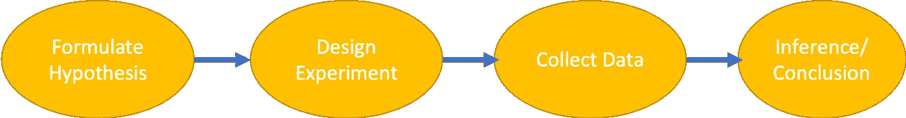
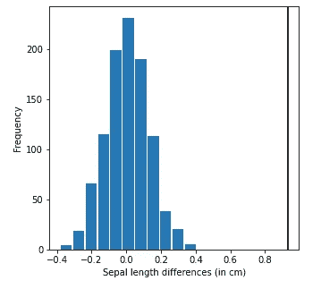
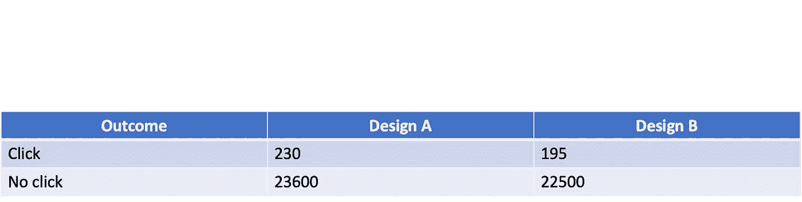
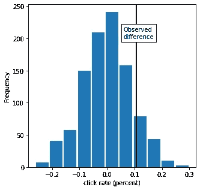

# 数据科学的重要性测试 Python 实现

> 原文：<https://medium.com/analytics-vidhya/significance-testing-for-data-science-with-python-implementation-5a59ddf8b358?source=collection_archive---------9----------------------->

确认和拒绝一个假设是统计学实践的基石。

数据科学家经常需要在例如用户界面和产品营销的环境中进行连续的统计实验。在经典统计学中，统计学家大多把他们的注意力限制在推断上，因为这是一个基于有限数量的样本得出总体结论的复杂过程。


假设检验

推断的目的是将有限样本数据的结果推广到更大的群体数据集中。



推理管道

# 什么是 A/B 测试？

A/B 测试是对两组人进行的实验，以确定两种处理方法(如产品、处理和过程)中哪一种更优越。在这种情况下，其中一组包括标准治疗或不治疗，它被称为对照组。A/B 测试有一个通常被随机分配到治疗组的受试者。受试者通常是许多形式的人，例如临床试验受试者或网络访问者。设计 A/B 检验的一个要点是，我们必须确保两组数据的差异仅仅是由于治疗效果的差异。通过这种方式，我们避免了任何可能潜伏在我们结论中的统计偏差(关于统计偏差的更多信息，请参考这里的)。我们还应该决定一个合适的*测试统计*，在此基础上捕捉两组之间的差异。例如，看看男性和女性群体之间的收入手段是否有差异。当然，连续或离散等数据类型会影响所采用的检验统计类型。测试统计应该是一个单一的数字，并事先决定。

在一些测试中，受试者并不知道他们所受到的治疗。这被称为*盲研究*或盲实验。在某些情况下，我们甚至采取了进一步的预防措施，并且研究者和协助者(例如，医学研究中的医生和护士)也不知道每个受试者被分配了哪种治疗。这被称为*双盲研究*。

# 与数据科学家的 A/B 测试相关

数据科学家更感兴趣的是回答这样的问题，例如哪个可能的组反映了最佳解决方案，而不是组之间是否有任何统计意义。为此，为了控制得出结论的成本和时间，建议使用“多臂土匪”的新研究设计。然而，在某些情况下，决定预测模型的组或特征之间的差异对于达到期望的输出是必要的。

# 假设检验

假设检验用于帮助您了解两组之间的差异不是由于随机机会。这主要是因为人类倾向于将随机效应误解为具有某种意义的模式。统计假设检验的发明是为了保护研究人员不被随机机会所愚弄。

假设检验包括两组，一组称为 ***零假设*** ，其中概率被认为是差异的根本原因，另一组称为 ***替代假设，*** 其中接受零假设的相反点，即差异不是由于概率。在假设检验中，最初我们坚持基线理论，即零假设，除非结果表明拒绝基线。

## 单向与双向假设检验

在形成假设检验的过程中，我们可以提出两种问题。一种方法是问一些问题，比如“两组之间在任何方向上有任何显著的不同吗？”。在这种情况下，我们有*双向假设检验*。在另一种叫做*单向假设检验*的形式中，我们感兴趣的是回答诸如“备选组比基线更好还是更差？”。

# 重采样

在制定假设检验和收集数据后，我们要评估两组之间的差异。我们想要一个明确的答案来回答这个问题，比如“这种差异是随机的吗？”换句话说，这种差异是随机分配两组受试者的结果吗？

重采样是从观测数据中重复采样，以测量检验统计的可变性，从而解释采样可变性。**重采样有两种不同的使用方式:引导和置换**。在 bootstrap 中，我们的目标是测量一组数据的统计估计的可靠性。引导通常以替换方式完成。有关自举治疗的更多信息，请参考此处的。在假设检验中使用的排列中，我们的目标是评估假设检验问题。在排列测试中，我们混合所有组的所有观察数据，然后从聚集的数据中随机分配到每个组。通过这样做，我们旨在扰乱每个组中的值的顺序。 ***我们认为，如果差异是由于随机机会，那么在置换数据中得到相同范围效应差异的机会应该是正的。***

假设我们有两组数据 A 和 B(这可以扩展到 C，D，…等多个测试)。置换过程如下[1]:

1.  将不同组的结果合并成一个数据集。
2.  混洗合并的数据，然后随机抽取(不替换)一个与 A 组相同大小的重新样本(显然它将包含其他组的一些数据)。
3.  从剩余的数据中，随机抽取(不替换)一个与 b 组相同大小的重样本。
4.  对 C 组、D 组等等进行同样的操作。现在，您已经收集了一组反映原始样本大小的重新样本。
5.  无论原始样本的统计或估计值是多少(例如，组比例的差异)，现在计算重新样本的统计或估计值，并记录；这构成了一次置换迭代。
6.  重复前面的步骤 *R* 次(R 在某种程度上是足够大的),以产生测试统计的排列分布。

在获得足够数量的重采样实现后，我们想要测量原始观测统计数据与重采样数据的相似程度。我们通过计算重采样值的频率(概率)来测量相似性，重采样值恰好与观察到的统计数据一样极端。如果观察到的差异位于排列分布的大部分之外，那么我们得出结论，机会是*而不是*造成的。用专业术语来说，差异是*统计上显著的*。

为了演示假设检验，我们选取了 scikit-learn 库中的 Iris 数据集。

```
import pandas as pd
from sklearn import datasetsiris = datasets.load_iris()#data frame to accommodate the data
df = pd.DataFrame(data=iris.data, columns=['sepal length (cm)', 'sepal width (cm)', 'petal length (cm)', 'petal width (cm)'])
```

我们想知道“刚毛”型和“杂色”型花的萼片长度的平均差异是否有统计学意义。我们采用排列重采样方法。python 实现如下所示:

```
def perm_resam_fun(df, feat = 'sepal length (cm)', target = [0, 1]):# extract the index of flower types
idx_1 = list(df[df['target'] == target[0]][feat].index)
idx_2 = list(df[df['target'] == target[1]][feat].index)#index of aggregated flower types
idx_agg = set(idx_1).union(idx_2)#mix the aggregated flower types
rand_idx = np.random.permutation(list(idx_agg))# pick index for each category ignoring the flower types
idx_A = rand_idx[0:len(idx_1)]
idx_B = rand_idx[len(idx_1):]return df.loc[idx_B][feat].mean() - df.loc[idx_A][feat].mean()
```

使用`perm_resam_fun,` 将观察到的平均值与置换样本的 1000 个实现进行比较。在下图中，观察值(垂直实线)与平均统计分布一起显示。

```
import matplotlib.pylab as pltmean_sepal_length_0 = df[df['target'] == 0]['sepal length (cm)'].mean()
mean_sepal_length_1 = df[df['target'] == 1]['sepal length (cm)'].mean()perm_diffs = [perm_resam_fun(df, feat = 'sepal length (cm)', target = [0, 1]) for _ in range(1000)]fig, ax = plt.subplots(figsize=(5, 5))ax.hist(perm_diffs, bins=11, rwidth=0.9)
ax.axvline(x = mean_sepal_length_1 - mean_sepal_length_0, color='black', lw=2)
ax.text(50, 190, 'Observed\ndifference', bbox={'facecolor':'white'})
ax.set_xlabel('Sepal length differences (in cm)')
ax.set_ylabel('Frequency')
```



1000 个排列样本的平均统计频率

上图中的直方图显示，随机排列的平均差异不超过观察到的萼片长度差异(垂直线)。根据我们的结果，这种情况几乎在 0%的情况下发生。

```
np.mean(np.array(perm_diffs) > mean_sepal_length_1 - mean_sepal_length_0)#output: 0.0
```

稍后，我们会发现这叫做假设检验的 *p 值*(简单吧？；)).这表明两种类型的花“setosa”和“versicolor”的萼片长度在统计学上是显著的。对于数据科学家来说，这表明在预测分类算法中，萼片长度可以是分类算法中采用的良好特征。**置换重采样可用于任何统计，如中位数、方差等。**

当每个处理有多个水平时，排列检验可用于衡量两种方法/处理的差异。举个例子，假设我们想看看两个网页设计在点击量方面是否表现相同。设想两个网页设计 A 和 B 的列联表如下:



网页设计两级结果的列联表

可以看出，设计 A 导致 0.96% (230/(230+23600))和设计 B 导致 0.85% (195/(195+22500))的点击率。现在的问题是:是否有统计学上的显著证据表明设计 A 比设计 B 吸引了更多的用户？我们使用排列试验，类似于确定萼片长度的平均统计量。不同的是，结果不是连续型的，而是二元型的(点击或不点击)。我们将比较观察到的点击百分比的差异与我们将每个样本随机分配给每个设计的情况，并查看点击百分比的差异是否不同于观察到的差异。

1.  我们首先将数据标记为“1”表示点击，标记为“0”表示无点击(标记无关紧要)。总共，我们有 230+195 = 425 个 1 和 23600+22500=46100 个 0。
2.  洗牌并抽取一个大小为 23，830 的重样本(与设计 A 相同的 *n* ，并记录有多少个 1。
3.  记录剩余的 22，695 中 1 的数量(与设计 B 中的 *n* 相同)。
4.  记录 1s 比例的差异。
5.  重复步骤 2–4。
6.  差异> = 10.5%的频率是多少？

python 的实现如下所示[1]:

```
def perm_fun(x, nA, nB):n=nA+nBidx_B = set(random.sample(range(n), nB))
idx_A = set(range(n)) - idx_Breturn x.loc[idx_B].mean() - x.loc[idx_A].mean()import random# the observed difference in click rate
obs_pct_diff = 100 * (230 / (230+23600) - 195 / (22500+195))
print(f'Observed difference: {obs_pct_diff:.4f}%')conversion = [0] * 46100
conversion.extend([1] * 425)
conversion = pd.Series(conversion)perm_diffs = [100 * perm_fun(conversion, 230+23600, 22500+195)
for _ in range(1000)]fig, ax = plt.subplots(figsize=(5, 5))
ax.hist(perm_diffs, bins=11, rwidth=0.9)
ax.axvline(x=obs_pct_diff, color='black', lw=2)
ax.text(0.06, 200, 'Observed\ndifference', bbox={'facecolor':'white'})
ax.set_xlabel('Conversion rate (percent)')
ax.set_ylabel('Frequency')
```

结果如下图所示:



点击结果的排列测试

排列结果大于观察结果(即 0.1059%)的情况百分比约为 12%！

```
np.mean(np.array(perm_diffs) > obs_pct_diff)#output: 0.119
```

**问题“结果有统计学意义吗？”仍然没有答案。我们将在下面的部分回答这个问题。**

# p 值和 Alpha

为了决定测试结果是否是静态显著的，我们应该回答这个问题:

> *如果您运行排列测试，您多久会看到大于观察统计值的极值？*

这叫做 **p 值**。在点击的例子中，我们看到这个值大约是 12%。如果我们想确保我们将结果声明为统计显著性的决策具有 95%的把握(以零假设假设为基线)，随机结果(即排列结果)大于观察值的频率应不超过 5%(实际为 12%)。因为在我们的例子中这个值是 12%,我们说 95%保证的 p 值不满足，并且零假设仍然成立。

预先指定一个阈值，如“超过 5%的可能性(零假设)结果”；这个阈值被称为 *alpha* 。典型的阿尔法水平是 5%和 1% [1]。

> 需要记住的重要一点是，p 值并不反映“这是偶然发生的概率是多少？”而是“给定一个机会模型，出现这种极端结果的概率是多少？”[1]

数据科学家可以使用 p 值来检查模型结果是否在正常的变化范围内。它还可用于要素选择，将要素作为决定某个值是否属于特定类的决定性因素。

# 总结

在这篇文章中，我们旨在集中于显著性检验，以确定结果是否不是随机的结果。这是经典统计学中推论的基础。讨论了数据科学家与假设检验的关系，并介绍了假设检验的不同应用。

参考

[1]布鲁斯、彼得、安德鲁·布鲁斯和彼得·格德克。*数据科学家实用统计:使用 R 和 Python 的 50 多个基本概念*。奥莱利媒体，2020。