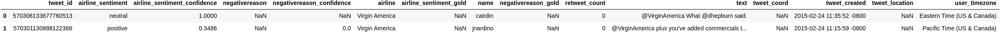

# 寻找相似的句子

> 原文：<https://medium.com/analytics-vidhya/similar-tweets-3bbb8494dd3f?source=collection_archive---------9----------------------->

在本笔记本中，我们尝试使用余弦相似度和欧几里德距离对美国航空公司情绪数据集的最相似推文进行分组。

## 必要的进口

首先，我们导入必要的库。我们在文本处理中使用了 nltk，re 中的停用词 word_tokenize。

```
import numpy as np
import pandas as pd
import re
import nltk
from nltk.corpus import stopwords
from nltk.tokenize import word_tokenize
stopwords = set(stopwords.words('english'))
```

## 加载数据集

我们使用了 ka ggle-Twitter-美国-航空公司-情绪数据集。在现有的各种列中，我们只对包含美国航空公司推文的文本列感兴趣。

```
data_source_url = "https://raw.githubusercontent.com/kolaveridi/kaggle-Twitter-US-Airline-Sentiment-/master/Tweets.csv"
airline_tweets = pd.read_csv(data_source_url)print(airline_tweets.columns)Index(['tweet_id', 'airline_sentiment', 'airline_sentiment_confidence',
       'negativereason', 'negativereason_confidence', 'airline',
       'airline_sentiment_gold', 'name', 'negativereason_gold',
       'retweet_count', 'text', 'tweet_coord', 'tweet_created',
       'tweet_location', 'user_timezone'],
      dtype='object')airline_tweets.head(2)
```



## 文本预处理

```
features=airline_tweets.text
```

## 给句子做记号

我们使用 word_tokenize 将句子转换成标记

```
word_token_sent=[]
for i in range(0,len(features)):
    word_token_sent.append(word_tokenize(features[i]))word_token_sent[1]['@',
 'VirginAmerica',
 'plus',
 'you',
 "'ve",
 'added',
 'commercials',
 'to',
 'the',
 'experience',
 '...',
 'tacky',
 '.']
```

## 数据预处理

我们过滤掉停用词、特殊字符、多空格、单个字符，并将其转换为小写

```
filtered_sentence = []
for w in word_token_sent[1]:
    if w not in stopwords:
        filtered_sentence.append(w)processed_features = []
for sentence in range(0, len(features)):
    processed_feature = re.sub(r'\@.*?\s','', str(features[sentence])) #removing mentions
    processed_feature = re.sub(r'\W', ' ', str(processed_feature)) #special character removal
    processed_feature= re.sub(r'\s+[a-zA-Z]\s+', ' ', processed_feature) #single charracter
    processed_feature = re.sub(r'\s+', ' ', processed_feature, flags=re.I) #multi space issues handled
    processed_feature = re.sub(r'^b\s+', '', processed_feature) #removing prefix b

    # Converting to Lowercase
    processed_feature = processed_feature.lower()

    processed_features.append(processed_feature)documents = set(processed_features) #removign dublicateslist(documents)[:3]['all hear is blah blah blah you shoulda used that 400 to buy ticket instead amp ill be driving there not flying',
 'fly 2301 delayed do to ice at jfk can switch to late flightr flight for free',
 'where are my bags they weren in lax like your promised 9 out of 10 things today were mess today because of you ']
```

## …向量化…

```
The process of converting words into numbers are called Vectorization.from sklearn.feature_extraction.text import TfidfVectorizer
tfidf_vectorizer = TfidfVectorizer()
tfidf_matrix = tfidf_vectorizer.fit_transform(documents)
print(tfidf_matrix.shape)(14286, 14334)
```

## 计算推文之间的相似度

这里我们给出了两种计算推文相似度的方法。第一种方法是余弦相似性，第二种方法是欧几里得相似性。**欧几里德距离**是通过统计文档之间的常用词的数量来计算的。当普通单词的数量增加但文档谈论不同的主题时，可以看到这种方法的缺点。**余弦相似度**的方法被用来克服这个缺陷。

## 余弦相似性

为了找到相似性，我们使用 sklearn 库中的 cosine_similarity。在这里，我们从我们的数据集中选取第 6 条推文，找出前 5 条类似的推文。

```
from sklearn.metrics.pairwise import cosine_similarity
similarity_index=cosine_similarity(tfidf_matrix[6:7],tfidf_matrix)print(processed_features[6]) # input tweetyes nearly every time fly vx this ear worm won go awaysimilarity_index=similarity_index.reshape(-1)
```

## 结果:使用余弦相似度与输入推文相似的推文

我们现在使用前面步骤中计算的相似性指数显示前 5 个最相似的句子。

```
n=6
print (similarity_index[np.argsort(similarity_index)[-n:]])[0.336306   0.35882412 0.36344862 0.36512195 0.41766352 1\.        ]res = sorted(range(len(similarity_index)), key = lambda sub: similarity_index[sub])[-n:] 

# printing result 
print("Indices list of max N elements is : " + str(res))Indices list of max N elements is : [1196, 12737, 12480, 5289, 10579, 6]for i in res:
    print(processed_features[i])
    print('\n')The most similar tweets givne by this approach are:you suck 9 hour delay 

so bad service in miami airport 

flight 1679 n76200 prepares for flight at before departing for http co xbkvcraokn

you just cancelled flightled my flight home so you better get me private jet or something need to get home now

 thanks for the 5 hour flight from pit to phx with zero entertainment guess why have quarter million miles on delta

# input tweet
yes nearly every time fly vx this ear worm won go away
```

## 欧几里德距离

```
from sklearn.metrics.pairwise import euclidean_distances

similarity_index=euclidean_distances(tfidf_matrix[6:7],tfidf_matrix)
```

## 结果:使用欧几里德距离，与输入推文相似的推文

```
similarity_index=similarity_index.reshape(-1)
n=6
print (similarity_index[np.argsort(similarity_index)[-n:]])
res = sorted(range(len(similarity_index)), key = lambda sub: similarity_index[sub])[-n:][1.41421356 1.41421356 1.41421356 1.41421356 1.41421356 1.41421356]Using euclidean distance we can see the result have almost similar words. Hence this approach is also called common word approach.print("Indices list of max N elements is : " + str(res)) 
for i in res:
    print(processed_features[i])
    print('\n')Indices list of max N elements is : [14220, 14225, 14234, 14235, 14257, 14268] The most similar tweets are:not to mention its three hour wait to get an agent on the phone 

aa agent said repeated myself when was explaining told him understand english his reply our conversation is over 

i ve got ba flight as your airport couldn accommodate us we were left without any info no vouchers for food nothing 

flight 1019 need 2 on the first flight out frm mia 2 tpa m extremely irritated ve been at this airport for 5 5 hrs 

i want the flight have on hold don want new flight 

what name and department does it come under thanks
```

## 参考

*   [https://stack abuse . com/python-for-NLP-opinion-analysis-with-scikit-learn/？FB clid = iwar 0032 f 5ljw _ ZvFDV-p5g 5 lxi 4 dz 975 _ 6 ubokefarg 187 tu 9 grpt 670 xxso](https://stackabuse.com/python-for-nlp-sentiment-analysis-with-scikit-learn/?fbclid=IwAR0032F5LjW_ZvFDV-p5G5Lxi4dz975_6ubOkEfaRg187Tu9GRPT670Xxso)
*   [https://towards data science . com/understanding-NLP-word-embeddings-text-vectorization-1a 23744 f 7223](https://towardsdatascience.com/understanding-nlp-word-embeddings-text-vectorization-1a23744f7223)