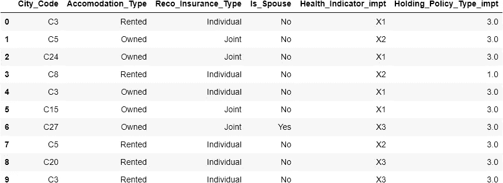
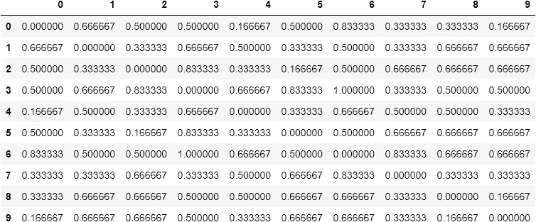
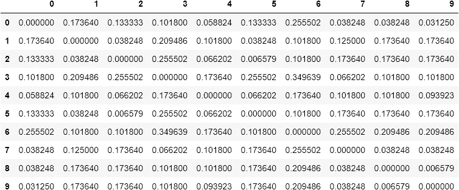
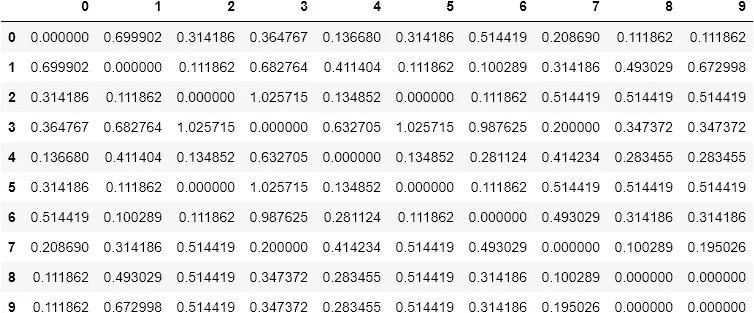

# 分类数据的相似性度量

> 原文：<https://medium.com/analytics-vidhya/similarity-measures-for-categorical-data-d83a1812bbe9?source=collection_archive---------5----------------------->

# 第 0 部分:填充物

分类数据(也称为名义数据)已经在各种背景下研究了很长时间。然而，计算分类数据实例之间的相似性并不简单，因为分类值之间没有明确的排序概念。为了克服这个问题，已经为分类数据提出了几个数据驱动的相似性度量。这种测量的行为直接取决于数据。

让我们试着了解一些措施。为了定义这些度量，让我们从一些符号开始。

## 第 1 部分:定义

*   考虑包含 n 个数据点(行)的分类数据集 d，定义在一组 d 分类属性上，让 Aₖ表示第 k 个属性，其中 K=1，2，3…d，让 Aₖ取数据集中的 nₖ唯一值。
*   设 fₖ(x)是属性 Aₖ取值 x 的频率，x 是 nₖ值之一。
*   设 pₖ(x)是属性 Aₖ取值 x 的样本概率

文献中有许多相似性度量，我们将只定义其中的几个，并在 python 中实现它们。

相似度量和距离度量有什么关系？

*   sim = ⁄₁₊ₗₑₙ，其中 sim =相似性，len=距离。

相似性度量在属于数据集 D 的两个数据实例 X 和 Y 之间赋值如下:

*   S(X,Y)=∑₁ᵈwₖSₖ(Xₖ,Yₖ)
*   这里，wₖ是分配给每个属性的权重，而 Sₖ(Xₖ,Yₖ是数据集的给定两个实例即 x 和 y 中第 k 个属性的相似性得分函数
*   对于 wₖ和 Sₖ(Xₖ,Yₖ有不同的定义)我们得到具有不同属性和使用情况的不同相似性度量。

这里所有的测量都是用 wₖ和 Sₖ(Xₖ,Yₖ定义的)

## 重叠

定义:Sₖ(Xₖ,Yₖ)=1 如果 Xₖ = Yₖ，否则等于 0，重量 wₖ是 1/d 这里 k =1，2，…d

## 埃斯金

定义:Sₖ(Xₖ,Yₖ)=1 如果 Xₖ = Yₖ并且等于 nₖ /(nₖ +2)否则，重量 wₖ是 1/d 这里 k =1，2，…d

## IOF-反向发生频率

定义:Sₖ(Xₖ,Yₖ)=1 如果 Xₖ = Yₖ并且等于

1/(1+log(fₖ(Xₖ))*log(fₖ(Yₖ)，否则重量 wₖ是 1/d，这里 k =1，2，…d

## 属于…的

定义:Sₖ(Xₖ,Yₖ)=1 如果 Xₖ = Yₖ并且等于

1/(1+log(N/fₖ(Xₖ))*log(N/fₖ(Yₖ)，否则，重量 wₖ是 1/d，这里 k =1，2，…d

## 林（姓氏）

定义:Sₖ(Xₖ,Yₖ)=2log(pₖ(Xₖ))如果 Xₖ = Yₖ并且等于 2log(pₖ(Xₖ)+pₖ(Yₖ))否则并且权重 wₖ是 1/(∑₁ᵈlog(pᵢ(Xᵢ))+log(pᵢ(Yᵢ))这里 k =1，2，…d

## 第 2 部分:实现

```
import pandas as pd
import numpy as np
import category_encoders as ce
import math
```

**让我们创建一个函数，它采用带有分类列的数据帧，并输出一个编码的数据帧。**这里，我们使用 category_encoders 包中的 OrdinalEncoder。请注意它的一个特性，即它用两个唯一值(1 和 2，而不是 0 和 1)对属性进行编码。这一知识将有助于理解为什么在代码的某些部分有一个负 1，尤其是在定义上述度量的函数中。

由于使用了频率值，我们必须生成一个合适的频率表。

创建频率表的步骤

1.  初始化一个列表，并用每个属性中唯一类别的数量填充它。
2.  出于显而易见的原因，初始化一个空频率表，其大小为唯一类别的最大数量除以类别的总数。
3.  逐列通过逐行计算找到每个类别的频率。

让我们实现上面的每一个措施，下面的代码输出它们相应的距离值。

## 重叠

## 埃斯金

## 眶下裂

## 属于…的

## 林（姓氏）

让我们看看测试数据。

```
df = Test_data 
```



```
pd.DataFrame(Overlap(df))
```



```
pd.DataFrame(Eskin(df))
```



```
pd.DataFrame(IOF(df))
```



```
pd.DataFrame(OF(df))
```


# 第 3 部分:总结

## 使用的包

*   熊猫版本=1.1.5
*   Numpy 版本=1.19.5
*   类别 _ 编码器=2.2.2
*   数学

在这篇博文中，我们定义了一些相似性度量，并用 python 实现了它们。在未来，我们必须学会解释它们，并了解何时何地使用它们。

**注意**林相似性度量的代码似乎不太好用。

## 第 4 部分:参考文献。

*   [分类数据的相似性度量:Boriah 等人的比较评估](https://epubs.siam.org/doi/abs/10.1137/1.9781611972788.22)。
*   R 的 Nomclust 包的文档
*   [上述软件包的作者对分类数据](http://www.amse.ue.wroc.pl/papers/Sulc,Rezankova.pdf)的近期相似性度量的评估。
*   Github- [分类 _ 相似性 _ 度量](https://github.com/AjayMukundS/Categorical_similarity_measures/tree/master/Categorical_similarity_measures)