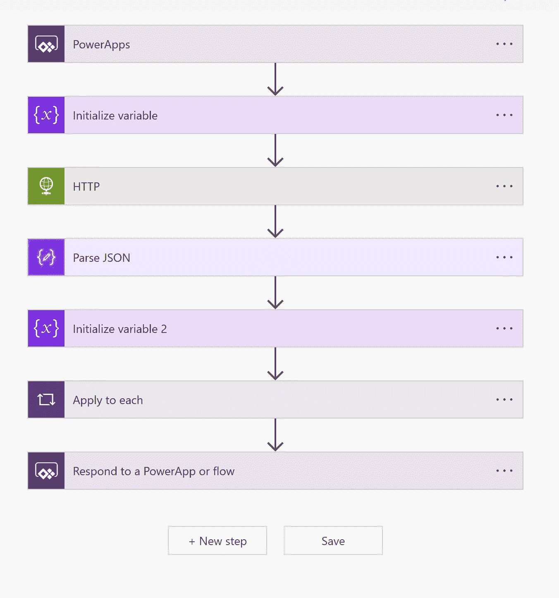
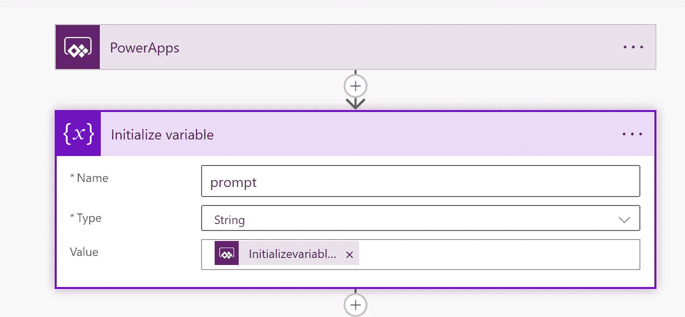
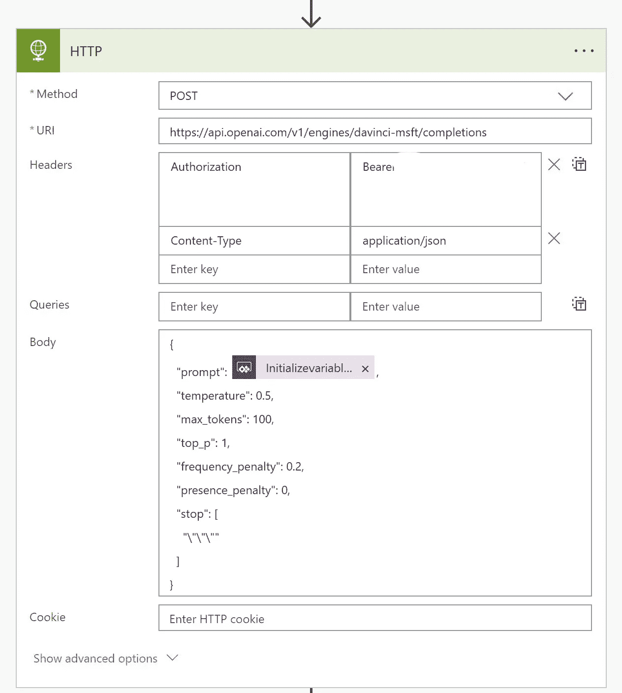
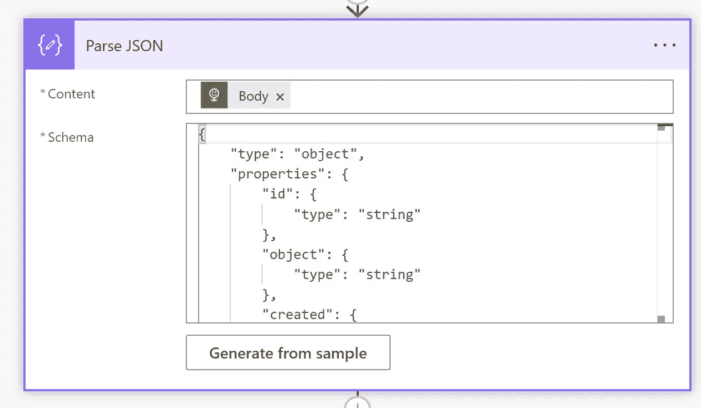
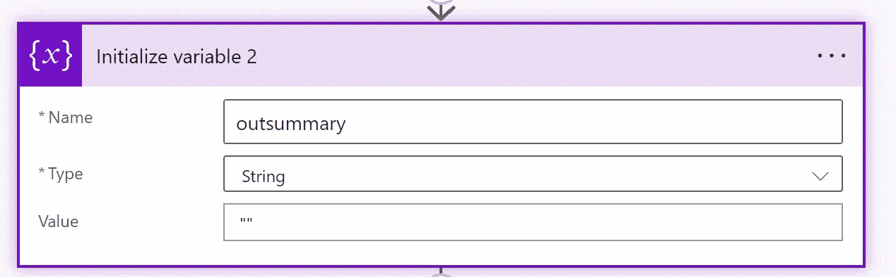
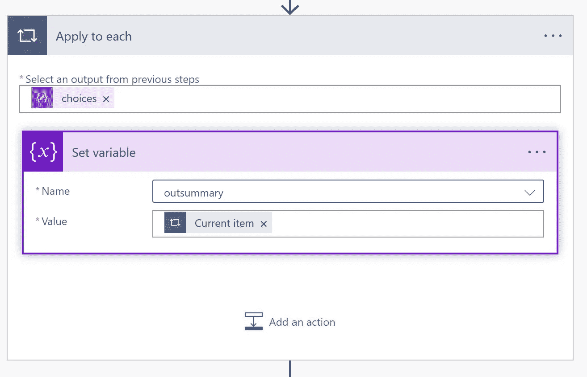
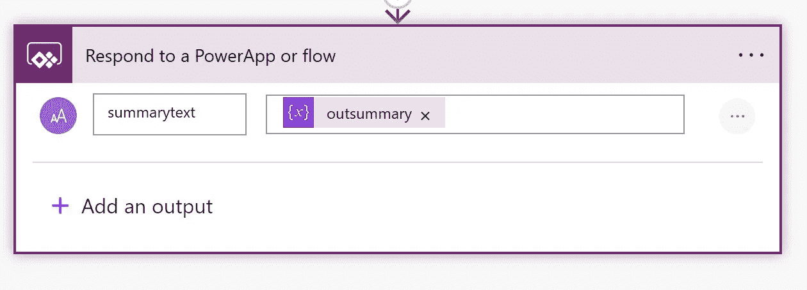
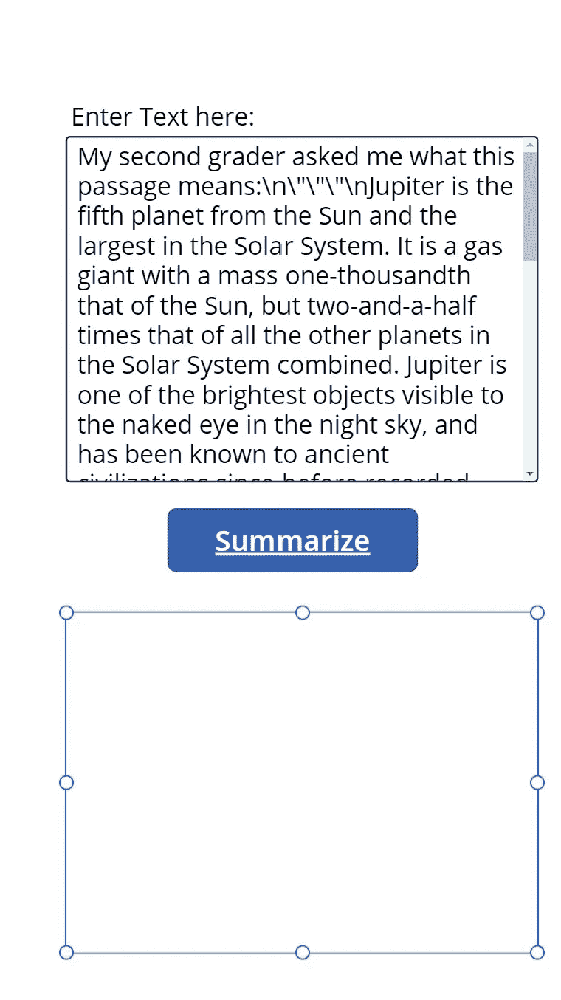
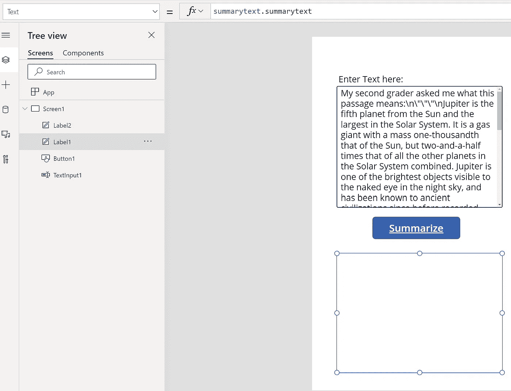

# 使用 GPT-3 openai 模型汇总数据的简单应用程序

> 原文：<https://medium.com/analytics-vidhya/simple-application-to-summarize-data-using-gpt-3-openai-model-37e6423a4b1c?source=collection_archive---------1----------------------->

# 让我们构建一个强大的应用程序，使用 GPT-3 openai 模型来汇总数据

# 需要什么

*   首先去—[https://beta.openai.com/](https://beta.openai.com/)注册一个试用账户
*   如果您的组织有一个帐户，然后注册该帐户
*   创建新的 API 密钥
*   在上面的网站的右上方点击你的名字，然后点击 API 键
*   然后创建一个新的密钥来使用
*   请确保在完成教程后删除密钥
*   转到文档并查看完成情况
*   我们将使用完井 api
*   还需要 Azure 帐户和 power 平台许可证

# 创建一个强大的应用程序

*   要创建一个电力应用程序，首先需要创建一个电力流
*   流由 powerapp 触发器调用
*   文本信息将被传递给流

# 能流

*   让我们创造一个能量流
*   在 power apps 的左侧菜单中，单击“流量”
*   https://make.preview.powerapps.com/
*   点击流程
*   单击新流程
*   将其命名为 getsummary
*   这是整个流程



*   首先添加触发器作为电源应用程序
*   然后初始化一个变量



*   对于从高级应用程序分配的值
*   它将接受输入值并赋给名为 prompt 的变量
*   现在，让我们将数据发送到 openai API，以使用 GPT-3 的达芬奇模型
*   首先带来 HTTP 操作
*   然后选择“发布”动作
*   这是网址

```
[https://api.openai.com/v1/engines/davinci-msft/completions](https://api.openai.com/v1/engines/davinci-msft/completions)
```

*   注意，我们需要内容类型作为应用程序/json
*   还需要授权为不记名<your_api_key></your_api_key>
*   这是尸体

```
{
  "prompt": @{triggerBody()['Initializevariable_Value']},
  "temperature": 0.5,
  "max_tokens": 100,
  "top_p": 1,
  "frequency_penalty": 0.2,
  "presence_penalty": 0,
  "stop": [
    "\"\"\""
  ]
}
```



*   确保 prompt 属性被替换为变量 prompt 的值，如上所示
*   接下来，我们需要解析上面 HTTP 输出的响应



*   现在我们需要提供一个样本文档来解析 JSON 模式

```
{
  "id": "cmpl-xxxxxxxxxxx",
  "object": "text_completion",
  "created": 1640707195,
  "model": "davinci:2020-05-03",
  "choices": [
    {
      "text": " really bright. You can see it in the sky at night.\nJupiter is the third brightest thing in the sky, after the Moon and Venus.\n",
      "index": 0,
      "logprobs": null,
      "finish_reason": "stop"
    }
  ]
}
```

*   从示例生成的架构

```
{
    "type": "object",
    "properties": {
        "id": {
            "type": "string"
        },
        "object": {
            "type": "string"
        },
        "created": {
            "type": "integer"
        },
        "model": {
            "type": "string"
        },
        "choices": {
            "type": "array",
            "items": {
                "type": "object",
                "properties": {
                    "text": {
                        "type": "string"
                    },
                    "index": {
                        "type": "integer"
                    },
                    "logprobs": {},
                    "finish_reason": {
                        "type": "string"
                    }
                },
                "required": [
                    "text",
                    "index",
                    "logprobs",
                    "finish_reason"
                ]
            }
        }
    }
}
```

*   初始化一个名为 outsummary 的变量



*   选择字符串类型
*   解析之后，我们需要循环数组并将文本赋给变量
*   将应用于每个动作
*   选择选项作为数组属性
*   现在带来集合变量动作
*   将 currentitem 赋给变量 outsummary



*   下一步添加对电源应用程序的响应
*   将超出的摘要作为响应发送回 Power Apps



*   保存流量
*   通过传递示例文本进行手动测试
*   如果成功了，你就可以开始心流了

# 高级应用程序

*   现在让我们创建一个强大的应用程序
*   这只是一个简单的应用程序
*   我正在创建一个画布应用程序
*   将应用程序命名为:OpenAPITest

```
Note: this process can be applied to any HTTP REST enabled actions needed to be invoked by Power Apps
```

*   现在我们需要创建一个画布
*   ▲文本输入框
*   添加默认文本作为提示

```
My second grader asked me what this passage means:\n\"\"\"\nJupiter is the fifth planet from the Sun and the largest in the Solar System. It is a gas giant with a mass one-thousandth that of the Sun, but two-and-a-half times that of all the other planets in the Solar System combined. Jupiter is one of the brightest objects visible to the naked eye in the night sky, and has been known to ancient civilizations since before recorded history. It is named after the Roman god Jupiter.[19] When viewed from Earth, Jupiter can be bright enough for its reflected light to cast visible shadows,[20] and is on average the third-brightest natural object in the night sky after the Moon and Venus.\n\"\"\"\nI rephrased it for him, in plain language a second grader can understand:\n\"\"\"\nJupiter is the fifth planet from the Sun. It is a big ball of gas. It is really bright, and you can see it in the sky at night. The ancient people named it after the Roman god Jupiter.\nJupiter is really big. It is bigger than all of the other planets in the Solar System combined. Jupiter is so big that if you could fit all of the other planets inside of Jupiter, you could still see Jupiter shining in the night sky!\nJupiter is
```



*   现在添加一个按钮
*   调用流并将返回值赋给变量

```
Set(summarytext,getsummary.Run(TextInput1.Text))
```

*   在选择中应用上述公式。
*   getsummary 是流的名称，我们将参数作为 textinput1.text 传递
*   现在让我们添加一个文本标签作为 label1
*   将 text 属性分配给 summarytext.summarytext
*   summarytext 是流中设置的输出属性

```
summarytext.summarytext
```



*   保存画布应用程序
*   运行应用程序并测试它
*   下面应该是输出

*最初发表于*[*【https://github.com】*](https://github.com/balakreshnan/Samples2022/blob/main/PowerPlatform/openaigpt3.md)*。*