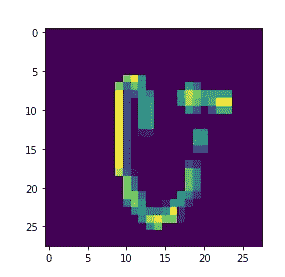

# 使用 NumPy 的简单 CNN:第一部分(简介和数据处理)

> 原文：<https://medium.com/analytics-vidhya/simple-cnn-using-numpy-part-i-introduction-data-processing-b6652615604d?source=collection_archive---------3----------------------->


# 介绍

卷积神经网络(CNN)是一类能够很好地处理网格状数据(如图像)的神经网络。它们从图像中提取有用的特征，使图像识别过程更加鲁棒。这些网络的灵感来自于**大卫·亨特·休伯尔&托斯坦·维厄·瑟尔**的实验结果，他们观察了猫的大脑对不同方向的直线的不同神经活动。

## 第一卷积网络

第一个卷积神经网络是由 Kunihiko Fukushima 博士在 1980 年实现的 [Neocognitron](http://www.scholarpedia.org/article/Neocognitron) 。该系统使用分层结构来学习图像的简单&复杂特征。使用无监督学习程序来识别手写字符。

Yann LeCun 博士和他的团队在 20 世纪 90 年代改进了这些想法，包括反向传播来识别手写邮政编码( [Le-Net5](http://yann.lecun.com/exdb/lenet/) )。这些类型的实现已经导致图像识别任务的显著改进。

CNN 具有从图像中检测有用特征(边缘、水平线、垂直线、曲率等)的能力，这类似于大脑中针对图像的不同方向的不同神经元放电。卷积层使这一特性成为可能。

大卫·亨特·休伯尔&托斯坦·维厄·瑟尔的实验可以在下面的 Youtube 视频中找到

在这一系列文章中，我将尝试使用 NumPy 实现一个基本的卷积神经网络。

# 输入数据

这里使用的输入将是来自 [Kaggle](https://www.kaggle.com/c/Kannada-MNIST) 中的卡纳达数字 MNIST 数据库的卡纳达数字。卡纳达语是一种达罗毗荼语，有超过 4500 万人使用。卡纳达语的数字如下:


**从 0 到 9 的卡纳达数字**

## 输入数据处理

输入来源于 CSV 文件，该文件包含图像的展平版本。数据预处理包括将这些条目中的每一个转换成像素值的 28×28 阵列。


**每个条目(行)被转换成一个 28×28 的数组**

下面的代码创建了训练数据集

```
import pandas as pd
import numpy as np

np.random.seed(42)
## import data setdata = pd.read_csv('../input/Kannada-MNIST/train.csv')
data['row_number'] = range(0,data.shape[0])
## Shuffling the data
data = data.sample(frac=1,random_state=42)
tmp = pd.DataFrame()
## Getting a balanced dataset with 600 entries per classfor label **in** range(10):
    if label==0:
        tmp = data[data['label']==label].head(600)
    else:
        temp = data[data['label']==label].head(600)
        tmp = pd.concat([tmp,temp])
data_train = tmp
row_numbers_in_train_set = tmp['row_number'].values
test_set = data.loc[~data['row_number'].isin(row_numbers_in_train_set)]
## Create one hot encoding
one_hot = pd.get_dummies(data_train['label'].unique())
one_hot['label'] = one_hot.index

data_train = pd.merge(data_train,one_hot)
data_test = test_set.sample(frac=1)
tmp = pd.DataFrame()
## Getting a balanced test set with 120 entries per classfor label **in** range(10):
    if label==0:
        tmp = data_test[data_test['label']==label].head(120)
    else:
        temp = data_test[data_test['label']==label].head(120)
        tmp = pd.concat([tmp,temp])
data_test = tmp
data_test = pd.merge(data_test,one_hot)
data_train.drop('label',axis=1,inplace=True)

data_test.drop('label',axis=1,inplace=True)

*## Create the train and test set and normalize the inputs*
X_train = np.array(data_train.drop([0,1,2,3,4,5,6,7,8,9,'row_number'],axis=1).values)/255
y_train = np.array(data_train[[0,1,2,3,4,5,6,7,8,9]].values)
X_test = np.array(data_test.drop([0,1,2,3,4,5,6,7,8,9,'row_number'],axis=1).values)/255
y_test = np.array(data_test[[0,1,2,3,4,5,6,7,8,9]].values)
```

导入展平的数据以创建 6000 个条目的训练数据集和 1000 个条目的测试数据集。这些像素条目的范围从 0 到 255(灰度)。这些条目通过除以最大值(255)来标准化。

输出类被更改为独热编码表示。

下面将输入向量重新整形为 28X28 NumPy 数组

```
X_train = X_train.T
y_train = y_train.T

X_test = X_test.T
y_test = y_test.T
X_train_reshape = np.zeros((X_train.shape[1],1,28,28))

for i **in** range(X_train.shape[1]):
    temp = X_train[:,i]
    temp = np.ravel(temp)
    temp = temp.reshape(28,28)
    X_train_reshape[i,0,:,:] = temp

X_train= X_train_reshape  

X_test_reshape = np.zeros((X_test.shape[1],1,28,28))

from matplotlib import pyplot as plt

for i **in** range(X_test.shape[1]):
    temp = X_test[:,i]
    temp = np.ravel(temp)
    temp = temp.reshape(28,28)
    X_test_reshape[i,0,:,:] = temp

X_test= X_test_reshape
```

一些重新成形的阵列如下


0


1



8


9

在处理之后，输入训练数据集现在具有维度(6000，1，28，28)，而测试数据具有维度(1000，1，28，28)。


**尺寸&含义**

# CNN 架构

在数据处理之后，NumPy 阵列形式的图像通过如下一系列层。

假设我们正在传递一个维数为(1，1，28，28)的图像。神经网络的结构将如下

*   输入层(1，1，28，28)
*   卷积滤波器(2，1，5，5)
*   最大池层(2x2)
*   全连接层(1，288)
*   第二完全连接层(1，60)
*   输出层(1，10)


紫色的尺寸是经过每个相应的处理阶段后图像的最终尺寸

上图显示了网络的大致“蓝图”。我将在下一篇文章中解释卷积滤波器和卷积运算。

感谢阅读！如有反馈/疑问，请随时给我发电子邮件至 padhokshaja@gmail.com。我会尽我所能回到他们身边。

# 资源

*   [LeNet-5](http://yann.lecun.com/exdb/lenet/)
*   [新克隆体](https://en.wikipedia.org/wiki/Neocognitron#:~:text=The%20neocognitron%20is%20a%20hierarchical,inspiration%20for%20convolutional%20neural%20networks.)
*   CNN 的 CS231n 讲座

# 下一篇文章

[卷积运算](/@PAdhokshaja/simple-cnn-using-numpy-part-ii-convolution-operation-b8c5a02b0844)