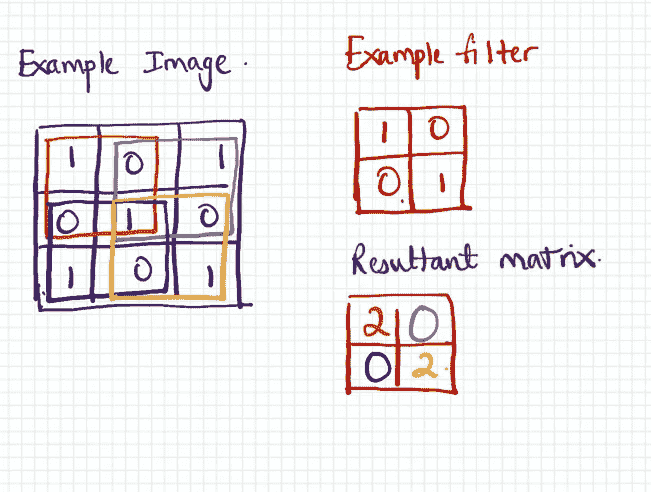
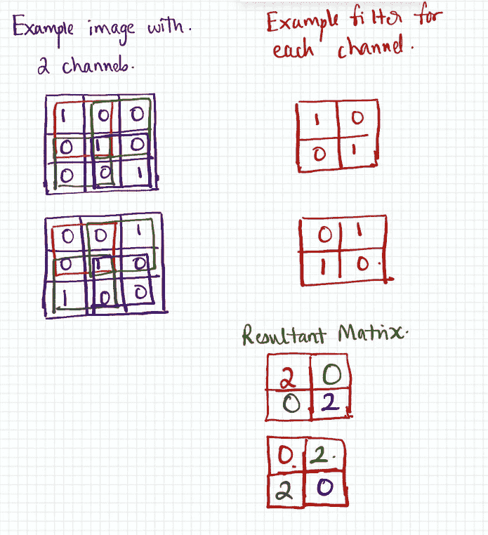
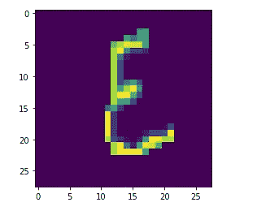
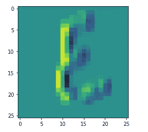
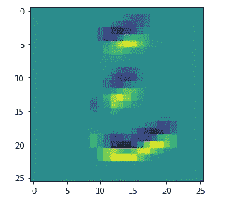
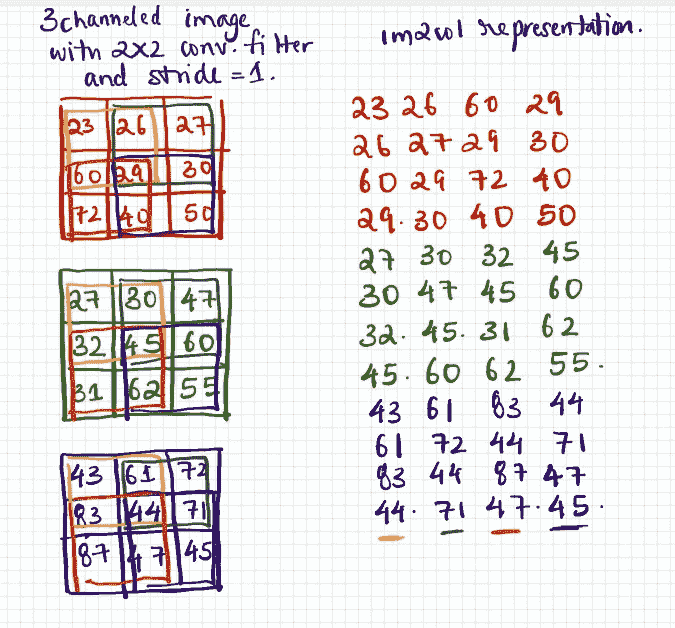

# 使用 NumPy 的简单 CNN 第二部分(卷积运算)

> 原文：<https://medium.com/analytics-vidhya/simple-cnn-using-numpy-part-ii-convolution-operation-b8c5a02b0844?source=collection_archive---------9----------------------->


在上一篇文章中，我简要介绍了卷积神经网络以及将展平图像的 CSV 数据转换为实际形状的代码。在这篇文章中，我将试着解释以下几点

*   卷积运算
*   为什么需要卷积？
*   使用 NumPy 实现它

# 卷积运算

在 ConvNets 环境中，卷积运算涉及**计算固定矩阵和图像不同区域之间的点积**。固定矩阵也被称为**卷积滤波器**。图像的不同区域具有与固定矩阵相同的形状。这些区域主要由三个参数决定；跨距、过滤器的宽度和过滤器的高度。

**步幅**参数决定每次点积计算之间的步数。

以下示例展示了卷积运算

对于跨距=1 和通道数= 1



过滤器和示例图像之间的卷积

在上面的示例中，滤镜以 1 为步长在图像上移动，对于每一步，计算点积。

对于跨距= 1 和通道数= 2



多通道图像的卷积运算。图像通道的数量应等于滤镜通道的数量。

对于多通道卷积运算，图像通道的数量和滤波器通道的数量应该相等。

卷积运算的结果维数可以使用下面的等式来计算:

***合成高度或宽度=((图像高度或宽度-过滤器高度或宽度)/步幅)+ 1***

# 为什么需要卷积？

卷积运算通过选择性地增加和减少像素强度来帮助去除图像的有用特征。这些有用的特征有助于将一幅图像与另一幅图像区分开来，从而使图像识别的任务更加高效。

例如，在上面的第一个例子中，卷积运算检测向左倾斜的对角线。第二个示例检测向左和向右倾斜的对角线。以下示例有助于检测卡纳达语数字 9(“omba tu”)中的垂直线和水平线。



描绘数字 9 的 28X28 图像



帮助检测垂直线的卷积运算



帮助检测水平线的卷积运算

# 使用 NumPy 实现它

在执行卷积运算之前，我想初始化我的卷积滤波器。卷积运算将发生在 1×1×28×28 的图像和 2 个维度(1×5×5)的滤波器之间。该操作的结果将是尺寸为(1X2X24X24)的图像。

```
import numpy as np
conv1 = np.random.randn(2,1,5,5) * np.sqrt(1\. / 5)
```

下面是卷积运算的朴素实现的伪代码。

***设 N 为图像数量***

1.  创建维数为零的结果矩阵(R )( nx2x 24x 24)
2.  选择给定的图像
3.  选择一个过滤器。假设这是带有过滤器的**。这将具有尺寸(1X5X5)**
4.  从选择的图像中，选择一个尺寸为(1X5X28)的矩形部分
5.  从这个矩形部分中，水平地连续选择尺寸为(1X5X5)的部分。
6.  取所选过滤器和(1X5X5)图像部分的点积，并将结果附加到矩阵 r。
7.  对下一个(1X5X28)部分重复步骤 4，该部分是通过将滤波器移动步长量得到的。
8.  重复步骤 5 和 6，直到覆盖整个图像。
9.  对所有图像重复步骤 3 至 8

代码如下所示

## 用 im2col 实现卷积运算

另一种实现卷积的方法是**将图像上卷积滤波器的每一步转换成矩阵的一列**。

具有跨距=1 的(3X2X2)卷积滤波器的三通道图像具有以下 im2col 表示



im2col 表示

设 im2col 矩阵为 X_im2col。那么计算如下

*   在多个滤波器中展平卷积滤波器。我们称之为 conv1_flatten
*   计算 C = conv1_flatten@X_im2col，其中@是矩阵乘法。
*   重塑 C 以适应矩阵的最终形状

im2col 实现和卷积结果可以按以下方式编码。

# 健全性检查

之间的卷积

```
X = np.array([[1,0,0],[1,2,3],[3,4,5]])
X = X.reshape(1,1,3,3)
```

和

```
conv1 = np.array([[1,0],[0,1]])
conv1 = conv1.reshape(1,1,2,2)
```

应该会产生一个具有形状(1，1，2，2)和以下条目的矩阵

(1*1)+(0*0)+(0*1)+(2*1) = 3

(1*0) + (0*0)+(2*0)+(3*1) = 3

(1*1)+(2*0)+(3*0)+(4*1) = 5

(2*1)+(3*0)+(4*0)+(5*1) = 7

正常卷积的输出为

```
array([[[[3., 3.],
         [5., 7.]]]])
```

im2col 卷积的输出是

```
array([[[[3\. 3.]
   [5\. 7.]]]])
```

***注:***

卷积滤波器的条目在开始时被随机化。对于每一批数据，通过反向传播逐渐调整条目，以便最小化损失函数。这里使用的损失函数是交叉熵损失，这是分类问题中常见的。

# 反馈

感谢阅读！如果您有任何反馈/建议，请发电子邮件到 padhokshaja@gmail.com 给我。我会尽最大努力给你回复。

# 我提到的资源

*   [详述 CNN 运作和实施的博客](https://hackmd.io/@bouteille/B1Cmns09I)

# 下一篇文章

ReLU，最大池，最大软件

[https://medium . com/@ PAdhokshaja/simple-CNN-using-numpy-part-iii-relu-max-pooling-soft max-c 03a 3377 EAF 2](/@PAdhokshaja/simple-cnn-using-numpy-part-iii-relu-max-pooling-softmax-c03a3377eaf2)