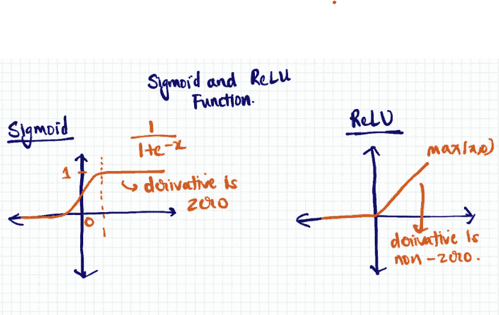
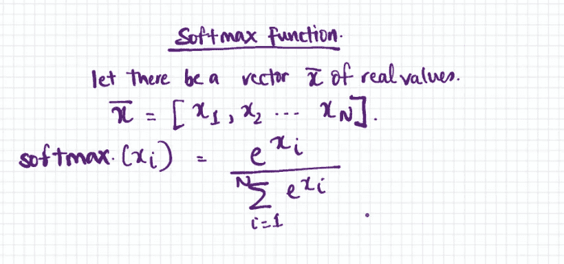
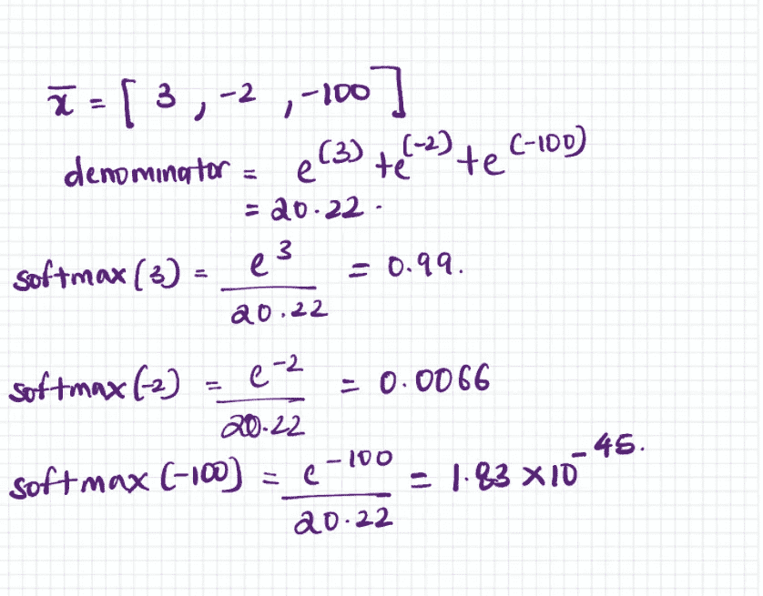

# 使用 NumPy 第三部分的简单 CNN(ReLU，Max pooling & Softmax)

> 原文：<https://medium.com/analytics-vidhya/simple-cnn-using-numpy-part-iii-relu-max-pooling-softmax-c03a3377eaf2?source=collection_archive---------5----------------------->

# 概述

在之前的帖子中，我讨论了以下主题

*   [图像的输入处理](/@PAdhokshaja/simple-cnn-using-numpy-part-i-introduction-data-processing-b6652615604d)
*   [卷积运算](/@PAdhokshaja/simple-cnn-using-numpy-part-ii-convolution-operation-b8c5a02b0844)

在本系列的第三部分中，我将介绍在正向传播过程中使用的三个函数。

1.  热卢
2.  最大池化
3.  Softmax

# ReLU 函数

ReLU 函数是一个非线性激活函数，它过滤掉负值。


ReLU 函数

在神经网络中应用的 ReLU 函数不会面临诸如消失梯度的问题。与 sigmoid 等饱和函数不同，ReLU 函数导致正值的非零梯度。

给定 ReLU 函数的微分是常数，计算具有 ReLU 激活的层的梯度需要较少的时间。



应用于 sigmoid 函数的大正值将收敛于 1。这导致对于大的正值导数为零。零导数将阻止模型参数正确调整。

下面的代码片段包含 ReLU 的函数

```
def ReLU(x):
    return (x>0)*x
```

# 最大池化

最大池化是提取图像中低级特征的过程。这是通过挑选预定大小的图像块，并从这些图像块中保留最大值来实现的。

单个最大池操作会选取一个图像块，其大小与最大池过滤器相同，并从中选择最大值。根据每次最大池操作后我们允许最大池筛选器移动的量，完成多个最大池操作。这由一个名为**步幅**的预定义参数决定。

在这个项目中，我选择了步幅= 2，图像宽度和高度= 2。

下图显示了应用于只有一个通道的图像的最大池操作的简单示例。


单通道最大池操作

下图显示了应用于具有两个通道的图像的最大池操作。通道的数量不变。图像的高度/宽度根据选择的过滤器高度/宽度而变化

使用以下公式计算新的高度或宽度

新高度或新宽度=((图像高度或宽度-过滤器高度或宽度+2 *填充)/步幅)+1


```
def maxpool_multiple(input_image,stride=2):
    input_width = input_image.shape[3]
    input_height = input_image.shape[2]
    filter_width = 2
    filter_height = 2

    output_width = int((input_width-filter_width)/stride)+1
    output_height = int((input_height-filter_height)/stride)+1

    output_image = np.zeros((input_image.shape[0],input_image.shape[1],output_width,output_height))
    for i in range(output_image.shape[0]):
        output_image[i:i+1,:,:,:] = maxpool(input_image[i:i+1,:,:,:],stride=2)
    return output_imagedef maxpool(input_image,stride=2):
    input_width = input_image.shape[3]
    input_height = input_image.shape[2]
    filter_width = 2
    filter_height = 2
    n_channels = input_image.shape[1]
    num_images = input_image.shape[0] 

    output_width = int((input_width-filter_width)/stride)+1
    output_height = int((input_height-filter_height)/stride)+1
    output = np.zeros((n_channels,output_width*output_height))
    c=0
    for height in range(0,input_height,stride):
        if height+filter_height<=input_height:
            image_rectangle = input_image[0,:,height:height+filter_height,:]
            for width in range(0,input_width,stride):
                if width+filter_width<=input_width:
                    image_square = image_rectangle[:,:,width:width+filter_width]
                    image_flatten = image_square.reshape(-1,1)
#                     print(image_flatten)
#                     print('----')
                    output[:,c:c+1] = np.array([float(max(i)) for i in np.split(image_flatten,n_channels)]).reshape(-1,1)
                    c+=1

    final_output = np.array(np.hsplit(output,1)).reshape((1,n_channels,output_height,output_width))

    return final_output
```

# 软最大值函数

softmax 函数**将一个实值向量转换为一个范围在 0 到 1** 之间的值向量。新变换的向量**加起来是 1；转换后的向量成为概率分布。**大值将被转换为接近 1 的值，小值将被转换为接近 0 的值。

软最大值函数将在最后一层用于预测；如果第一个节点具有最高值，则预测值将为 0。如果第三个节点具有最高值，则预测将是 2。

在下面的示例中，我们将查看 softmax 操作。



软最大值函数

softmax 转换将如下所示



较小的值将被映射到接近零的值。

# 资源

*   [Softmax 函数定义| DeepAI](https://deepai.org/machine-learning-glossary-and-terms/softmax-layer)
*   [ReLu 定义| DeepAI](https://deepai.org/machine-learning-glossary-and-terms/relu#:~:text=ReLu%20is%20a%20non-linear%20activation%20function%20that%20is,maximum%20value%20between%20zero%20and%20the%20input%20value.)

# 反馈

感谢您的阅读！如果您有任何反馈/建议，请随时在下面评论/您可以发邮件到 padhokshaja@gmail.com**给我**

# 下一篇文章

[通过全连接层的反向传播](/@PAdhokshaja/simple-cnn-using-numpy-part-iv-back-propagation-through-fully-connected-layers-c5035d678307)