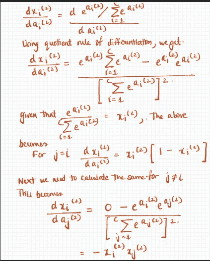
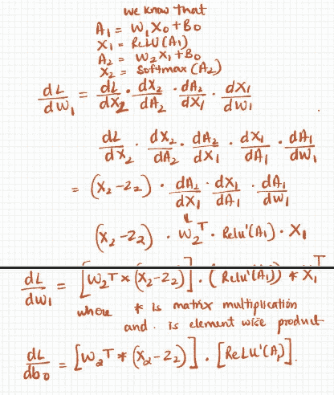

# 使用 NumPy 的简单 CNN 第四部分(通过全连接层的反向传播)

> 原文：<https://medium.com/analytics-vidhya/simple-cnn-using-numpy-part-iv-back-propagation-through-fully-connected-layers-c5035d678307?source=collection_archive---------16----------------------->


在前面的章节中，我们介绍了

1.  [数据处理](/@PAdhokshaja/simple-cnn-using-numpy-part-i-introduction-data-processing-b6652615604d)
2.  [卷积](/@PAdhokshaja/simple-cnn-using-numpy-part-ii-convolution-operation-b8c5a02b0844)
3.  [ReLU，最大汇集&软最大功能](/@PAdhokshaja/simple-cnn-using-numpy-part-iii-relu-max-pooling-softmax-c03a3377eaf2)

在 CNN 这个系列的第四部分，我们将尝试通过网络中完全连接的层来覆盖反向传播。

简单回顾一下，我们的网络从头到尾有以下一系列操作

***设 N 为图像总数***

*   它接受大小为( **N，1，28，28** )的输入矩阵
*   随后是大小为( **2，1，5，5** )的第一个卷积滤波器
*   卷积运算导致矩阵转换为大小( **N，2，24，24** )。这个结果被传递给一个 ReLU 函数。
*   跨距为 2 的(2x2)过滤器的最大池操作。这产生了一个大小为( **N，2，12，12** )的矩阵
*   然后我们将它展平成一个大小为( **288，N** )的数组
*   接下来是矩阵乘法，将数组转换成形状( **60，N** )。这个结果被提供给 ReLU 函数。
*   最后的操作包括将前一层的结果乘以另一个矩阵，该矩阵将形状更改为( **10，N** )。该结果被馈送到软最大值函数。


我们 CNN 的草图

我们初始化的模型参数将导致不正确的估计。估计值和实际标签之间的偏差通过称为交叉熵的度量来量化。交叉熵通过一个称为梯度下降的过程迭代地减少。


交叉熵方程

**交叉熵背后的直觉**

让我们举一个简单的例子，我们有三个类。让实际标签的一个热编码表示为[1，0，0]。让我们来看几个场景。

1.  **设预测输出为【1，0，0】**。交叉熵误差将是(-1 * log(1))+(-0 * log(0))+(-0 * log(0))，即 0。
2.  **设预测输出为【0，1，0】**。这里的交叉熵误差将是(-1 * log(0))+(-1 * log(1))+(-0 * log(0))。由于 log(0)是一个无限大的负值&，所以误差会无限大。
3.  **设预测输出为[0，0，1]** 。交叉熵误差将是(-1 * log(0))+(-0 * log(0))+(-0 * log(1))。这将导致无限高的误差。

交叉熵惩罚给出高置信度错误输出的分类器。

所以在学习过程中，我们需要减少交叉熵。这是通过一个叫做梯度下降的过程完成的。梯度下降是一个迭代过程，它调整模型的参数，使输出尽可能接近实际输出


梯度下降

我们将其扩展到完全连接的层中的模型参数。


全连接层中的梯度下降

这里，希腊字母 alpha 指的是学习率。这决定了模型收敛到最小值需要多长时间。

# 通过完全连接的层的梯度下降

## 计算交叉熵相对于 W2 和 B1 的导数



关于 W2 的推导误差

下面的代码片段实现了上述功能

```
delta_2 = (final_fc-y_batch)dW2 = delta_2@fc1.T
dB1 = np.sum(delta_2,axis=1,keepdims=True)
```

## 计算交叉熵相对于 W1 和 B0 的导数



损失函数关于 W1 和 B0 的导数的求导。

下面的代码片段计算损失函数相对于 W1 和 B0 的导数。

```
delta_1 = np.multiply(W2.T@delta_2,dReLU(W1@X_maxpool_flatten+B0))
dW1 = delta_1@X_maxpool_flatten.T
dB0 = np.sum(delta_1,axis=1,keepdims=True)
```

上面的 dReLU()函数是 ReLU 函数的派生物。ReLU 函数的导数将每个正值转换为 1，而其余的值则为零。该函数编写如下

```
def dReLU(x):
    return (x>0)*1.0
```

## 计算相对于 X0 的导数

我们需要计算损失函数对 X0 的导数。这将用于计算卷积滤波器的导数。其推导过程如下。


损失函数关于 X0 的导数

下面的代码片段找到了损失函数相对于 X0 的导数

```
delta_0 = np.multiply(W1.T@delta_1,1.0)
```

鉴于每个模型参数相对于损失函数的误差是从网络的末端到前端计算的，这个过程也称为“反向传播”。

在下一部分中，我们将尝试计算卷积滤波器损失函数的误差。

# 资源

*   [用交叉熵和 softmax 寻找图层错误的视频教程](https://www.youtube.com/watch?v=5-rVLSc2XdE)
*   [迈克尔·尼尔森关于神经网络的博客](http://neuralnetworksanddeeplearning.com/)

# 反馈

感谢您的阅读！如果您有任何反馈/建议，请随时在下面评论，或者您可以发电子邮件到 padhokshaja@gmail.com 给我

# 下一篇文章

[通过 max pooling 滤波器的反向传播，卷积输出层&卷积滤波器。](/@PAdhokshaja/simple-cnn-using-numpy-part-v-back-propagation-through-max-pool-layer-convolutional-filter-7c434a7addd4)